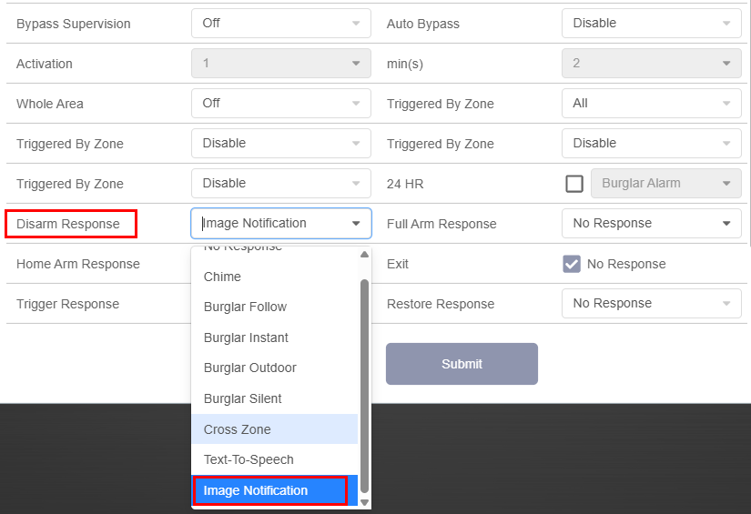


### **Add Keypad to VESTA Panel**

**STEP 1:** Put panel in learning mode:&#x20;

**STEP 2**: Press and hold the **\*** and **#** buttons simultaneously for 4 seconds while the panel is in learning mode to add the keyboard.


