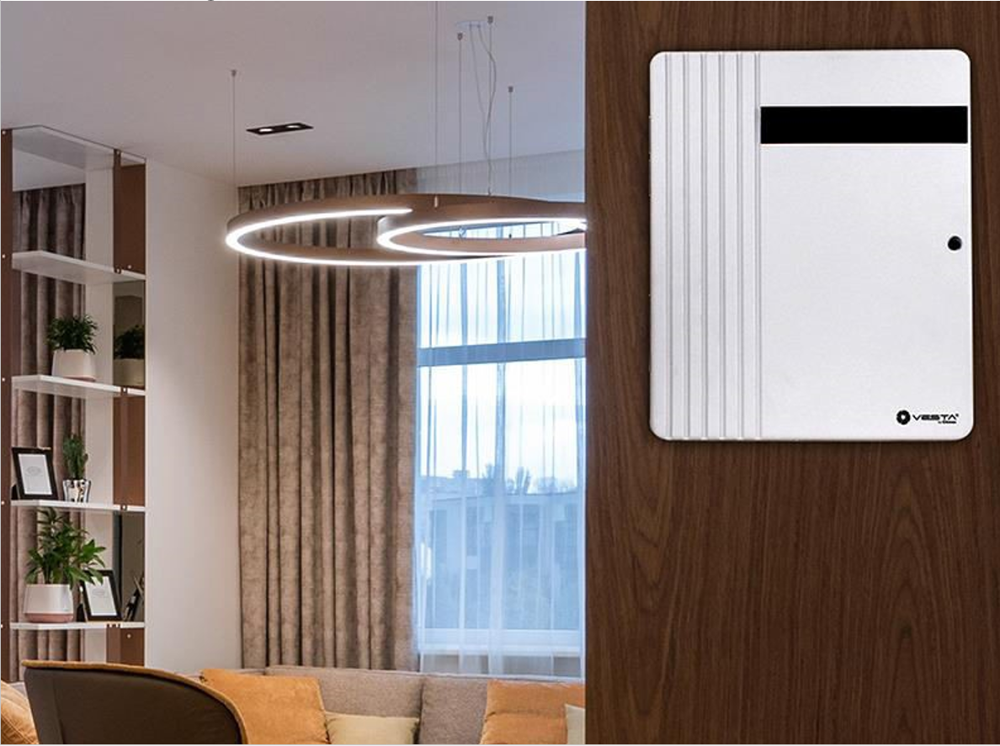
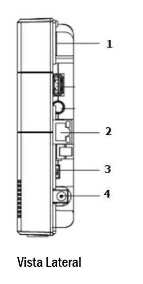
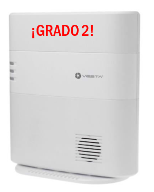

# VESTA 006

-   Manual del usuario del contacto óptico de puerta (OPDC-1)

El contacto óptico de puerta, que integra un sensor de infrarrojos, monitorea la apertura/cierre de dispositivos específicos (por ejemplo, puerta o ventana). Mediante el uso de tecnología de detección por infrarrojos, el OPDC puede detectar si la puerta o ventana está abierta o cerrada, sin necesidad de un imán adicional. El OPDC transmitirá señales de alarma cuando detecte un cambio y mantendrá su hogar protegido.

El contacto óptico de puerta consta de una cubierta y una base. La base contiene todos los componentes electrónicos y proporciona un medio para fijar el dispositivo. Un interruptor antisabotaje de PCB incluido proporciona protección contra manipulaciones contra la apertura no autorizada del dispositivo.

_**Identificando las partes**_

1.  **Indicador LED**
2.  **Botón Aprender/Probar**
    -   Presione el botón Prueba para transmitir un código de aprendizaje.
    -   Presione el botón Prueba una vez para ingresar al modo de prueba durante 3 minutos.
3.  **Manosear**
4.  **Batería**
5.  **Área de detección de infrarrojos**
6.  **Pegatina reflectante**

-   _**Indicador LED**_

En el modo de funcionamiento normal, el indicador LED permanece apagado excepto en las siguientes situaciones:

-   Cuando se activa el interruptor de manipulación del contacto óptico de la puerta.
-   Cada vez que el contacto óptico de la puerta se activa en condiciones de manipulación o batería baja.
-   Cada vez que el Contacto de Puerta se activa y transmite la señal en el modo de Prueba.
-   _**Supervisión**_
-   El contacto óptico de la puerta transmitirá automáticamente señales de supervisión periódicamente al panel de control en intervalos aleatorios de 30 a 50 minutos en el modo de funcionamiento normal.
-   Si el panel de control no ha recibido la señal del contacto óptico de la puerta durante un período de tiempo preestablecido, el panel de control indicará que el contacto de la puerta en particular está experimentando un problema de falta de señal.
-   _**Manibela de encendido**_
-   Está diseñado para proteger contra la apertura no autorizada de la cubierta. Cuando se activa la manipulación, el contacto óptico de la puerta emitirá una señal al panel de control para informar y el LED también se iluminará.
-   _**Batería**_

El contacto óptico de puerta utiliza uno**Batería alcalina AAA de 1,5 V**como fuente de energía y también es capaz de detectar batería baja. Cuando la batería está baja, se enviará una señal de batería baja al panel de control junto con una transmisión regular. El LED se iluminará cuando el contacto de puerta se active en estado de batería baja. Cuando la batería se agota, el contacto óptico de la puerta detendrá todas sus funciones y el LED parpadeará cada 4 segundos.

-   _**Cambio de batería**_

Sostenga el área del botón Aprender/Probar y levante suavemente la cubierta frontal. Retire la batería vieja como se muestra en la Figura 1 y luego presione el botón Aprender/Probar 5 o 6 veces para descargarla por completo. Inserte una batería nueva y vuelva a colocar la tapa, como se muestra en la Figura 2.

| Figura 1                                                      | Figura 2                                                      |
| ------------------------------------------------------------- | ------------------------------------------------------------- |
|  |  |

-   _**Modo de prueba**_

El contacto óptico de la puerta se puede poner en modo de prueba durante 3 minutos presionando una vez el botón de prueba en la cubierta frontal. Durante el modo de prueba, el indicador LED se encenderá al activarse. Cada vez que presione el botón de prueba, el contacto óptico de la puerta transmitirá una señal de prueba al panel de control para la prueba del alcance del radio y restablecerá el modo de prueba a la duración de 3 minutos. Saldrá del modo de prueba automáticamente después de 3 minutos y volverá al modo de funcionamiento normal.

-   _**Empezando**_

Paso 1: Utilice un destornillador de punta plana para encajar en el orificio de apertura de la cubierta en la parte inferior.

Paso 2: Empuje suavemente el destornillador de punta plana hacia arriba y retire la cubierta superior.

Paso 3: Inserte la batería en el compartimiento de la batería. Evite mirar directamente al área de detección de infrarrojos.

cuando esté en funcionamiento.

Paso 4: Coloque el Panel de control en modo de aprendizaje; consulte el manual del Panel de control para obtener más detalles.

Paso 5: Presione el botón de prueba en el contacto óptico de la puerta para enviar la señal al panel de control.

Paso 6: Si el Panel de control recibe exitosamente la señal, el Panel de control debería responder (por ejemplo, emitiendo pitidos). Consulte el manual de su Panel de control para completar el proceso de aprendizaje.

Paso 7: Después de que se haya programado el contacto óptico de la puerta, coloque el panel de control en "**Prueba de caminata**" modo. Sostenga el contacto óptico de la puerta en la ubicación deseada y presione el botón Probar para confirmar si esta ubicación está dentro del alcance de la señal del panel de control.

Paso 8: Cuando esté satisfecho con el contacto óptico de puerta en la ubicación elegida, continúe con la instalación.

-   _**Montaje del contacto de la puerta**_

Encuentre un lugar adecuado para instalar el contacto de puerta. Se recomienda instalar el contacto óptico de puerta en el objeto más estacionario (como el marco de una puerta o un marco de ventana). Asegúrese de que la ubicación esté dentro del alcance de la señal del panel de control antes del montaje.

Paso 1: La superficie de montaje debe estar limpia, seca y lisa. Limpie la superficie de montaje con un desengrasante adecuado si es necesario.

Paso 2: Retire la cubierta protectora de un lado de la almohadilla adhesiva de doble cara. Aplicar en la parte posterior del dispositivo y presionar firmemente durante 30 segundos para asegurar un buen contacto.

Paso 3: Retire la otra cubierta y presione firmemente el contacto óptico de la puerta en la ubicación deseada. Evite aplicar la almohadilla adhesiva sobre superficies irregulares o vuelva a aplicarla.

Paso 4: marque la ubicación de la pegatina reflectante. La pegatina reflectante debe aplicarse en el**opuesto**lado del área de detección de infrarrojos. La brecha no debe ser mayor que**zm**cuando la puerta/ventana está cerrada.

Paso 5: aplica la pegatina reflectante. Evite aplicar la pegatina reflectante sobre superficies irregulares o vuelva a aplicarla.

\\<Note>

-   NO aplique la almohadilla adhesiva sobre una superficie con pintura descascarada o agrietada, ni sobre una superficie rugosa.
-   Tenga en cuenta que la cinta adhesiva 3M no se puede reutilizar.
-   NO exponga el área de detección de infrarrojos a la luz solar directa.
