# 👨‍🔧 Manual Instalador centrales Híbridas y radio de VESTA

### MANUAL INSTALADOR

### Características central VESTA HSGW

#### Puesta en marcha

1. Inserte SIM (2G, 3G o 4G) “Opcional”
2. Conectar Ethernet
3. Coloque el interruptor de la batería en la posición: ON
4. Conecte el adaptador de CC
5. Todos los LED se encenderán y después de 10-15 segundos la puerta de enlace estará lista.

#### Características Panel:

* IP (Ethernet) y 2G o 4G
* 640 Zonas - 8 áreas - 240 usuarios/partición
* RF 868 MHz (rango de 2 km) y Z-Wave (100- 200 m)
* 100 Reglas de automatización
* 50 Escenas
* Ranura de expansión USB: Zig-Bee, Wi-Fi, 3G / LTE, LoraWAN
* Sirena incorporada y batería de respaldo
* EN-50131 Grado 2
* Operativo: -10 ° C a 45 ° C (14 ° F a 113 ° F) Hasta 85% sin condensación

### Características central VESTA HIBRIDA

#### Características Panel:

* IP (Ethernet) y 2G o 4G
* 640 Zonas - 8 áreas- 240 usuarios/partición

_**¡GRADO 3!**_

* RF 868 MHz (rango de 2 km) y Z-Wave/ZigBee (100- 200 m)
* 100 Reglas de automatización
* 50 Escenas
* Ranura de expansión USB: Z-Wave, Zig-Bee, Wi-Fi, LoraWAN
* Terminal de BUS RS485
  * Conexion de teclados (táctil y/o LCD)
  * Expansores de zonas convencionales EOL, DEOL, 3EOL
  * Volumetricos BUS V-Max
  * PIR CAM BUS V-Max
  * Sirenas en BUS V-Max
  * Módulos de relés en BUS V-Max
  * Aisladores de BUS V-Max
  * Amplificadores de BUS V-Max
  * Etc…
* Clema para salida de SIRENA y Salida PG
* Batería de respaldo
* EN-50131 Grado 3

### Dar de alta una cuenta de instalador

NOTA!:Si ya dispones de una cuenta de instalador puedes directamente saltar al punto nº4 “Alta de paneles bajo la cuenta de instalador. Registrar panel”

Este paso nº3 solo se realizará una vez.

#### Activar cuenta de instalador:

*
  1. Entrar en la plataforma SmartHomeSec vía:
     1. WEB https://smar thomesec.bydemes.com/ByDemes/
     2. o APP SHS
  2. Pulsar sobre Registro de instalador

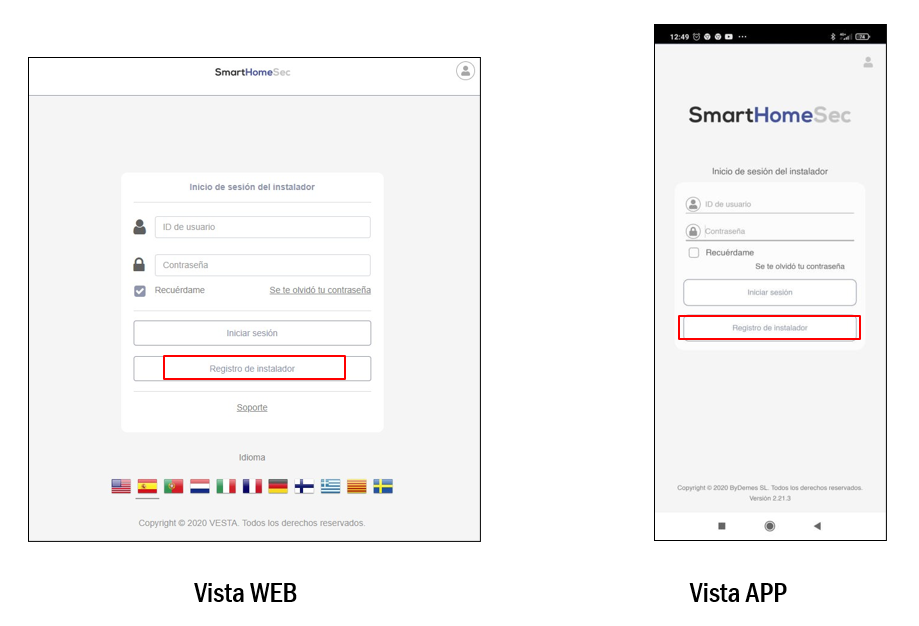

*
  1. Rellenar el formulario y clicar en siguiente

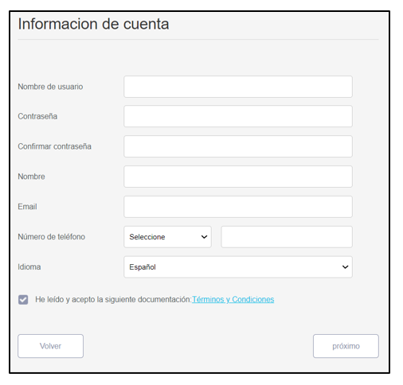

*
  1. Verificar con el código recibido en el email

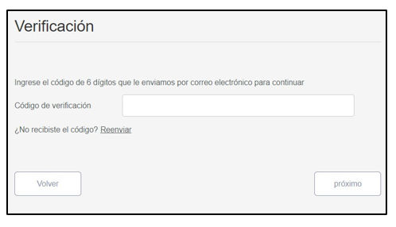

3.5 En comerciante elegir ByDemes

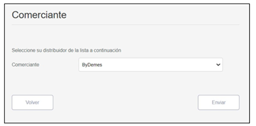

Ahora ya dispones de una cuenta de instalador desde la que gestionarás todos tus centrales VESTA!

### Alta de paneles bajo la cuenta de instalador

**Registrar panel**

Acceder a la plataforma SmartHomeSec desde una cuenta de instalador

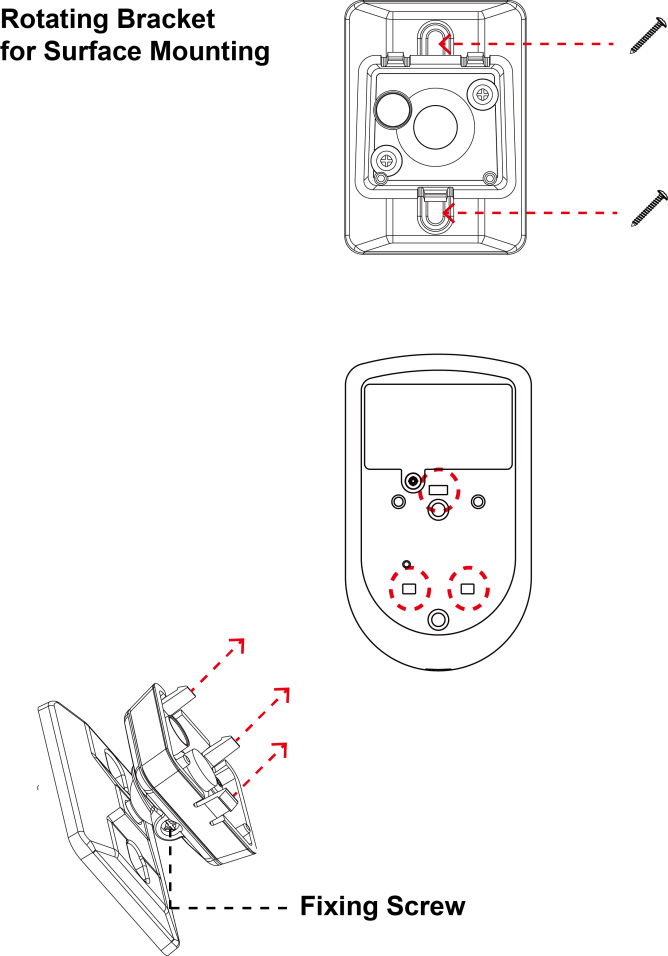

[https://smarthomesec.bydemes.com/ByDemes/](https://smarthomesec.bydemes.com/ByDemes/)

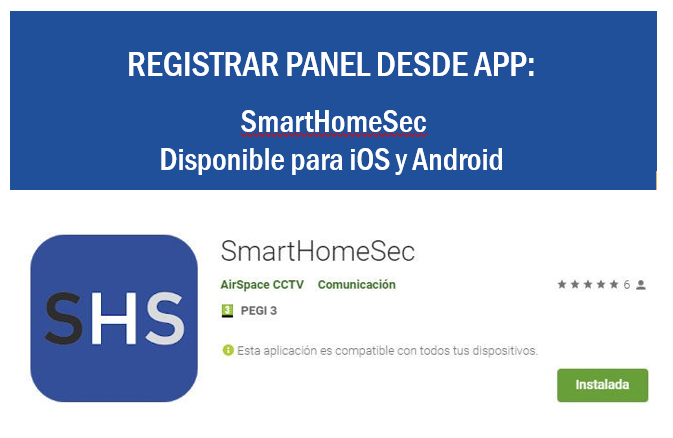

#### 4.1 Registrar panel desde la WEB SmartHomeSec

Para dar de alta centrales en la cuenta de instalador:

Entrar en la WEB SmartHomeSec: https://smar thomesec.bydemes.com/ByDemes/

* Acceder con el usuario y contraseña registrado

NOTA! El cambio entre el visionado en modo instalador o usuario se hace clicando sobre el icono:

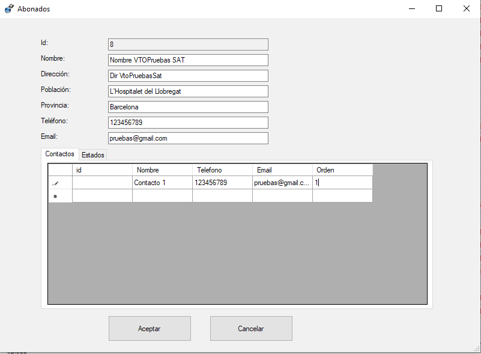

* Clicar sobre el botón “+” para añadir un nuevo panel

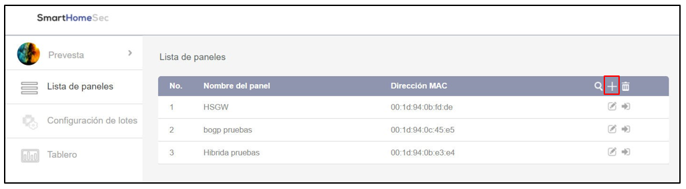

Info! ¡El panel deberá estar encendido y con conexión a internet. Dispondremos de 15 minutos tras la alimentación para registrar el panel!

* Clicar sobre el botón “+” para añadir un nuevo panel

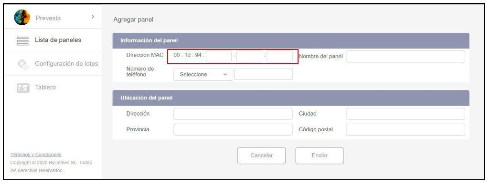

* La **MAC** se encuentra en el lateral de los paneles
* **Nombre de panel** con el que se registrará en el sistema
* Nº de telf., Dirección, Ciudad, Provincia y Código Postal es info no obligatoria, pero interesante para disponer de una pequeña base de datos con información de cada central
* **Una vez finalizado el proceso, recibimos un email de confirmación. Nuestro panel esta registrado**

#### 4.2 Registrar panel desde la APP SmartHomeSec

Para dar de alta centrales en la cuenta de instalador

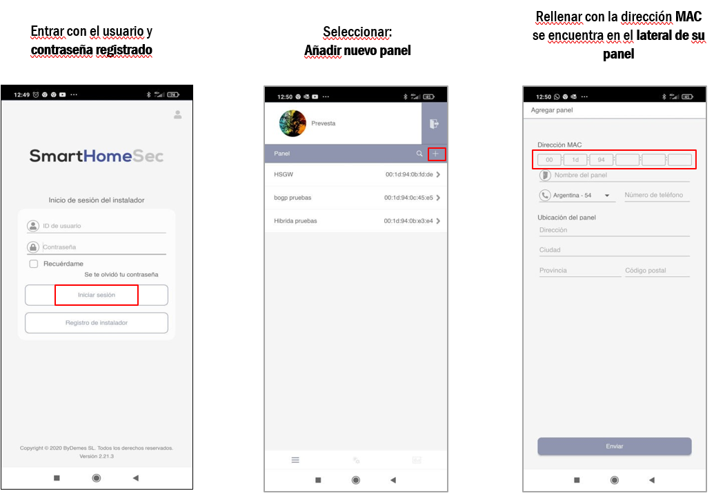

Nota! El cambio entre el visionado en modo instalador o usuario se hace clicando sobre el icono:

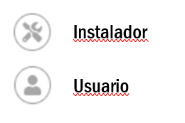

Info! ¡El panel deberá estar encendido y con conexión a internet. Dispondremos de 15 minutos tras la alimentación para registrar el panel!

* La **MAC** se encuentra en el lateral de los paneles
* **Nombre de panel** con el que se registrará en el sistema
* Nº de telf., Dirección, Ciudad, Provincia y Código Postal es info no obligatoria, pero interesante para disponer de una pequeña base de datos con información de cada central
* **Una vez finalizado el proceso, recibimos un email de confirmación. Nuestro panel esta registrado**

### Programación del panel

¡Para simplificar este manual, a partir de este punto toda la información y figuras mostradas harán referencia a la plataforma WEB! Debido a la gran similitud entre las plataformas APP y WEB, se entiende como no necesario insistir en lo mismo y duplicar la información.

1. Entrar en la WEB SmartHomeSec: https://smar thomesec.bydemes.com/ByDemes/
2. Acceder a la cuenta de instalador con el usuario y contraseña registrado

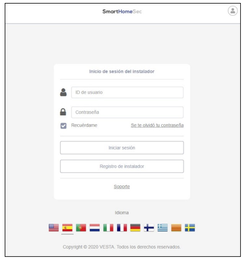

1. Seleccprogramaciónionar de la lista \[1] el panel objetivo de
2. Insertar Código de instalador, de fábrica **7982**

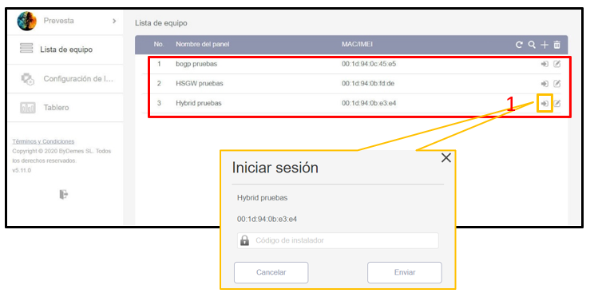

### Pantalla inicial: Apartado Seguridad

Desde aquí el usuario instalador tendrá una idea general del estado actual del sistema a nivel técnico (fallos técnicos del panel o dispositivos) que se remarcarán en rojo. Además, podrá revisar si las particiones del panel están armadas o desarmadas.

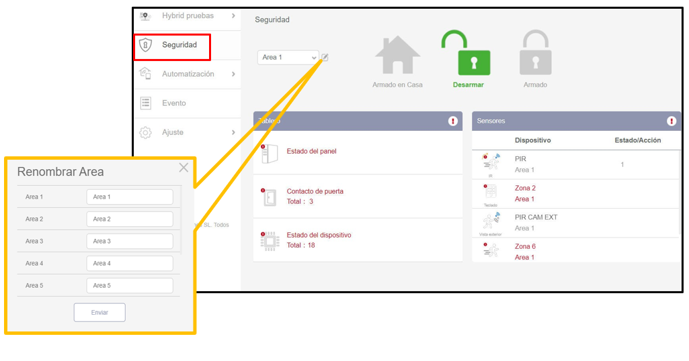

Nota! Por ley no es posible controlar las particiones desde la cuenta de instalador

### Historial de eventos

En el apartado de eventos se guardan y muestran por un periodo aproximado de 1 mes todos los eventos generados por el panel, incluyendo: armados, desarmados, fallos técnicos, alarmas técnicas, alarmas de intrusión.

Disponible un buscador **\[1]** desde el cual poder aplicar filtros de búsqueda por imágenes de alarma, eventos de alarma o búsqueda por fecha

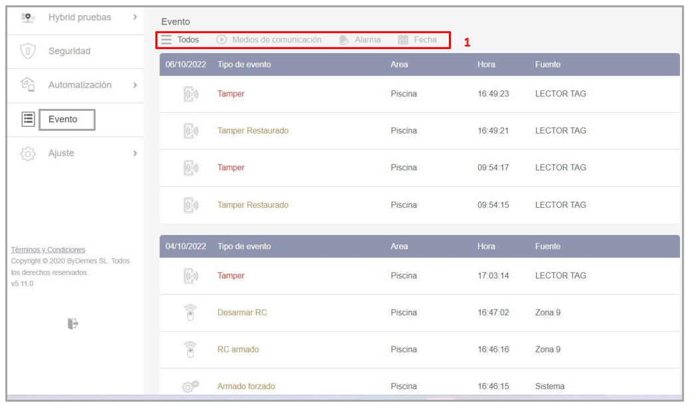

### Ajustes: Añadir dispositivos

**Ajuste Dispositivo \[1] Añadir dispositivo \[2] Otros \[3] .**

El panel cambia a modo aprendizaje y queda a la espera de recibir señales de asignación

1. Presionar el botón de enrolar en el dispositivo que desea añadir. Ejemplo: Contacto magnético DC-16SL. Una vez detectado en el panel, seleccionar el dispositivo y Aceptar.

Nota! Cada detector dispone de un botón especifico para enrolar el equipo. Revisar su manual especifico para asegurar que está presionando en modo y forma el botón correcto

1. Seleccionar Área, Zona y asignar un nombre a la zona. El dispositivo ya esta añadido correctamente al panel

#### 8.1 Configuración de zona

Para configurar un dispositivo: entrar en Dispositivos \[1] y presionar sobre la configuración de dispositivo \[2]

Nota! Cada detector dispondrá de diferentes ajuste según su naturaleza. A continuación un resumen de los ajustes generales basándose en un PIR

#### 8.2 Configuración de zona. Ajustes internos

1. Seleccionar Área \[1/2/3/4/5/6/7/8]
2. Seleccionar Número de zona de \[1-80]
3. Asignar un Nombre de zona \[“PIR CABLEADO”]
4. Bypass ONAnular zona
   1. Bypass OFF Habilitar zona
5. Anular tamper ON/OFF
6. Anular supervisión de zona
7. Zona 24h
8. Reacción de zona con el panel Desarmado
9. Reacción de zona con el panel Armado
10. Reacción de zona en Armado en Casa
    1. No actuar
    2. Retardo de entrada 1
    3. Retardo de entrada 2
    4. Timbre
    5. Alarma de seguimiento
    6. Alarma instantánea
    7. Alarma Exterior
    8. Alarma silenciosa
    9. Zona cruzada
11. Aplicar Escena al detectar
12. Aplicar Escena al restaurarse

#### 8.3 Prueba de paseo

Lanzando una prueba de paseo se comprueba la potencia de señal con la que transmiten las zonas vía radio

Nota! Presionar el botón de aprendizaje de la misma forma que para asignar el dispositivo. A continuación se mostrará la potencia de señal en un rango del 0 al 9. Se recomienda potencias => 4 o inferiores si se mantiene una señal estable en el tiempo

### Ajustar GEOFENCING

Desde este apartado, Ajuste \[1] Geofencing \[2] se podrá configurar la geovalla virtual

Nota! Ahora ya se podrá utilizar el Geofence desde la APP SmartHomeSec.

Se podrán activar escenas por la entrada/salida del perímetro virtual marcado

#### 9.1 Configuración Geofence en APP SmartHomeSec

Para configurar la geolocalización en el teléfono móvil, hay que entrar en la App **SmartHomeSec**:

Nota! Al entrar o salir de la zona Geofence, se puede aplicar escenarios preconfigurados en el panel. En el escenario podemos hacer que arme o desarme el panel, encender/apagar luces… (Para más información sobre **Escenas: Apartado 12.1 y 12.2)**

### Configuración de panel

Para acceder a los ajustes generales del panel: Ajuste \[1] Panel \[2] Ajustes- Panel \[3]

Subapartados:

1. Seguridad
2. Panel
3. Código
4. Fecha y hora
5. Reset a fábrica
6. Actualización de FW

#### 10.1 Seguridad

Para acceder al subapartado Seguridad: Ajuste Panel Ajustes- Seguridad

Dentro del subapartado Seguridad, se podrán modificar para cada una de las particiones, los parámetros genéricos de seguridad. Entre ellos:

1. Tiempo de entrada 1
2. Tiempo de entrada 2
3. Tiempo de salida
4. Longitud de alarma “Tiempo de activación de sirena en caso de alarma”
5. Alarma por sabotaje de dispositivos (Con el panel Armado o Siempre)
6. Armado directo o confirmación
7. Volumen de las advertencias
8. … Para más detalles consulte el manual complete

#### 10.2 Panel

Para acceder al subapartado panel : Ajuste Panel Ajustes- Panel

Dentro del subapartado Panel, se podrán modificar los parámetros del panel:

1. Tiempo en notificar: Fallo de Corriente AC
2. Sensibilidad: Interferencia RF
3. Tiempo de Supervisión
4. Polling CRA
5. Resolución de las fotos de PIRCAM
6. Habilitar/deshabilitar Tamper sirena
7. Cambiar nombre de la central
8. Revisar info del panel: Ip local, publica, FW actual, etc…

#### 10.3 Códigos

Para acceder al subapartado Codigo : Ajuste Panel Ajustes- Código

Dentro de la subapartado Código, se podrán modificar los parámetros de acceso. Es decir, programación de los códigos que autenticarán los distintos tipos de usuario desde cualquier teclado

* Código Maestro 1 y 2: habilita a un usuario a anular zonas permanentemente, gestionar códigos, etc… desde una cuenta App/WEB con perfil de administrador
* Código de Instalador: permite programar el panel completamente
* Código de Coacción: control del sistema con alarma silenciosa
* Código Guarda: para personal de seguridad
* Código Temporal: Solo desarma y arma 1 vez
* PIN de usuario: código de usuario con capacidad de control del área seleccionada.

1. **Añadir** o **borrar usuario**.
2. Asignar **nombre al usuario** y **código** (4 a 6 dígitos).
3. Hasta 240 códigos por área

#### 10.4 Fecha y Hora

Para acceder al subapartado Fecha y hora: Ajuste Panel Ajustes- Fecha y hora

Nota! Se recomienda dejar este apartado de fábrica, siempre y cuando la fecha y hora coincidan con la zona horario correcta.

#### 10.5 Reset a fábrica

Para acceder al subapartado Reset: Ajuste Panel Ajustes- Restablecimiento de fábrica

Nota! También se permite realizar un reset a fábrica de forma manual. Pero esta función vía software nos brinda la posibilidad de mantener la configuración de red como de los dispositivos asignados tras lanzar el reset

#### 10.6 Actualización de FW

Antes de abandonar la instalación se recomienda dejar el panel actualizado a la última versión de FW disponible.

Si por alguna razón NO puede, podrá actualizar este FW remotamente cuando lo desee. Se trata de un proceso muy seguro que lleva < de 3 min. y tras el cual se reiniciará el panel.

Nota! El modelo de panel con el que se están tomando las capturas es el Hibrido, y por tanto además de poder actualizar el FW del panel \[1] también se podrá actualizar el FW del controlador IO MCU \[2], encargado de gestionar los expansores cableados y BUS

Nota 2! Se recomienda elegir siempre la última versión de FW, que normalmente ocupa la 1º posición

#### 10.7 Zonas cableadas convencionales

Exclusivamente en la central HIBRIDA se pone a disposición 16 zonas cableadas en placa con capacidad para proteger el lazo con resistencias EOL, DEOL, 3EOL o implementar lazos simples NC / NA. Para habilitar la zona simplemente es necesario indicar :

Conexionado de zonas

Nota! Los valores resistivos dentro del mismo lazo se pueden elegir \[1k, 2.2K, 3.74K, 4.7K, 5.6K, 6.8K, 8.2k, 10K ] pero deberá ser el mismo para las 2 resistencias a excepción del lazo 9 y 10 que está destinado para detectores 3xEOL que cuentan con antimasking, contacto de alarma y tamper. En este caso, se debe respetar los valores de resistencia marcados en el esquema

#### 10.8 Ajustes de RED: GSM

Ajuste Red GSM / GPRS / LORA

Accediendo al subapartado GSM se despliega la siguiente info :

1. Operador GSM: con el que panel se encuentra conectado
2. Nivel de señal GSM \[0-9] donde 0 implica que no hay cobertura GSM y 9 señal excelente
3. Detección de SIM. Es posible habilitar/deshabilitar el comunicador.
4. Evento GSM: En caso de fallos recurrentes por falta de cobertura, se puede deshabilitar este evento.
5. Límite de conexión GPRS:
   1. Instalaciones con doble via de comunicación, recomendable seleccionar 1h.
   2. Instalaciones con tan solo comunicación via GPRS/LTE, seleccionar inhabilitar.
6. Antena: en caso de conectar una antena GSM amplificadora en el conector externo hay que habilitar este mediante este parámetro

#### 10.9 Ajustes de RED: GPRS

Ajuste Red GSM / GPRS / LORA

Acceder al subapartado GPRS para configurar el punto de acceso y poder salir a internet y comunicar el panel vía comunicador GPRS/LTE.

Puede consultar a su operador sobre el APN de la SIM y si usted no lo conoce puede escribir en

APN: internet

Usuario: \[Dejar en blanco]

Contraseña: \[Dejar en blanco]

#### 10.10 Ajustes de RED: LORA

Ajuste Red GSM / GPRS / LORA

Accediendo al subapartado LORA se puede habilitar esta 3º vía de comunicación.

De esta forma en caso de caída de IP por ethernet (vía principal) o IP por GPRS/LTE (2º vía de backup) conseguiremos llegar a transmitir los eventos del panel vía LORAWAN (3º via de backup) y mantener conectado el panel con CRA mientras las otras vías no estén disponibles

Para más información consulte a su agente comercial o a SAT Bydemes. Disponible manual específico para la configuración de la comunicación LORA

#### 10.11 Ajustes de Conexión a CRA: eventos

Ajuste Reporte Reporte / Archivo capturado

Dentro del subapartado REPORTE, puede configurar los datos de su receptora o receptor de eventos. Simplemente clicando sobre el botón “+” se abre otro campo para conectar con la CRA.

En el apartado de Nota, dispone de todos los formatos compatibles, así como ejemplos de la cadena URL a configurar. El formato estándar con el que deberá conectar es el mostrado en el ejemplo nº3 \[MANITOU]

*
  * Abonado: nº de abonado acordado con CRA
  * Server: IP pública de CRA
  * Port: Puerto público de la CRA

/MAN, hace referencia a la transmisión de eventos en formato manitou. Nuestra pasarela de CRA, ALARMSPACE, se encargará de convertir los eventos en un lenguaje adecuado a software de receptora existente.

Grupo: Los eventos se transmitirán a todas las URLs que pertenezcan a grupos distintos. URLs dentro del mismo grupo actuarán como backup y el evento solo se transmitirá a una de ellas empezando por orden de lista (URL1,2,3…).

Nota! Para conectar a una CRA direccionar la URL al grupo 2 ya que el grupo 1 viene predefinido para la nube VESTA.

Procesar de nuevo: recomendable 3/5 reintentos para todos los grupos

#### 10.12 Ajustes de Conexión a CRA: imágenes

Ajuste Reporte Reporte / Archivo capturado

Dentro del subapartado Archivo capturado, puede configurar los datos de su receptora para que reciban las tramas de fotos generadas por los PIR CAM o cámaras IP existentes.

Simplemente clicando sobre el botón “+” se abre otro campo

para conectar con la CRA.

En el apartado de Nota, dispone de todos los formatos compatibles, así como ejemplos de la cadena URL a configurar. El formato estándar con el que deberá conectar es el mostrado en el ejemplo nº4

*
  * User: nº de abonado acordado con CRA
  * Server: IP pública de CRA
  * Port: Puerto público de la CRA

Del desplegable seleccionar protocolo MANITOU. Nuestra pasarela de CRA, ALARMSPACE, se encargará de recibir las fotos y transmitirlas al software de CRA

### Compartir el panel con el cliente

**El instalador será el encargado de crear una cuenta (compartir App con cliente) para que el usuario final pueda controlar su sistema remotamente desde la App o plataforma WEB SmartHomeSec**

\[1] Entrar en el nombre del **panel**  \[2] Entrar en Lista de cuentas  \[3] Seleccionar **Añadir**

Nota! Como medida de seguridad el instalador dispone de 15 min. tras la alimentación del panel para compartir con el 1º usuario de la lista. En caso de superar este tiempo simplemente hay que reiniciar el panel desconectando la alimentación principal + batería. Por eso se recomienda realizar este paso acto seguido al registro del panel. Para los siguientes usuarios compartidos no hay límite de tiempo

Si es un **cliente nuevo**, seleccionar **Crear una cuenta**, y si el cliente ya tiene otros paneles seleccionar

Enlace a cuenta existente

### Compartir el panel con el cliente

\[1] Dispositivo

A destacar 3 subapartados: \[1] Dispositivos, \[2] Escena y \[3] Regla

\[1] Dispositivo: Se enlistan y muestran todos los equipos relacionados con la automatización. Desde aquí se podrán controlar (activar/desactivar) cada uno de los módulos de domótica de manera individual y en cualquier momento.

Disponible un filtro en la parte superior que ordena cada uno de los módulos por familias, muy útil en caso de una instalación domótica grande.

Filtro por familia:

\[1] Todos los equipos

\[2] Switches (on/off)

\[3] Cerraduras electrónicas

\[4] Termómetros/termostatos

#### 12.1 Compartir el panel con el cliente

Las Escenas le permite establecer un grupo de acciones que el Panel de control puede realizar con sus dispositivos de domótica. El usuario puede programar la escena para activar manualmente un conjunto de dispositivos, o activarlos automáticamente mediante una regla preprogramada (Consulte el Apartado de reglas para más detalles sobre acciones inteligentes.)

Ejemplo Escena:

ESCENA: SALIR DE CASA

Como se puede observar en el Ejemplo, esta escena se puede accionar con un dispositivo como un detector, contacto magnético, Geofence, selector de escenas, APP/WEB o reglas… Al accionar la escena del ejemplo, se apagará el enchufe del salón, luces, ajustará la temperatura a 22ºC, apagará el televisor y por último cambiará el panel a modo ARMADO. Por lo tanto, con solo una acción de escena controlamos el estado de todos los dispositivos deseados y ajustarlos a las necesidades deseadas.

Resumen: _Activación de Regla\*Condiciones=Acciones a Realizar_

#### 12.2 Compartir el panel con el cliente

\[2] Escena

Nota! Se puede crear un máximo de 10 Escenas diferentes y cada una con máximo 5 Acciones diferentes.

1. **Añadir escena**
2. Asignar nombre a la Escena
3. Seleccionar un Icono “Opcional”
4. **Añadir/ Borrar** Acción.
5. Configuración de las acciones a realizar:

En la foto Ej.:

*
  * Acción 1: Apagar dispositivo Luz
  * Acción 2: accionar dispositivo

#### 12.3 Compartir el panel con el cliente

Para guardar la configuración seleccionar Enviar

La subpágina **Regla** le permite establecer una lista de reglas bajo ciertas condiciones. Por ejemplo, puedes determinar qué dispositivo se activará en un rango de nivel de lux preprogramado, rango de temperatura o calendario. También puede seleccionar el tipo de acción a realizar, o simplemente aplicar la escena previamente creado bajo la subpágina Escena (Apartado - Escena).

Ejemplo Escena:

REGLA: RIEGO AUTOMÁTICO

Como se puede observar en el Ejemplo, esta Regla de desencadena de Lunes a Viernes a las 18:00h, En condiciones\* es opcional, en este caso siempre se cumplirá la regla SI: es un día de lunes a viernes a las 18:00h Y el sistema o panel está armado, Entonces se activará el réle de la electroválvula durante 10 minutos o el tiempo deseado.

Resumen: _Activación de Regla\*Condiciones=Acciones a Realizar_

#### 12.4 Domótica: Regla

\[3] Regla

Nota! Se puede crear un máximo de 100 Reglas diferentes

1. **Añadir** Regla
2. **Asignar nombre** a la Regla
3. Seleccionar como se va a accionar esta regla.\
   Ej.:\
   **Calendario**
4. Condiciones “Opcional”
5. **Configuración** de las **acciones** a realizar una vez cumplidas las condiciones anteriores.\
   Ej.:\
   \*Acción 1: Activar el Relé de la electroválvula durante 10 minutos. (Ej. Riego Automático)

Para guardar la configuración seleccionar **Enviar**.

### Anexo: Gestión y configuración del BUS V-MAX

Este anexo trata específicamente las opciones de software y hardware disponibles para la configuración y gestión del sistema usando la tecnología propietaria BUS V-MAX. Los dispositivos V-MAX son compatibles únicamente con los modelos de panel HYBRID-IMAX. Además, en el documento se especificarán las topologías de conexión, dispositivos actuales V-MAX BUS y recomendaciones varias para maximizar la calidad de comunicación del sistema

#### INDICE

1. Alta de los dispositivos BUS V-MAX
2. Ajustes de zona y sensibilidad
3. Gestión del BUS
4. Arquitectura de los paneles híbridos
5. Topologías BUS V-MAX
6. TIPs: Reglas y consejos generales de instalación
7. Calculadora de BUS
8. Amplificador & aislador
9. Fuente supervisada
10. Lista de equipos BUS destacados
11. Ejemplos de soluciones únicas

a) Integración BUS V-MAX de lectores de terceros wiegand 26\
b) Integración BUS V-MAX de cualquier detector convencional

#### Dispositivo: Agregar dispositivo

Proceso simplificado para el alta de

dispositivos BUS

1. Ajuste
2. Dispositivo
3. Click en “+”
4. Dispositivos

En este momento el sistema entra en modo reconocimiento del BUS y mostrará en una lista todos los dispositivos conectados \[pag. siguiente]

#### Dispositivo: Ajustes internos del dispositivo

Nota! Cada detector dispondrá de diferentes ajustes según su naturaleza. A continuación, un resumen de los ajustes generales basándose en un PIR V-MAX

1. Ajustes de zona
2. Ajustes de infrarrojos

#### Dispositivo: Ajuste de zona y sensibilidad

Este apartado nos filtra únicamente los elementos que componen en el BUS, reflejando el área y zona que ocupa cada elemento.

1. Si una zona sufre una avería técnica se reflejará en rojo con el símbolo de la advertencia. Clicando encima se desplegará el tipo de avería\

2. EOL El técnico marcará manualmente aquellos elementos de BUS que son finales de línea. Sirve únicamente a modo informativo para de un simple vistazo poder identificarlos.\

Nota! Aquellos elementos finales de línea se les colocará el puente destinado para este fin. Ver manual adjunto a cada equipo.\

1. Herramienta muy útil para identificar físicamente a cada elemento. Clicando sobre el botón el elemento correspondiente responderá iluminando o parpadeando el led pertinente.

#### Anexo: Arquitectura paneles hibridos VESTA

#### Anexo: Topologías BUS V-MAX

**Caso 1a: Una linea de BUS interior**

\*Max. 128 dispositivos BUS

**Cableado Flexible**

Algunas de las características a destacar del sistema en BUS V-MAX son:

* Ajustes bidireccionales para cualquier equipo
* Supervisión instantánea
* Facilidad de instalación y configuración
* PIR CAM BUS en GRADO 3
* PIR CAM BUS exterior
* Fotos de alarma de los PIR CAM en HD (720p) de forma casi instantánea
* Fotos bajo demanda del usuario instantáneas y de alta calidad
* Gran flexibilidad pudiendo optar por elementos en BUS propietario o interponiendo detectores convencionales con una simple “pastilla” de integración (vesta-399)
* Fuentes supervisadas con monitorización en tiempo real de la corriente y tensión suministradas
* Amplificadores que I/O aislados galvánicamente
* y mucho más….

Esquema: configuración del jumper (resistencia final de linea)

Se recomienda el uso del jumper para mejorar las comunicaciones del BUS en términos de fiabilidad y velocidad. En este caso, llevará el jumper los extremos de la rama: panel y último elemento.

**Caso 1b: Una linea de BUS interior y exterior**

\*Max. 128 dispositivos BUS

**Cableado Flexible**

Cuando salimos al exterior con el BUS, es muy recomendable, aunque no obligatorio, usar el aislador. Galvánicamente aislado, protegerá el interior de cualquier intento de sabotaje desde el exterior.

Esquema: configuración del jumper (Resistencia final de línea)

Se recomienda el uso del jumper para mejorar las comunicaciones del BUS en términos de fiabilidad y velocidad. En este caso, **el amplificador & aislador se comporta como el final y el inicio de una nueva rama independiente** y por tanto los jumpers se colocan como sigue el esquema.

**Caso 2a: Dos líneas de BUS (interior) en estrella**

\*Max. 128 dispositivos BUS

**Cableado Flexible**

Esquema: configuración del jumper (Resistencia final de línea)

Se recomienda el uso del jumper para mejorar las comunicaciones del BUS en términos de fiabilidad y velocidad. En este caso, **llevarán el jumper el último elemento de cada rama**.

**Caso 2b: Dos líneas de BUS (interior & exterior) en estrella**

\*Max. 128 dispositivos BUS

En este caso, se recomienda el uso de un amplificador & aislador con el objetivo de proteger la instalación contra sabotajes desde el exterior: cortocircuitos, corte de cable, etc…

Esquema: configuración del jumper (resistencia final de linea)

Se recomienda el uso del jumper para mejorar las comunicaciones del BUS en términos de fiabilidad y velocidad. En este caso, **el amplificador & aislador se comporta como el final y el inicio de 2 nuevas ramas** independientes y por tanto los jumpers se colocan como sigue el esquema.

**Caso 3a: Tres líneas de BUS en Estrella CON amplificador & aislador**

\*Max. 128 dispositivos BUS

**Cableado Flexible**

En este caso, se recomienda el uso de un amplificador & aislador con el único objetivo de ramificar el BUS en 2 estrellas a mayores (total de 3 o superior). El uso de este dispositivo permite filtrar, amplificar y estabilizar las comunicaciones, para que la única preocupación del técnico sea la carga aplicada al BUS (consumo de detectores) y no así las distancias medidas en cable acumulado

Esquema: configuración del jumper (resistencia final de línea)

Se recomienda el uso del jumper para mejorar las comunicaciones del BUS en términos de fiabilidad y velocidad. En este caso, el amplificador & aislador se comporta como el final y el inicio de 2 nuevas ramas independientes y por tanto los jumpers se colocan como sigue el esquema

**Caso 3b: Tres líneas de BUS en Estrella SIN amplificador & aislador**

\*Max. 128 dispositivos BUS

**Cableado Flexible**

Entre las múltiples ventajas de usar el panel hibrido de VESTA para las instalaciones cableadas, se encuentra no solo la posibilidad de cablear hasta 16 zonas convencionales directamente en la placa del panel, sino que a mayores es posible ampliar tantas zonas convencionales como necesitemos mediante expansores conectados a cualquier punto del BUS. Se aprovecha este ejemplo y se muestra como conectar el expansor de 8 zonas, encapsulado, protegido contra manipulaciones y con batería de backup incorporada.

Esquema: configuración del jumper (resistencia final de línea)

Se recomienda el uso del jumper para mejorar las comunicaciones del BUS en términos de fiabilidad y velocidad. En este caso, se recomienda **colocar el jumper en el /las ramas más largas en distancia de cable acumulado**

**Caso 4: cuatro líneas de BUS en Estrella**

\*Max. 128 dispositivos BUS

**Cableado Flexible**

Entre las múltiples ventajas de usar el panel hibrido de VESTA para las instalaciones cableadas, se encuentra no solo la posibilidad de cablear hasta 16 zonas convencionales directamente en la placa del panel, sino que a mayores es posible ampliar tantas zonas convencionales como necesitemos mediante expansores conectados a cualquier punto del BUS. Se aprovecha este ejemplo y se muestra como conectar el expansor de 8 zonas, encapsulado, protegido contra manipulaciones y con batería incorporada con función de backup

Esquema: configuración del jumper (resistencia final de linea)

Se recomienda el uso del jumper para mejorar las comunicaciones del BUS en términos de fiabilidad y velocidad. En este caso, **se colocará el jumper en el inicio y final de cada una de las ramas independientes que se generan en cada módulo amp & aislador.**

### Anexo: Calculadora de BUS

* No se debe exceder la distancia máxima de 300m entre elementos. Ver imagen ejemplo, entre el panel y el teclado o entre el teclado y el expansor, no deberá exceder la distancia indicada
* La distancia máxima alcanzable (en cable acumulado) dependerá del consumo y tensión en cada punto. Si se garantiza una corriente y tensión suficiente en cada dispositivo, el sistema funcionará correctamente
* Es muy importante conocer la corriente requerida por el sistema (usar para ello la calculadora o la tabla de consumos de cada dispositivo)
* Tener en cuenta la caída de tensión por perdidas en el cable (usar calculadora). Si en el diseño o durante la puesta en marcha se observan caídas de tensión será necesario instalar un fuente super visada o un amplificador & aislador según las necesidades específicas de cada caso.
* Para implementar topologías en estrella, se recomienda basarse en los 3 casos anteriores y hacer uso del amplificador & aislador
* Las resistencias finales de línea son una herramienta clave para mejorar y estabilizar las comunicaciones en distancias largas (ver los casos anteriores de topologías)

El técnico dispone de acceso desde la APP o WEB SHS a la calculadora de BUS. Esta herramienta permite dimensionar correctamente el sistema previo a la instalación. Esto disminuirá los costes operativos que suponen las incidencias de última hora como por ejemplo, que no llegue tensión suficiente a los elementos por la mala elección de un cable, la necesidad de añadir una fuente de alimentación de refuerzo, tipo de cable, etc….

Los únicos datos a suministrar en la plataforma son:

* Tipo de elemento:
  1. Tecnología convencional
  2. Tecnología BUS V-MAX
* Potencia consumida
* Distancia en cable acumulado
* Sección de cable

Se tiene en cuenta como referencia la carga máxima en corriente que puede suministrar la fuente del panel es de 2A \[2] y que se debe garantizar una tensión mínima de alimentación para los detectores de 10 VDC aprox.

Cruzando los datos solicitados para el expansor de zonas \[zonas cableadas a bordo] y para las líneas de BUS \[Dispositivos BUS línea 1, 2…] el sistema es capaz de decidir si dicha combinación de elementos, tipo de cable y distancias acumuladas es viable o no.

Resultado OK o No OK \[1]

\[1] Tipo de cable: identifica la sección de cable usada para las zonas convencionales usando topología Estrella

\[2] Añadir detector convencional: se puede añadir un máximo de 16 zonas en placa

\[3] Distancia: distancia entre el detector convencional y el panel

\[4] Potencia: consumo máximo del detector

### Anexo: FUENTE SUPERVISADA V-MAX BUS \[GRADO 3]

\[1]Tipo de cable: Sección de cable para las lineas de BUS

\[2] Añadir dispositivo de BUS

\[3] Distancia: distancia en cable acumulado respecto al elemento de BUS inmediatamente anterior

\[4] Tensión restante: tensión de referencia para medir las pérdidas en el cable. Si el valor llega a 0, para continuar añadiendo elementos se deberá añadir la fuente de alimentación supervisada referenciada como PWB \[ver su apartado correspondiente del manual]

### Anexo: Dispositivos V-MAX BUS

### Anexo: Integración BUS V-MAX de lectores de terceros wiegand 26

Controlador Wiegand 26, vesta-344.

**Cableado Flexible**

El módulo integrador wiegand 26, vesta-344, permite que cualquier lector de accesos del mercado compatible con esta tecnología se puede usar dentro del sistema VESTA para controlar las conexiones y desconexiones. Se trata de un equipo combo, compatible tanto con el BUS V-max como con la tecnología VR F1 de Vesta, lo que permite adaptarse a cualquier solución. En el ejemplo se observa una integración simple con un lector biométrico de terceros.

### Anexo: Integración BUS V-MAX de cualquier detector convencional

Detector convencional con salidas de contacto seco

Expansor de 1 zona (vesta-399)

**Cableado Flexible**

Cualquier detector convencional del mercado se puede integrar y convertir a BUS VESTA con el módulo vesta-399. Esto ofrece al técnico gran flexibilidad a la hora de rehabilitar un sistema de intrusión obsoleto manteniendo los detectores del sistema antiguo.
