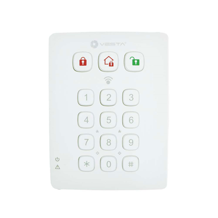

# VESTA 012

***

***

## VESTA 012

### GUÍA RÁPIDA

<figure><figcaption>
VESTA-012 - KPT-39N-F1
</figcaption></figure>

**Para agregar un teclado en el panel VESTA:**

Paso 0: coloque el panel **modo aprendizaje**

Paso 1: Presione\[\*] +\[# ] durante 3 segundos para aprender del teclado al panel

\[❓] Cómo poner el panel en modo aprendizaje desde **SmartHomeSec**



### CERTIFICACIONES

EN50131 Grado 2, Clase II

### MANUAL

TECLADO REMOTO (KPT-39N) Este es VESTA-012

* _**Identificación de piezas**_

 (1).png>)

| <ol><li>Tecla de brazo</li><li>Llave de la casa</li><li>Tecla de desarmar</li><li>Alarma de pánico (si está habilitada)</li></ol>
- presione 1 y 3 para activar la alarma de pánico
<ol><li>Alarma de incendio (si está habilitada)</li></ol>
- presione 4 y 6 para activar la alarma de incendio
<ol><li>Alarma médica (si está habilitada)</li></ol>
- presione 7 y 9 para activar la alarma médica
<ol><li>Enviar código de aprendizaje</li></ol>
- presione ＊ y luego la tecla 7 (en Modo de prueba)

- presione las teclas # y 🞸 (en el modo de operación normal)
 | <ol><li># Llave</li></ol>
- presione para verificar el modo actual del sistema
<ol><li>🞸 Clave</li><li>LED de fallo (LED naranja)</li><li>LED de encendido (LED verde)</li><li>Área de detección para etiqueta NFC</li></ol><ul><li>Coloque la etiqueta NFC cerca del área de detección para acceder al sistema de alarma.</li></ul><ol><li>Manibela de encendido</li><li>Orificios de montaje</li><li>Etiqueta NFC</li></ol> |
| ------------------------------------------------------------------------------------------------------------------------------------------------------------------------------------------------------------------------------------------------------------------------------------------------------------------------------------------------------------------------------------------------------------------------------------------------------------------------------------------------------------------------------------------------------------------------------------------------- | ----------------------------------------------------------------------------------------------------------------------------------------------------------------------------------------------------------------------------------------------------------------------------------------------------------------------------------------------------------------------------------------------------------------------------------- |

\\

* Sonará un pitido corto al presionar una tecla para indicar que el botón presionado es válido.
* Sonarán 4 pitidos continuos indicando error y el usuario deberá repetir el proceso nuevamente.
* _**Indicador LED**_
* **LED de encendido (verde):**
  *
    * Encendido durante 5 segundos: después de completar exitosamente una secuencia de teclas válida.
    * Parpadea durante 5 segundos: batería baja en modo de funcionamiento normal.
    * Si el LED de encendido se apaga antes de que se complete una secuencia de pulsación de tecla válida, se ignoran las teclas ingresadas anteriormente.
* **LED de fallo (naranja):**
  *
    * Tecla Desarmar y LED Naranja encendido junto con 5 pitidos: Memoria de Alarma (depende del Panel de Control).
    * Destello:
* Solo flash: el panel de control no envía respuesta en 10 segundos.
* Parpadea junto con 2 pitidos: Solicitud de modo Casa durante el modo Armado.
* Parpadea junto con 3 pitidos: Solicitud de modo de inicio o armado cuando existe una condición de falla.
* Parpadea junto con 4 pitidos: el código PIN era incorrecto.
* _**Operación general**_
* Ingrese al modo de prueba: ingrese el código PIN del teclado y luego presione la tecla ＊.
* Alarma de pánico: presione**1**tecla +**3**clave al mismo tiempo. (si la función está habilitada)
* Alarma de incendio: presione**4**tecla +**6**clave al mismo tiempo. (si la función está habilitada)
* Alarma médica — Presione**7**tecla +**9**clave al mismo tiempo. (si la función está habilitada)
* Verificar el estado del panel de control: modo normal Presione\*\*#\*\*llave.
* Activar/desactivar sonido de entrada y salida: presione**1**tecla +**2**tecla al mismo tiempo durante 2 segundos. (El teclado emitirá un pitido largo para indicar que la función está habilitada y emitirá 2 pitidos cortos para indicar que la función está deshabilitada).
* _**Fuerza**_
* El teclado remoto utiliza una batería de litio CR123 de 3 V como fuente de energía.
* El teclado remoto también puede detectar el estado de la batería. Si el voltaje de la batería es bajo, el LED de encendido parpadeará durante 5 segundos durante el funcionamiento. La señal de batería baja se enviará junto con transmisiones de señal regulares al panel de control para mostrar el estado correspondiente.
* Antes del envío, la batería viene preinstalada de fábrica.
* Al cambiar la batería, presione cualquier tecla un par de veces para descargarla antes de insertar una batería nueva.
* _**Función de ahorro de energía**_
* Cuando está inactivo, el teclado remoto está en**Apoyar**modo y no utiliza energía. Se activará y**despertar**durante 5 segundos cuando se presiona cualquier tecla.
* Después de 5 segundos de inactividad de la tecla, la energía se corta y vuelve a funcionar.**o En espera**modo.
* _**Protección contra manipulación**_
* El teclado está protegido contra cualquier intento de abrir la tapa o separar el teclado de su superficie de montaje.
* La protección contra manipulaciones se desactiva cuando el teclado está en modo de prueba.
* _**Empezando**_

Paso 1. Ponga el panel de control en modo de aprendizaje.

Paso 2. Agregar un teclado remoto al Panel de control:

**Modo de prueba:**

1. Ponga el teclado remoto en modo de prueba ingresando el código PIN de KP (predeterminado:**0000**), entonces presione\*\*＊\*\*llave.

El tres.png>).png>).png>)Los LED se encenderán junto con un pitido largo.

1. Presione la tecla ＊ y luego**7**Clave para transmitir la señal de aprendizaje. El teclado remoto emitirá un pitido largo.

**Función de modo de prueba:**

1. Presione la tecla ＊ y luego la tecla 1: ingrese al modo de aprendizaje/administración de etiquetas NFC.
2. Presione la tecla ＊ y luego la tecla 2: habilite la función de alarma de pánico de doble tecla
3. Presione la tecla ＊ y luego la tecla 3: habilite la función de alarma contra incendios de doble tecla
4. Presione la tecla ＊ y luego la tecla 4: habilite la función de alarma médica de doble tecla
5. Presione la tecla ＊ y luego la tecla 5: deshabilite todas las funciones de tecla dual (predeterminado)
6. Presione la tecla ＊ y luego la tecla 6 — Editar código PIN del teclado

..Ingresar**Viejo**Código PIN del teclado y luego presione\*\*＊\*\*llave

..Ingresar**Nuevo**un nuevo código PIN de teclado de 4 dígitos y luego presione\*\*#**llave**.\*\*

1. Presione la tecla ＊ y luego la tecla 8 — Habilitar la función Armar/Casa sin código PIN.

_(Por favor refiérase a "**Armar/Inicio sin código PIN del panel de control**” para más detalles, página 4)._

1. Presione la tecla ＊ y luego la tecla 9: Habilite Armar/Inicio con la función Código PIN de usuario del panel de control (predeterminado).

(_Por favor refiérase a "**Armar/Inicio con código PIN del panel de control**” para más detalles, página 4_).

\\

* Si el teclado remoto no emitió un pitido largo, significa que el teclado remoto no envió el código de aprendizaje al Panel de control, presione la tecla ＊ y luego**7**tecla nuevamente para enviar el código de aprendizaje.
* Si el Panel de control recibe el código de aprendizaje, mostrará la información correspondiente. Consulte el manual de operación de su Panel de control para completar el proceso de aprendizaje.
* Después de que el Panel de control reciba la señal del teclado remoto, enviará un reconocimiento al teclado remoto. Luego, el teclado remoto emitirá un pitido 3 veces para confirmar que se ha recibido el reconocimiento. Si el teclado remoto no emite 3 pitidos, reinicie el procedimiento de aprendizaje.

Paso 3. Después de aprender el teclado remoto, coloque el panel de control en**Prueba de caminata**modo, mantenga presionado el teclado remoto en la ubicación deseada y envíe el código de aprendizaje al Panel de control para confirmar que esta ubicación está dentro del alcance de la señal del Panel de control. Para enviar el código de aprendizaje, presione el botón\*\*＊**clave entonces**7**tecla en Modo de prueba o presione ambas**#**y**＊\*\*teclas juntas en el modo de funcionamiento normal.

Paso 4. Cuando esté satisfecho de que el teclado remoto funciona en la ubicación elegida, puede continuar con el montaje del teclado remoto siguiendo los pasos que se describen a continuación (consulte "_**Montaje del teclado remoto**" para detalles)_.

Paso 5. Presione la tecla Desarmar**dos veces**para salir del modo de prueba y se completará la instalación. El teclado remoto emitirá un pitido largo y tres LED de modo del sistema se apagarán. El teclado remoto vuelve al modo de funcionamiento normal.

\\

* El teclado remoto saldrá automáticamente del modo de prueba después de 5 minutos de inactividad y volverá al modo de espera. Todos los LED se apagarán y el teclado emitirá un pitido largo.
* _**Procedimientos de aprendizaje/borrado/instalación de etiquetas NFC**_

NFC significa Near Field Communication, que es una tecnología de comunicación inalámbrica que establece conexión entre dos dispositivos acercándolos. Puede almacenar un código PIN de usuario en una etiqueta NFC y usar la etiqueta NFC para acceder al sistema de alarma sin ingresar un código PIN de usuario en KPT-39N. El teclado puede aprender hasta 100 etiquetas NFC con hasta 50 códigos PIN.

_**A. Procedimiento de aprendizaje NFC:**_

Paso 1. Habilite el teclado remoto para ingresar primero al modo de prueba. Ingrese el código PIN del teclado (predeterminado:**0000**) seguido de la tecla ＊. Mientras ingresa el código PIN, el**LED de encendido**(Verde) se encenderá. El**LED de encendido**Luego se apagará y emitirá un pitido largo.

Paso 2. Presione la tecla ＊ y luego**1**para ingresar al modo de aprendizaje de etiquetas NFC. El**LED de fallo**(Naranja) se encenderá y emitirá un pitido largo.

Paso 3. Ingrese un nuevo código PIN seguido de la tecla #. El teclado emitirá un pitido largo y el LED naranja comenzará a parpadear durante 5 segundos para indicar que está listo para aprender una etiqueta NFC.

Paso 4. En 5 segundos, coloque una etiqueta NFC cerca del área de detección del teclado para vincularla con el código PIN de usuario que acaba de ingresar.

* Cada etiqueta emparejada restablecerá el tiempo de aprendizaje de la etiqueta NFC a 5 segundos. Puede emparejar varias etiquetas con un único código de usuario aplicando las etiquetas una por una.
* El teclado saldrá del modo de aprendizaje de etiquetas NFC después de 5 segundos de inactividad.
* Si la etiqueta aprendida es nueva, el Teclado emitirá 2 pitidos cortos.
* Si la etiqueta aprendida ya existe en el Teclado (asignada a otro Código PIN), el Teclado emitirá 1 pitido corto.

Paso 5. Para aprender en otra etiqueta, repita del paso 3 al paso 4. El teclado saldrá del modo de aprendizaje de etiquetas NFC automáticamente después de estar inactivo durante 5 segundos.

Paso 6. Presione.png>)para salir del modo de aprendizaje de etiquetas NFC.

* Condición de error:
* Si el código de usuario del panel de control ingresado excede el máximo de dígitos del código PIN, el LED naranja parpadeará junto con 4 pitidos cortos para indicar un error.
* Si el teclado ya ha almacenado 50 códigos PIN del panel de control, emitirá 4 pitidos cortos para indicar un error cuando intente ingresar el código PIN número 51.
* Si el teclado ya aprendió 100 etiquetas NFC, emitirá 4 pitidos cortos para indicar un error cuando intente aprender en la etiqueta NFC 101.

_**B. Procedimiento de compensación NFC:**_

Puede borrar la información de la etiqueta NFC.

Paso 1. Habilite el teclado remoto para ingresar primero al modo de prueba. Ingrese el código PIN del teclado (predeterminado:**0000**) seguido de la tecla ＊. Mientras ingresa el código PIN, el**LED de encendido**(Verde) se encenderá. El**LED de encendido**Luego se apagará y emitirá un pitido largo.

Paso 2. Presione la tecla ＊ y luego**1**para ingresar al modo de aprendizaje de etiquetas NFC. El**LED de fallo**(Naranja) se encenderá y emitirá un pitido largo.

Paso 3. Si desea eliminar un código PIN del Panel de control almacenado en el teclado y todas las etiquetas NFC asignadas a este código PIN, ingrese el código de usuario del Panel de control y presione la tecla ＊, sonará un pitido largo.

Si desea borrar solo una etiqueta NFC específica, presione la tecla ＊ con un pitido largo y el LED naranja parpadeará durante 5 segundos. Coloque una etiqueta NFC cerca del área de detección del teclado en 5 segundos:

* Si la etiqueta NFC aplicada existe en el teclado, el teclado emitirá 2 pitidos cortos para indicar que se han eliminado los datos de la etiqueta NFC.
* Si la etiqueta NFC aplicada no existe en el teclado, el teclado emitirá 4 pitidos cortos para indicar un error.
* Cada etiqueta NFC aplicada restablecerá el temporizador de eliminación de etiquetas NFC a 5 segundos; puede eliminar varias etiquetas NFC

etiquetas aplicándolas una por una.

Paso 4. El teclado saldrá automáticamente del modo de eliminación de etiquetas NFC después de estar inactivo durante 5 segundos.

 (1) (1).jpeg>)Paso 5. Presione (1).png>)para salir del modo de aprendizaje de etiquetas NFC.

_**C. Procedimiento de instalación de NFC**_

Las pequeñas etiquetas NFC se pueden colocar en la parte posterior de teléfonos inteligentes, tarjetas o llaveros para facilitar el acceso.

Paso 1. Aprenda en la etiqueta NFC del teclado remoto

Paso 2. Retire la cubierta protectora de la etiqueta NFC.

Paso 3. Aplique la etiqueta NFC a la tapa trasera de su teléfono celular, etc.

Paso 4. Ahora puedes usar la etiqueta NFC para acceder al sistema.

**\\**

* Tenga cuidado de no doblar la etiqueta NFC, ya que podría dañarse y quedar inservible.
* KPT-39N solo admite el protocolo ISO 14443A para etiquetas NFC.
* _**Control de modo del sistema**_

Después de terminar de aprender el teclado en el panel de control del sistema de alarma, el usuario puede cambiar el sistema usando el teclado.

Hay dos formas de armar el sistema.

1. Armar Ausente/Casa Armar el sistema ingresando el código PIN de usuario del panel de control.
2. Armar Ausente/Casa Armar el sistema sin ingresar el código PIN de usuario del panel de control.

Para desarmar el sistema siempre es necesario ingresar el código PIN de usuario del panel de control.

**Armar/Inicio con código PIN del panel de control:**

En el modo de prueba, presionando la tecla ＊ y luego**9**para habilitar la función Armar/Casa con código PIN.

Etiqueta NFC. Si el panel no tiene fallas y el armado es exitoso, el (1).png>)El LED se encenderá junto con

un pitido largo.

pitidos.

5 pitidos.

**Armar/Inicio sin Código PIN del Panel de Control:**

En el modo de prueba, presionando la tecla ＊ y luego**8**Tecla para habilitar la función Armar/Inicio sin código PIN

junto con un pitido largo.

junto con 3 pitidos.

una etiqueta. Si el desarmado tiene éxito, el.png>)El LED se encenderá junto con 2 pitidos. Si hay\*\*memoria de alarma,\*\*el.png>)El LED y el LED de falla se encenderán junto con 5 pitidos.

* _**Sonido de entrada/salida**_
* Después de habilitar el sonido de entrada/salida presionando**1**tecla +**2**al mismo tiempo durante 2 segundos (indicado por un pitido largo), el teclado emitirá pitidos cuando se active el temporizador de entrada/salida.
* Después de desactivar el sonido de entrada/salida presionando**1**tecla +**2**al mismo tiempo durante 2 segundos (indicado por dos pitidos cortos), el teclado permanecerá en silencio cuando se active el temporizador de entrada/salida.
* _**Condiciones de falla**_

_Cuando el teclado remoto está bajo**MODO DE FUNCIONAMIENTO NORMAL,**_

*
  1. Cuando existe una condición de falla dentro del panel de control, si se usa el teclado para armar el panel, el LED de falla parpadeará junto con 3 pitidos para indicar la condición de falla.
  2. Cuando el Teclado desarma el panel, el.png>)El LED se encenderá junto con dos pitidos que indican un funcionamiento normal.
  3. Si ingresa un código PIN KP incorrecto 4 veces en 10 minutos en el modo de prueba, KP desactivará la función de la tecla durante 1 minuto y todos los LED parpadearán 3 veces junto con 6 pitidos. Después de 1 minuto, emitirá un pitido largo para indicar que la función de la tecla ha vuelto a la normalidad.
  4. Si ingresa un código PIN de KP incorrecto 4 veces en 10 minutos al cambiar el modo del sistema, KP desactivará la función de la tecla durante 5 minutos. Después de 5 minutos, el teclado emitirá un pitido largo para indicar que la función de la tecla ha vuelto a la normalidad.
* _**Restablecimiento de fábrica**_

Restablecer el teclado a los valores predeterminados de fábrica restaurará el código PIN del teclado a 0000 y borrará toda la memoria de aprendizaje del panel.

_**Restablecer los valores predeterminados de fábrica:**_

Paso 1 Retire las baterías y libere el manipulador.

Paso 2 Si “**Armar/Inicio con código PIN del panel de control**"Método seleccionado, mantenga presionado**3**llave mientras vuelve a insertar la batería.

.Si "**Armar/Inicio sin código PIN del panel de control**"Método seleccionado, mantenga presionado**4**llave mientras vuelve a insertar la batería.

Paso 3 Continuar presionando**3**hasta que el KP emita 3 pitidos para indicar que el reinicio se realizó correctamente.

.Continúe presionando la tecla 4 hasta que KP emita 4 pitidos para indicar un reinicio exitoso.

Paso 4 Liberación**3**o 4 teclas, el proceso de reinicio está completo. Después del reinicio, el código PIN vuelve a los valores predeterminados de fábrica.**0000**.

.El teclado remoto necesitará un nuevo proceso de aprendizaje para comenzar a funcionar.

* Siempre que se retira el teclado del Panel de control, también se debe restablecer a los valores de fábrica para borrar la memoria del Panel de control.
* _**Montaje del teclado remoto**_

Para montar el teclado remoto:

1. Retire la cubierta frontal.
2. Utilizando los 2 orificios de montaje de la cubierta trasera como plantilla, marque las posiciones en el lugar más adecuado.
3. Inserte los tacos de pared si los fija en una superficie de yeso o ladrillo.
4. Atornille el teclado remoto a los tacos de pared.
5. Vuelva a colocar la cubierta frontal.
