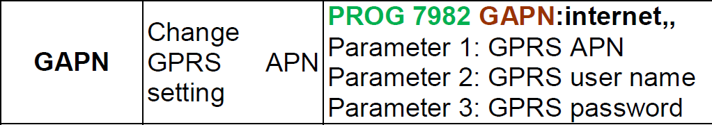

# VESTA-068N: Manual instalador \[BOGP]

## Introducción: Manual para Centrales Tipo BOGP Autónomas

<figure><figcaption>
VESTA-068N/VESTA-067
</figcaption></figure>

Este manual está diseñado para guiarte en la puesta en marcha y configuración de centrales tipo BOGP autónomas, operadas a pilas o con batería externa. El contenido del manual está organizado de la siguiente manera:

1. Conexión de batería externa y SIM
2. Alta del panel en instalador y Master
3. Añadir y configurar dispositivos
4. Completar configuraciones del sistema y reporte a CRA

## 1. Conexión de batería externa + SIM y configuración de APN


Es crucial configurar el APN para que el panel pueda comunicarse con el cloud de SmartHomeSec. Asimismo, la conexión de la batería externa es fundamental para que el panel mantenga una comunicación constante y efectiva con el cloud. Si el panel solo cuenta con pilas internas, no se conectará al cloud a menos que se habilite el XMPP en los ajustes del panel.


### 1.1 Conexión de SIM y batería externa

<figure><figcaption>
Insertar la SIM y Batería externa
</figcaption></figure>

### 1.2 Configuración del APN

<figure><figcaption>
Configuración del APN paso a paso
</figcaption></figure>


Advertencia! Para paneles que NO disponen de batería externa, solo pilas internas, habilitar el cloud usando el teclado y pantalla LCD del propio panel de la siguiente forma antes de proceder:


<figure><figcaption>
Habilitar el cloud, cuando se usa el panel únicamente por pilas
</figcaption></figure>

## 2. Registro del panel como instalador y usuario

### 2.1 Registro como instalador

<table data-view="cards"><thead><tr><th></th><th></th><th></th></tr></thead><tbody><tr><td><strong>Paso 1:</strong> Entrar como instalador en la APP SmartHomeSec</td><td></td><td></td></tr><tr><td>
<strong>Paso 2:</strong> Seleccionar el botón + 

(Añadir panel) 
</td><td></td><td></td></tr><tr><td><strong>Paso 3:</strong> Introducir la dirección MAC del panel que viene una etiqueta</td><td></td><td></td></tr></tbody></table>

Una vez registrado el panel como instalador, está listo [✨](https://emojipedia.org/es/chispas) para su configuración.


El panel deberá estar encendido y con conexión a internet. Dispondremos de 15 minutos tras la alimentación para registrar el panel.



La MAC del panel siempre está en un lateral del mismo físicamente. En el campo **NOMBRE**, debemos colocar el abonado o cualquier identificativo del panel.


### 2.2 Registro de la cuenta de usuario

La cuenta de usuario es la que se emplea para controlar el sistema y está destinada al usuario final. Desde la APP SmartHomeSec, esta cuenta permite armar, desarmar y realizar cualquier operativa. Existen dos tipos de cuentas de usuario: Master y Esclava.

La primera cuenta que registramos es la Master. La diferencia principal entre la cuenta Master y la Esclava es que la Master permite crear nuevos usuarios, mientras que la Esclava no puede crear nuevas cuentas.

