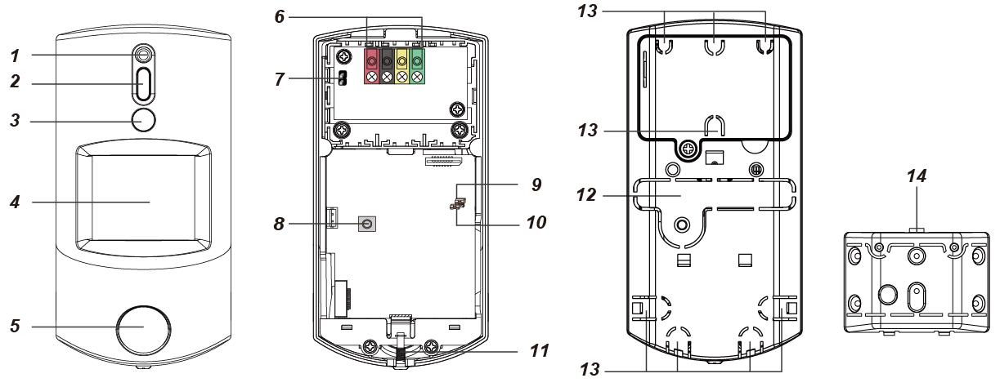
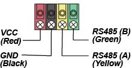
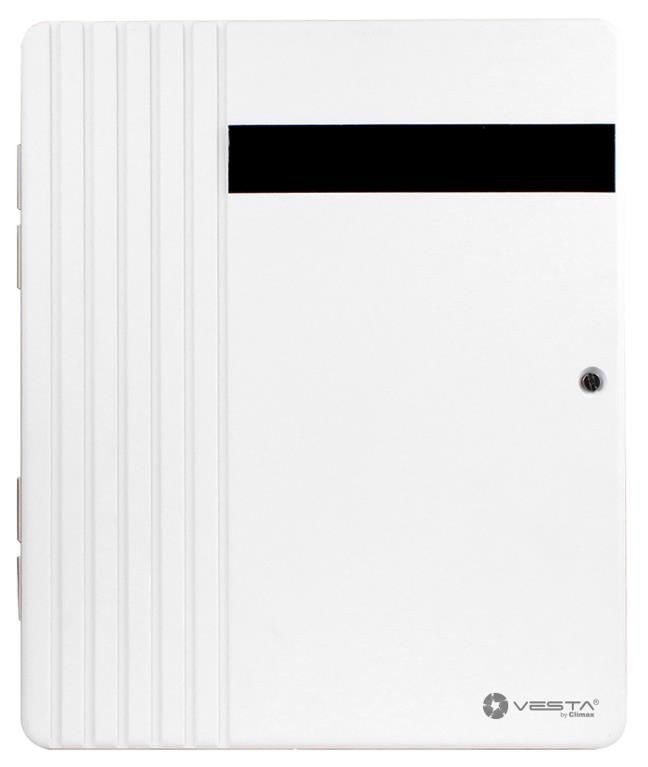

# VESTA 177

**Sensor de movimiento PIR Serie IR-35-2W / VESTA-177**

**Introducción**

El PIR detecta firmas infrarrojas para detectar movimientos dentro de un área asignada y le indica al panel de control que active la alarma si un intruso se cruza en su camino de detección.

El PIR está diseñado para ofrecer un rango de detección típico de 12 metros cuando se monta a 2,5 metros del suelo. El sensor PIR también admite la función de inmunidad a mascotas y no detectará mascotas de hasta 25 kg para minimizar la situación de falsas alarmas.

El PIR consta de un diseño de dos partes formado por una cubierta y una base. La cubierta contiene toda la electrónica y la óptica y la base proporciona un medio de fijación.

**El sensor PIR serie IR-35-2W incluye los siguientes modelos:**

**IR-35-2W**– Sensor de movimiento PIR alimentado por dos pilas alcalinas

**Arakhsalu**– Sensor de movimiento PIR alimentado por una batería CR123

**Identificación de piezas**

1. **Botón de prueba/indicador LED**
   * El botón de prueba se utiliza para probar el rendimiento de la radio y con fines de aprendizaje.
   * El indicador LED se utiliza para indicar el estado del sistema.
2. **Sensor de infrarrojos**

**3. Compartimento de la batería**

**4. Interruptor de puente para habilitar/deshabilitar la inmunidad a mascotas (JP3)**

**Puente encendido**

**Puente apagado**

.png>)

* Cuando está activado, la inmunidad a mascotas está desactivada (valor predeterminado de fábrica).
* Cuando se establece en APAGADO, la inmunidad a mascotas está habilitada.

1. **Interruptor de puente aumentador de sensibilidad (JP4)** \*
   * Cuando se establece en ON, la sensibilidad de detección del PIR es alta.
   * Cuando se configura en APAGADO, la sensibilidad de detección del PIR está en el nivel normal. (Predeterminado de fábrica)
2. **Manibela de encendido**
3. **Tornillo de fijación inferior**
   1. **Orificio aislante de batería IR-35-2W**

**9. Orificio aislante de batería IR-35SL-2W**

**Características**

* _**Indicador LED**_

En el modo de funcionamiento normal, el indicador LED se iluminará en las siguientes situaciones:

*
  * Cuando se detecta movimiento en condiciones de batería baja
  * Cuando se abre la cubierta y se activa el interruptor de manipulación
  * Cuando se detecta movimiento si la condición de manipulación continúa
  * Cuando se detecta movimiento en el modo de prueba
  * Cuando se presiona el botón de prueba en condiciones de manipulación o si el PIR tiene poca batería, el LED no parpadeará si la manipulación del PIR y la batería son normales y el PIR no está en modo de prueba.

Si el LED parpadea para indicar transmisión de señal, parpadeará dos veces rápidamente al recibir el reconocimiento del Panel de control.

* _**Detección de batería y batería baja**_

El sensor de movimiento PIR de la serie IR-35-2W utiliza baterías alcalinas o de litio como fuente de energía:

* El modelo IR-35-2W utiliza dos pilas alcalinas AA de 1,5 V como fuente de alimentación.
* El modelo IR-35SL-2W utiliza una batería de litio CR123 de 3 V como fuente de energía.

El PIR presenta una función de detección de batería baja. Si se detecta un voltaje de batería bajo, se enviará una señal de batería baja al Panel de control junto con las transmisiones de señal regulares para que el Panel de control muestre el estado correspondiente.

Para cada instalación, las baterías las instala la fábrica antes del envío con un aislante insertado.

* Al cambiar las baterías, después de quitar las baterías viejas, presione el interruptor de manipulación dos veces para descargar completamente antes de insertar baterías nuevas.
* _**Protección contra manipulación**_

El PIR está protegido por un interruptor de manipulación que se comprime cuando el PIR está instalado correctamente. Cuando se retira el PIR de la superficie montada o del soporte de montaje, o cuando se abre su cubierta, se activará el interruptor de manipulación y el PIR enviará una señal de apertura de manipulación al panel de control del sistema para recordarle al usuario la condición. Si se detecta algún movimiento cuando el interruptor de manipulación está abierto, el LED se iluminará.

* _**Función de supervisión**_

Cuando el PIR esté en modo de funcionamiento normal, realizará una autoprueba periódicamente transmitiendo una señal de supervisión una vez cada 90 a 110 minutos.

Si el Panel de Control no recibe las señales de supervisión transmitidas desde un determinado PIR durante un tiempo preestablecido, se producirá un “**Fuera de servicio**r” se generará un mensaje de error.

* _**Modo de prueba**_

El PIR se puede poner en modo de prueba presionando el botón de prueba. En el modo de prueba, desactivará el temporizador de apagado y permitirá que el indicador LED se encienda cada vez que se detecte un movimiento. Cada vez que se presiona el botón de prueba, el PIR transmitirá una señal de prueba al panel de control para realizar una prueba de alcance de radio y entrará en el modo de prueba durante 3 minutos. El modo de prueba finalizará después de 3 minutos.

* _**Tiempo de dormir**_
  * El PIR tiene un “**hora de dormir**" de aproximadamente**1 minuto**para conservar el poder.
  * Dependiendo de la configuración del modo de suspensión (normal u optimizado), el PIR entrará**hora de dormir**para**1 minuto**después de transmitir un movimiento detectado o 3 movimientos detectados en 1 minuto.
  * Durante el**1 minuto de sueño**, el PIR no retransmitirá ninguna señal; cualquier movimiento adicional detectado durante este período de sueño extenderá el tiempo de sueño en otro minuto. De esta manera, el movimiento continuo frente al PIR no agotará indebidamente la batería.
* La configuración del modo de suspensión se puede configurar de forma remota. Cuando el modo de suspensión está configurado en Normal, el PIR entrará en tiempo de suspensión durante 1 minuto después de transmitir un movimiento detectado. Cuando el modo de suspensión está configurado en Optimizado, el PIR entrará en tiempo de suspensión durante 1 minuto después de transmitir 3 movimientos detectados en 1 minuto. Por favor refiérase a\_**Configuración remota**\_sección siguiente para más detalles.
* _**Función de inmunidad a las mascotas**_
  * El sensor PIR admite la función de inmunidad a mascotas y no detectará mascotas de hasta 25 kg para minimizar la situación de falsas alarmas.
  * La función de inmunidad a mascotas se puede habilitar/deshabilitar configurando la posición del interruptor de puente (JP3). Cuando el interruptor de puente (JP3) está en ON, la inmunidad a mascotas está desactivada (valor predeterminado de fábrica). Cuando el interruptor de puente (JP3) está en APAGADO, se habilita la inmunidad a mascotas.
  * La función Pet Immunity también se puede configurar de forma remota. Por favor refiérase a\_**Configuración remota**\_sección siguiente para más detalles.
* _**Función de aumento de sensibilidad**_
  * Puede utilizar la función de aumento de sensibilidad para aumentar la sensibilidad de detección del PIR.
  * Para aumentar la sensibilidad de detección, configure el interruptor de puente (JP4) en ON. Para mantener una sensibilidad de detección normal, configure el interruptor de puente (JP4) en APAGADO (valor predeterminado de fábrica).
  * La sensibilidad de detección del PIR también se puede configurar de forma remota. Por favor refiérase a\_**Configuración remota**\_sección siguiente para más detalles.
* _**Configuración remota**_
  * El sensor de movimiento PIR admite la configuración remota de inmunidad a mascotas, sensibilidad y modo de suspensión.
  * Cuando el PIR está encendido, su función de inmunidad a mascotas y su sensibilidad están determinadas por las configuraciones JP3 y JP4. Los usuarios pueden ajustar la configuración de los puentes o cambiar de forma remota la configuración de sensibilidad e inmunidad a las mascotas desde el Panel de control. La configuración remota sobrescribirá la configuración del puente.

**Página web del panel de control**

1. En la página web local del Panel, vaya a la página Editar dispositivo e ingrese la configuración del sensor de movimiento PIR en la sección Configuración del sensor. Haga clic en Aceptar para confirmar.

Consulte la siguiente tabla para obtener detalles de configuración. Por ejemplo, si desea habilitar la inmunidad a mascotas y configurar el nivel de sensibilidad y el modo de suspensión en normal, puede ingresar 02.

| **Configuración de infrarrojos** | **Inmunidad a las mascotas** | **Sensibilidad** | **Modo de sueño**          |
| -------------------------------- | ---------------------------- | ---------------- | -------------------------- |
| 00                               | No                           | Normal           | Normal (1 detección)       |
| 01                               | No                           | Alto             | Normal (1 detección)       |
| 02                               | Sí                           | Normal           | Normal (1 detección)       |
| 03                               | Sí                           | Alto             | Normal (1 detección)       |
| 04                               | No                           | Normal           | Optimizado (3 detecciones) |
| 05                               | No                           | Alto             | Optimizado (3 detecciones) |
| 06                               | Sí                           | Normal           | Optimizado (3 detecciones) |
| 07                               | Sí                           | Alto             | Optimizado (3 detecciones) |

1. Presione el botón Prueba una vez en el sensor de movimiento PIR para enviar una señal al Panel de control y la nueva configuración se aplicará inmediatamente. Si no se presiona el botón, la nueva configuración se aplicará en la siguiente transmisión de señal, es decir, la transmisión de la señal de supervisión o la señal de activación de IR.

**Servidor del portal de inicio**

1. En Home Portal Server, vaya a la página de configuración del dispositivo, haga clic en la fila del dispositivo IR-35-2W y seleccione "Configuración de IR".
2. Seleccione la función Inmunidad a mascotas (Activar/Desactivar), Sensibilidad (Alta/Normal) y la función Modo de suspensión optimizado (Normal/Optimizado) de las listas desplegables, haga clic en "Enviar" para confirmar la configuración.
3. Presione el botón Prueba una vez en el sensor de movimiento PIR para enviar una señal al Panel de control y la nueva configuración se aplicará inmediatamente. Si no se presiona el botón, la nueva configuración se aplicará en la siguiente transmisión de señal, es decir, la transmisión de la señal de supervisión o la señal de activación de IR.

* _**Empezando**_
  * Saque el aislante de la batería para activar las baterías.
  * El indicador LED parpadeará durante 30 segundos (el PIR se está calentando). Durante el período de calentamiento, el PIR no se activará. Una vez finalizado el período de calentamiento, el LED se apagará y el PIR estará listo para funcionar.
  * Coloque el Panel de control en modo de aprendizaje (consulte el manual del Panel de control para obtener más detalles).
  * Presione el botón de prueba.
  * Consulte el manual del Panel de control para completar el proceso de aprendizaje.
  * Después de aprender el PIR, coloque el Panel de control en "**Prueba de caminata**" modo; sostenga el PIR en la ubicación deseada y presione el botón Prueba para confirmar que esta ubicación está dentro del rango de señal del panel de control (consulte el manual del panel de control para completar la prueba de caminata).
  * Cuando esté satisfecho de que el PIR funciona bien en la ubicación elegida, puede continuar con el montaje.

**Instalación**

_**Guía de instalación**_

.png>)

**Rango de detección IR-35-2W**

3

* _**Método de montaje**_
* El PIR está diseñado para montarse en una superficie plana o en una esquina.
* La base tiene dos orificios ciegos, donde el plástico es más delgado y se puede romper para montarlo en la superficie.
* Un soporte de montaje incluye dos orificios para tornillos centrales para fijar el PIR a una superficie y cuatro orificios para tornillos laterales.

* Para montaje en superficie, se proporciona un soporte giratorio opcional para que los usuarios ajusten el rango de detección. Con el soporte giratorio, el IR-35-2W se puede girar 80 grados horizontalmente y 70 grados verticalmente para brindar una cobertura óptima.
  * **Montaje en superficie sin soporte de montaje:**
    1. Retire el tornillo de fijación inferior y el conjunto de la cubierta.
    2. Rompe los dos nocauts desde el interior de la base.
    3. Utilice los agujeros como plantilla y taladre agujeros en la superficie a montar.
    4. Inserte los tacos si el PIR se va a fijar sobre yeso o ladrillo.
    5. Atornille la base a los tacos.
    6. Atornille la tapa a la base.
* **Montaje en superficie con el soporte de montaje:**
  1. Utilice los dos orificios centrales para tornillos en el soporte como plantilla y taladre orificios en la superficie a montar.
  2. Inserte los tacos si el PIR se va a fijar sobre yeso o ladrillo.
  3. Atornille el soporte de montaje a los tacos de pared con los dos punteros hacia arriba y hacia usted.
  4. Coloque el PIR en los ganchos del soporte de montaje.
* **Montaje en superficie con soporte giratorio (artículo opcional, se vende por separado):**
  * Para montaje en superficie, se proporciona un soporte giratorio opcional para que los usuarios ajusten el rango de detección. Con el soporte giratorio, el IR-35-2W se puede girar 80 grados horizontalmente y 70 grados verticalmente para brindar una cobertura óptima.
  * El soporte giratorio se puede montar en la pared con los tornillos suministrados.
    1. Atornille el soporte giratorio a la pared.
    2. Coloque los 3 ganchos del soporte giratorio en los 3 orificios de la base en consecuencia.
    3. Gire el soporte para obtener el rango de detección adecuado y apriete el tornillo de fijación.
* _**Recomendaciones de instalación**_
  * **Se recomienda instalar el PIR en las siguientes ubicaciones:**
    * A una altura de 2,3-2,5 metros para un mejor rendimiento:
    * En lugares donde los animales no puedan llegar al área de detección trepando a muebles u otros objetos.
    * No apunte el sensor hacia escaleras donde los animales puedan subir.
    * En una posición tal que un intruso normalmente se movería a través del campo de visión del PIR de lado a lado.
    * En una esquina para dar la vista más amplia.
    * En una posición donde su campo de visión no quede obstruido por, por ejemplo, cortinas, adornos, etc.
  * **Limitaciones**

<figure><figcaption>
Do not install outdoors. / Avoid large obstacles in the detection area.
</figcaption></figure>

<figure><figcaption>
Do not install the PIR completely exposed to direct sunlight. / Avoid vapor or high humidity that can cause condensation.
</figcaption></figure>
