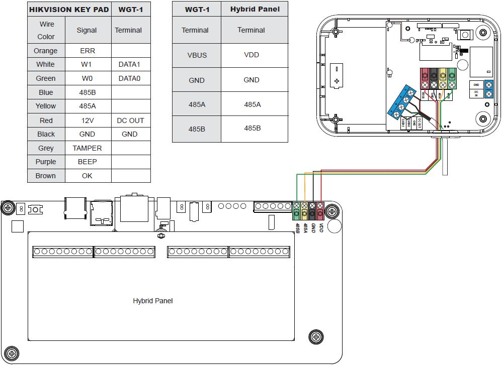

# VESTA 344

 (1) (1).png>)**Módulo WIEGAND (Combo WGT-1)**

WGT-1-COMBO es un módulo WIEGAND que se puede conectar al lector de tarjetas HIKVISION para encubrir WIEGAND 26\[W26] Protocolo en señales inalámbricas RF o señales cableadas BUS. Cuando el lector de tarjetas WIEGAND lee una etiqueta para solicitar armado/desarmado, WGT-1-COMBO transmitirá la señal ARMAR/Desarmar con el número de etiqueta al panel de control.

 (1) (1).png>)

* _**Identificando las partes**_
  1. **Terminal de BUS enchufable**
  2. **Indicador LED**

El LED parpadea una vez después del encendido.

El LED parpadea 3 veces cuando se presiona el botón de aprendizaje y está transmitiendo señal de RF.

*
  1. **Botón Aprender**
  2. **Interruptor de puente de resistencia terminal**

Cuando el módulo WIEGAND está conectado como el dispositivo BUS más lejano en una línea BUS, configure el puente de resistencia terminal del módulo WIEGAND y el puente de resistencia terminal del primer dispositivo BUS (generalmente el panel híbrido) en ON para que sirvan como resistencias terminales. Se mejorará la capacidad de comunicación de la línea BUS conectada.

* Si el puente está APAGADO (si el enlace del puente está retirado o “estacionado” en un pin), la capacidad de comunicación está en nivel normal.
* Si el puente está activado, se mejorará la capacidad de comunicación.
* **Entrada de 12 V CC/tierra.**

 (1) (1).png>)

Conéctelo a una fuente de alimentación de 12 V 1 A.

1. **Salida de 12 V CC/tierra.**

Proporcione 12 V CC a 150 mA al lector de tarjetas HIKVISION conectado.

1

1. **FECHA0**

Conéctese a W0 del lector de tarjetas HIKVISION.

**DATOS1**

Conéctese al W1 del lector de tarjetas HIKVISION.

1. **Orificio de cableado**
2. **Tornillos de base x 4**
3. **Orificios de montaje x 2 (para soporte de montaje)**
4. **Soporte de montaje**

 (1).png>)

* _**Fuerza**_

**Alimentado por panel híbrido (solo para aplicaciones cableadas de BUS)**

* Cuando WGT-1-COMBO está en modo cableado (cableado al panel híbrido), el panel híbrido proporcionará una fuente de alimentación de 13,5 V (típica).

**Aplicación de adaptador de corriente (requerida para aplicaciones inalámbricas; opcional para aplicaciones con cable)**

* Cuando el WGT-1-COMBO esté en modo inalámbrico (NO cableado al panel híbrido), encienda el WGT-1-COMBO conectando el adaptador CA-CC de 12 V de dos cables al**ENTRADA CC / TIERRA**Terminal.
* Cuando WGT-1-COMBO está en modo cableado (cableado al panel híbrido), pero el panel está conectado a cargas que requieren un mayor consumo de energía, se recomienda utilizar un adaptador CA-CC de 12 V de dos cables.

**Salida de potencia:**

*
  *
    * WGT-1-COMBO puede suministrar energía de 12 V, 150 mA al lector de tarjetas HIKVISION conectado a través del terminal de alimentación.
* _**Diagrama de aplicación**_
  * La especificación de cableado de los orificios de inserción es AWG 20-28 o Ø 0,518-0,081 (mm²). Al conectar el cable al terminal, apriete el tornillo para cerrar la cortadora y mantener el cable en su lugar. Desatornille para abrir la cortadora y retire el cable.
  * El WGT-1-COMBO se puede conectar para una aplicación inalámbrica o por cable de acuerdo con los diagramas a continuación:
    *
      1. **Aplicación inalámbrica RF (NO cableado al panel híbrido)**

 (1) (1).png>)

* Antes de realizar el cableado, asegúrese de que se haya desconectado la fuente de alimentación.
  * Conectar**Tierra**terminal de WGT-1-COMBO al terminal de tierra de una fuente de alimentación.
  * Conectar**DC EN**Terminal de entrada de WGT-1-COMBO al terminal de salida de energía de la fuente de alimentación.
  * Conectar**SALIDA CC**terminal del WGT-1-COMBO al**cable rojo**del lector de tarjetas HIKVISION.
  * Conectar**Tierra**terminal del WGT-1-COMBO al**cable negro**del lector de tarjetas HIKVISION.
  * Conectar**FECHA0**terminal del WGT-1-COMBO al\*\*cable verde (W0)\*\*del lector de tarjetas HIKVISION.
  * Conectar**DATOS1**terminal del WGT-1-COMBO al\*\*cable blanco (W1)\*\*del lector de tarjetas HIKVISION.

 (1).png>)

2

1. **Aplicación cableada BUS (cableado al panel híbrido)**

* Antes de conectar el módulo WIEGAND al bus del sistema, apague la alimentación.
* Para ayudar con las conexiones de cables, los bloques de terminales de cada módulo del sistema BUS están codificados por colores.

.jpeg>)

| **Rojo**     | VDD    |
| ------------ | ------ |
| **Negro**    | Tierra |
| **Amarillo** | 485A   |
| **Verde**    | 485B   |

*
  * Conectar**SALIDA CC**terminal del WGT-1-COMBO al**cable rojo**del lector de tarjetas HIKVISION.
  * Conectar**Tierra**terminal del WGT-1-COMBO al**cable negro**del lector de tarjetas HIKVISION.
  * Conectar**FECHA0**terminal del WGT-1-COMBO al\*\*cable verde (W0)\*\*del lector de tarjetas HIKVISION.
  * Conectar**DATOS1**terminal del WGT-1-COMBO al\*\*cable blanco (W1)\*\*del lector de tarjetas HIKVISION.
* Las conexiones incorrectas provocarán fallas o un funcionamiento incorrecto. Inspeccione el cableado y asegúrese de que las conexiones sean adecuadas antes de aplicar energía.
* Encienda el panel, el WGT-1-COMBO también se encenderá.

_\\_

*
  * El diseño enchufable de los bloques de terminales BUS mejora la eficiencia de la instalación. Antes de realizar el cableado, puede retirar los bloques de terminales de la placa PCB para facilitar su uso y enchufarlos nuevamente después del cableado.
  * Después de desconectar el terminal, al volver a instalarlo en la placa, asegúrese de instalar el terminal en la misma dirección para evitar posibles peligros.
* El módulo WIEGAND se puede conectar en serie con otros dispositivos BUS al Panel Híbrido. Cuando está conectado a**VBUS**terminal sin conexión a**DC EN**, la longitud total del cableado no deberá exceder los 300 pies. Cuando está conectado a**DC EN**, la longitud total del cableado puede ser de hasta 3000 pies.
* Para una comunicación óptima de los dispositivos de línea BUS conectados, asegúrese de que los interruptores de puente de resistencia terminal del primer y último dispositivo BUS en una línea BUS estén configurados en ON para que sirvan como resistencias de terminación. Asegúrese de habilitar solo los 2 interruptores de puente antes mencionados y no configurar los interruptores de puente en ON para ningún otro dispositivo BUS intermedio.

3

*  (1).png>)_**Aprender WGT-1-COMBO en el Panel de control**_

\*\*Paso 1.\*\*Ponga el Panel de control en modo de aprendizaje.

\*\*Paso 2.\*\*\*\*(Para aplicación inalámbrica)\*\*Presione el botón de aprendizaje del WGT-1-COMBO. El módulo WIEGAND transmitirá una señal de aprendizaje al Panel de Control. Si el Panel de Control recibe exitosamente la señal de aprendizaje, el WGT-1-COMBO se mostrará en el Panel de Control como lector de etiquetas.

\*\*(Para aplicaciones cableadas de BUS)\*\*Si el WGT-1-COMBO está correctamente conectado al Panel, se mostrará automáticamente en el Panel de Control como lector de etiquetas.

\*\*Paso 3.\*\*Consulte el manual del Panel de control para completar el proceso de aprendizaje.

\*\*Etapa 4.\*\*Navegue por el Panel de control hasta "**Prueba de caminata**" modo. Sostenga el WGT-1-COMBO en la ubicación deseada, presione el botón de aprendizaje en el módulo WIEGAND para confirmar que esta ubicación está dentro del alcance de la señal del Panel de control.

 (1).png>)

* _**Identificación (para aplicación cableada de BUS)**_

El "**Identificar**La función ”se utiliza para localizar un dispositivo BUS específico en el sistema cableado BUS. Esta función es útil para distinguir qué dispositivo es cuál, especialmente en una instalación grande donde se incluyen numerosos dispositivos BUS.

Para ubicar el módulo WIEGAND en el sistema BUS:

\*\*Paso 1.\*\*En la página web del Panel híbrido, haga clic en "Identificar" debajo de la lista de dispositivos después de la entrada de la columna del dispositivo del lector de etiquetas.

\*\*Paso 2.\*\*Si el lector de etiquetas recibe la señal del panel híbrido, la página web mostrará un mensaje de éxito y el indicador LED del WGT-1-COMBO parpadeará 10 veces para indicarle al usuario dónde está.

 (1) (1).png>)

_\\_

* Si se muestra un mensaje de tiempo de espera en la página web, significa que el módulo WIEGAND no recibió la señal del Panel.

Verifique si el módulo WIEGAND está conectado correctamente al panel con la distancia de cableado adecuada.

* _**Prueba de caminata**_
  * Para asegurarse de que el módulo WIEGAND pueda comunicarse con el panel después de su aprendizaje, coloque el panel de control en modo de prueba de caminata y presione el botón de aprendizaje en WGT-1-COMBO para transmitir una señal de prueba al panel de control.
  * Cuando el panel reciba la señal de prueba, emitirá un pitido y mostrará la información del módulo WIEGAND en consecuencia en la parte superior de la lista de dispositivos.

_\\_

* Si no hay respuesta del Panel después de presionar el botón de aprendizaje, significa que el Panel no recibió la señal de prueba del dispositivo.

Verifique si WGT-1-COMBO está conectado correctamente al panel dentro de la distancia de cableado adecuada.

* _**Aprendizaje/eliminación de etiquetas**_
  * Antes de aprender una etiqueta en el Panel de control, asegúrese de que el WGT-1-COMBO se haya aprendido en el Panel de control.
  * Después de encender por primera vez el lector de tarjetas HIKVISION, espere hasta que suene un pitido, lo que indica que se completó el proceso de inicio.

 (1) (1).png>)

**Aprendizaje de etiquetas**

\*\*Paso 1.\*\*Desarmar el sistema.

**Paso 2.Ve a lapágina web local**>**Código PIN**. Selecciona el**Área**. pasar etiqueta**dos veces**a través del lector de tarjetas HIKVISION en**menos de 4 segundos**, el lector de tarjetas emitirá dos pitidos y luego WGT-1-COMBO transmitirá la señal con el número de etiqueta al panel de control. Hacer clic**Carga**botón en la página web.

 (1) (1).png>)

4

\*\*Paso 3.\*\*Cuando el número de identificación de la etiqueta se muestra en la página web, ingrese un código de usuario de 4 o 6 dígitos y asigne un nombre de usuario para la etiqueta.

 (1) (1).png>)

**Etapa 4.Hacer clicDE ACUERDO**en la página web para guardar.

**Paso 5.El aprendizaje de etiquetas está completo.**

**Eliminación de etiquetas**

\*\*Paso 1.\*\*Desarmar el sistema.

**Paso 2.Ve a lapágina web local**>**Código PIN**. Selecciona el**Área**. pasar etiqueta**dos veces**a través del lector de tarjetas HIKVISION en**menos de 4 segundos**, el lector de tarjetas emitirá dos pitidos y luego WGT-1-COMBO transmitirá la señal con el número de etiqueta al panel de control. Busque una fila de número de etiqueta en blanco y haga clic en el botón Cargar para verificar el número de ID de etiqueta que va a eliminar\*\*.\*\*

 (1) (1).png>)

**Paso 3.Según el número de identificación de etiqueta recién cargado, busque el mismo número de identificación de etiqueta en la lista y seleccioneBorrar**.

* **Ejemplo:Como se muestra en la imagen a continuación, los números 1 y 2 de la lista son las etiquetas aprendidas existentes. Después de pasar la etiquetados veces**a través del lector de tarjetas y haga clic en**Carga**en la fila en blanco No.3, el número de identificación de la etiqueta se mostrará en el No. 3. Como el No.3 es el mismo que el No.2, el No.2 es la etiqueta que se eliminará. Seleccionar**Borrar**en la fila número 2 para quitar la etiqueta.

 (1) (1).png>)

**Etapa 4.Hacer clicDE ACUERDO**en la página web para guardar el cambio.

\*\*Paso 5.\*\*La eliminación de la etiqueta está completa.

* _**Señal de supervisión**_
  * Cuando esté en modo cableado, el módulo WIEGAND transmitirá automáticamente señales de supervisión al panel de control en un intervalo de 20 a 30 segundos.
  * Cuando esté en modo inalámbrico, el módulo WIEGAND transmitirá automáticamente señales de supervisión al panel de control en un intervalo de 30 a 50 minutos.
  * Si el Panel de control no ha recibido la señal del módulo WIEGAND durante un período de tiempo preestablecido, el Panel de control considerará que el módulo WIEGAND está fuera de servicio y reaccionará de acuerdo con la configuración del panel.

5

* **Para armar el sistema:pasar etiquetauna vez**a través del lector de tarjetas HIKVISION, el lector de tarjetas emitirá un pitido. Después de 4 segundos, WGT-1-COMBO transmitirá la señal ARM con el número de etiqueta al Panel de control. Si el panel de control confirma que la etiqueta está adjunta al usuario, cambiará automáticamente al modo armado.
* **Para desarmar el sistema:pasar etiquetados veces**a través del lector de tarjetas HIKVISION en**menos de 4 segundos**, el lector de tarjetas emitirá dos pitidos y luego WGT-1-COMBO transmitirá la señal DE DESARMADO con el número de etiqueta al panel de control. Si el Panel de control confirma que la etiqueta está adjunta al usuario, cambiará automáticamente al modo Desarmar.
* _**Montaje**_

**Monte el soporte**

\*\*Paso 1.\*\*Asegure el soporte de montaje en la pared en la ubicación deseada.

\*\*Paso 2.\*\*Utilice los agujeros como plantilla y taladre agujeros en la superficie.

\*\*Paso 3.\*\*Atornilla el soporte de montaje en los orificios perforados.

\*\*Etapa 4.\*\*Enganche el módulo WIEGAND en el soporte de montaje.

\*\*Paso 5.\*\*Deslizando hacia abajo el módulo WIEGAND cuando está enganchado al soporte de montaje para apretar y asegurar el módulo.
