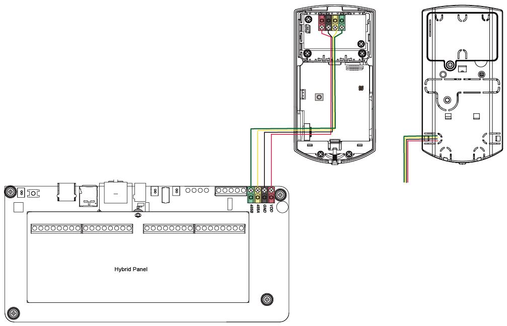

# VESTA 355

**Cámara con sensor de movimiento PIR con cable (VST-892-BUS)**

**Introducción**

VST-892-BUS es una cámara con sensor de movimiento infrarrojo pasivo (PIR). Es capaz de enviar señales por cable e imágenes capturadas (calidad de imagen de hasta 640 x 480 píxeles) a través de BUS al panel de control al detectar movimiento.

La cámara PIR está diseñada con un rango de detección típico de 12 metros cuando se monta a una altura de 2,3 a 2,5 metros sobre el suelo. Cuando la función de inmunidad a mascotas está habilitada, la cámara con sensor de movimiento no detectará mascotas de hasta 25 kg cuando se monte a una altura de 2,3 a 2,5 metros sobre el suelo.

Además, VST-892-BUS está diseñado con un detector de proximidad digital. La función antienmascaramiento permite detectar cualquier intento de cegar el detector colocando objetos en su campo de visión.

La configuración remota es compatible con la cámara PIR. Además de ajustar los interruptores de puente, los usuarios también pueden habilitar/deshabilitar la función de inmunidad a mascotas y ajustar la sensibilidad de la cámara PIR desde la página web del Panel de control o Home Portal Server.

La cámara PIR consta de un diseño de dos partes formada por una cubierta y una base. La cubierta contiene toda la electrónica y la óptica y la base proporciona un medio de fijación. La base tiene orificios ciegos para permitir el montaje directamente en una superficie plana, o se proporciona un soporte de montaje para montaje en esquina y montaje en superficie.

**La serie VST-892-BUS incluye los siguientes modelos**:

VST-892-BUS – Cámara con sensor de movimiento PIR con cable y flash LED VST-892-IL-BUS – Cámara con sensor de movimiento PIR con cable y LED infrarrojo

**Identificación de piezas**

.jpeg>)

**1. LED de destello/LED infrarrojo**

El LED de flash (para VST-892-BUS) o el LED de infrarrojos (para VST-892-IL-BUS) proporciona suficiente luz para capturar imágenes en condiciones de poca iluminación.

**2. LED azul/botón de función**

**LED azul:**

(Por favor refiérase a_**Indicador LED**_descripción a continuación para más detalles)

**Uso del botón de función:**

-   -   Presione el botón una vez para ingresar al modo de prueba durante 3 minutos.

1.  **Detector de proximidad digital**

El detector de proximidad digital se utiliza para detectar cualquier intento de enmascaramiento (bloqueo) por parte de un intruso.

1.  **Sensor de infrarrojos**
2.  **Lente de cámara PIR**
3.  **Terminal de autobus**

.jpeg>)

Conecte los cuatro terminales (VCC, GND, A, B) al terminal BUS en el panel de control. Por favor refiérase a_**Cableado de la cámara PIR**_sección para más detalles.

1

1.  **Interruptor de puente de resistencia terminal**

Cuando la cámara PIR esté conectada como el dispositivo BUS más lejano en una línea BUS, configure el puente de resistencia terminal de la cámara PIR y el interruptor de puente del primer dispositivo BUS (generalmente el panel híbrido) en ON para que sirvan como resistencias terminales. Se mejorará la capacidad de comunicación de la línea BUS conectada.

.jpeg>).png>)

**Puente encendido**

Se inserta el enlace del puente, conectando los dos pines.

**Puente apagado**

El enlace del puente se elimina o "**estacionado**”en un alfiler.

-   -   Si el puente está APAGADO, la capacidad de comunicación está en nivel normal.
    -   Si el puente está activado, se mejora la capacidad de comunicación.

1.  **Manibela de encendido**
2.  **Interruptor de puente de activación/desactivación de inmunidad a mascotas (JP3)**

.png>)

**Puente encendido**

 (1).jpeg>)

Se inserta el enlace del puente, conectando los dos pines.

**Puente apagado**

El enlace del puente se elimina o "**estacionado**”en un alfiler.

Cuando está activado, la inmunidad a mascotas está desactivada (valor predeterminado de fábrica).

Cuando se establece en APAGADO, la inmunidad a mascotas está habilitada.

**10. Interruptor de puente aumentador de sensibilidad (JP4)**

Cuando está activado, la sensibilidad de detección del PIR es alta.

Cuando se configura en APAGADO, la sensibilidad de detección del PIR está en el nivel normal (valor predeterminado de fábrica).

1.  **Tornillo de fijación inferior**
2.  **Área de separación para interruptor de manipulación**
3.  **Opciones de área de separación para cableado**
4.  **Soporte de montaje**

**Características**

 (1) (1).png>)

-   _**Indicador LED**_
    -   El LED azul parpadeará durante 1 segundo cuando la cámara PIR entre en modo de prueba. Durante el modo de prueba, el LED azul parpadeará una vez cada vez que se detecte un movimiento.
    -   El LED no parpadeará si la cámara PIR está normal y no está en modo de prueba.
-   _**Captura de imagen**_

.png>)

Cuando el sistema de alarma esté armado, la cámara PIR capturará 1, 3 o 6 imágenes de alarma con una resolución de 640 x 480 o 320 x 240 (programable desde el panel de control) al detectar movimiento. También puede solicitar manualmente a la cámara PIR que tome una fotografía a través del Panel de control. Las imágenes capturadas se transferirán al Panel de control para que los usuarios las vean.

.png>)

_\\<NOTE>_

-   -   Si su cámara PIR está instalada en una ubicación donde el campo de visión de la cámara es un entorno complejo con luz intensa o muchos colores, las imágenes capturadas tendrán un gran tamaño de archivo, lo que posiblemente provocará un truncamiento cuando las imágenes se transmitan al Panel de control. .
-   _**Período de calentamiento**_

.png>)

Cuando el sistema del panel de control ingresa al modo armado, o cuando la cámara PIR se pone en modo de prueba, la cámara PIR se calentará durante 30 segundos.

-   _**Fuente de alimentación**_

Cuando el VST-892-BUS está cableado a un panel híbrido, el panel híbrido puede proporcionar una fuente de alimentación de 13,5 V.

.png>)

-   _**Antienmascaramiento**_
    -   La cámara PIR tiene un detector de proximidad digital que puede detectar cualquier intento de enmascaramiento (bloqueo) por parte de un intruso.
    -   Cuando se detecta un evento de enmascaramiento y la condición de enmascaramiento dura 3 minutos, VST-892-BUS enviará una señal de alarma de enmascaramiento al panel de control para notificar al usuario sobre la condición de enmascaramiento.
    -   Después de eliminar el enmascaramiento/bloqueo durante 3 minutos, VST-892-BUS enviará una señal de restauración al Panel de control.
-   _**Protección contra manipulación**_

.png>)

La cámara PIR está protegida por un interruptor de manipulación que se presiona cuando la cámara PIR está instalada correctamente. Cuando se retira la cámara PIR de la superficie de montaje o se abre su cubierta, se activará el interruptor de manipulación y la cámara PIR enviará una señal de apertura de manipulación al panel de control del sistema para recordarle al usuario la condición.

2

-   .png>)_**Supervisión**_

La cámara PIR realizará una autoprueba periódicamente transmitiendo una señal de supervisión una vez cada 20 a 30 segundos.

.png>)

-   _**Modo de prueba**_
    -   -   El modo de prueba sirve para comprobar el rango de detección de la cámara PIR (no la cobertura de disparo).
        -   Presione el botón Función una vez para ingresar al modo de prueba durante 3 minutos. El LED azul parpadeará durante 1 segundo.
        -   La cámara PIR se calentará durante 30 segundos. No active la cámara durante este período de calentamiento.
        -   Después del período de calentamiento, puede activar la cámara PIR para verificar el rango de detección de IR. Si se activa la cámara PIR, el LED azul parpadeará una vez.
-   _**Precaución**_
    -   El cableado de la cámara PIR sólo debe ser realizado por técnicos certificados con el conocimiento y la formación adecuados en equipos eléctricos.
    -   Antes de la instalación o cualquier trabajo de mantenimiento, asegúrese de que se haya desconectado la alimentación del Panel de Control.
-   _**Cableado de la cámara PIR**_
    -   -   Antes de realizar la conexión, asegúrese de que la fuente de alimentación del panel esté desconectada y que el interruptor de la batería del panel se haya deslizado a la posición APAGADO.
        -   Para ayudar con las conexiones de cables, los bloques de terminales de cada módulo del sistema BUS están codificados por colores.

.png>).png>)

| **Rojo**     | VDD    |
| ------------ | ------ |
| **Negro**    | Tierra |
| **Amarillo** | 485A   |
| **Verde**    | 485B   |

-   Se pueden conectar varios dispositivos BUS en serie al panel híbrido. Para una comunicación óptima de los dispositivos de línea BUS conectados, asegúrese de que los interruptores de puente de resistencia terminal del primer dispositivo (generalmente el panel híbrido) y del último dispositivo BUS en una línea BUS estén configurados en ON para que sirvan como resistencias de terminación. Asegúrese de habilitar solo los 2 interruptores de puente antes mencionados y no configurar los interruptores de puente en ON para ningún otro dispositivo BUS intermedio.

.png>)

_\\<NOTE>_

-   -   El diseño enchufable de los bloques de terminales BUS mejora la eficiencia de la instalación. Antes de realizar el cableado, puede retirar los bloques de terminales de la placa PCB para facilitar su uso y enchufarlos nuevamente después del cableado.
    -   Después de desconectar el terminal, al volver a instalarlo en la placa, asegúrese de instalar el terminal en la misma dirección para evitar posibles peligros.
-   Las conexiones incorrectas provocarán fallas o un funcionamiento incorrecto. Inspeccione el cableado y asegúrese de que las conexiones sean adecuadas antes de aplicar energía.
-   Hay ocho opciones de área de separación en la cubierta posterior y en la cubierta de la batería para que los cables salgan separando cualquiera de ellos.

3

-   _**Aprendiendo**_

Siga los pasos a continuación para aprender el dispositivo en el panel híbrido.

Paso 1. Conecte el dispositivo al Panel. Luego, encienda el Panel.

Paso 2. En la página web del Panel, haga clic en “**Aprendiendo**”para ingresar a la página de aprendizaje.

Paso 3. Haga clic en "**Comenzar**”para ingresar al modo de aprendizaje.

Paso 4. Haga clic en "**Agregar**”para incluir el dispositivo en el Panel.

Paso 5. Si el dispositivo se reconoce correctamente en el Panel, se mostrará en la sección "Dispositivo aprendido".

-   _**Identificación**_

La función "Identificar" se utiliza para localizar un dispositivo BUS específico en el sistema cableado BUS. Esta función es útil para distinguir qué dispositivo es cuál, especialmente en una instalación grande donde se incluyen numerosos dispositivos BUS.

Para ubicar la Cámara PIR en el sistema BUS:

**Paso 1.**En la página web del Panel híbrido, haga clic en "Identificar" debajo de la lista de dispositivos después de la entrada de la columna del dispositivo de la cámara IR.

**Paso 2.**Si VST-892-BUS recibe la señal del panel híbrido, la página web mostrará un mensaje de éxito y el indicador LED de VST-892-BUS parpadeará 10 veces para indicarle al usuario dónde se encuentra.

_\\<NOTE>_

-   -   -   Si se muestra un mensaje de tiempo de espera en la página web, significa que VST-892-BUS no recibió la señal del Panel.

Verifique si el VST-892-BUS está conectado correctamente al panel dentro de la distancia de cableado adecuada.

-   _**Prueba de caminata**_
    -   Para asegurarse de que la cámara PIR pueda comunicarse con el panel después de su aprendizaje, coloque el panel de control en modo de prueba de caminata y presione el botón de función en VST-892-BUS para transmitir una señal de prueba al panel.
    -   Cuando el panel reciba la señal de prueba, emitirá un pitido y mostrará la información de la cámara PIR en consecuencia en la parte superior de la lista de dispositivos.

_\\<NOTE>_

-   -   Si no hay respuesta del Panel después de presionar el botón de función, significa que el Panel no recibió la señal de prueba del dispositivo.

Verifique si el VST-892-BUS está conectado correctamente al panel dentro de la distancia de cableado adecuada.

-   _**Función de inmunidad a las mascotas**_

El sensor PIR admite la función de inmunidad a mascotas y no detectará mascotas de hasta 25 kg para minimizar situaciones de falsas alarmas. La función de inmunidad a mascotas se puede habilitar/deshabilitar configurando la posición del interruptor de puente (JP3). Cuando el interruptor de puente (JP3) está en ON, la inmunidad a mascotas está desactivada (valor predeterminado de fábrica). Cuando el interruptor de puente (JP3) está en APAGADO, se habilita la inmunidad a mascotas. La función de inmunidad a mascotas también se puede ajustar mediante configuración remota como se describe a continuación.

-   _**Función de aumento de sensibilidad**_

Puede utilizar la función de aumento de sensibilidad para aumentar la sensibilidad de detección del PIR. Para aumentar la sensibilidad de detección, configure el interruptor de puente (JP4) en ON. Para mantener una sensibilidad de detección normal, configure el interruptor de puente (JP4) en APAGADO (valor predeterminado de fábrica). La función de aumento de sensibilidad también se puede ajustar mediante configuración remota como se describe a continuación.

-   _**Configuración remota**_
    -   La cámara PIR admite la configuración remota de la inmunidad y sensibilidad de las mascotas.
    -   Cuando la cámara PIR está encendida, su función de inmunidad a mascotas y su sensibilidad están determinadas por los ajustes JP3 y JP4. Los usuarios pueden ajustar la configuración de los puentes o cambiar de forma remota la configuración de sensibilidad e inmunidad a las mascotas desde el Panel de control. La configuración remota sobrescribirá la configuración del puente.

**Página web del panel de control**:

-   -   1.  En la página web local del Panel, vaya a la página Editar dispositivo e ingrese la configuración de la cámara PIR en la sección Configuración del sensor. Haga clic en Aceptar para confirmar.

Consulte la siguiente tabla para obtener detalles de configuración. Por ejemplo, si desea habilitar la inmunidad a mascotas y establecer el nivel de sensibilidad en alto, puede ingresar 02.

| **Configuración de infrarrojos** | **Inmunidad a las mascotas** | **Sensibilidad** |
| -------------------------------- | ---------------------------- | ---------------- |
| 00                               | No                           | Alto             |
| 01                               | No                           | Normal           |
| 02                               | Sí                           | Alto             |
| 03                               | Sí                           | Normal           |

**Servidor del portal de inicio**:

1.  En Home Portal Server, vaya a la página Configuración del dispositivo, haga clic en la fila del dispositivo VST-892 y seleccione "Configuración IR".

4

1.  Seleccione la función Inmunidad a mascotas (Activar/Desactivar) y Sensibilidad (Alta/Normal) en el menú desplegable y haga clic en "Enviar" para confirmar la configuración.

**Instalación**

-   _**Guía de instalación**_
    -   La cámara PIR está diseñada para montarse en una superficie plana o en una esquina.
    -   La base tiene orificios ciegos, donde el plástico es más delgado, para fines de montaje. Dos orificios ciegos en la base sirven para la fijación en la superficie y se puede utilizar un soporte de montaje para la fijación en las esquinas.
    -   El rango de detección es de hasta 12 metros si la cámara PIR se monta a una altura de 2,3 a 2,5 metros sobre el suelo.
    -   Cuando la función de inmunidad a mascotas está habilitada, no detectará mascotas de hasta 25 kg cuando se monte a una altura de 2,3 a 2,5 metros sobre el suelo. Si es necesario, puede ajustar la altura de la cámara PIR según el tamaño de su mascota para un rendimiento inmunológico óptimo. Una ubicación de instalación más alta proporcionará un mayor espacio inmune a las mascotas, pero también aumentará el punto ciego debajo de la cámara PIR.
    -   Cuando el VST-892-BUS se monta con el soporte giratorio, no tendrá el área de detección normal ni el rango típico de inmunidad a mascotas.

**Se recomienda instalar la cámara PIR en las siguientes ubicaciones:**

-   -   En una posición donde los animales no puedan llegar a la zona de detección trepando a muebles u otros objetos.
    -   No monte el dispositivo en escaleras donde los animales puedan subir.
    -   En una posición donde un intruso normalmente cruzaría el campo de visión del PIR.
    -   A una altura entre 2,3 y 2,5 metros sobre el suelo para un mejor rendimiento.
    -   En una esquina para dar la vista más amplia.
    -   En una posición donde su campo de visión no quede obstruido por, por ejemplo, cortinas, adornos, etc.
-   **Limitaciones**

|  | No instalar al aire libre.                                   |  | Evite grandes obstáculos en el área de detección.                       |
| - | ------------------------------------------------------------ | - | ----------------------------------------------------------------------- |
|   |                                                              |   |                                                                         |
|  | No exponga la cámara PIR completamente a la luz directa.     |  | Evite el vapor o la alta humedad que pueden causar                      |
|   | luz de sol.                                                  |   | condensación.                                                           |
|   |                                                              |   |                                                                         |
|  | Evite objetos en movimiento, por ejemplo, cortinas, tapices, |  | Evite la luz reflejada de superficies brillantes, por ejemplo, espejos, |
|   | etc., en el área de detección.                               |   | ventanas, etc                                                           |
|   |                                                              |   |                                                                         |

5

-   Evite instalar la cámara PIR en áreas donde máquinas como aires acondicionados o calentadores puedan causar cambios rápidos de temperatura en el área de detección.
-   Evite superficies reflectantes en el área de detección. Las firmas infrarrojas reflejadas pueden provocar falsas alarmas.

6

6.Vuelva a colocar la cubierta en la base y apriete el tornillo de fijación inferior.

-   **Montaje en superficie con el soporte de montaje:**
    1.  Utilice los dos orificios centrales para tornillos en el soporte como plantilla y taladre orificios en la superficie a montar.
    2.  Inserte los tacos de pared si la cámara PIR se va a fijar sobre yeso o ladrillos.
    3.  Atornille el soporte de montaje a los tacos de pared con los dos punteros hacia arriba y hacia usted.
    4.  Enganche la cámara PIR en los ganchos del soporte de montaje.
-   **Montaje en esquina con soporte de montaje:**
    1.  Utilice los 4 orificios para tornillos laterales del soporte como plantilla y taladre orificios en la superficie de la esquina.
    2.  Inserte los tacos de pared si la cámara PIR se va a fijar sobre yeso o ladrillos.
    3.  Atornille el soporte de montaje a los tacos de pared con los dos punteros hacia arriba y hacia usted.
        1.  Enganche la cámara PIR en los ganchos del soporte de montaje.

7

-   **Montaje en superficie con soporte giratorio (artículo opcional, se vende por separado):**

El soporte giratorio se puede montar en la pared con los tornillos suministrados.

1.  Atornille el soporte giratorio a la pared.
2.  Enganche la cámara PIR en el soporte giratorio en consecuencia.
3.  Gire el soporte para obtener el rango de detección adecuado y apriete el tornillo de fijación.

8
