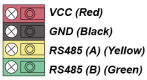

# VESTA 360

**Contacto de puerta cableado/sensor de impacto (DCSV-29-BUS)**

DCSV-29-BUS es un sensor de choque/contacto de puerta cableado que es capaz de enviar señales cableadas a través de BUS al panel de control al detectar la apertura de una puerta/ventana o la detección de rotura o choque del vidrio de una ventana.

El diseño del sensor de impacto/contacto de puerta cableado consta de una cubierta y una base. La cubierta contiene todos los componentes electrónicos y la base proporciona un medio para fijar el dispositivo. Un interruptor antisabotaje de PCB incluido proporciona protección contra manipulación contra la apertura y/o extracción no autorizada del dispositivo.

**Identificación de piezas**

.png>)

1.  **Indicador LED/Botón de prueba**

\-Presione el botón una vez para ingresar al modo de prueba durante 3 minutos.

1.  **Tornillo de fijación de la cubierta**
2.  **Interruptor de puente de resistencia terminal**

Cuando el contacto de puerta/sensor de impacto está conectado como el dispositivo BUS más lejano en una línea BUS, configure el puente de resistencia terminal del contacto de puerta/sensor de impacto y el interruptor de puente del primer dispositivo BUS (generalmente el panel híbrido) en ON para que sirva como resistencias terminales. Se mejorará la capacidad de comunicación de la línea BUS conectada.

.jpeg>).png>)

**Puente encendido**

.jpeg>)

Se inserta el enlace del puente, conectando los dos pines.

**Puente apagado**

El enlace del puente se retira o se “estaciona” en un pin.

-   -   Si el puente está activado, se mejora la capacidad de comunicación.
    -   Si el puente está APAGADO, la capacidad de comunicación está en nivel normal.

1.  **Terminal de autobus**
2.  **Manibela de encendido**
    -   Proporciona protección contra manipulación contra la apertura y/o extracción no autorizada del dispositivo de la superficie de montaje.
3.  **Interruptor de láminas Interruptor de puente**

.jpeg>).png>)

**Puente encendido**

.jpeg>)

Se inserta el enlace del puente, conectando los dos pines.

**Puente apagado**

El enlace del puente se retira o se “estaciona” en un pin.

-   -   Puente ON: el interruptor de láminas está**activado**. El dispositivo funciona como contacto de puerta y sensor de impacto (predeterminado de fábrica).
    -   Puente APAGADO: El interruptor de láminas está**desactivado**y el dispositivo sólo funciona como sensor de impacto.

1.  **Orificios de montaje**
2.  **Orificios de cableado**
3.  **Imán**
4.  **Imán Orificio para tornillo**
5.  **Espaciador magnético**

1

**Características**

.jpeg>)

-   _**Indicador LED**_
    -   En el modo de funcionamiento normal, el LED no se iluminará cuando se active el dispositivo.
    -   Cuando se activa el interruptor de manipulación, el LED parpadeará una vez. Cuando la condición de manipulación continúa, el LED parpadeará una vez cada vez que se active el dispositivo.
    -   Cuando esté en modo de prueba, el LED parpadeará una vez cada vez que se active el dispositivo.
    -   El LED no parpadeará si la manipulación del dispositivo es normal y el dispositivo no está en modo de prueba.
-   _**Detección de apertura de puertas y detección de golpes**_

 (1).jpeg>)

El dispositivo se activa al abrir una puerta/ventana o al detectar un impacto que supera el umbral de detección.

.jpeg>)

-   _**Materiales de superficie de montaje**_

El dispositivo admite la detección de impactos en diversos materiales, incluidos vidrio, madera, metal y hormigón. Después de la instalación, puede seleccionar el material de la superficie de montaje en el Panel de control. El valor predeterminado se establece como**Madera**.

.png>)

-   _**Sensibilidad**_
    -   La sensibilidad requerida para activar el contacto de puerta cableado/sensor de impacto la determina el panel de control.
    -   Se pueden seleccionar tres niveles de sensibilidad:**Bajo**,**Medio**, y**Alto**. El valor predeterminado se establece como**Medio**.
-   _**Fuente de alimentación**_
    -   Cuando DCSV-29-BUS está cableado a un panel híbrido, el panel híbrido puede proporcionar una fuente de alimentación de 13,5 V.
-   _**Protección contra manipulación**_
    -   El contacto de puerta cableado/sensor de impacto está protegido por un interruptor antisabotaje que se presiona contra la superficie de montaje cuando el contacto de puerta/sensor de impacto está montado en su lugar. Cada vez que se retira el sensor de impacto/contacto de puerta cableado de la superficie de montaje o se abre su cubierta, se activará el interruptor de manipulación y el dispositivo enviará una señal de apertura de manipulación para recordarle al usuario la condición.
    -   La señal de apertura por manipulación se transmitirá con la transmisión de señal normal del dispositivo al Panel de control. El estado de falla de manipulación se mostrará en la zona del dispositivo de CC y en la zona del dispositivo del sensor de impacto en el panel de control.
-   _**Supervisión**_
    -   Cuando está en funcionamiento normal, el sensor de choque/contacto de puerta cableado enviará una señal de supervisión al panel de control por separado en intervalos aleatorios de 20 a 30 segundos.
    -   Si el panel de control no ha recibido la señal de supervisión del contacto de puerta cableado/sensor de impacto durante un período de tiempo preestablecido, el panel de control indicará que el contacto de puerta cableado/sensor de impacto en particular está experimentando un problema de falta de señal.
-   _**Modo de prueba**_
    -   En el modo normal, presione el botón de prueba para transmitir una señal de prueba al panel de control. El contacto de puerta cableado/sensor de impacto entrará en modo de prueba durante 3 minutos.
    -   En el modo de prueba, el LED parpadeará una vez cada vez que se active el contacto de puerta cableado/sensor de impacto.
    -   Cada pulsación adicional del botón de prueba restablecerá el tiempo del modo de prueba a 3 minutos.
-   _**Precaución**_
    -   -   El cableado del contacto de la puerta/sensor de impacto solo debe ser realizado por técnicos certificados con el conocimiento y la capacitación adecuados en equipos eléctricos.
        -   Antes de la instalación o cualquier trabajo de mantenimiento, asegúrese de que la fuente de alimentación esté desconectada.

.jpeg>).jpeg>).jpeg>).jpeg>).png>)

2

-   .jpeg>)_**Cableado del sensor de impacto/contacto de puerta**_
    -   Antes de conectar el contacto de puerta cableado/sensor de impacto al BUS del sistema, apague la alimentación.
    -   Para ayudar con las conexiones de cables, los bloques de terminales de cada módulo del sistema BUS están codificados por colores.

| **Rojo**     | VDD    |
| ------------ | ------ |
| **Negro**    | Tierra |
| **Amarillo** | 485A   |
| **Verde**    | 485B   |

-   Se pueden conectar varios dispositivos BUS en serie al panel híbrido. Para una comunicación óptima de los dispositivos de la línea BUS conectados, asegúrese de que los interruptores de puente de resistencia terminal del primero (generalmente el panel híbrido) y del último dispositivo BUS en una línea BUS estén configurados. en ON para servir como resistencias terminales. Asegúrese de habilitar solo los 2 interruptores de puente antes mencionados y no configurar los interruptores de puente en ON para ningún otro dispositivo BUS intermedio.

_\\<NOTE>_

-   -   El diseño enchufable de los bloques de terminales BUS mejora la eficiencia de la instalación. Antes de realizar el cableado, puede retirar los bloques de terminales de la placa PCB para facilitar su uso y enchufarlos nuevamente después del cableado.
    -   Después de desconectar el terminal, al volver a instalarlo en la placa, asegúrese de instalar el terminal en la misma dirección para evitar posibles peligros.
-   Las conexiones incorrectas provocarán fallas o un funcionamiento incorrecto. Inspeccione el cableado y asegúrese de que las conexiones sean adecuadas antes de aplicar energía.

.png>)

-   _**Aprendiendo**_

Siga los pasos a continuación para aprender el dispositivo en el panel híbrido.

Paso 1. Conecte el dispositivo al Panel. Luego, encienda el Panel.

Paso 2. En la página web del Panel, haga clic en “**Aprendiendo**”para ingresar a la página de aprendizaje.

Paso 3. Haga clic en "**Comenzar**”para ingresar al modo de aprendizaje.

_Cuando se aprende en el panel de control, DCSV-29-BUS será reconocido como 2 dispositivos separados (contacto de puerta y sensor de impacto) y ocupará 2 zonas en el panel._

Paso 4. Haga clic en "**Agregar**”para incluir el dispositivo en el Panel.

3

Paso 5. Si el dispositivo se reconoce correctamente en el Panel, se mostrará en la sección "Dispositivo aprendido".

.jpeg>)

-   _**Configuración del material y nivel de sensibilidad**_

Paso 1. Seleccione el material y el nivel de sensibilidad en la página web del Panel de control (página Configuración del sensor).

Paso 2. Cuando DCSV-29-BUS recibe el comando de programación del Panel, el LED primero se apagará, luego se volverá más brillante y se oscurecerá. La configuración del nivel de material y sensibilidad ya está completa.

-   _**Identificación**_

El "**Identificar**La función ”se utiliza para localizar un dispositivo BUS específico en el sistema cableado BUS. Esta función es útil para distinguir qué dispositivo es cuál, especialmente en una instalación grande donde se incluyen numerosos dispositivos.

Para ubicar DCSV-29-BUS en el sistema BUS:

**Paso 1.**En la página web del Panel híbrido, haga clic en "Identificar" debajo de la lista de dispositivos después de la entrada de la columna de dispositivos del DCSV-29-BUS.

**Paso 2.**Si el contacto de puerta cableado/sensor de impacto recibe la señal del panel híbrido, la página web mostrará un mensaje de éxito y el indicador LED del contacto de puerta cableado/sensor de impacto parpadeará 10 veces para indicarle al usuario dónde está.

_\\<NOTE>_

-   -   -   Si se muestra un mensaje de tiempo de espera en la página web, significa que el contacto de puerta cableado/sensor de impacto no recibió la señal del panel.

Verifique si DCSV-29-BUS está conectado correctamente al panel dentro de la distancia de cableado adecuada.

-   _**Prueba de caminata**_
    -   Para asegurarse de que el sensor de impacto/contacto de puerta cableado pueda comunicarse con el panel después de su aprendizaje, coloque el panel de control en modo de prueba de recorrido y presione el botón de prueba en DCSV-29-BUS para transmitir una señal de prueba al Panel de control.
    -   Cuando el panel reciba la señal de prueba, emitirá un pitido y mostrará la información del contacto de puerta cableado/sensor de impacto en la parte superior de la lista de dispositivos.

_\\<NOTE>_

-   Si no hay respuesta del Panel después de presionar el botón de prueba, significa que el Panel no recibió la señal de prueba del dispositivo.

Verifique si DCSV-29-BUS está conectado correctamente al panel dentro de la distancia de cableado adecuada.

**Instalación**

-   _**Montaje del contacto de puerta cableado/sensor de impacto**_

**Montaje como contacto de puerta:**

-   El contacto de puerta debe instalarse con el lado marcado con nervaduras mirando hacia el imán.
-   La distancia entre el contacto de la puerta y el imán no debe ser superior a 15 mm cuando la puerta está cerrada.
-   Monte el dispositivo lo más alto posible.

4

**Montaje como sensor de impacto:**

Consulte la siguiente tabla para obtener información sobre la ubicación de instalación y el espesor de los diferentes materiales:

|                                 |                     |                       | Ventana de vidrio | Puerta de madera/metal | Pared de concreto |   |
| ------------------------------- | ------------------- | --------------------- | ----------------- | ---------------------- | ----------------- | - |
|                                 |                     |                       |                   |                        |                   |   |
|                                 | **Espesor**         | >5mm                  | &lt;40 mm         | -                      |                   |   |
|                                 |                     |                       |                   |                        |                   |   |
| **Ubicación de la instalación** | Marco de la ventana | Puerta                | Muro              |                        |                   |   |
|                                 |                     |                       |                   |                        |                   |   |
|                                 |                     | **Baja sensibilidad** | 0,5 millones      | 0,5 millones           | 0,25 millones     |   |
| **Detección de golpes**         |                     |                       |                   |                        |                   |   |
| **Sensibilidad media**          | 1M                  | 1M                    | 0,5 millones      |                        |                   |   |
| **Radio**                       |                     |                       |                   |                        |                   |   |
|                                 |                     |                       |                   |                        |                   |   |
|                                 |                     | **Alta sensibilidad** | 1,5 millones      | madre                  | 1M                |   |
|                                 |                     |                       |                   |                        |                   |   |

-   _**Procedimiento de montaje**_
    1.  Utilice los 2 orificios de montaje de la cubierta posterior como plantilla y taladre orificios en la superficie a montar.
    2.  Inserte los tacos suministrados cuando vaya a montar el dispositivo en marcos de ventanas o paredes de hormigón.
    3.  Atornille el contacto de puerta cableado/sensor de impacto a los tacos de pared. (Se recomienda taladrar cuando se monta en acero, o también puede utilizar la pegatina proporcionada en el paquete).
    4.  Coloque el imán en la puerta utilizando un pequeño trozo de cinta adhesiva de doble cara o con los tornillos suministrados.
    5.  Para montar el imán, utilice los 2 orificios para tornillos del imán como plantilla para posicionar y perforar los orificios._\\<NOTE>_
        -   El imán debe alinearse con el lado de la marca de la nervadura del contacto de la puerta. Si es necesario, aplique el espaciador del imán en la parte posterior del imán para alinear mejor el imán con las marcas de las nervaduras.
    6.  Atornille el imán e inserte las dos tapas blancas en los orificios de los tornillos del imán para lograr una integridad estética.
    7.  La instalación ya está completa.

5
