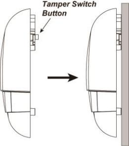

# VESTA 361

**Caja de timbre exterior cableada (BX-32-BUS)**

BX-32-BUS es una caja de timbre cableada que se utiliza para indicar alarmas del sistema fuera de un edificio. Cuando se recibe una señal de alarma desde el panel de control, el timbre activará su sirena y luz estroboscópica para llamar la atención.

El Bell Box también puede funcionar con el panel de control para emitir sonidos de retardo de entrada y salida, y también alertarle sobre violaciones de manipulación.

.png>)

**Identificación de piezas**

1.  **Orificios de montaje en pared x 3**
2.  **Manibela de encendido**

El interruptor de manipulación se activará cuando se retire la caja del timbre de la superficie montada o cuando se abra su cubierta.

1.  **Botón Aprender**
2.  **LED 3, 2 y 1 (de izquierda a derecha)**
3.  **Interruptor de puente de resistencia terminal (J3)**

Cuando Bell Box esté conectado como el dispositivo BUS más lejano en una línea BUS, configure el puente de resistencia terminal de Bell Box y el interruptor de puente del primer dispositivo BUS (generalmente el panel híbrido) en ON para que sirvan como resistencias de terminación. Se mejorará la capacidad de comunicación de la línea BUS conectada.

.jpeg>).png>)

**Puente encendido**

.jpeg>)

Se inserta el enlace del puente, conectando los dos pines.

**Puente apagado**

El enlace del puente se elimina o "**estacionado**”en un alfiler.

-   -   Si el puente está APAGADO, la capacidad de comunicación está en nivel normal.
    -   Si el puente está activado, se mejora la capacidad de comunicación.

1.  **Terminal de conexión de autobús**
2.  **Orificio de cableado (para terminal BUS)**
3.  **Terminal de alimentación (entrada de 12 V CC/GND) (opcional)**

Conéctese a la fuente de alimentación.

1.  **Orificio de cableado (para terminal de alimentación)**

**Fuente de alimentación**

-   Cuando BX-32-BUS está cableado a un panel híbrido, el panel híbrido puede proporcionar una fuente de alimentación de 13,5 V.
-   BX-32-BUS también se puede alimentar conectándolo a un adaptador CA-CC de 12 V de dos cables a través del terminal de 12 V CC. Se recomienda utilizar el adaptador cuando se conecta a cargas que requieren un mayor consumo de energía.

1

**Supervisión**

El timbre transmitirá una señal de supervisión cada 20 a 30 segundos en modo de funcionamiento normal. Si no se recibe esta señal, el panel de control indicará que la caja de timbre en particular está experimentando un problema de avería.

**Descripción general de funciones**

.png>)

-   **Memoria de alarma**

If an alarm was triggered in your absence and the system was not disarmed before alarm length expiry, the Bell box will sound a short alarm when the system is disarmed to warn the user that an alarm had been triggered when he is away. This suggests that the intruder could still be within the premises.

-   **Duración de la alarma**

Cuando el panel de control activa una alarma, el panel de control notificará al timbre para que comience a emitir la alarma de acuerdo con la configuración de duración de la alarma del panel. Cuando expire la duración de la alarma del Panel, notificará al timbre para detener la alarma.

Si el timbre no recibe la señal del panel de control para detener la alarma, hará sonar la alarma durante un máximo de 15 minutos y luego la detendrá.

Por ejemplo:

-   -   Si la duración de la alarma del panel está configurada en más de 15 minutos, después de activarse una alarma, en lugar de esperar a que expire la duración de la alarma del panel, el timbre dejará de sonar después de 15 minutos.
    -   Si el Panel está en modo desarmado y el interruptor de sabotaje del timbre se activa, el timbre no activará la alarma ya que el Panel está en modo desarmado y activará la alarma durante 15 minutos debido al disparo por sabotaje.
-   **Manipulación de sirena**

La caja Bell está protegida contra cualquier intento de abrir la tapa o de separar la caja Bell de su superficie de montaje.

Si el timbre detecta una condición de manipulación, activará la sirena y la luz estroboscópica durante la duración de la alarma programada. Se enviará una señal de manipulación al Panel de control junto con transmisiones de señales regulares para que el Panel de control muestre el estado correspondiente. Si la condición de manipulación continúa, la campana emitirá una serie de cinco pitidos cada vez que el sistema esté armado o cuando la manipulación esté habilitada, para indicar una falla.

-   **Indicación de estado audiovisual**

Mientras arma/desarma el sistema, la caja Bell utiliza diferentes métodos para distinguir varios estados para el usuario, como se enumera en la siguiente tabla.

.png>).png>).png>)

|                           | **Sonido de sirena** |                                           | **Indicación de luz estroboscópica** |
| ------------------------- | -------------------- | ----------------------------------------- | ------------------------------------ |
|                           |                      |                                           |                                      |
| Armar/Inicio              | 1 pitido             | 3                                         | Los grupos de LED parpadean una vez  |
| Desarmar                  | 2 pitidos            | Destella secuencialmente durante 1 ciclo  |                                      |
| Brazo (sabotaje)          | 5 pitidos            | 3                                         | Los grupos de LED parpadean 5 veces  |
| Desarmar (sabotaje)       | 5 pitidos            | Destella secuencialmente durante 5 ciclos |                                      |
| Retraso de entrada/salida | Cuenta regresiva     |                                           |                                      |
| Sonido                    | pitidos              |                                           |                                      |

.jpeg>) (1).jpeg>).png>)

**Precaución**

-   El cableado del timbre exterior solo debe ser realizado por técnicos certificados con el conocimiento y la capacitación adecuados en equipos eléctricos.
-   Antes de la instalación o cualquier trabajo de mantenimiento, asegúrese de que la fuente de alimentación esté desconectada.

**Cableado de la caja de timbre**

2

-   Antes de conectar la caja Bell al bus del sistema, apague la alimentación.
-   Para ayudar con las conexiones de cables, los bloques de terminales de cada módulo del sistema BUS están codificados por colores.

.jpeg>)

| **Rojo**     | VDD    |
| ------------ | ------ |
| **Negro**    | Tierra |
| **Amarillo** | 485A   |
| **Verde**    | 485B   |

-   Se pueden conectar varios dispositivos BUS en serie al panel híbrido. Para una comunicación óptima de los dispositivos de la línea BUS conectados, asegúrese de que los interruptores de puente de resistencia terminal del primero (generalmente el panel híbrido) y del último dispositivo BUS en una línea BUS estén configurados. en ON para servir como resistencias terminales. Asegúrese de habilitar solo los 2 interruptores de puente antes mencionados y no configurar el puente

cambia a ON para cualquier otro dispositivo BUS intermedio.

.png>)

_\\<NOTE>_

-   -   El diseño enchufable de los bloques de terminales BUS mejora la eficiencia de la instalación. Antes de realizar el cableado, puede retirar los bloques de terminales de la placa PCB para facilitar su uso y enchufarlos nuevamente después del cableado.
    -   Después de desconectar el terminal, al volver a instalarlo en la placa, asegúrese de instalar el terminal en la misma dirección para evitar posibles peligros.
-   Las conexiones incorrectas provocarán fallas o un funcionamiento incorrecto. Inspeccione el cableado y asegúrese de que las conexiones sean adecuadas antes de aplicar energía.

.jpeg>)

**Aprendiendo**

Siga los pasos a continuación para aprender la caja de timbre en el panel híbrido.

Paso 1: Conecte la caja del timbre al panel. Luego, encienda el Panel.

Paso 2: En la página web del Panel, haga clic en "**Aprendiendo**”para ingresar a la página de aprendizaje.

Paso 3: Haga clic en "**Comenzar**”para ingresar al modo de aprendizaje.

Paso 4: Haga clic en "**Agregar**”para incluir el cuadro Campana en el Panel.

Paso 5: Si el cuadro de timbre se aprende correctamente en el Panel, se mostrará en la sección "Dispositivo aprendido".

3

**Identificación**

La función "Identificar" se utiliza para localizar un dispositivo BUS específico en el sistema cableado BUS. Esta función es útil para distinguir qué dispositivo es cuál, especialmente en una instalación grande donde se incluyen numerosos dispositivos BUS.

Para ubicar el Bell Box en el sistema BUS:

**Paso 1.**En la página web de Hybrid Panel, haga clic en "Identificar" debajo de la lista de dispositivos después de la entrada de la columna de dispositivos de Bell Box.

**Paso 2.**Si Bell Box recibe la señal del panel híbrido, la página web mostrará un mensaje de éxito y los 3 grupos de LED de Bell Box parpadearán 10 veces para indicarle al usuario dónde está.

.png>)

_\\<NOTE>_

-   Si se muestra un mensaje de tiempo de espera en la página web, significa que Bell Box no recibió la señal del Panel.

Verifique si el Bell Box está conectado correctamente al panel dentro de la distancia de cableado adecuada.

**Prueba de caminata**

-   Para asegurarse de que Bell Box pueda comunicarse con el panel después de su aprendizaje, coloque el panel de control en**Prueba de caminata**modo y presione el botón de aprendizaje en la caja de timbre para transmitir una señal de prueba al panel de control.
-   Cuando el panel reciba la señal de prueba, emitirá un pitido y mostrará la información del Bell Box en consecuencia en la parte superior de la lista de dispositivos.

.png>)

_\\<NOTE>_

-   Si no hay respuesta del Panel después de presionar el botón de aprendizaje, significa que el Panel no recibió la señal de prueba del dispositivo.

Verifique si Bell Box está conectado correctamente al panel dentro de la distancia de cableado adecuada.

**Instalación**

Paso 1. Encuentre la ubicación donde se montará la caja del timbre.

Paso 2. Desatornille el tornillo inferior con un destornillador Phillips y retire la cubierta superior.

Paso 3. Sostenga la caja del timbre en la posición donde se va a montar.

Paso 4. Identifique los 3 orificios de montaje, monte y fije la caja del timbre en la pared usando los tornillos grandes y los tacos de pared provistos. Asegure los tornillos con un destornillador Phillips. Asegúrese de que el interruptor antisabotaje esté completamente presionado contra la pared.

.png>)

_\\<NOTE>_

-   El interruptor de manipulación sobresale de la parte posterior de la sirena cuando la caja del timbre no está montada en su lugar. Cuando la sirena se retira de la pared, se activará la alarma. Asegúrese de que esté completamente presionado cuando la sirena esté montada. Si hay un espacio, empaquete con un material espaciador adecuado.

Paso 5. Vuelva a colocar la cubierta superior y apriete el tornillo inferior con un destornillador Phillips.

Paso 6. Verifique si la instalación fue exitosa probando desde el Panel de control con la función de armado y desarmado.

El armado/desarmado exitoso se indicará en la tabla proporcionada arriba en**Indicación de estado audiovisual**sección.

.png>)

_\\<NOTE>_

-   Si se escuchan 5 pitidos cortos durante el armado/desarmado, significa que el sabotaje no está completamente presionado. Verifique para asegurarse de que la manipulación esté configurada correctamente y pruebe nuevamente desde el Panel de control.

Paso 7. La instalación ya está completa.

4
