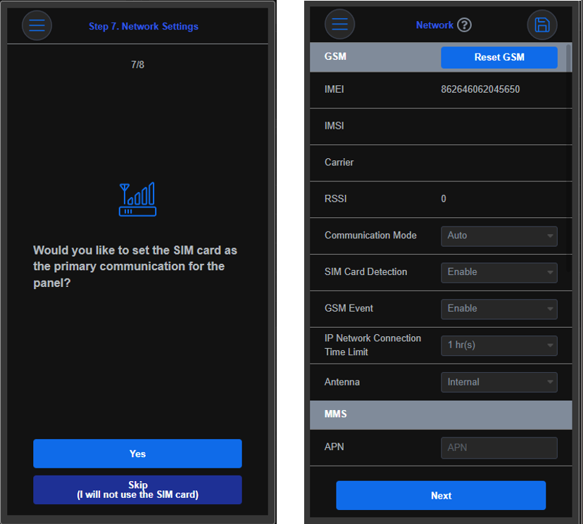

# Guide d'utilisation de l'assistant de configuration

## <mark style="color:$info;">Début de l'assistant</mark>

<figure><figcaption></figcaption></figure>

Choisissez sur **Non** et l'assistant s'arrêtera pour vous permettre de configurer manuellement votre centrale.\
Choisissez **Oui** et l'assistant de configuration démarrera.\
Saisir le code installateur par défaut : **7982** et appuyer sur **Connexion.**

<figure><figcaption></figcaption></figure>


NOTE: Durant l'utilisation de l'assistant, il est possible d'accéder à n'importe quel moment à une étape particulière de la configuration en cliquant sur l'icône représentant 3 lignes en haut à gauche.


<figure><figcaption></figcaption></figure>

### _<mark style="background-color:yellow;">1. Configuration en lot</mark>_

Il est possible à ce stade d'utiliser des profils de configuration déjà créés afin d'éviter de devoir renseigner toujours les mêmes paramètres pour  la configuration d'un système.\
Appuyez sur **Passer**, pour avancer dans l'assistant.\
Appuyez sur **Oui**, pour charger un profil de configuration préalablement créé.

<figure><figcaption></figcaption></figure>

Choisir un modèle de profil (préalablement créé).\
Les paramètres configurés dans le profils seront automatiquement envoyés à la centrale.

<figure><figcaption></figcaption></figure>

Vous pouvez afficher les paramètres du profil en cliquant sur l'icône représentant 3 point superposés.



<figure><figcaption></figcaption></figure>



<figure><figcaption></figcaption></figure>



Appuyez sur **Sauvegarder** puis **Suivant**

### _<mark style="background-color:yellow;">2. Créer un Compte</mark>_

Cette étape permet la création d'un compte utilisateur pour le client. Ce compte permettra l'accès à SmartHomeSec app ou web afin de géré le système.\
Appuyez sur **Passer**, pour avancer dans l'assistant.\
Appuyez sur **Oui**, pour ajouter une nouveau compte à la centrale ou associer un compte déjà existant.

<figure><figcaption></figcaption></figure>

Cet écran, permet de choisir la création d'un nouveau compte ou d'utiliser un compte déjà existant.

<figure><figcaption></figcaption></figure>

#### _<mark style="background-color:green;">**Création d'un compte**</mark>_

1. Identifiant: Nom du client ou adresse e-mail
2. Mot de passe
3. &#x20;E-mail du client
4. &#x20;Privilèges

<figure><figcaption></figcaption></figure>

Privilèges - le compte sera capable de :

Demande Média – Demander des images des PIRCAMs,\
Notification – Recevoir les notifications,\
Domotique – Accéder à la section domotique,\
Caméra – Accéder à la visualisation des caméras,\
Evènements – Accéder au journal des évènements de la centrale,\
Partition (1 à 8) – L'utilisateur aura un accès uniquement aux partitions indiquées

_<mark style="background-color:green;">**Associer un compte existant**</mark>_

En cliquant sur  “Associer à un compte existant”, il sera demandé la saisie de l'identifiant et du mot de passe du compte à utiliser, de configurer les privilèges et l'accès aux partitions.

<figure><figcaption></figcaption></figure>

<figure><figcaption></figcaption></figure>

### _<mark style="background-color:yellow;">3. Codes</mark>_

Cette étape permet la configuration des codes utilisateurs.\
Appuyez sur **Passer**, pour avancer dans l'assistant.\
Appuyez sur **Oui**, pour être en mesure de configuration un nom et un code our les utilisateurs finaux.

<figure><figcaption></figcaption></figure>

### _<mark style="background-color:yellow;">4. Ajouter un périphérique</mark>_

Cette étape permet l'ajout de périphérique comme: un détecteur d'ouverture, un PIR, un PIRCAM, une caméra ou autres dans la centrale.\
Appuyez sur **Passer**, pour avancer dans l'assistant.\
Appuyez sur **Oui**, la centrale demandera quel type de périphérique vous souhaitez ajouter.

<figure><figcaption></figcaption></figure>

Sélectionnez le type de périphérique approprié, ex:  Détecteur de mouvement. Maintenir le bouton d'apprentissage du périphérique jusqu'au clignotement de sal led (consulter le manuel du périphérique pour les instructions détaillées).

<figure><figcaption></figcaption></figure>


Important!\
Pour les PIRCAMs et les claviers, les touches doivent être maintenues 3 à 4 secondes.\
Le reste des périphériques supporte un appui bref pour l'enregistrement.


Suivez les instructions pour compléter le processus d'enregistrement. La centrale confirmera l'ajout vec succès du périphérique.

Sélectionnez le périphérique et cliquez sur **Soumettre**

<figure><figcaption></figcaption></figure>


Pour configurer les zones correctement, il est important d'être familiarisé avec les attributs disponibles et leurs impacts sur le fonctionnement final du système d'alarme.

Par exemple: "Intérieur" est une zone instantanée et "Temporisation d'entrée" est une zone avec délai; ces attributs sont configurable dans les sections liées au mode de fonctionnement de la centrale (Mode Total, Mode, Partiel, Mode Arrêt).


### _<mark style="background-color:yellow;">5. Paramètres de Sécurité</mark>_

Cette étape permet de définir les paramètres de sécurité associés aux différents partitions de la centrale.\
Ex: temporisation d'entrée, temporisation de sortie, ...

<figure><figcaption></figcaption></figure>

### _<mark style="background-color:yellow;">6. Paramètres de la Centrale</mark>_

Cette étape permet de personnaliser les options de la centrale.

<figure><figcaption></figcaption></figure>

### _<mark style="background-color:yellow;">7. Paramètres Réseau</mark>_

Cette étape perme d'activer le transmetteur GSM de la centrale.\
Appuyez sur **Passer**, pour avancer dans l'assistant.\
Appuyez sur **Oui**, pour activer la détection de carte SIM et configurer l'APN si nécessaire.

<figure><figcaption></figcaption></figure>

### _<mark style="background-color:yellow;">8. Paramètres de Transmission</mark>_

Cette étape permet de configurer l'envoi des évènements et des images provenant de PIRCAMs vers un télésurveilleur.\
Appuyez sur **Passer**, pour avancer dans l'assistant.\
Appuyez sur **Oui**, pour configurer la transmission d'évènements.

<figure><figcaption></figcaption></figure>

1. Il est possible d'appliquer un profil de configuration préalablement créé pour la transmission vers un télésurveilleur.

<figure><figcaption></figcaption></figure>

2. Cliquez sur l'icône +  pour ajouter une seconde méthode de communication (la première est toujours le cloud et ne peut pas être modifiée). Choisissez "Groupe 2" et saisissez les paramètres indiqués par le télésurveilleur

<figure><figcaption></figcaption></figure>

3. Configurez 3 tentatives sur le Groupe 2 et cliquez sur **Sauvegarder** et **Suivant**.

## Fin de l'assistant

<figure><figcaption></figcaption></figure>

***
