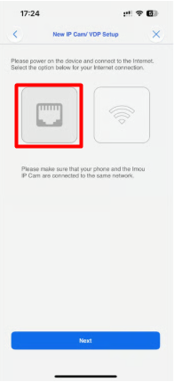

# IPC-A1-PTZ-WF (FR)

## Caméra IP WiFi VESTA 3MP avec PAN/TILT - usage intérieur

<figure><figcaption></figcaption></figure>

### Caractéristiques

* Caméra IP WiFi VESTA Home avec PAN/TILT
* Capteur CMOS 1/2.8″ 3MP
* Résolution 3MP (2304×1296) à 25/30 fps
* Eclairage IR jusqu'à 10 m
* Objectif fixe 3.6 mm
* Codecs: H.265, H.264
* Détection humain
* Alertes sonores inhabituelles
* Suivi intelligent de cibles
* Sirène intégrée
* Mode privatif (masquage de l'objectif)
* Audio biderectionnel
* Micro et haut-parleur intégrés
* Slot MicroSD jusqu'à 256Go (carte non incluse)
* Supporte le stockage sur cloud uo NVR
* WiFi (IEEE 802.11 b/g/n), portée jusqu'à 50m (164 ft)
* Compatible ONVIF
* 5Vdc / 1A
* Consommation < 3.7 W
* Température de fonctionnement : -10 °C to +45 °C
* Humidité relative < 95 %.
* Matériau: Plastique
* Dimensions: Approx. 77.4 × 77.4 × 106.2 mm
* Poids net: approx. 197 g

#### Configuration 


[configuration-des-cameras-ip-vesta-home-fr.md](configuration-des-cameras-ip-vesta-home-fr.md)

