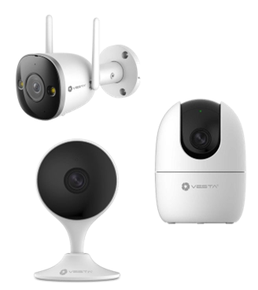
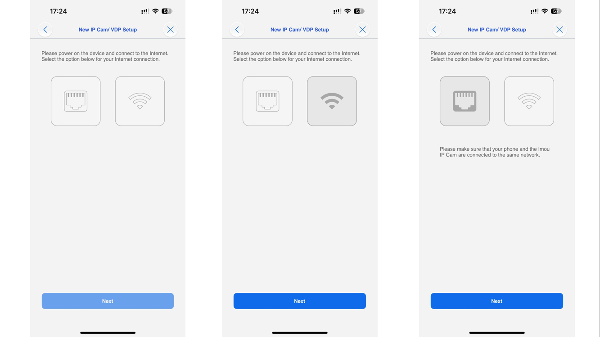
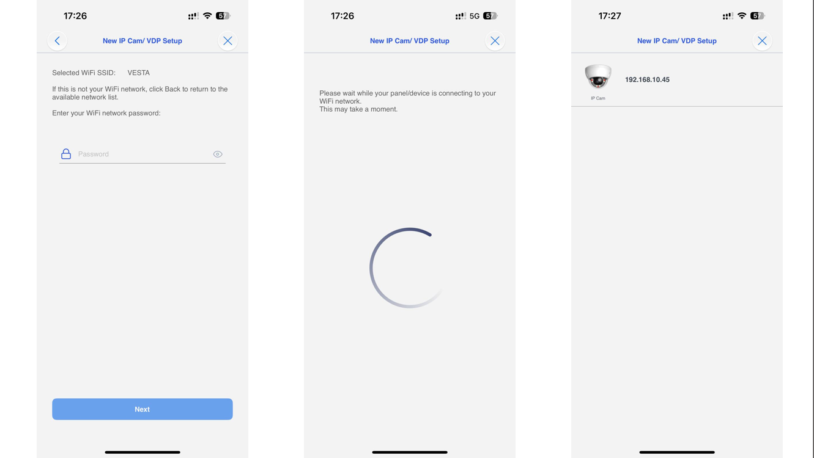

# VESTA-291/292/293

<figure><figcaption></figcaption></figure>


Le modèle VESTA-292 sera utilisé tout au long de ce document mais, les étapes sont identiques pour les modèles VESTA-291 et VESTA-293.


<figure><figcaption></figcaption></figure>

### _<mark style="background-color:yellow;">Préparation</mark>_

<mark style="color:orange;">**Etape 1:**</mark>  Branchez l'alimentation de la caméra.\
\
<mark style="color:orange;">**Etape 2:**</mark> Attendez que la LED de la caméra soit VERTE fixe pour une connexion en Ethernet (câble) ou VERTE clignotante pour une connexion en Wi-Fi.

### _<mark style="background-color:yellow;">Initialisation et ajout de la caméra avec SmartHomeSec</mark>_

Utilisez l'application SmartHomeSec avec le compte utilisateur maître pour initialiser et ajouter la caméra au système.

<figure><figcaption>
Etape 1                                                                Etape 2                                                           Etape 3
</figcaption></figure>

<mark style="color:orange;">**Etape 1:**</mark> Avec l'app SmartHomeSec, se connecter en mode utilisateur avec le compte utilisateur maître.\
\
<mark style="color:orange;">**Etape 2:**</mark> Cliquez sur l'icône représentant une caméra.\
\
<mark style="color:orange;">**Etape 3:**</mark> Cliquez sur le bouton "+" pour ajouter une caméra.

<figure><figcaption>
Etape 4                                                                                                             Etape 5 
</figcaption></figure>

<mark style="color:orange;">**Etape 4:**</mark> Cliquez sur l'icône VESTA/Imou.\
\
<mark style="color:orange;">**Etape 5:**</mark> Scannez le QR code de la caméra et cliquez sur "Suivant".\
\
<mark style="color:orange;">**Etape 6:**</mark> Choisir comment la caméra doit être ajoutée au système.

*

    <figure><figcaption>
Etape 6
</figcaption></figure>
* &#x20;Ajouter à l'équipement: La caméra et la centrale doivent utiliser le même réseau local. De cette manière, la caméra sera totalement prise en charge par la centrale et l'application.&#x20;


Avantages du mode "Ajouter à l'équipement":

* La caméra sera une zone d'intrusion dans la centrale et pourra générer des alarmes.
* L'accès aux enregistrements sur la CARTE SD est possible.
* Détection de mouvement.
* Contrôle des fonctions Pan/Tilt pour le modèle VESTA-292


* Ajouter au cloud: La caméra sera ajoutée en utilisant le cloud. L'utilisateur ne verra que le live de la caméra depuis l'application.


Avantages du mode "Ajouter au cloud":

* La caméra peut être installée un réseau différent (ou un autre site).
* Les utilisateurs avec une centrale connectée uniquement en 4G peuvent avoir des caméras connectées à leurs comptes.


<mark style="color:orange;">**Etape 7:**</mark> Choisir le mode de communication avec la caméra (Ethernet ou Wi-Fi)


La caméra et la centrale doivent être sur le même réseau, veillez à vérifier avant de continuer.&#x20;


<figure><figcaption>
Etape 7
</figcaption></figure>


En cas d'utilisation du mode de communication Ethernet, veuillez directement consulter l'étape 12.


<mark style="color:orange;">**Etape 8:**</mark> Connexion Wi-Fi


Le téléphone doit être connecté au réseau Wi-Fi sur lequel vous voulez ajouter la caméra (2.4GHz uniquement).


<figure><figcaption>
Etape 8                                                                Etape 9                                                                 Etape 10
</figcaption></figure>

<mark style="color:orange;">**Etape 9:**</mark> Connectez votre téléphone à la caméra en cliquant sur "Rejoindre" (selon le modèle de téléphone cette étape est optionnelle).\
\
<mark style="color:orange;">**Etape 10:**</mark> Choisir le réseau et cliquez sur "Suivant".

<figure><figcaption>
 Etape 11                                                                Etape 12                                                                    Etape 13
</figcaption></figure>

<mark style="color:orange;">**Etape 11:**</mark> Saisir le clé de sécurité du réseau Wi-Fi sélectionné.\
\
<mark style="color:orange;">**Etape 12:**</mark> L'application affichera  l'identifiant utilisateur et le mot de passe de la caméra.

<figure><figcaption>
                                                                                                                    Etape 12                                                                                                                                                  
</figcaption></figure>


NOTE:

Si les champs Identifiants et mot de passe ne sont pas automatiquement renseignés, voir ci-dessous: \
Identifiant: admin\
Mot de passe: code de sécurité de la caméra (présent sur l'étiquette du produit)


<figure><figcaption>
Mot de passe/Code de sécurité
</figcaption></figure>

CONFIGURATION TERMINEE

<figure><figcaption></figcaption></figure>

### _<mark style="background-color:yellow;">Dépannage</mark>_

**Je ne retrouve pas l'adresse IP de la caméra durant les étapes de configuration:**

1\.   Assurez-vous que la centrale VESTA et la caméra soient connectées sur le même réseau.

2\.   Redémarrez le switch ou le routeur sur lequel les équipements sont connectés.

***

**Je ne parviens pas a terminée la configuration en Wi-Fi:**

1\.   Vérifiez que la centrale VESTA soit bien équipée du dernier firmware.

2\.   Assurez-vous d'avoir la fonction de localisation d'activée pour l'application SmartHomeSec APP.

3\.   Assurez-vous d'avoir donné à l'application la permission de se connecter aux réseaux Wi-Fi et, si elle demande les autorisations acceptées les.

<figure><figcaption>
Autorisation Wi-Fi
</figcaption></figure>

***

### Réglage de l'horloge VESTA-29x: 

***

**La caméra n'est pas prête:**

1. Faire une reset de la caméra.

Pour faire une reset de la caméra, veuillez maintenir enfoncé le bouton RESET pendant 10 secondes (la caméra émettra un bip et la led deviendra rouge)


&#x20;NOTES:\
Pour le modèle VESTA-292, le bouton est situé sous l'objectif.\



<figure><figcaption>
Reset VESTA-292
</figcaption></figure>
