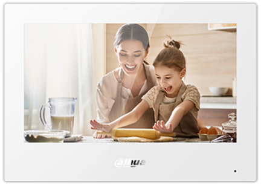

# VTH Dahua avec VESTA

<figure><figcaption></figcaption></figure>

<figure><figcaption>
VTH
</figcaption></figure>

### **Fonctionnalités de l'intégration**

<figure><figcaption>
VTH5321GW-W; VTH5321GB-W; VTH5341G-W
</figcaption></figure>

* Modifier le mode de fonction de la centrale
* Vérifier l'état des partitions&#x20;
* Liste des périphériques contournables&#x20;
* Utiliser les scénarios&#x20;
* Visualiser le journal d'évènements

### **Avant de commencer**

Avant de commencer la configuration, vous devez mettre à jour le VTH pour ajouter cette intégration au moniteur:

**VERSION 1.0 (**<mark style="color:red;">Obsolète</mark>**)**\
Customer\_VTH53X1\_MultiLang\_SIP\_V4.400.00BY000.0.R.20241203.**bin**\
[Téléchargement](https://drive.google.com/file/d/1ZrdeRizv-VHpTvorulqKDoywTdrPXQCa/view?usp=drive_link)

**VERSION 2.0** (<mark style="color:green;">NOUVEAU</mark>)\
Customer\_VTH53X1\_MultiLang\_SIP\_V4.400.00BY000.0.T.20250327.zip\
[Téléchargement](https://drive.google.com/file/d/1f4012VX1Ealt-zi62zF4abYr2YLzi9ug/view)

### **Ajouter la centrale VESTA au VTH**&#x20;

Suivez les étapes suivantes pour ajouter votre centrale VESTA au VTH:

1. **Accès aux réglages du VTH:** Sur le VTH, maintenir le bouton réglages appuyé (habituellement situé sur la droite). Ce bouton représente souvent un engrenage.
2. **Saisir le mot de passe:** Une fois demandé, saisir le mot de passe pas défaut: `123456`
3. **Choisir VESTA:** Depuis le menu réglage, choisir l'option "VESTA".
4. **Saisir les détails de la centrale:** Vous devrez fournir les informations suivantes:
   * **IP locale de la centrale:** Saisir l'adresse IP locale de votre centrale VESTA. Il s'agit de l'adresse IP attribuée à la centrale sur votre réseau.
   * **Port:** 80
   * **Utilisateur:** Saisir l'identifiant permettant d'accéder à la centrale VESTA. Par défaut: admin.
   * **Mot de passe:** Saisir le mot de passe de la centrale.
   * **MAC**: Saisir l'adresse MAC de votre centrale VESTA.


**Important:**\
Il est crucial d'initialiser votre centrale avant l'association avec un VTH Dahua. Connectez vous au serveur web local de votre centrale VESTA en saisissant son adresse IP dans votre navigateur. Utilisez les identifiants par défaut et configurez un nouveau mot de passe pour assurer la sécurité.

**Identifiants par défaut:**

Utilisateur: admin
\
Mot de passe: cX+HsA\*7F1



Si l'interface web de la centrale n'est pas disponible, pensez à la redémarrer.


5. **Sauver:** Après la saisie des informations, sauver les réglages dans le VTH.

### **Dépannage:**

* **Connexion impossible:**
  * Assurez-vous que le VTH et la centrale VESTA soient sur le même réseau local.
  * Vérifiez l'adresse IP de la centrale VESTA.
  * Vérifiez le nom d'utilisateur et le mot de passe.
  * Vérifiez la configuration du firewall de votre routeur pour vous assurez que le VTH peut communiquer avec la centrale VESTA.
* **Mot de passe incorrect:**
  * Si vous avez modifié le mot de passe de la centrale VESTA depuis son iterface web locale, assurez-vous d'utiliser le bon.
