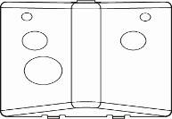

# NVR7464-IO-ULTRA

## NVR Ultra AI Serie - 64 canaux

<figure><figcaption>
NVR7464-IO-PRO
</figcaption></figure>

<figure><figcaption></figcaption></figure>

### Specifications

* 64 IP channels
* Video compression: H.265 and H.264
* Simultaneous video outputs of 2 HDMI (4K) and VGA (1080P)
* Output division: 1, 4, 9, 16, 25, 32
* 1 input / 2 RCA audio outputs
* Bi-directional audio
* Audio compression: G.711a
* Recording resolution up to 8MP (3840x2160)
* Bandwidth: 384 Mbps in, 384 Mbps out
* Decoding capacity:
  * 8 channels at 8MP (30 fps)
  * 32 channels 1080P (30 fps)
* Supports adaptive decoding
* Manual, scheduled recording modes (general, videosensor, alarm, intelligence)
* Alarm link: Recording, Image capture, Buzzer, Log, Preset, Email
* Supports image capture in JPEG format
* Artificial Intelligence from intelligent cameras:
  * Perimeter protection (intrusion, line crossing).
  * Face detection
  * People counting
  * Intelligent motion detection
* Artificial Intelligence in the recorder:
  * Perimeter protection (intrusion, line crossing): Up to 4 channels
  * Face detection: Up to 4 channels
  * Face recognition: Up to 4 channels
  * Intelligent motion detection: Up to 4 channels
* AI search by target classification (people, motorized vehicles and non-motorized vehicles)
* Synchronized playback of up to 16 channels
* 16 alarm inputs / 8 alarm outputs
* Internal capacity for 4 SATA HDD up to 16TB (sold separately)
* 1 eSATA port
* 2 RJ45 Gigabit Ethernet network ports (10/100/1000Mbps)
* Network protocols: HTTP, TCP/IP, IPv4, UPnP, SNMP, RTSP, UDP, SMTP, NTP, DHCP, DNS, IP Filter, DDNS, FTP, P2P, Auto register
* Onvif and SDK support
* Compatible with IE, Edge, Chrome, Firefox web browser
* Compatible with Android and iOS devices
* Communication ports: 4 USB 2.0 ports, 1 USB 3.0 port, 1 RS485 port, 1 RS232 port
* Power supply: 110V \~ 220V AC (±10%), 47\~63Hz
* Power consumption: 20W (excluding hard disk)
* Operating temperature from -10°C \~ +55°C
* Relative humidity 10%\~90% (non-condensing)
* Metal housing
* Dimensions: 440 (W) x 44 (H) x 340 mm (1.5U)
* Weight: 7 kg
* CE/FCC certified
