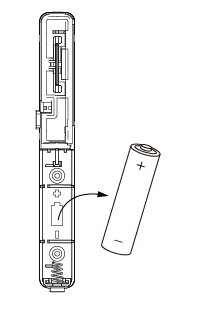
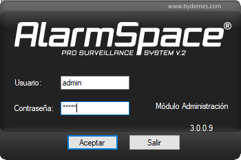
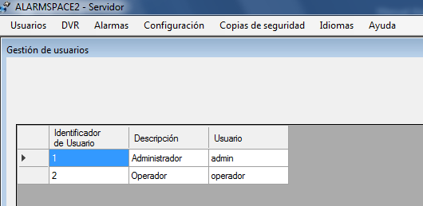
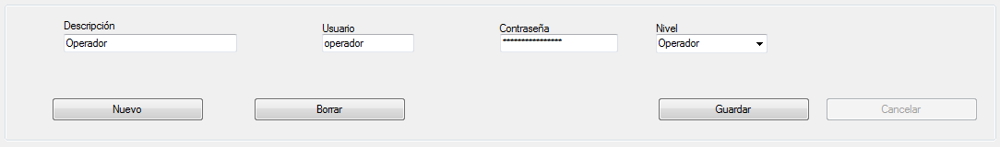

# VESTA 006

-   Manuel d'utilisation du contact de porte optique (OPDC-1)

Le contact de porte optique, intégrant un capteur infrarouge, surveille l'ouverture/fermeture d'appareils spécifiés (par exemple porte ou fenêtre). En utilisant la technologie de détection infrarouge, l'OPDC peut détecter si la porte ou la fenêtre est ouverte ou fermée, sans avoir besoin d'un aimant supplémentaire. L'OPDC transmettra des signaux d'alarme lorsqu'il détectera un changement et protégera votre maison.

Le contact de porte optique se compose d'un couvercle et d'une base. La base contient toute l'électronique et fournit un moyen de fixation de l'appareil. Un interrupteur anti-sabotage sur circuit imprimé fourni offre une protection contre l'ouverture non autorisée de l'appareil.

_**Identifier les pièces**_

1.  **Indicateur LED**
2.  **Bouton Apprendre/Test**
    -   Appuyez sur le bouton Test pour transmettre un code d'apprentissage.
    -   Appuyez une fois sur le bouton Test pour passer en mode Test pendant 3 minutes.
3.  **Altérer**
4.  **Batterie**
5.  **Zone de détection infrarouge**
6.  **Autocollant réfléchissant**

-   _**Indicateur LED**_

En mode de fonctionnement Normal, le voyant LED reste éteint sauf dans les situations suivantes :

-   Lorsque l’interrupteur anti-sabotage du contact optique de porte est déclenché.
-   Chaque fois que le contact de porte optique est activé dans des conditions de sabotage ou de batterie faible.
-   Chaque fois que le contact de porte est activé et transmet le signal en mode test.
-   _**Surveillance**_
-   Le contact de porte optique transmettra automatiquement des signaux de supervision périodiquement au panneau de commande à des intervalles aléatoires de 30 à 50 minutes en mode de fonctionnement normal.
-   Si le panneau de commande n'a pas reçu le signal du contact de porte optique pendant une période prédéfinie, le panneau de commande indiquera que ce contact de porte particulier rencontre un problème de manque de signal.
-   _**Interrupteur anti-sabotage**_
-   Il est conçu pour protéger contre l’ouverture non autorisée du couvercle. Lorsque l'autoprotection est déclenchée, le contact de porte optique émettra un signal au panneau de commande pour rapport, la LED s'allumera également.
-   _**Batterie**_

Le contact de porte optique utilise un**Pile alcaline AAA 1,5 V**comme source d'alimentation, et il est également capable de détecter une batterie faible. Lorsque la batterie est faible, un signal de batterie faible sera envoyé au panneau de commande avec une transmission régulière. La LED s'allumera lorsque le contact de porte est activé en cas de batterie faible. Lorsque la batterie est épuisée, le contact de porte optique arrêtera toutes les fonctions et la LED clignotera toutes les 4 secondes.

-   _**Changer la batterie**_

Maintenez la zone du bouton Apprendre/Test et soulevez doucement le capot avant. Retirez l'ancienne batterie comme indiqué sur la figure 1, puis appuyez 5 à 6 fois sur le bouton Apprendre/Test pour la décharger complètement. Insérez une nouvelle batterie et replacez le couvercle, comme indiqué sur la figure 2.

| Figure 1                                                      | Figure 2                                                      |
| ------------------------------------------------------------- | ------------------------------------------------------------- |
|  |  |

-   _**Mode d'essai**_

Le contact de porte optique peut être mis en mode test pendant 3 minutes en appuyant une fois sur le bouton de test situé sur le capot avant. Pendant le mode Test, le voyant LED s'allumera lors du déclenchement. À chaque pression sur le bouton de test, le contact de porte optique transmettra un signal de test au panneau de commande pour un test de portée radio et réinitialise le mode de test à la durée de 3 minutes. Il quittera automatiquement le mode test après 3 minutes et reviendra au mode de fonctionnement normal.

-   _**Commencer**_

Étape 1 : utilisez un tournevis à tête plate pour l'insérer dans le trou d'ouverture du couvercle en bas.

Étape 2 : Poussez doucement le tournevis à tête plate vers le haut et retirez le capot supérieur.

Étape 3 : Insérez la batterie dans le compartiment à batterie. Veuillez éviter de regarder directement la zone de détection infrarouge

lorsqu'il est en fonctionnement.

Étape 4 : Mettez le panneau de commande en mode d'apprentissage, reportez-vous au manuel du panneau de commande pour plus de détails.

Étape 5 : Appuyez sur le bouton de test du contact optique de porte pour envoyer un signal au panneau de commande.

Étape 6 : Si le panneau de commande reçoit le signal avec succès, le panneau de commande doit répondre (par exemple en émettant des bips). Reportez-vous au manuel de votre panneau de configuration pour terminer le processus d'apprentissage.

Étape 7 : Une fois le contact de porte optique appris, placez le panneau de commande sur «**Test de marche**mode ". Maintenez le contact optique de porte à l'emplacement souhaité et appuyez sur le bouton Test pour confirmer si cet emplacement est à portée du signal du panneau de commande.

Étape 8 : Lorsque vous êtes satisfait du contact de porte optique à l'emplacement choisi, procédez à l'installation.

-   _**Montage du contact de porte**_

Trouvez un endroit approprié pour installer le contact de porte. Il est recommandé d'installer le contact de porte optique sur un objet plus fixe (tel qu'un cadre de porte ou un cadre de fenêtre). Veuillez vous assurer que l'emplacement est à portée du signal du panneau de commande avant le montage.

Étape 1 : La surface de montage doit être propre, sèche et lisse. Nettoyer la surface de montage avec un dégraissant adapté si nécessaire.

Étape 2 : Retirez le revêtement protecteur d'un côté du tampon adhésif double face. Appliquer au dos de l'appareil et appuyer fermement pendant 30 secondes pour assurer un bon contact.

Étape 3 : Retirez l'autre couvercle et appuyez fermement sur le contact optique de porte à l'emplacement souhaité. Veuillez éviter d'appliquer le tampon adhésif sur une surface inégale ou de le réappliquer.

Étape 4 : Marquez l’emplacement de l’autocollant réfléchissant. L'autocollant réfléchissant doit être appliqué sur le**opposé**côté de la zone de détection infrarouge. L'écart ne devrait pas dépasser**zm**lorsque la porte/fenêtre est fermée.

Étape 5 : appliquez l'autocollant réfléchissant. Veuillez éviter d'appliquer l'autocollant réfléchissant sur une surface inégale ou de le réappliquer.

\\<Note>

-   Veuillez NE PAS appliquer le tampon adhésif sur une surface avec de la peinture écaillée ou craquelée, ou sur une surface rugueuse.
-   Veuillez noter que le ruban adhésif 3M ne peut pas être réutilisé.
-   Veuillez NE PAS exposer la zone de détection infrarouge à la lumière directe du soleil.
