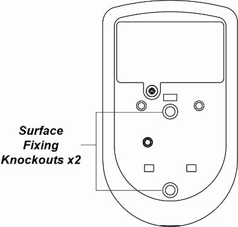

# VESTA-007 (FR)

**VST-862**

## **PIRCAM intérieur (lithium)**

### **Introduction**

VST-862 est détecteur de mouvement infrarouge passif (PIR) avec caméra. Il est capable d'envoyer des signaux RF et des images (qualité d'image jusqu'à 640 x 480 pixels) à la centrale suite à la détection d'un mouvement.\
Le PIRCAM est conçu pour offrir une portée de détection de 12 mètres lorsqu'il est installé à 2 mètres de haut. Pour les modèles avec immunité animaux,  la portée de l'immunité est de 7 mètres pour 27kg, vos animaux domestiques ne déclencheront pas de fausses alarmes dans les limites énoncées. Pour les modèles compatibles avec le répéteur RP-29/routeur RMB-29 de Climax (**Modèles P5 uniquement**), la portée de communication RF peut être encore étendue pour les zones difficiles à atteindre.\
Le PIRCAM est composé de deux éléments, le couvercle et la base. Le couvercle contient toute l'électronique et l'optique et la base fournit un moyen de fixation. La base comporte des découpes pour permettre un montage sur une surface plane ou dans un angle avec un support triangulaire.

**La série VST-862 comprend les modèles suivants :**

| **Nom du modèle** | **LED clignotante** | **LED IR** | **Immunité animaux** | **Compatibilité répéteur** |
| ----------------- | ------------------- | ---------- | -------------------- | -------------------------- |
| VST-862-(P5)      | OUI                 |            |                      | Modèle P5 uniquement       |
| VST-862-IL-(P5)   |                     | OUI        |                      | Modèle P5 uniquement       |
| VST-862P-(P5)     | OUI                 |            | OUI                  | Modèle P5 uniquement       |
| VST-862P-IL-(P5)  |                     | OUI        | OUI                  | Modèle P5 uniquement       |

### **Identification**

<figure><figcaption></figcaption></figure>

1. **LED clignotante / LED IR**\
   La LED clignotante (pour 862(P)) ou la LED IR (pour 862(P)-IL) fournit suffisamment de lumière pour la capture d'images dans des conditions de faible éclairage.
2. **LED bleue/bouton de fonction**\
   **LED bleue:**\
   (Prière de se référer à **Voyant LED** dans la description ci-dessous pour plus de détails)\
   **Utilisation du bouton de fonction :**\
   **-** Maintenez le bouton appuyé pendant 3 secondes pour envoyer un code d'apprentissage, relâchez lorsque la LED bleue s'allume (pour les centrales autonomes, après avoir appuyé et maintenu le bouton pendant 3 secondes, veuillez appuyer sur le bouton **de nouveau** pendant une seconde pour envoyer le code d'apprentissage).\
   \- Appuyez une fois sur le bouton pour passer en mode test pendant 3 minutes.\
   \- Appuyez une fois sur le bouton pour envoyer un code d'apprentissage au répéteur/routeur (Modèles P5 uniquement).
3. **Capteur IR**
4. **Objectif de caméra PIR**
5. **Couvercle du compartiment à batteries**
6. **Autoprotection**
7. **Compartiment à batterie**
8. **Cavalier de réglage de la sensibilité (JP3)**\
   Le cavalier est inséré pour relier les deux broches.\
   \- Cavalier On : le niveau de sensibilité du PIR est réglé sur Haut.\
   \- Cavalier Off : le niveau de sensibilité du PIR est réglé sur Normal (**par défaut**).
9. **Cavalier de mise en veille (JP2)**\
   Le cavalier est inséré pour relier les deux broches.\
   \- Cavalier On : après la détection de mouvement, la caméra PIR n'entre pas en mode veille et transmettra à nouveau le signal de détection immédiatement si elle est déclenchée (**par défaut**).\
   \- Cavalier Off : la caméra PIR a une "**mise en veille**" d'environ 1 minute après la détection de mouvement pour économiser l'énergie.

### **Caractéristiques**

#### **- Voyant LED**

En fonctionnement normal, la LED bleue ne s'allumera pas sauf dans les situations suivantes :\
\- Lorsque le PIRCAM est en état de batterie faible, chaque fois qu'il transmet un mouvement détecté, la LED bleue clignote pendant 2 secondes.\
\- Lorsque le couvercle est ouvert et que l'autoprotection est déclenchée, la LED bleue clignote pendant 2 secondes pour indiquer qu'il transmet le signal "Autoprotection".\
\- Lorsque la condition de sabotage persiste, chaque fois qu'il transmet un mouvement détecté, la LED bleue clignote pendant 2 secondes.\
\- Lorsque le PIRCAM entre en mode test, la LED bleue clignote pendant 1 seconde. Pendant le mode Test, la LED bleue clignote également pendant 2 secondes à chaque fois qu'un mouvement est détecté.\
\- Lorsque le PIRCAM est en période de démarrage de 30 secondes, la LED bleue clignote lentement.\
\- Lorsque le PIRCAM transmet des images capturées dans des conditions de défaut (batterie faible, autoprotection), la LED bleue clignote en continu.

#### **- Capture d'image**

Lorsque le système d'alarme est armé, le PIRCAM capturera 1, 3 ou 6 images d'alarme en résolutions 640 x 480 ou 320 x 240 (programmable depuis la centrale) lors de la détection de mouvement. Vous pouvez également demander manuellement au PIRCAM de prendre une photo via la centrale. Les images capturées seront transférées vers la centrale pour que les utilisateurs puissent les consulter.

#### **- Période de démarrage**

Lorsque la centrale est armée ou lorsque le PIRCAM est mis en mode test, un période de démarrage de 30 secondes démarre. Pendant cette période, le PIRCAM ne sera pas actif. La LED bleue clignotera lentement pendant la période de démarrage uniquement lorsque le PIRCAM entre en mode test.

#### **- Mise en veille**

Quand **JP2** est réglé sur Off, le PIRCAM a une "**mise en veille**" d'environs 1 minute pour économiser de l'énergie. Après avoir transmis un mouvement détecté, le PIRCAM ne retransmettra pas pendant 1 minute. Tout mouvement détecté pendant cette période réinitialisera la temporisation de mise en veille de 1 minute. Un mouvement continu devant le PIRCAM n'épuisera donc pas la batterie.

#### **- Batteries et détection batterie faible**

Le PIRCAM utilise ses trois **Piles au lithium CR123A 3V** comme source d'énergie. Retirez le couvercle du compartiment des piles et insérez les piles pour activer le PIRCAM.\
Le PIRCAM dispose d'une fonction de détection de batterie faible. Lorsque la tension de la batterie est faible, le PIRCAM transmet le signal de batterie faible à la centrale. Si un mouvement est détecté dans des conditions de batterie faible, la LED bleue clignote pendant 2 secondes.\
Lors du changement de batterie, après avoir retiré l'ancienne batterie, appuyez deux fois sur l'autoprotection ou sur le bouton de fonction pour la décharger complètement avant d'insérer de nouvelles piles.

#### **- Autoprotection**

Le PIRCAM est protégé par une autoprotection qui est compressée lorsque le périphérique est correctement installée. Lorsque le PIRCAM est retiré de la surface montée ou que son couvercle est ouvert, l'autoprotection sera activée et le PIRCAM enverra un signal d'autoprotection à la centrale pour informer l'utilisateur. Si un mouvement est détecté lorsque l'autoprotection est déclenchée, la LED bleue clignote pendant 2 secondes.

#### **- Supervision**

Le PIRCAM effectuera périodiquement un auto-test en transmettant un signal de supervision toutes les 30 à 50 minutes

#### **- Mode test**

_**-**_ Le mode test permet de vérifier la plage de détection du PIRCAM (et non la couverture de prise de vue).\
\- Appuyez une fois sur le bouton  de fonction pour passer en mode Test pendant 3 minutes, la LED bleue clignotera pendant 1 seconde.\
\- Le PIRCAM activera sa période de démarrage de 30 secondes. Veuillez ne pas déclencher le PIRCAM pendant cette période.\
\- Après la période de démarrage, vous pouvez déclencher le PIRCAM pour vérifier la plage de détection IR. Si le PIRCAM est déclenché, la LED bleue clignote pendant 2 secondes.\
\- Pour que le mode test fonctionne correctement, il est recommandé de désactiver la mise en veille.

### **Apprentissage**

_**-**_ Retirez le couvercle du compartiment à piles en desserrant la vis. Insérez les piles. Orientez la batterie selon l'indication de polarité.\
\- Mettez la centrale en mode apprentissage, reportez-vous au manuel de la centrale pour plus de détails.\
\- Maintenez appuyé le bouton de fonction pendant 3 secondes, relâchez le bouton lorsque la LED bleue s'allume (pour les centrales autonomes, après avoir appuyé et maintenu enfoncé le bouton de fonction pendant 3 secondes, veuillez appuyer **de nouveau** sur le bouton pendant une seconde).\
\- La LED bleue s'allumera pendant 25 secondes en mode d'apprentissage, ajoutez le PIRCAM à la centrale durant cette période (référez-vous à votre centrale pour terminer l'apprentissage en cours). Si le PIRCAM est ajouté avec succès à la centrale, la LED bleue clignotera 6 fois. Si le PIRCAM n'est pas ajouté dans les 25 secondes, veuillez répéter le processus d'apprentissage.


NOTE:

* Si le PIRCAM existe déjà dans une centrale, vous devrez d'abord supprimer le PIRCAM de cette centrale avant de pouvoir l'enregistrer dans une autre centrale.
* Lors de l'apprentissage du PIRCAM dans un répéteur/routeur, veuillez appuyer une fois sur le bouton de fonction (au lieu de le maintenir enfoncé pendant 3 secondes) pour envoyer un code d'apprentissage (Modèles P5 uniquement).


#### **- Test de fonctionnement**

_**-**_ Une fois le PIRCAM enregistré, mettre la centrale en "**mode test**", maintenez le PIRCAM à l'emplacement souhaité et appuyez sur le bouton de fonction pour confirmer que cet emplacement est à portée de signal de la centrale, reportez-vous au manuel de la centrale pour effectuer le test de fonctionnement.\
\- Lorsque vous êtes convaincu que le PIRCAM fonctionne à l'emplacement choisi, vous pouvez procéder au montage.

#### **- Modification de la Partition**

Suivez les instructions ci-dessous pour modifier la partitions d'un PIRCAM dans la centrale d'alarme.\
1\. Utilisez le menu de configuration depuis la centrale pour modifier la partition du PIRCAM.\
2\. Maintenez appuyé le bouton de fonction pendant 3 secondes sur le PIRCAM pour envoyer un signal à la centrale, puis relâchez le bouton lorsque la LED s'allume (pour les centrales autonomes, après avoir appuyé et maintenu enfoncé le bouton de fonction pendant 3 secondes, veuillez appuyer **de nouveau** sur le bouton pendant une seconde pour envoyer un signal.)

### **Installation**

#### **Guide d'installation**

_**-**_ Le PIRCAM est conçu pour être monté sur une surface plane ou dans un angle avec les vis de fixation et les chevilles fournies.\
\- La base comporte des découpes, là où le plastique est plus fin, à des fins de montage. Deux découpes sont destinées à la fixation en surface et un support de montage triangulaire est utilisé pour la fixation en angle.\
\- La portée de détection peut atteindre 12 mètres si le PIRCAM est monté à 2 mètres au-dessus du sol.\
\- Les modèles avec immunité animaux une portée de l'immunité de 7 mètres lorsqu'ils sont montés entre 1,9 et 2 mètres au-dessus du sol. Si nécessaire, vous pouvez régler la hauteur du PIRCAM en fonction de la taille de votre animal pour une performance optimale. Une hauteur plus élevée signifie un plus grand espace immunisé contre les animaux, mais augmentera également l'angle mort sous le PIRCAM.\
\- Lorsque le PIRCAM est monté avec un support articulé, il n'aura pas la zone de détection normale (comme dans le diagramme) ni la portée normale de l'immunité animaux.

 (1).png>)

**Il est recommandé d'installer le PIRCAM aux endroits suivants**

* Là où les animaux ne peuvent pas accéder à la zone de détection en grimpant sur des meubles ou d'autres objets.
* Ne dirigez pas le détecteur vers des escaliers dans lesquels les animaux peuvent circuler.
* Dans une position telle qu’un intrus se déplacerait normalement dans le champ de vision du PIR.
* Entre 1,9 et 2 m du sol pour de meilleures performances.
* Dans un angle pour donner la vue la plus large.
* Où son champ de vision ne sera pas obstrué, par ex. par des rideaux, des ornements, etc.

**Limites**

* N'installez pas le PIRCAM complètement exposé à la lumière directe du soleil.
* Évitez d'installer le PIRCAM dans des zones où les appareils peuvent provoquer un changement rapide de température dans la zone de détection, c'est-à-dire un climatiseur, un radiateur, etc.
* Évitez les gros obstacles dans la zone de détection.
* Ne pas pointer directement vers des sources de chaleur, par ex. foyer de cheminée ou chaudières, et pas au-dessus des radiateurs.
* Évitez de déplacer des objets dans la zone de détection, par exemple un rideau, une tenture murale, etc.

**Assurez-vous de toujours maintenir la force du signal RSSI stable à « 4 ».**

#### **Montage du PIRCAM**

<figure><figcaption></figcaption></figure>

\- Le PIR est conçu pour être monté sur une surface plane ou dans un angle avec les vis de fixation et les chevilles fournies.\
\- Pour le montage en angle, un support triangulaire est fourni pour ajouter une autoprotection arrière. Le support comprend également deux emplacements de fixation.\
\- Pour le montage en applique, un support articulé en option est disponible pour permettre aux utilisateurs d'ajuster la plage de détection. Grâce au support articulé, le PIRCAM peut pivoter de 80° horizontalement et de 70° verticalement pour offrir une couverture optimale.

* **Installation en angle :**\
  1\. Percez les emplacements du support triangulaire.\
  2\. Utilisez les deux trous comme gabarit pour percer des trous sur la surface en angle.\
  3\. Insérez les chevilles murales.\
  4\. Vissez le support triangulaire dans les chevilles murales avec les deux pions de fixation en haut face à vous.\
  5\. Fixez le PIRCAM sur les crochets du support triangulaire.

<figure><figcaption></figcaption></figure>

* **Montage en applique :**\
  1\. Ouvrez le couvercle en desserrant la vis à l'aide d'un tournevis Philips.\
  2\. Percez les 2 découpes au centre de la base.\
  3\. Utilisez les trous comme gabarit pour percer la surface de fixation.\
  4\. Insérez les chevilles murales si vous le fixez dans du plâtre ou de la brique.\
  5\. Vissez la base dans les chevilles murales.\
  6\. Installez le couvercle sur la base et serrez.

* **Montage avec support articulé (en option, vendu séparément) :**\
  Le support articulé peut être monté au mur à l'aide des vis fournies.\
  1\. Vissez le support articulé au mur.\
  2\. Insérez les 3 crochets du support articulé dans les 3 trous de la base.\
  3\. Faites pivoter le support pour obtenir la plage de détection souhaitez et serrez la vis de fixation.

.png>)


Remarque :\
Le message "Contrôle Erreur" est dû au fait qu'un PIRCAM n'a pas été ajouté en appuyant sur le bouton d'apprentissage pendant 4 secondes.

