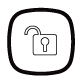

# VESTA 011

-   CLAVIER À DISTANCE (KPT-39N)
-   _**Identification des pièces**_

.png>)

| <ol><li>Clé de bras</li><li>Clé de la maison</li><li>Clé de désarmement</li><li>Alarme de panique (si activée)</li></ol>
- appuyez à la fois sur 1 et 3 pour déclencher l'alarme de panique
<ol><li>Alarme incendie (si activée)</li></ol>
- appuyez à la fois sur 4 et 6 pour déclencher l'alarme incendie
<ol><li>Alarme médicale (si activée)</li></ol>
- appuyez à la fois sur 7 et 9 pour déclencher l'alarme médicale
<ol><li>Envoyer le code d'apprentissage</li></ol>
- appuyez sur ＊ puis sur la touche 7 (sous Mode Test)

- appuyez sur les touches # et 🞸 (en mode de fonctionnement normal)
 | <ol><li># Clé</li></ol>
- appuyez pour vérifier le mode système actuel
<ol><li>🞸 Clé</li><li>LED de défaut (LED orange)</li><li>LED d'alimentation (LED verte)</li><li>Zone de détection pour l'étiquette NFC</li></ol><ul><li>placez l'étiquette NFC à proximité de la zone de détection pour accéder au système d'alarme</li></ul><ol><li>Interrupteur anti-sabotage</li><li>Trous de montage</li><li>Étiquette NFC</li></ol> |
| ----------------------------------------------------------------------------------------------------------------------------------------------------------------------------------------------------------------------------------------------------------------------------------------------------------------------------------------------------------------------------------------------------------------------------------------------------------------------------------------------------------------------------------------------------------------------------------------------------------------------------------- | ------------------------------------------------------------------------------------------------------------------------------------------------------------------------------------------------------------------------------------------------------------------------------------------------------------------------------------------------------------------------------------------------------------------------------------- |

\\<NOTE>

-   Un bip court retentira en même temps que la touche enfoncée pour indiquer que le bouton enfoncé est valide.
-   4 bips continus retentiront pour indiquer une erreur et l'utilisateur devra répéter le processus.
-   _**Indicateur LED**_
-   **LED d'alimentation (verte) :**
    -   -   Allumé pendant 5 secondes : après la réussite d’une séquence de touches valide.
        -   Flash pendant 5 secondes : batterie faible en mode de fonctionnement normal.
        -   Si le voyant d'alimentation s'éteint avant qu'une séquence de touches valide ne soit terminée, les touches saisies précédemment sont ignorées.
-   **LED de défaut (orange) :**
    -   -   Touche de désarmement et LED orange allumées avec 5 bips : mémoire d'alarme (dépend du panneau de commande).
        -   Éclair:
-   Flash uniquement : Aucune réponse envoyée par la centrale dans les 10 secondes.
-   Clignote accompagné de 2 bips : demande de mode Accueil pendant le mode Armement.
-   Clignote avec 3 bips : demande de mode Accueil ou Armement en cas de condition de panne.
-   Clignote accompagné de 4 bips : le code PIN était incorrect.
-   _**Opération générale**_
-   Entrez en mode test — Entrez le code PIN du clavier, puis appuyez sur la touche ＊.
-   Alarme de panique — Appuyez sur**1**touche +**3**clé en même temps. (si la fonction est activée)
-   Alarme incendie — Appuyez sur**4**touche +**6**clé en même temps. (si la fonction est activée)
-   Alarme médicale — Presse**7**touche +**9**clé en même temps. (si la fonction est activée)
-   Vérifier l'état du panneau de commande - Mode normal Appuyez sur**#**clé.
-   Activer/Désactiver le son d'entrée et de sortie — Appuyez sur**1**touche +**2**en même temps pendant 2 secondes. (Le clavier émettra un bip long pour indiquer que la fonction est activée et émettra 2 bips courts pour indiquer que la fonction est désactivée.)
-   _**Pouvoir**_
-   Le clavier à distance utilise une pile au lithium CR123 3 V comme source d'alimentation.
-   Le clavier distant peut également détecter l'état de la batterie. Si la tension de la batterie est faible, la LED d'alimentation clignote pendant 5 secondes pendant le fonctionnement. Le signal de batterie faible sera envoyé avec des transmissions de signal régulières au panneau de commande pour afficher l'état en conséquence.
-   Avant expédition, la batterie est préinstallée en usine.
-   Lors du changement de batterie, appuyez plusieurs fois sur n'importe quelle touche pour la décharger avant d'insérer une nouvelle batterie.
-   _**Power Saving Feature**_
-   Lorsqu'il est inactif, le clavier distant est en**Attendre**mode et ne consomme aucune énergie. Il s'activera et**réveillez-vous**pendant 5 secondes lorsqu'une touche est enfoncée.
-   Après 5 secondes d'inactivité de la touche, l'alimentation s'éteint et revient**o En veille**mode.
-   _**Autoprotection**_
-   Le clavier est protégé contre toute tentative d'ouverture du couvercle ou de détachement du clavier de sa surface de montage.
-   La protection anti-sabotage est désactivée lorsque le clavier est en mode test.
-   _**Commencer**_

Étape 1. Mettez le panneau de contrôle en mode apprentissage.

Étape 2. Ajout d'un clavier distant dans le panneau de configuration :

**Mode d'essai:**

1.  Mettez le clavier déporté en mode Test en saisissant le code PIN KP (par défaut :**0000**), puis appuyez**＊**clé.

Les trois.png>).png>).png>)Les LED s'allumeront avec un long bip.

1.  Appuyez ensuite sur la touche ＊**7**Clé pour transmettre le signal d'apprentissage. Le clavier à distance émettra un long bip.

**Fonction du mode test :**

1.  Appuyez sur la touche ＊ puis sur la touche 1 — Entrez dans le mode d'apprentissage/de gestion des étiquettes NFC.
2.  Appuyez sur la touche ＊ puis sur la touche 2 - Activez la fonction d'alarme de panique à deux touches
3.  Appuyez sur la touche ＊ puis sur la touche 3 — Activez la fonction d'alarme incendie à deux touches
4.  Appuyez sur la touche ＊ puis sur la touche 4 — Activez la fonction d'alarme médicale à deux touches
5.  Appuyez sur la touche ＊ puis sur la touche 5 - Désactivez toutes les fonctions Dual Key (par défaut)
6.  Appuyez sur la touche ＊ puis sur la touche 6 - Modifier le code PIN du clavier

..Entrer**Vieux**Code PIN du clavier, puis appuyez sur**＊**clé

..Entrer**Nouveau**un nouveau code PIN du clavier à 4 chiffres, puis appuyez sur**#**clé**.**

1.  Appuyez sur la touche ＊ puis sur la touche 8 — Activer la fonction Armement/Accueil sans code PIN.

_(Prière de se référer à "**Armement/Accueil sans code PIN du panneau de commande**» pour plus de détails, page 4)._

1.  Appuyez sur la touche ＊, puis sur la touche 9 — Activer la fonction Armement/Accueil avec la fonction Code PIN utilisateur du panneau de commande (par défaut).

(_Prière de se référer à "**Armement/Accueil avec code PIN du panneau de commande**» pour plus de détails, page 4_).

\\<NOTE>

-   Si le clavier distant n'a pas émis de bip long, cela signifie que le clavier distant n'a pas envoyé le code d'apprentissage au panneau de commande, veuillez appuyer sur la touche ＊ puis**7**touchez à nouveau pour envoyer le code d'apprentissage.
-   Si le panneau de contrôle reçoit le code d'apprentissage, il affichera les informations en conséquence. Reportez-vous au manuel d'utilisation de votre panneau de commande pour terminer le processus d'apprentissage.
-   Une fois que le panneau de commande a reçu le signal du clavier distant, il enverra un accusé de réception au clavier distant. Le clavier distant émettra alors 3 bips pour confirmer que l'accusé de réception a été reçu. Si le clavier distant n'émet pas 3 bips, veuillez redémarrer la procédure d'apprentissage.

Étape 3. Une fois le clavier distant appris, placez le panneau de commande dans**Test de marche**mode, maintenez le clavier distant à l'emplacement souhaité et envoyez le code d'apprentissage au panneau de commande pour confirmer que cet emplacement se trouve dans la plage de signal du panneau de commande. Pour envoyer le code d'apprentissage, appuyez soit sur la touche**＊**clé alors**7**sous Mode Test ou appuyez sur les deux**#**et**＊**touches ensemble en mode de fonctionnement normal.

Étape 4. Lorsque vous êtes satisfait que le clavier distant fonctionne à l'emplacement choisi, vous pouvez procéder au montage du clavier distant en suivant les étapes décrites ci-dessous (veuillez vous référer à «_**Montage du clavier déporté**» pour plus de détails)_.

Étape 5. Appuyez sur la touche Désarmer**deux fois**pour quitter le mode Test et l'installation est terminée. Le clavier à distance émettra un long bip et trois LED de mode système s'éteindront. Le clavier distant revient au mode de fonctionnement normal.

\\<NOTE>

-   Le clavier distant quittera automatiquement le mode Test après 5 minutes d'inactivité et reviendra en mode Veille. Toutes les LED s'éteindront et le clavier émettra un long bip.
-   _**Procédures d'apprentissage/effacement/installation des étiquettes NFC**_

NFC signifie Near Field Communication, qui est une technologie de communication sans fil qui établit une connexion entre deux appareils en les rapprochant. Vous pouvez stocker un code PIN utilisateur dans une étiquette NFC et utiliser l'étiquette NFC pour accéder au système d'alarme sans saisir de code PIN utilisateur sur le KPT-39N. Le clavier peut apprendre jusqu'à 100 étiquettes NFC avec jusqu'à 50 codes PIN.

_**A. Procédure d'apprentissage NFC :**_

Étape 1. Activez d'abord le clavier distant pour passer en mode test. Saisissez le code PIN du clavier (par défaut :**0000**) suivi de la touche ＊. Lors de la saisie du code PIN, le**LED d'alimentation**(Vert) s'allumera. Le**LED d'alimentation**s'éteindra alors et émettra un long bip.

Étape 2. Appuyez sur la touche ＊ puis**1**pour accéder au mode d'apprentissage de l'étiquette NFC. Le**LED de défaut**(Orange) s'allumera et émettra un long bip.

Step 3. Enter a new PIN code followed by # key. The Keypad will emit a long beep, and the orange LED will begin to flash for 5 seconds to indicate it is ready to learn a NFC label.

Étape 4. Dans les 5 secondes, placez une étiquette NFC à proximité de la zone de détection du clavier pour la coupler avec le code PIN utilisateur que vous venez de saisir.

-   Chaque étiquette associée réinitialisera le temps d'apprentissage de l'étiquette NFC à 5 secondes. Vous pouvez associer plusieurs étiquettes avec un seul code utilisateur en appliquant les étiquettes une par une.
-   Le clavier quittera le mode d'apprentissage des étiquettes NFC après 5 secondes d'inactivité.
-   Si l'étiquette apprise est nouvelle, le clavier émettra 2 bips courts.
-   Si l'étiquette apprise existe déjà dans le clavier (attribuée à un autre code PIN), le clavier émettra 1 bip court.

Étape 5. Pour apprendre une autre étiquette, veuillez répéter l'étape 3 à l'étape 4. Le clavier quittera automatiquement le mode d'apprentissage de l'étiquette NFC après 5 secondes d'inactivité.

Étape 6. Appuyez sur.png>)touche pour quitter le mode d'apprentissage des étiquettes NFC.

-   État d'erreur :
-   Si le code utilisateur du panneau de commande saisi dépasse le nombre maximum de chiffres du code PIN, la LED orange clignotera avec 4 bips courts pour indiquer une erreur.
-   Si le clavier a déjà stocké 50 codes PIN du panneau de commande, il émettra 4 bips courts pour indiquer une erreur lorsque vous tenterez de saisir le 51e code PIN.
-   Si le clavier a déjà appris 100 étiquettes NFC, il émettra 4 bips courts pour indiquer une erreur lorsque vous tenterez d'apprendre la 101ème étiquette NFC.

_**B. Procédure de compensation NFC :**_

Vous pouvez effacer les informations de l'étiquette NFC.

Étape 1. Activez d'abord le clavier distant pour passer en mode test. Saisissez le code PIN du clavier (par défaut :**0000**) suivi de la touche ＊. Lors de la saisie du code PIN, le**LED d'alimentation**(Vert) s'allumera. Le**LED d'alimentation**s'éteindra alors et émettra un long bip.

Étape 2. Appuyez sur la touche ＊ puis**1**pour accéder au mode d'apprentissage de l'étiquette NFC. Le**LED de défaut**(Orange) s'allumera et émettra un long bip.

Étape 3. Si vous souhaitez supprimer un code PIN du panneau de commande stocké dans le clavier et toutes les étiquettes NFC attribuées à ce code PIN, entrez le code utilisateur du panneau de commande et appuyez sur la touche ＊, un long bip retentira.

Si vous souhaitez effacer uniquement une étiquette NFC spécifique, appuyez sur la touche ＊ avec un long bip et la LED orange clignotera pendant 5 secondes. Apposez une étiquette NFC à proximité de la zone de détection du clavier dans les 5 secondes :

-   Si l'étiquette NFC appliquée existe dans le clavier, le clavier émettra 2 bips courts pour indiquer que les données de l'étiquette NFC ont été supprimées.
-   Si l'étiquette NFC appliquée n'existe pas sur le clavier, le clavier émettra 4 bips courts pour indiquer une erreur.
-   Chaque étiquette NFC appliquée réinitialisera le minuteur de retrait de l'étiquette NFC à 5 secondes, vous pouvez supprimer plusieurs NFC

étiquettes en les appliquant une par une.

Étape 4. Le clavier quittera automatiquement le mode de suppression des étiquettes NFC après 5 secondes d'inactivité.

Étape 5. Appuyez sur.png>)touche pour quitter le mode d'apprentissage des étiquettes NFC.

_**C. NFC Installation Procedure**_

Les petites étiquettes NFC peuvent être placées au dos des smartphones, des cartes ou des porte-clés pour un accès facile.

Étape 1. Apprenez l'étiquette NFC au clavier distant

Étape 2. Retirez le couvercle de protection de l'étiquette NFC.

Étape 3. Appliquez l'étiquette NFC sur la coque arrière de votre téléphone portable, etc.

Étape 4. Vous pouvez maintenant utiliser l'étiquette NFC pour accéder au système.

**\\<NOTE>**

-   Faites attention à ne pas plier l'étiquette NFC, car elle pourrait être endommagée et devenir inutilisable.
-   Le KPT-39N prend uniquement en charge le protocole ISO 14443A pour l'étiquette NFC.
-   _**Contrôle du mode système**_

Après avoir fini d'apprendre le clavier dans le panneau de commande du système d'alarme, l'utilisateur peut changer le système à l'aide du clavier.

Il existe deux manières d'armer le système.

1.  Armement absent/domicile Armez le système en saisissant le code PIN utilisateur du panneau de commande.
2.  Armement Absent/Départ Armez le système sans entrer le code PIN utilisateur du panneau de commande.

Le désarmement du système nécessite toujours la saisie du code PIN utilisateur du panneau de commande.

**Armement/Accueil avec code PIN du panneau de commande :**

En mode Test, appuyez sur la touche ＊ puis**9**pour activer la fonction Armement/Accueil avec code PIN.

Étiquette NFC. Si le panneau ne présente aucun défaut et que l'armement réussit, le.png>)La LED s'allumera avec

un long bip.

bips.

5 bips.

**Armement/Accueil sans code PIN du panneau de commande :**

En mode Test, appuyez sur la touche ＊ puis**8**Touche pour activer la fonction Arm/Home sans code PIN

accompagné d'un long bip.

accompagné de 3 bips.

une marque. Si le désarmement réussit, leLa LED s'allumera avec 2 bips. S'il y a**Mémoire d'alarme,**leLa LED et la LED de défaut s'allumeront avec 5 bips.

-   _**Son d'entrée/sortie**_
-   Une fois le son d'entrée/sortie activé en appuyant sur**1**touche +**2**en même temps pendant 2 secondes (indiqué par un bip long), le clavier émettra des bips lorsque la minuterie d'entrée/sortie est activée.
-   Une fois le son d'entrée/sortie désactivé en appuyant sur**1**touche +**2**en même temps pendant 2 secondes (indiqué par deux bips courts), le clavier restera silencieux lorsque la minuterie d'entrée/sortie sera activée.
-   _**Conditions de défaut**_

_Lorsque le clavier distant est sous**MODE DE FONCTIONNEMENT NORMAL,**_

-   1.  Lorsqu'une condition de défaut existe dans le panneau de commande, si le clavier est utilisé pour armer le panneau, la LED de défaut clignotera avec 3 bips pour indiquer une condition de défaut.
    2.  Lorsque le clavier désarme le panneau, leLa LED s'allumera avec deux bips indiquant un fonctionnement normal.
    3.  Si vous saisissez un code PIN KP incorrect 4 fois en 10 minutes en mode test, KP désactivera la fonction clé pendant 1 minute et toutes les LED clignoteront 3 fois avec 6 bips. Après 1 minute, il émettra un long bip pour indiquer que la fonction clé est revenue à la normale.
    4.  Si vous saisissez un code PIN KP incorrect 4 fois dans les 10 minutes lors du changement de mode système, KP désactivera la fonction clé pendant 5 minutes. Après 5 minutes, le clavier émettra un long bip pour indiquer que la fonction des touches est revenue à la normale.
-   _**Retour aux paramètres d'usine**_

La réinitialisation du clavier aux paramètres d'usine par défaut restaurera le code PIN du clavier à 0000 et effacera toute la mémoire d'apprentissage du panneau.

_**Réinitialiser aux paramètres d'usine :**_

Étape 1 Retirez les piles et relâchez le dispositif anti-sabotage.

Étape 2 Si «**Armement/Accueil avec code PIN du panneau de commande**" La méthode est sélectionnée, appuyez et maintenez**3**clé tout en insérant la batterie.

.Si "**Armement/Accueil sans code PIN du panneau de commande**" La méthode est sélectionnée, appuyez et maintenez**4**clé tout en insérant la batterie.

Étape 3 Continuez à appuyer**3**jusqu'à ce que KP émette 3 bips pour indiquer une réinitialisation réussie.

.Continuez à appuyer sur la touche 4 jusqu'à ce que KP émette 4 bips pour indiquer une réinitialisation réussie.

Étape 4 : Libération**3**ou 4 touches, le processus de réinitialisation est terminé. Après la réinitialisation, le code PIN revient aux valeurs par défaut d'usine,**0000**.

Le clavier distant aura besoin d'un nouveau processus d'apprentissage pour commencer à fonctionner.

-   Chaque fois que le clavier est retiré du panneau de commande, il doit également être réinitialisé aux paramètres d'usine pour effacer la mémoire de son panneau de commande.
-   _**Montage du clavier déporté**_

Pour monter le clavier déporté :

1.  Retirez le capot avant.
2.  En utilisant les 2 trous de montage de la coque arrière comme gabarit, marquez les positions à l'endroit le plus approprié.
3.  Insérez les chevilles murales si vous fixez sur une surface en plâtre ou en brique.
4.  Vissez le clavier déporté sur les chevilles.
5.  Remettez le capot avant.
