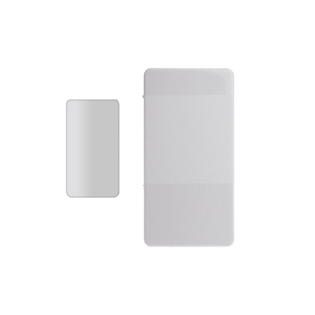

# VESTA-013 (FR)

MDC-3

## Mini Détecteur d'ouverture

### GUIDE RAPIDE

<figure><figcaption>
VESTA-013 - MDC-3-F1
</figcaption></figure>

1. Retirez l'opercule isolant la batterie du MDC-3.
2. Mettez la centrale en mode apprentissage (reportez-vous au manuel de la centrale pour plus de détails).
3. Appuyez sur le bouton d'apprentissage/test à l'arrière du MDC-3 pour envoyer le signal à la centrale.
4. Si la centrale reçoit le signal avec succès, elle doit répondre (par exemple en émettant un bip).

### Introduction

Le mini détecteur d'ouverture surveille l'ouverture/fermeture d'éléments spécifiques (par exemple porte ou fenêtre). L'électronique est fixée au cadre de l'élément à surveiller tandis que l'aimant est fixé sur la partie mobile. Lorsque la porte ou la fenêtre s'ouvre, l'aimant s'éloigne du détecteur d'ouverture, activant un interrupteur magnétique interne provoquant la transmission par le détecteur d'un signal d'alarme vers la centrale. L'appareil a également la capacité de communiquer les problèmes de transmission ainsi que les situations de batterie faible.

Le détecteur d'ouverture se compose d'un couvercle et d'une base. L'ensemble contient tous les composants électroniques et la base permet la fixation de l'appareil. Une autoprotection sur le circuit imprimé offre une protection contre l'ouverture non autorisée de l'appareil.

### **Identification**

 (1).png>)

1. **Emplacement pour aimant**
2. **Opercule de batterie**
3. **Bouton d'apprentissage/test**
   * Appuyez sur le bouton pour transmettre un code d'apprentissage.
   * Appuyez une fois sur le bouton pour passer en mode Test pendant 3 minutes.
4. **Voyant LED rouge**
5. **Autoprotection**
6. **Batterie**
7. **Trous de fixation**
8. **Ergot pour autoprotection**
9. **Aimant**
10. **Entretoise magnétique**

#### **- Accessoires inclus**

1. 1 aimant
2. 1 entretoise magnétique adhésive double face
3. 2 vis
4. 4 chevilles murales
5. 1 bande Velcro adhésive double face (pour détecteur d'ouverture)
6. 1 bande adhésive double face (pour aimant)
7. 2 vis de montage pour l'aimant

### **Caractéristiques**

#### **- Voyant LED**

En mode de fonctionnement normal, le voyant LED reste éteint sauf dans les situations suivantes.

* Lorsque l’autoprotection du détecteur d'ouverture est déclenchée.
* Chaque fois que le détecteur d'ouverture est activé dans des conditions de sabotage ou de batterie faible.
* Chaque fois que le détecteur d'ouverture est activé et transmet le signal en mode test.

#### **- Supervision**

* Le détecteur d'ouverture transmettra automatiquement des signaux de supervision périodiquement vers la centrale à des intervalles aléatoires de 30 à 50 minutes en mode de fonctionnement normal.
* Si la centrale n'a pas reçu le signal du détecteur d'ouverture pendant une période prédéfinie, elle indiquera que ce périphérique rencontre un problème de perte de signal.

#### **- Autoprotection**

* Elle est conçue pour protéger contre l’ouverture non autorisée du couvercle. Lorsque l'autoprotection est déclenchée, le détecteur d'ouverture émettra un signal vers la centrale pour rapport, la LED s'allumera également..

#### **- Batterie**

Le MDC-3 en utilise une **Pile lithium 3V CR2450** comme source d'énergie.\
Il est également capable de détecter une batterie faible. Lorsque la batterie est faible, un signal de batterie faible sera envoyé à la centrale. La LED s'allumera lorsque le détecteur d'ouverture est activé en cas de batterie faible.

#### **- Changement de batterie**

<figure><figcaption></figcaption></figure>

Vous devez ouvrir le couvercle pour insérer/retirer la batterie\
(Prière de se référer à la rubrique **Installation** pour retirer correctement le couvercle)\
Une fois la batterie retirée, appuyez 5 à 6 fois sur le bouton Apprentissage/Test pour une décharge complète avant d'insérer la nouvelle batterie.


NOTE:

* assurez-vous que le pôle positif (+) de la batterie soit tourner vers le haut lors de l'insertion de la batterie.
* Assurez-vous de placer la batterie depuis l'angle supérieur du boîtier


#### **- Mode test**

Le détecteur d'ouverture peut être mis en mode test pendant 3 minutes en appuyant une fois sur le bouton de test situé à l'arrière du boîtier. Pendant le mode Test, le voyant LED s'allumera lors du déclenchement. À chaque pression sur le bouton de test, le détecteur d'ouverture optique transmettra un signal de test à la centrale pour un test de portée radio et réinitialise la durée du mode test à 3 minutes. Il quittera automatiquement le mode test après 3 minutes et reviendra au mode de fonctionnement normal.

### **Démarrage**

**Étape 1 :** Retirez l'opercule isolant la batterie situé à l'arrière du détecteur d'ouverture.\
**Étape 2 :** Mettez la centrale en mode apprentissage, reportez-vous au manuel de la centrale pour plus de détails.\
**Étape 3 :** Appuyez sur le bouton d'apprentissage/test du détecteur d'ouverture pour envoyer un signal à la centrale.\
**Étape 4 :** Si la centrale reçoit le signal avec succès, elle doit répondre (par exemple en émettant des bips). Reportez-vous au manuel de votre centrale pour terminer le processus d'apprentissage.\
**Étape 5 :** Une fois le détecteur d'ouverture appris, placez la centrale en **test de fonctionnement**, maintenez le détecteur d'ouverture à l'emplacement souhaité et appuyez sur le bouton Test pour confirmer si cet emplacement est à portée de signal de la centrale.\
**Étape 6 :** Lorsque vous êtes satisfait du fonctionnement à l'emplacement choisi, passez à **remplacement de la batterie**.

### **Remplacement de la batterie**

Pour ouvrir le couvercle du contact de porte :\
**Étape 1.** Utilisez un tournevis à tête plate pour l'insérer dans l'encoche sur le côté du détecteur d'ouverture (**Photo1**).\
**Étape 2.** Poussez le tournevis à tête plate vers le haut comme indiqué sur  **Photo2**.\
**Étape 3.** Réalisez la même manipulation de l'autre côté.

|  |  |
| ----------------------------------------------------------------- | ------------------------------------------------------------------- |
| (Photo 1)                                                         | (Photo 2)                                                           |

**Étape 4.** Une fois le couvercle ouvert, vous pouvez procéder au changement de la batterie.\
**Étape 5.** Pour replacer le couvercle :\
\- Assurez-vous que l'ergot de l'autoprotection soit dans le bon sens (**Photo3**).\
-Assurez-vous également que les crochets de fixations du couvercle correspondent aux emplacements de fixation de la base (**Photo4**).\
-Insérez le couvercle dans la base et pousser vers le bas (1) puis vers l'avant (2) jusqu'à entendre un clip (**Photo 5**).

|                                                       Photo3                                                       |                                                       Photo4                                                       |                                                       Photo5                                                      |
| :----------------------------------------------------------------------------------------------------------------: | :----------------------------------------------------------------------------------------------------------------: | :---------------------------------------------------------------------------------------------------------------: |
| 
<figure><figcaption></figcaption></figure>
 | 
<figure><figcaption></figcaption></figure>
 | 
<figure><figcaption></figcaption></figure>
 |

### **Méthodes d'installation**

* Installez le détecteur d'ouverture en utilisant l'une des méthodes ci-dessous: **Bande Velcro** ou **Visser.**
* Installez l'aimant sur la partie mobile (comme une porte) à l'aide de la bande adhésive ou de vis.
* Alignez l'aimant en fonction des marques disponibles sur l'une des tranches du détecteur d'ouverture. Si nécessaire, utilisez l'entretoise magnétique pour mieux aligner l'aimant.


NOTE:\
La distance entre l'aimant et le détecteur d'ouverture ne doit pas dépasser **15mm**.


#### **Méthodes d'installations du détecteur d'ouverture**

* **Montage vissé**

La base comporte deux emplacements de fixation. Le plastique est plus fin, pour faciliter l'installation.

Pour installer le détecteur d'ouverture :

1. Retirez le couvercle (voir **Remplacement de la batterie** ci-dessus).
2. Cassez les découpes de la base.
3. En utilisant les trous comme gabarit, percez les deux trous.
4. Insérez des chevilles murales si vous fixez dans du plâtre ou de la brique.
5. Vissez la base dans les chevilles à l'aide d'un tournevis Philips.
6. Fixez le couvercle à la base (voir **Photo3\~5** ci-dessus).

* **Bande Velcro**

Le détecteur d'ouverture peut être fixé à l'aide de la bande Velcro fournie.

1. Nettoyez l'emplacement et l'arrière du contact de porte avec un dégraissant. Ne pas monter sur un mur avec de la peinture craquelée ou une surface rugueuse.
2. La bande Velcro peut être séparée.
3. Retirez l'opercule de protection du côté crochet et fixez-le à l'arrière du détecteur d'ouverture. Appuyez fermement pendant 30 secondes pour assurer un bon contact (**Photo6**).
4. Retirez l'opercule de protection du côté boucle et appliquez-le à l'emplacement souhaité comme indiqué (**Photo7**). Appuyez fermement pendant 30 secondes pour assurer un bon contact.

 (1).jpeg>) .jpeg>)

5. Appliquez le détecteur d'ouverture sur la partie boucle du Velcro collé sur le mur (**Photo 8 et 9.**)

.jpeg>) .png>)

.jpeg>)

#### **Méthodes d'installations de l'aimant**

* **Montage vissé**

La base du boîtier de l'aimant comporte deux trous de fixation.\
Pour installer l'aimant :\
\
1\. Ouvrez la base à l'aide d'un tournevis à tête plate pour l'insérer dans la zone évidée et poussez vers le haut.

|  |  |
| ------------------------------------------------------------------- | ------------------------------------------------------------------- |

2\. En utilisant les trous comme gabarit, percez les deux trous.\
3\.  Vissez la base dans la porte/fenêtre à l'aide d'un tournevis Philips. Si nécessaire, utilisez l'entretoise magnétique pour mieux aligner l'aimant avec le détecteur d'ouverture.\
4\. Fixez le capot avant au capot arrière. Si le capot avant est stabilisé sur le capot arrière, vous devriez entendre un clic.

.png>)

* **Montage avec adhésif**

L'aimant peut également être installé à l'aide du ruban adhésif double face ou de l'entretoise magnétique double face.\
1\. Nettoyez l'emplacement et l'arrière de l'aimant avec un dégraissant approprié.\
2\. Retirez un opercule protecteur de l'adhésif double face ou de l'entretoise magnétique adhésive double face. Appliquer au dos de l'aimant et appuyer fermement pendant 30 secondes pour assurer un bon contact.\
3\. Retirez l'autre opercule et appuyez fermement sur l'aimant à l'emplacement souhaité pendant 30 secondes.

.png>)


NOTE:

* Veuillez ne pas réappliquer l'adhésif double face ou l'entretoise magnétique adhésive double face. Ils ne peuvent pas être réutilisés.

