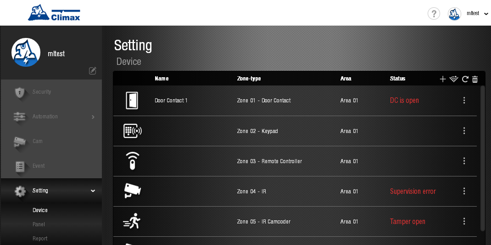

# VESTA 109

.gif>)

**VDP-3**

**Visiophone**

**Manuel de l'Utilisateur**

17 septembre 2020

**Table des matières**

Introduction 2

1.Présentation de l'application 3

1.1. Identification des pièces 3

1.2. L'alimentation 3

1.3. Indicateur LED 4

1.4. Équipement requis 4

1.5. Installation du matériel 5

1.6. Configuration 6

2.Opération 9

2.1. Accès au navigateur Web 9

2.2. Accès aux smartphones 10

2.3. Notification de sonnette 12

2.4. Capture vidéo/image et historique des événements 13

3.Programmation à distance 14

3.1. Paramètres utilisateur de l'application 14

3.2. Informations sur l'utilisateur du compte 15

3.3. Paramètres vidéo 15

3.4. Paramètres VDP 18

### Introduction

Le visiophone VDP-3 est conçu pour remplacer la sonnette conventionnelle en fournissant un accès au streaming vidéo à distance et une communication bidirectionnelle via le réseau Wi-Fi. Le visiophone fonctionne comme une partie du système d'alarme Climax en se connectant à un panneau de commande du système de sécurité Climax. La configuration et l'accès à distance du visiophone s'effectuent via l'application pour smartphone développée par Climax Technology.

### Présentation de l'application

### Identification des pièces

| **Vue de face**                                                    | 
<strong>Vue de face</strong>

<strong>(couvercle retiré)</strong>
 | **Vue arrière** |
| ------------------------------------------------------------------ | ----------------------------------------------------------------------------- | --------------- |
|  |                                                                               |                 |

1.  **Couvercle de protection**
2.  **Objectif de la caméra**
3.  **Bouton de fonction/indicateur LED (bleu/ambre)**
4.  **Objectif IR**
5.  **Vis de fixation du couvercle**
6.  **Trou de montage**
7.  **12~24 V CC ou 16~Entrée d'alimentation 24 V CA**

Veuillez noter que le couple sur la vis doit être inférieur à 24,5 Nm (2,5 kg-m).

1.  **12~24 V CC ou 16~Entrée d'alimentation 24 V CA**

Veuillez noter que le couple sur la vis doit être inférieur à 24,5 Nm (2,5 kg-m).

1.  **Réservé**
2.  **Réservé**

### L'alimentation

Le VDP utilise 12~24V DC or 16~Alimentation 24 V CA comme source d’alimentation. Coupez d’abord l’alimentation secteur. Desserrez les deux vis du 12~24 V CC ou 16~Entrée d'alimentation 24 V CA et conservez les vis pour une utilisation ultérieure. Connectez les fils aux entrées situées à l'arrière du capot arrière.**\***; installez le VDP pour allumer l’appareil.

**\*Note:**Il est recommandé d'utiliser un fil d'un diamètre inférieur à 15 mm pour se connecter à l'entrée d'alimentation. Le couple sur la vis doit être inférieur à 24,5 nm (2,5 kg-m).

### Indicateur LED

Le visiophone dispose de LED bleues et rouges intégrées pour indiquer l'état de l'appareil.

| Couleur des LED                        | Comportement                                               | Indication                                                                                |
| -------------------------------------- | ---------------------------------------------------------- | ----------------------------------------------------------------------------------------- |
| Bleu                                   | Clignote toutes les 3 secondes                             | VDP en mode de configuration Wi-Fi (mode AP)                                              |
| Filage                                 | Bouton VDP enfoncé, en attente de réponse                  |                                                                                           |
| SUR                                    | VDP sous streaming vidéo et communication bidirectionnelle |                                                                                           |
| ambre                                  | ALLUMÉ pendant 3 secondes                                  | Le VDP termine son préchauffage à la mise sous tension et entre en fonctionnement normal. |
| Clignote toutes les 3 secondes         | Problème de connectivité Wi-Fi**\***                       |                                                                                           |
| Flash toutes les secondes              | VDP ne parvient pas à se connecter au serveur              |                                                                                           |
| 3 flash puis allumé pendant 6 secondes | VDP réinitialisé aux paramètres d'usine par défaut         |                                                                                           |

**\*Note:**Il faut environ 1 minute au VDP pour se connecter au Wi-Fi après la mise sous tension. Avant que la connexion Wi-Fi ne soit établie, la LED rouge peut clignoter momentanément.

### Matériel nécessaire

L'équipement suivant est requis pour utiliser VDP :

-   Un routeur prenant en charge le réseau Wi-Fi 2,4 GHz. Le VDP doit être connecté à ce routeur avec accès à Internet et au Home Portal Server.
-   Un smartphone iPhone ou Android

Exigence de version Android : Android**5.1**ou au-dessus.

Exigence de version de l'iPhone : iOS**9**ou au-dessus.

-   Pour utiliser le VDP, un panneau d'alarme du système de sécurité basé sur IP Climax est requis - Le panneau doit être enregistré dans Climax Home Portal Server avec un compte utilisateur valide. Reportez-vous au guide de l'utilisateur du panneau et du Home Portal Server pour terminer le processus de configuration et d'enregistrement du panneau.

### Installation du matériel

**Étape 1.**Avant de commencer, recherchez le disjoncteur ou la boîte à fusibles.

**Étape 2.**Une fois que vous l'avez trouvé, ouvrez la porte et éteignez l'interrupteur principal.

**Étape 3.**Retirez le VDP du paquet. Retirez le couvercle de protection et placez-le

de côté pour une utilisation ultérieure.

**Étape 4.**Retournez le VDP à l’envers et localisez les 4 vis près du bas du VDP.

**Étape 5.**Desserrez les 2 vis du 12~24 V CC ou 16~Entrée d'alimentation 24 V CA et conservez les vis.

pour une utilisation ultérieure.

**Étape 6.**Connectez les fils aux entrées situées à l'arrière du capot arrière, comme indiqué dans

Figure 1. Il est recommandé d'utiliser un fil d'un diamètre inférieur à 15 mm pour

connecter à l’entrée d’alimentation. Veuillez noter que le couple sur la vis doit être inférieur

que 24,5 nm (2,5 kg-m)

**Étape 7.**Localisez les 2 trous de montage sur le VDP, comme indiqué sur la figure 2, et vissez le

VDP dans le mur.

| Figure 1                                                                                                                             | Figure 2 |
| ------------------------------------------------------------------------------------------------------------------------------------ | -------- |
|  |          |

**Étape 8.**Remettez le capot de protection sur le dessus du VDP et serrez la fixation du capot.

vis.

**Étape 9.**Allumez le disjoncteur pour alimenter le VDP.

### Installation

Le visiophone peut être intégré au système de sécurité Climax existant en tant que dispositif accessoire. Pour utiliser le VDP, un panneau d'alarme du système de sécurité basé sur Climax IP est requis.

Afin d'intégrer le visiophone dans le système de sécurité Climax existant, le panneau de commande du système de sécurité doit d'abord être enregistré dans le serveur Climax Home Portal avec un compte utilisateur fonctionnel.

Un smartphone avec**Vesta Home 5 TW / Vesta Home 5 US**ou**Vesta Home 5 UE**L'application installée est requise pour effectuer la configuration. Recherchez l'application sur Google Play ou Apple App Store, tapez**Vesta Home 5 TW/US/UE**sur la barre de recherche en fonction de votre serveur, puis téléchargez l'application. Reportez-vous au guide de l'utilisateur de Climax Home Portal Server pour plus de détails.

.png>)

1.  Ouvrez l'application Vesta Home 5 et entrez votre compte utilisateur existant et le mot de passe du panneau de configuration que vous souhaitez utiliser pour une configuration ultérieure.
2.  Appuyez sur l'icône Caméra dans la barre de navigation et sur l'icône + dans le coin supérieur gauche pour ajouter le VDP à votre système existant. Sélectionnez l'icône VDP et appuyez sur « Suivant ».

 (1).jpeg>).jpeg>)

1.  Allumez la sonnette vidéo en appliquant l’alimentation secteur. L'appareil se réchauffera d'abord pendant environ 30 secondes et sa LED bleue commencera à clignoter.

La LED clignotante indique que la sonnette vidéo ne dispose pas encore d'un paramètre Wi-Fi fonctionnel. Il entrera automatiquement en mode de configuration Wi-Fi (mode AP) à la mise sous tension.

1.  Sélectionnez l'itinéraire pour configurer votre réseau Wi-Fi et suivez les instructions à l'écran. Veuillez noter que si le VDP a déjà été configuré sur un autre réseau Wi-Fi, assurez-vous d'abord de réinitialiser l'appareil avant de l'ajouter à votre système d'alarme existant.

4.1. Manuel : utilisez votre VDP comme point d'accès. Connectez-vous à votre réseau Wi-Fi. Assurez-vous que le Wi-Fi de votre smartphone est activé. Suivez les instructions à l'écran et attendez que votre VDP se connecte à votre réseau Wi-Fi. Après avoir réussi à rejoindre votre réseau Wi-Fi, l'application procède à l'apprentissage du VDP dans le panneau de configuration. Une fois l'apprentissage terminé, reconnectez-vous à l'application et commencez à utiliser votre VDP.

.png>) (1).png>) (1).png>) (1).png>) (1).png>) (1).png>)

 (1).png>)

4.2. Code QR : saisissez vos informations SSID pour générer un code QR que VDP devra scanner. Le QR Code comprend des informations sur le réseau Wi-Fi et le panneau de configuration. Suivez les instructions à l'écran. Appuyez sur « QR Code » pour que votre smartphone l'affiche. VDP émettra un court bip pour indiquer que l'analyse est réussie. Lorsque la LED cesse de clignoter, appuyez sur « Terminé » pour terminer la configuration. Une fois que VDP s'est connecté avec succès à votre réseau Wi-Fi, l'application procédera à l'apprentissage du VDP dans le panneau de configuration. Une fois l'apprentissage terminé, le VDP peut être consulté sur l'application.

 (1).jpeg>) (1).png>) (1).png>)

### Opération

Le visiophone est accessible via un navigateur Web et/ou une application pour smartphone. La fonction de communication vocale bidirectionnelle est uniquement disponible via l'accès au smartphone.

### Accès au navigateur Web

Lors de l'accès au compte Home Portal Server du panneau de configuration à l'aide d'un navigateur Web, VDP se trouve sous la page Caméra et a la même fonction qu'une caméra IP Climax.

_Les fonctions de voix bidirectionnelle et de sonnette ne sont pas activées pour l'accès au navigateur Web. Pour utiliser ces fonctions, une application pour smartphone est nécessaire. S'il te plait regarde**22. Accès aux smartphones**pour le détail._

 (1) (1) (1).png>)

### Accès aux smartphones

Utiliser**Vesta Maison 5**application pour vous connecter au compte du portail d'accueil enregistré par le panneau de configuration. Sélectionnez la page Cam pour afficher la miniature du streaming VDP. Appuyez sur l'image miniature pour l'agrandir en plein écran.

Lorsque vous appuyez sur le bouton de la sonnette vidéo, tous les comptes associés avec la fonction d'appel entrant activée pourront voir la fenêtre contextuelle d'appel entrant et répondre à l'appel.

.jpeg>)

Pour accéder à la configuration des fonctions de l'appareil photo, appuyez sur le bouton.png>)et suivez les instructions ci-dessous.

-   **Nom de l'appareil**

**Ceci vous permet de nommer ou de renommer votre caméra IP pour une identification facile. Saisissez le nom souhaité et appuyez sur Enregistrer.**

-   **Ajustement vidéo**

Ceci vous permet d'ajuster les paramètres vidéo de la caméra IP, tels que la luminosité, la saturation et le contraste. Le réglage vidéo permet désormais l'option de retournement vidéo haut/bas, permettant ainsi aux utilisateurs de retourner la vidéo sans avoir à déplacer physiquement la caméra de sécurité elle-même.

-   **Détection de mouvement**

Ceci vous permet de configurer la région 1 et la région 2, ainsi que les niveaux de sensibilité pour chaque région. Si un mouvement est détecté lorsque le système est armé, une vidéo sera enregistrée. Appuyez sur Enregistrer pour confirmer le paramètre.

-   **Volume du haut-parleur**

Ceci vous permet de régler le volume du haut-parleur. Appuyez sur le curseur pour régler le volume au niveau souhaité.

-   **Reliure de serrure de porte**

Ceci vous permet de sélectionner la serrure de porte que vous souhaitez associer au système. Veuillez noter : le verrouillage de porte disponible sera affiché après son apprentissage dans le panneau de commande. Appuyez sur Soumettre pour terminer. Assurez-vous de vous déconnecter et de vous reconnecter pour que les modifications soient effectives.

-   **Configuration Wi-Fi**

**Pour ajouter un nouvel appareil, appuyez sur l'icône dans le coin supérieur gauche pour configurer le WiFi pour votre caméra IP ou VDP. Avant de continuer, assurez-vous de mettre à jour le micrologiciel de l'appareil vers la dernière version.**

**Pour configurer la fonction WiFi pour un modèle existant, appuyez sur le bouton****et suivez les instructions étape par étape.**

**Pour agrandir en plein écran, appuyez sur le bouton****icône pour différents paramètres de fonction. Le menu de gauche vous permet d'allumer ou d'éteindre votre microphone, d'enregistrer une vidéo ou de prendre un instantané, ou encore de déverrouiller à distance votre serrure électrique liée au système. Appuyez sur l'icône pour revenir à la page principale.**

### Notification de sonnette

La fonction Doorbell Notification permet à VDP d'informer l'utilisateur à distance lorsque le bouton de sonnette est enfoncé. Avec Doorbell Notification, l'utilisateur pourra répondre à la sonnette à distance et converser avec l'invité via VDP en utilisant le smartphone, même lorsqu'il n'est pas chez lui.

Avant d'utiliser la notification par sonnette, les paramètres suivants doivent être effectués :

-   Le VDP doit être correctement configuré comme décrit dans le chapitre précédent.
-   Le compte Control Panel Home Portal Server doit être enregistré et fonctionner correctement.
-   Le paramètre de notification push du compte Control Panel Home Portal Server doit être activé. Pour accéder à la page Divers, connectez-vous à votre application, appuyez sur l'icône dans le coin supérieur droit et appuyez sur Notification.

-   La page Notification permet aux utilisateurs de modifier les paramètres de notification push, d'appel entrant et de notification par e-mail. Le paramètre Push affecte uniquement le rapport de notification push sur ce compte utilisateur spécifique et n'affecte pas les autres comptes liés au même panneau.
-   Vous pouvez également activer ou désactiver la notification par courrier électronique de l'événement VDP avec votre application.

\\<NOTE>

-   Si la notification de sonnette ne répond pas dans la minute qui suit l'appui sur le bouton, le VDP expirera et la LED cessera de tourner.
-   Lorsque vous appuyez sur le bouton, VDP prend un instantané et le télécharge sur le serveur Home Portal.

### Capture vidéo/image et historique des événements

Le VDP prendra une photo ou une vidéo lors des occasions suivantes. Toutes les photos et clips vidéo pris seront téléchargés sur le serveur.

**Vidéo**

**Image**

-   Appuyez sur le bouton de fonction devant VDP pour prendre une photo
-   Appuyez sur l'icône de l'appareil photo dans le menu de gauche de l'application pour prendre un instantané.

Toutes les activités du visiophone, y compris les notifications de sonnette, les photos et les clips vidéo, seront stockées dans le compte utilisateur du Home Portal Server. Appuyez sur l'onglet Médias sous la page Événement pour vérifier l'historique des opérations.

1.  **Programmation à distance**

### Paramètres utilisateur de l'application

La page de configuration du compte est accessible en appuyant sur l'icône dans le coin supérieur droit.

-   **Liste des comptes (disponible pour le compte principal)**

La page de liste des comptes permet la configuration des utilisateurs secondaires. Sous cette page, cliquez sur l'icône pour ajouter un utilisateur secondaire au panneau. Vous pouvez créer un nouveau compte ou créer un lien vers un compte existant.

### Informations sur l'utilisateur du compte

-   **Informations sur l'utilisateur du compte**

Appuyez sur le**Informations sur l'utilisateur du compte**barre pour afficher la page d'informations sur l'utilisateur du compte. Vous pouvez modifier vos informations enregistrées sur cette page.

### Paramètres vidéo

Les options de paramètres vidéo ne sont disponibles que lorsque VDP est inclus dans un système de sécurité. Les options sont accessibles sur la page Caméra de l’interface utilisateur Web de Home Portal Server.

-   Ajustement vidéo

Cliquez sur l'icône pour ajuster les paramètres vidéo. Le réglage vidéo permet désormais l'option de retournement vidéo haut/bas, permettant ainsi aux utilisateurs de retourner la vidéo sans avoir à déplacer physiquement la caméra de sécurité elle-même.

-   Emplacement de l'horodatage

L'emplacement de l'horodatage permet à l'utilisateur de modifier le format de l'horodatage sur la vidéo. Les utilisateurs peuvent ajuster la position de l'horodatage, le format de la date et le format de l'heure.

-   Détection de mouvement

La détection de mouvement permet à l'utilisateur d'ajouter une configuration de détection de mouvement. Les utilisateurs peuvent ensuite configurer la région 1 et la région 2, ainsi que les niveaux de sensibilité pour chaque région. Si un mouvement est détecté lorsque le système est armé, une vidéo sera enregistrée en tant qu'événement vidéo.

-   Enregistrer une vidéo

Cliquez sur l'icône pour enregistrer un clip vidéo. La caméra IP enregistrera un clip vidéo en fonction de ses paramètres internes (veuillez vous référer à**3.4. Paramètre VDP**pour le détail).

### Paramètre VDP

Les propres options de configuration de VDP ne sont disponibles que lorsqu'elles sont incluses dans le système de sécurité et accessibles sur la page Modifier le périphérique de l'interface utilisateur Web de Home Portal Server.

-   **Paramètre**

La page de configuration est utilisée pour définir le numéro de zone VDP, le nom de l'appareil et le paramètre de fuseau horaire. Veuillez vous référer à la page Web de configuration de votre panneau de configuration pour plus de détails sur les options.

-   **Vidéos enregistrées**

La page Vidéo enregistrée stocke les clips vidéo précédemment pris par VDP pour téléchargement. Cliquez sur l'icône du lien de téléchargement pour télécharger le fichier sur votre ordinateur.

-   **Paramètres vidéo**

**Durée de l'enregistrement vidéo**

-   **Temps total:**La durée totale de chaque vidéo enregistrée peut être réglée en option sur 5/10/15 secondes.

**Alarme**

-   **Alerte IR :**Lorsque cette fonction est activée, un événement sera affiché dans la page Événement lorsqu'un mouvement est détecté.

**Déclencheur d'enregistrement**

-   **Alerte IR :**Lorsque cette fonction est activée, une vidéo sera enregistrée lorsqu'un mouvement est détecté.
-   **Bouton VDP enfoncé :**Lorsque cette fonction est activée, une vidéo sera enregistrée lorsque le bouton de fonction est enfoncé.

**Flux vidéo**

-   **Qualité:**Définissez la qualité de la vidéo.
-   **FPS :**Définissez le FPS de la vidéo.

**JPEG animé**

-   **Qualité:**Définissez la qualité de l'image.

**Réseau sans fil**

La page Web du réseau sans fil affiche le paramètre Wi-Fi VDP actuel.

Les paramètres Wi-Fi ne peuvent être modifiés qu'en réinitialisant VDP aux paramètres d'usine et en utilisant l'application Vesta Home 5 pour reprogrammer les paramètres Wi-Fi. Le paramètre Wi-Fi ne peut pas être modifié sur la page Web.
