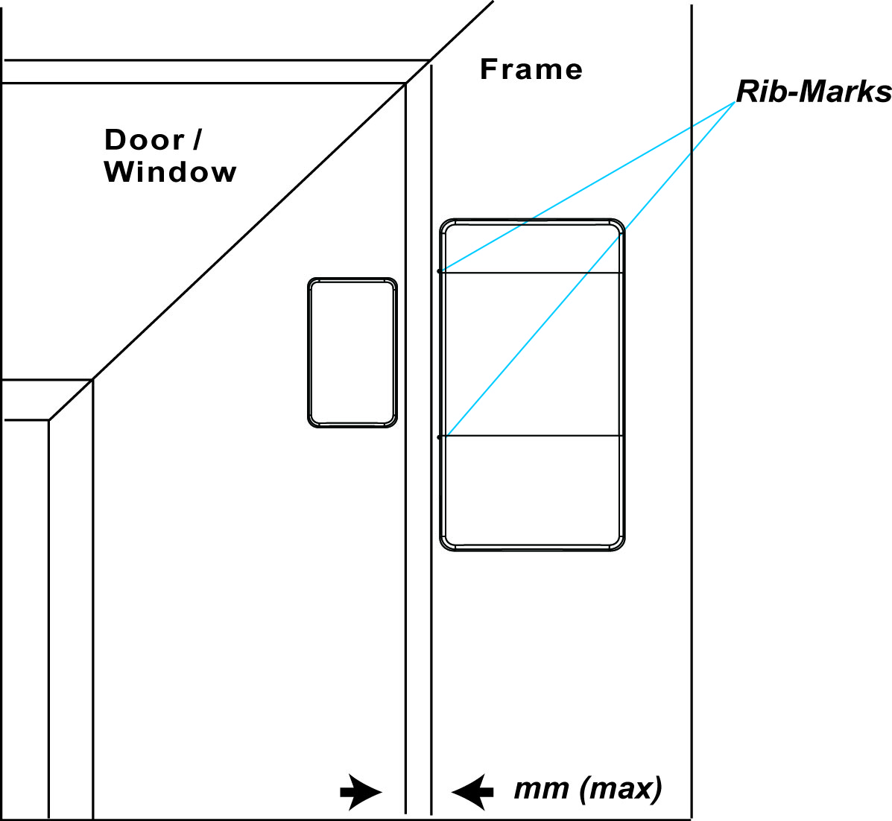

# VESTA 114

.jpeg>)**CLAVIER COMBO FILAIRE/SANS FIL (KP-35-COMBO)**

KP-35-COMBO est un clavier câblé et sans fil conçu pour permettre un contrôle d'accès rapide au panneau de commande du système. Le clavier peut envoyer des signaux filaires et sans fil et recevoir des signaux du panneau de commande à distance du fil, en fonction du calibre du fil et de la consommation électrique totale de tous les appareils filaires. L'écran LCD affichera les informations renvoyées par le panneau de commande du système.

Le clavier filaire/sans fil peut être monté sur une surface plane ou sur un mur avec des vis. Il dispose également d'un interrupteur de protection anti-effraction qui sera activé en cas de tentative non autorisée d'ouverture du capot arrière.

.jpeg>)

* **Identification des pièces**

.jpeg>)

1. **Écran LCD rétroéclairé**
2. **LED verte**
   * La LED verte est éteinte en mode veille.
   * La LED verte s'allumera lorsqu'une touche est enfoncée.
3. **LED jaune**
   * La LED jaune clignote une fois toutes les 3 secondes lorsqu'une situation de défaut est détectée et s'éteint lorsque toutes les conditions de défaut sont restaurées. Le comportement de la LED est contrôlé par le panneau de commande.
4. **Touches numériques rétroéclairées**
5. **Touche étoile rétroéclairée (＊)**
6. **Touche dièse (＃) rétroéclairée**
7. **Touche OK rétroéclairée**
   * Pour confirmer les données saisies ou confirmer la sélection.
8. **Restauration rétroéclairée (**.jpeg>))**Clé**
   * Cette touche est utilisée pour supprimer un chiffre, annuler la sélection, abandonner l'écran actuel et revenir à l'écran précédent, etc.
9. **Bras rétroéclairé/touche **
   * Utilisez cette touche pour déplacer le curseur et faire défiler l'affichage vers le haut.
   * La clé est également utilisée pour accéder au mode « Armé Absent ».
10. **Bras d'accueil/touche  rétroéclairés**
    * Utilisez cette touche pour déplacer le curseur et faire défiler l'affichage vers le bas.
    * La clé est également utilisée pour accéder au mode « Home Armed ».
11. **Avertisseur sonore**
12. **Compartiment à piles**
13. **Terminal de bus**

* Câblage des quatre bornes (V, G, A, B) aux connexions en série. Pour le câblage du clavier, reportez-vous à

Borne BUS sur le panneau de commande. Jusqu'à quatre KP-35-Combos peuvent être\_**Câblage du clavier**\_section sur la page suivante pour plus de détails.

1. **Trou de gestion des câbles**
   * Trou pré-perforé utilisé pour améliorer la flexibilité de la gestion du câblage.
2. **Commutateur de cavalier de résistance de borne**
   * Lorsque le clavier est connecté en tant que périphérique BUS le plus éloigné sur une ligne BUS, veuillez régler le cavalier de résistance terminal du clavier et le commutateur de cavalier du premier périphérique BUS sur ON pour servir de résistances de terminaison. La capacité de communication de la ligne BUS connectée sera améliorée.

.jpeg>) .jpeg>)

**Cavalier**

.jpeg>)

Si le cavalier est activé, la capacité de communication sera améliorée.

**Cavalier**

.jpeg>)

Si le cavalier est désactivé (le lien du cavalier est retiré ou « garé » sur une broche), la capacité de communication est au niveau normal.

1. **Interrupteur anti-sabotage**
2. **Trous de montage x 4**
3. **Vis de fixation inférieure x 1**

1

.jpeg>)**Prudence**

* Le câblage du clavier filaire/sans fil doit être effectué uniquement par des techniciens certifiés possédant les connaissances et la formation appropriées en matière d'équipement électrique.
* Avant l'installation ou tout travail de maintenance, assurez-vous que l'alimentation électrique du panneau de commande a été débranchée.

**Caractéristiques**

* _**Source de courant**_

Lorsque le KP-35-Combo est câblé au panneau de commande, une alimentation de 13,5 V (typique) peut être fournie par le panneau de commande au KP-35-Combo.

.jpeg>)

* _**Détection de batterie et de batterie faible**_
  * Deux piles au lithium AA L91 1,5 V peuvent être installées à l'intérieur du compartiment à piles pour servir de source d'alimentation de secours en cas de panne de courant. Avant d'insérer les piles, assurez-vous de leur placement correct pour protéger votre appareil.
  * Le clavier filaire/sans fil peut également surveiller la durée de vie de la batterie. Lorsque les piles sont faibles, un signal de pile faible sera envoyé avec une transmission régulière du signal au panneau de commande pour alerter les utilisateurs du remplacement des piles.

_\\_

*
  * Utilisez uniquement les piles spécifiées avec l'appareil. Lors du remplacement des piles, remplacez toujours l'ensemble et ne mélangez pas différents types de piles ou des piles neuves et usagées pour éviter d'endommager l'appareil.
* _**Fonction d'économie d'énergie**_
  * Lorsqu'il est inactif, le clavier filaire/sans fil est en**attendre**mode et ne consomme aucune énergie. Il se réveillera lorsqu'une touche sera enfoncée.
  * Après avoir accédé au menu utilisateur, si aucun des deux**Bras**clé/**Bras d'accueil**est enfoncée, le clavier filaire/sans fil reviendra à**attendre**mode dans les 5 secondes. Si l'un ou les deux**Bras**clé/**Bras d'accueil**est/sont enfoncées, le clavier filaire/sans fil reviendra en mode veille dans les**20**secondes.
  * Une fois « Entrer le code PIN » affiché sur l'écran LCD, si aucune touche n'est enfoncée, le clavier filaire/sans fil reviendra à**attendre**mode dans les 5 secondes.
  * Après la soumission de la demande de changement de mode, si aucun signal n'est reçu du panneau de commande, le clavier reviendra à**attendre**mode dans les 15 secondes.
  * À la fin d'une entrée de commande, le clavier filaire/sans fil reviendra à**attendre**mode.
* _**Câblage du clavier**_
  *
    * Pour connecter le KP-35-COMBO au panneau de commande, ouvrez le capot avant à l'aide d'un tournevis cruciforme pour desserrer la vis de fixation du capot.
    * Avant de connecter les bornes « V », « G », « A », « B », retirez les piles du KP-35-COMBO et assurez-vous que l'alimentation électrique du panneau de commande a été débranchée.
    * Desserrez la borne « V » du KP-35-COMBO et la borne « VDD » du panneau de commande. Connectez la borne « V » à la borne « VDD » et serrez les deux vis des bornes.
    * Desserrez la borne « G » du KP-35-COMBO et la borne « GND » du panneau de commande. Connectez la borne « G » à la borne « GND » et serrez les deux vis des bornes.
    * Desserrez la borne « A » du KP-35-COMBO et la borne « 485A » du panneau de commande. Connectez la borne « A » à la borne « 485A » et serrez les deux vis des bornes.
    * Desserrez la borne « B » du KP-35-COMBO et la borne « 485B » du panneau de commande. Connectez la borne « B » à la borne « 485B » et serrez les deux vis des bornes.
    * Allumez le panneau de commande et attendez que « KP-35 COMBO » s'affiche sur l'écran LCD du clavier filaire/sans fil.

.jpeg>)

2

* Le terminal du clavier peut être câblé au panneau de commande. Jusqu'à quatre KP-35-Combos peuvent être connectés en série. La longueur maximale du câble dépend du calibre du fil et de la consommation électrique totale de tous les appareils câblés, par exemple : maximum 3 000 pieds @ câble 22 AWG pour un KP-35-COMBO ; câble maximum de 1 500 pieds à 22 AWG pour 2 KP-35-COMBO ; ou maximum 1000 pieds @ câble 22-AWG pour 3 KP-35-COMBO.
* Dans l'image ci-dessous, KP-35-COMBO-**UN**et KP-35-COMBO-**B**sont câblés correctement en série car la distance totale des câbles entre deux claviers et le panneau de commande est inférieure à 1 500 pieds. Pour le KP-35-COMBO-**C**sur l'image ci-dessous, c'est**PAS**correctement câblé car il se trouve à plus de 1 000 pieds du panneau de commande.
* Pour une communication optimale des appareils de ligne BUS connectés, assurez-vous que les cavaliers de résistance terminale du premier et du dernier appareil BUS sur une ligne BUS sont réglés sur ON pour servir de résistances de terminaison. Assurez-vous d'activer uniquement les 2 cavaliers susmentionnés et de ne pas régler les cavaliers sur ON pour tout autre périphérique BUS intermédiaire.

Par exemple, pour KP-35-COMBO-**B**dans l'image ci-dessous, il s'agit de l'appareil le plus éloigné de la ligne BUS et Hybrid Panel est le premier appareil de la ligne BUS. Assurez-vous de régler le KP-35-COMBO-**B**Le cavalier de résistance de borne du et le cavalier J53 du panneau hybride sur ON pour servir de résistances de terminaison.

.png>)

* _**Autoprotection**_
  * Le clavier filaire/sans fil est protégé contre toute tentative non autorisée d'ouverture du capot arrière à l'aide d'un interrupteur anti-sabotage. Lorsque le capot arrière est ouvert, l'interrupteur anti-sabotage se déclenche et le clavier filaire/sans fil transmet un signal d'ouverture anti-sabotage au panneau de commande du système.
  * Après avoir replacé le capot arrière, le clavier filaire/sans fil transmettra un signal de restauration anti-sabotage au panneau de commande.
  * Lorsque le clavier filaire/sans fil est correctement monté avec le couvercle arrière vissé au mur, retirer le clavier avec force brisera le couvercle arrière de la section creuse autour de l'emplacement de la vis et activera l'interrupteur anti-sabotage.
* _**Signal de surveillance**_
  * En mode filaire, le clavier filaire/sans fil transmettra automatiquement les signaux de supervision au panneau de commande à un intervalle de 20 à 30 secondes.
  * En mode sans fil, le clavier filaire/sans fil transmettra automatiquement les signaux de supervision au panneau de commande à un intervalle de 30 à 50 minutes.
  * Si la centrale n'a pas reçu le signal du clavier filaire/sans fil pendant une période de temps prédéfinie, la centrale considérera le clavier filaire/sans fil hors service et réagira en fonction des paramètres du panneau.

3

* _**Rejoindre le réseau système**_

**Fonctionnement sans fil :**

* Pour ajouter le clavier filaire/sans fil au réseau du système, mettez d'abord la centrale en mode apprentissage.
* Appuyez une fois sur la touche OK. Lorsque « Entrer le code PIN » s'affiche sur l'écran LCD, maintenez enfoncée la touche**D'ACCORD**touche pendant 10 secondes.
* « KP se réinitialisera dans 2 secondes » s'affichera sur l'écran LCD avec un long bip.
* « Scanning Network » s'affichera sur l'écran LCD pendant que le clavier filaire/sans fil envoie le code d'apprentissage au panneau de commande.
* Lorsque le clavier est ajouté au panneau de commande, « Learning Success » s'affichera sur l'écran LCD avec 2 bips.

_\\_

* Si le panneau de commande répond rapidement au clavier filaire/sans fil, le processus de « numérisation du réseau » sera ignoré et « Learning Success » sera directement affiché sur l'écran LCD.
* Si le clavier filaire/sans fil ne reçoit aucun signal du panneau de commande dans les 20 secondes, l'écran LCD s'éteindra et le clavier filaire/sans fil reviendra en mode veille.

**Opération de câblage :**

En plus de l'opération sans fil pour rejoindre le réseau du système comme indiqué ci-dessus, l'utilisateur peut le faire via un câblage.

\*\*Étape 1.\*\*Connectez le clavier au panneau via le câblage.

\*\*Étape 2.\*\*Choisissez une zone localisée et une zone libre pour rejoindre le réseau du système.

**Choisir\*\*\*\*Zone et zones**

**A n dEntrerCodes**

* **Zone 1 Zone 2**
* **Z o n e 1 Z o n e 3**

\*\*Étape 3.\*\*Entrez le code PIN de la zone localisée.

**E n t**

**et r**

**ÉPINGLE**

**C o d e**

\*\*Étape 4.\*\*Entrez le code installateur. (Par défaut : 7982)

**E n t**

**et r**

**je**

**-**

**C o d e**

\*\*Étape 5.\*\*Le clavier est ajouté à la zone localisée et à la zone que vous avez choisies.

**AjoutéeClavierÀ**

**Sont un 1\*\*\*\*Z o n e 1**

* _**Identification**_

Le "**Identifier**La fonction " est utilisée pour localiser un appareil câblé spécifique dans l'ensemble du système câblé. Cette fonction est utile pour distinguer quel appareil est quel appareil, en particulier dans une grande installation où de nombreux appareils câblés sont inclus.

Pour localiser le KP-35-Combo dans le système filaire :

\*\*Étape 1.\*\*Sur la page Web du panneau, cliquez sur « Identifier » sous la liste des appareils après l'entrée dans la colonne des appareils du clavier.

\*\*Étape 2.\*\*Si le KP-35-Combo reçoit le signal du panneau, la page Web affichera un message de réussite et le rétroéclairage blanc du clavier filaire/sans fil clignotera 10 fois pour indiquer à l'utilisateur où il se trouve.

_\\_

*
  *
    * Si un message de délai d'attente s'affiche sur la page Web, cela signifie que le clavier filaire/sans fil n'a pas reçu le signal du panneau.

Veuillez vérifier si le KP-35-Combo est correctement connecté au panneau à une distance de câblage appropriée.

* _**Vérification de l'état de la zone**_
  * Le clavier filaire/sans fil permet à l'utilisateur de vérifier le mode d'état de chaque zone. Lorsque le panneau de commande est en mode veille, appuyez sur la touche OK et l'état actuel de chaque zone s'affichera sur l'écran LCD pendant 3 secondes.

 Il existe trois états différents : A = Armé Absent / H = Armé Domicile / D = Système Désarmé.

* Un point d'interrogation "?" sera affiché si l’état de la zone ne peut pas être identifié.
* Exemple:

4

|   | **1**  | **\|** | **2** | **\|** | **3** | **\|** | **4** | **\|** | **5** | **\|** | **6** | **\|** | **7** | **\|** | **8** |
| - | ------ | ------ | ----- | ------ | ----- | ------ | ----- | ------ | ----- | ------ | ----- | ------ | ----- | ------ | ----- |
|   | **UN** | **\|** | **H** | **\|** | **D** | **\|** | **?** | **\|** | **D** | **\|** | **H** | **\|** | **?** | **\|** | **?** |

* _**Changement de mode système**_

Les utilisateurs peuvent utiliser le clavier pour changer le mode système via un code PIN.

* **Pour changer le mode système avec un code PIN :**

Après avoir saisi le code PIN, appuyez sur la touche**Armer/Accueil Armer/OK**clé pour entrer**Armé Absent/Armé Domicile/Système Désarmé**mode.

*
  * Lorsque le mode système passe en mode désarmé, l'écran LCD affichera « Mémoire d'alarme du numéro de zone » et la LED jaune clignotera une fois toutes les 3 secondes avec 5 bips si une ou plusieurs alarmes ont été déclenchées auparavant. Les utilisateurs peuvent accéder manuellement au menu utilisateur pour afficher la mémoire d'alarme (veuillez vous référer à la section Menu utilisateur ci-dessous pour plus de détails).
  * **Fonction de bras rapide :Les utilisateurs peuvent accéder au menu de configuration pour activer la fonction d'armement rapide (choisissezParamètres > Armement rapide > Activer**, puis appuyez sur OK), ce qui permettra aux utilisateurs de changer de mode en appuyant sur la touche Armer ou sur la touche Armer Accueil sans saisir le code PIN. Pour désarmer le système, les utilisateurs doivent toujours saisir le code PIN.
  * Après avoir accédé au menu utilisateur avec le système désarmé, les utilisateurs peuvent également sélectionner**Bras extérieur**ou**Bras d'accueil**, puis appuyez sur OK pour modifier le mode système.
* _**Menu utilisateur**_
  * Le clavier communiquera avec le système pour récupérer des informations avant d'accéder au menu utilisateur. Les options suivantes seront affichées sur l'écran LCD pour la sélection. Utiliser****et****pour sélectionner et appuyez sur les touches**D'ACCORD**touche pour confirmer votre sélection.
  * Pour accéder au menu utilisateur, appuyez et maintenez «**＊**" pendant 2 secondes en mode veille du clavier lorsque le système de la zone où se trouve le KP-35-Combo est déjà en**Mode désarmé**.
  * Le clavier quittera automatiquement le menu utilisateur après 20 secondes d'inactivité.

|   | **UN** | **Dans**  | **un**   | **et**    |        | **UN** | **r**  | **m**     |       |       |       |        |        |   |   |
| - | ------ | --------- | -------- | --------- | ------ | ------ | ------ | --------- | ----- | ----- | ----- | ------ | ------ | - | - |
|   | **H**  | **Ô**     | **m**    | **C'est** |        | **UN** | **r**  | **m**     |       |       |       |        |        |   |   |
|   | **UN** | **l**     | **un**   | **r**     | **m**  |        | **M.** | **C'est** | **m** | **Ô** | **r** | **et** |        |   |   |
|   | **F**  | **un**    | **dans** | **l**     | **t**  |        | **D**  | **je**    | **s** | **p** | **l** | **un** | **et** |   |   |
|   | **L**  | **Ô**     | **g**    |           |        |        |        |           |       |       |       |        |        |   |   |
|   | **B**  | **et**    | **p**    | **un**    | **s**  | **s**  |        |           |       |       |       |        |        |   |   |
|   | **S**  | **C'est** | **t**    | **t**     | **je** | **n**  | **g**  |           |       |       |       |        |        |   |   |

* \*\*Bras extérieur :\*\*Sélectionnez « Armé en absence » et appuyez sur la touche OK pour changer le mode du système en « Armé en absence ».
* \*\*Bras domestique :\*\*Sélectionnez « Home Arm » et appuyez sur la touche OK pour changer le mode système en « Home Armed ».
* **Mémoire d'alarme :Cette option deviendra disponible après le déclenchement d’une alarme. L’entrée dans le menu utilisateur sera automatiquement dirigée vers l’option Mémoire d’alarme. PresseD'ACCORD**pour confirmer la sélection, puis utilisez****et****touches pour visualiser la mémoire des alarmes.
* \*\*Affichage des défauts :\*\*Cette option deviendra disponible lorsqu'un événement de panne existe dans le système. Pour afficher les événements de défaut, sélectionnez « Affichage des défauts » et appuyez sur OK pour confirmer la sélection. Utilisez les touches  et  pour afficher les événements de défaut et appuyez sur la touche pour revenir au menu utilisateur.

_\\_

* La LED jaune clignote une fois toutes les 3 secondes lorsqu'une situation de défaut est détectée et s'éteint lorsque toutes les situations de défaut sont effacées.
* Si vous essayez d'armer le système lorsqu'un événement de défaut existe, l'armement sera interdit et l'écran LCD passera à l'affichage des défauts. Si vous souhaitez armer le système de force, effectuez à nouveau l'action d'armement dans les 30 secondes. Le système ignorera l'événement de panne et entrera dans le mode d'armement sélectionné.
  * **Enregistrer**: Sélectionnez « Journal » et appuyez sur OK pour afficher le journal système. Utilisez les touches  et  pour visualiser les événements et appuyez sur la touche pour revenir au menu utilisateur.
  * **Contourne:Cette fonction est uniquement disponible en connexion filaire. «Entrez le code M.» s'affichera sur l'écran LCD (le code M. par défaut est1111**). Le panneau ignorera tous les signaux reçus du périphérique contourné et ne répondra pas du tout lorsque ce périphérique est déclenché.
  * \*\*Paramètre:\*\*Pour une connexion sans fil, après être entré dans le menu Unser, saisissez le code M. par défaut «**1111**» pour accéder au menu de réglage. Pour une connexion filaire, saisissez le code I. par défaut «**7982**» pour accéder au menu de réglage. Utilisez les touches  et  pour sélectionner les options de réglage et appuyez sur la touche pour revenir au menu utilisateur.

|   | **B**  | **C'est** | **C'est** | **p**     |          | **C**     | **Ô**  | **n**     | **t**  | **r** | **Ô**  | **l** |       |           |   |
| - | ------ | --------- | --------- | --------- | -------- | --------- | ------ | --------- | ------ | ----- | ------ | ----- | ----- | --------- | - |
|   | **P.** | **un**    | **n**     | **je**    | **c**    |           | **UN** | **l**     | **un** | **r** | **m**  |       |       |           |   |
|   | **F**  | **je**    | **r**     | **C'est** |          | **UN**    | **l**  | **un**    | **r**  | **m** |        |       |       |           |   |
|   | **M.** | **C'est** | **d**     | **je**    | **c**    | **un**    | **l**  |           | **UN** | **l** | **un** | **r** | **m** |           |   |
|   | **Q**  | **dans**  | **je**    | **c**     | **k**    |           | **UN** | **r**     | **m**  |       |        |       |       |           |   |
|   | **L**  | **un**    | **n**     | **g**     | **dans** | **un**    | **g**  | **C'est** |        |       |        |       |       |           |   |
|   | **C**  | **h**     | **un**    | **n**     | **g**    | **C'est** |        | **M.**    | **.**  |       | **C**  | **Ô** | **d** | **C'est** |   |

* \*\*Langue:\*\*Sélectionnez « Langue » et appuyez sur OK pour accéder au menu de langue. Utilisez les touches  et  pour sélectionner la langue d'affichage et appuyez sur la touche pour revenir au menu utilisateur.

**Anglais**

**E s p a ñ o l**

5

|   | **P.** | **Ô**     | **r**    | **t**     | **dans** | **g**  | **dans** | **hein**  | **s** |       |   |   |   |   |   |
| - | ------ | --------- | -------- | --------- | -------- | ------ | -------- | --------- | ----- | ----- | - | - | - | - | - |
|   | **F**  | **r**     | **un**   | **n**     | **Quoi** | **un** | **je**   | **s**     |       |       |   |   |   |   |   |
|   | **D**  | **C'est** | **dans** | **t**     | **s**    | **c**  | **h**    | **C'est** |       |       |   |   |   |   |   |
|   | **L**  | **t**     | **un**   | **l**     | **je**   | **un** | **n**    | **Ô**     |       |       |   |   |   |   |   |
|   | **N**  | **C'est** | **d**    | **C'est** | **r**    | **l**  | **un**   | **n**     | **d** | **s** |   |   |   |   |   |

*
  * \*\*Changer le code M. :\*\*Cette fonction est uniquement disponible sous connexion sans fil. Le code M. par défaut est 1111. Les utilisateurs peuvent le modifier manuellement, et ce n'est que lorsque le code M. correct est saisi que l'utilisateur peut accéder au menu de configuration.
* _**Résultat du changement de mode**_
  *
    * \*\*Armé absent :\*\*Lorsque le système passe en mode « Armé en absence », « N° de zone armée en absence » s'affichera sur l'écran LCD avec un long bip indiquant le fonctionnement réussi.
    * \*\*Armé à domicile :\*\*Lorsque le système passe en mode « Armé à domicile », « N° de zone armé à domicile » s'affichera sur l'écran LCD avec 3 bips indiquant un fonctionnement réussi.
    * \*\*Système désarmé :\*\*Lorsque le système passe en mode « Système désarmé », « N° de zone Système désarmé » s'affichera sur l'écran LCD avec 2 bips indiquant un fonctionnement réussi.
    * \*\*Délai de sortie/entrée :\*\*Lorsque le temporisateur d'entrée/sortie est activé dans le panneau de commande et que la fonction bip d'entrée/sortie est activée sur le clavier filaire/sans fil, le clavier filaire/sans fil compte à rebours avec le système lorsque le temporisateur d'entrée/sortie commence. "Décompte de la zone numéro." s'affichera sur l'écran LCD pendant 10 secondes. La LED verte s'allumera également pendant 10 secondes avec 1 bip toutes les secondes. Après 10 secondes, l'écran LCD et la LED verte s'éteindront, mais les bips d'avertissement continueront avec le compte à rebours du système.
    * **Erreur d'opération :**« Erreur de fonctionnement » s'affichera sur l'écran LCD avec 2 bips indiquant un fonctionnement infructueux ; par exemple, lorsque vous soumettez la demande de changement de mode depuis**Bras extérieur**à**Bras d'accueil**mode.
    * **Affichage des défauts**: Lorsque le système s'arme avec un défaut, « Affichage du défaut » s'affichera sur l'écran LCD avec 3 bips indiquant un défaut d'armement.
    * \*\*Code PIN incorrect :\*\*Lorsqu'un mot de passe incorrect est soumis, « Code PIN incorrect » s'affichera sur l'écran LCD avec 4 bips indiquant un mauvais mot de passe saisi.

_\\_

*
  * Une fois la demande de changement de mode soumise, si aucun signal n'est reçu de la centrale, le clavier reviendra en mode veille dans les 15 secondes.
  * S'il y a 5 tentatives de code PIN incorrectes dans les 10 minutes, le clavier filaire/sans fil sera automatiquement verrouillé pendant 5 minutes. Durant cette période, toute opération sera invalide. Lorsque le temps de verrouillage expire, le clavier filaire/sans fil émettra. 1 bip long.
* _**Fonctions d'alarme à double touche**_
  *
    * La fonction double touche est désactivée par défaut. Pour l'activer, entrez dans le menu de configuration du clavier filaire/sans fil pour définir les déclencheurs d'alarme (choisissez**Paramètres > Alarme de panique/Alarme incendie/Alarme médicale > Activer**, puis appuyez sur OK).
    * Alarme de panique : appuyez sur « 1 + 3 » pour déclencher une alarme de panique.
    * Alarme incendie : appuyez sur « 4 + 6 » pour déclencher une alarme incendie.
    * Medical Alarm: Press “7 + 9” to trigger a Medical Alarm.
    * Lorsqu'une alarme se déclenche, « Alarme ! Alarme!" sera affiché sur l'écran LCD et la LED verte s'allumera pendant

10 secondes.

* _**Contrôle du bip :**_

Cette fonction vous permet de définir les fonctions du bip d'avertissement du clavier.

*
  * **Bip d'entrée/sortie :La fonction est désactivée par défaut. Pour l'activer, veuillez choisirParamètres > Contrôle du bip > Bip d'entrée/sortie > Activer**dans le menu utilisateur, puis appuyez sur OK pour confirmer le paramètre. La durée du bip d’entrée/sortie est de 4 minutes maximum.
  * **Bip d'alarme :La fonction est désactivée par défaut. Pour l'activer, veuillez choisirParamètres > Contrôle du bip > Bip d'alarme > Activer**dans le menu utilisateur, puis appuyez sur OK pour confirmer le paramètre. La durée du bip d’alarme dure au maximum 15 minutes.
* _**Conditions de panne**_

_Lorsque le clavier filaire/sans fil est sous**MODE DE FONCTIONNEMENT NORMAL,**_

*
  *
    * Si le panneau de commande est en mode Armé Absent, vous NE POUVEZ PAS activer le Mode Armé Domicile à l'aide du clavier filaire/sans fil. Si vous le faites, le clavier filaire/sans fil émettra 2 bips indiquant que le panneau de commande est en mode armé absent.
    * Lorsqu'une situation de défaut est détectée, la LED jaune clignote une fois toutes les 3 secondes. Le comportement de la LED jaune est décidé par le panneau de commande.
    * S'il y a 5 tentatives de code PIN incorrectes dans les 10 minutes, le clavier filaire/sans fil sera automatiquement verrouillé pendant 5 minutes. Durant cette période, toute opération sera invalide. Lorsque le temps de verrouillage expire, le clavier filaire/sans fil émettra 1 bip long.
* _**Changement de piles**_
  1. Accédez au menu de programmation du panneau de commande pour contourner l’alarme anti-sabotage du KP.
  2. Démontez le clavier filaire/sans fil.
  3. Retirez les deux piles usagées et appuyez sur l'interrupteur anti-sabotage pendant plus de 3 secondes pour les décharger complètement avant d'insérer de nouvelles piles. Ne mélangez pas des piles neuves et usagées.
  4. Retirez la batterie usagée et appuyez sur l'interrupteur anti-sabotage pour la décharger avant de mettre de nouvelles piles.
  5. Revissez le clavier filaire/sans fil à la surface de montage à l'aide des vis de montage.

6

*
  1. Remettez le panneau de commande en mode de fonctionnement normal.
* _**Réinitialiser le clavier filaire/sans fil aux paramètres d'usine par défaut**_

Le clavier filaire/sans fil peut être réinitialisé pour effacer toutes les données apprises et rétablir tous les paramètres aux valeurs par défaut en suivant les étapes ci-dessous :

1. Veuillez suivre\_**Changement de batterie**\_étapes pour les paramètres d'usine par défaut.
2. Dans les 10 secondes suivant l'insertion des piles, entrez « 0000 ». Lorsque le dernier chiffre de « 0000 » se transforme en «  » sur l'écran LCD, appuyez sur « # » pour réinitialiser le clavier filaire/sans fil aux valeurs par défaut.
3. « Réinitialiser les paramètres par défaut » s'affichera sur l'écran LCD avec 3 bips indiquant une opération réussie.
4. Toutes les données apprises seront effacées.
5. Les bips d’entrée/sortie seront désactivés.
6. Le bip d’alarme sera désactivé.
7. La fonction d’alarme Dual Key sera désactivée.

_\\_

*
  * Le réglage d'usine par défaut ne peut être effectué que dans les 10 secondes suivant l'insertion des piles. Si le clavier ne se réveille pas dans les 10 secondes après l'insertion des piles, retirez les piles et réessayez.
  * Chaque fois que le clavier est retiré du panneau de commande, il doit également être mis aux paramètres d'usine par défaut pour effacer la mémoire de son panneau de commande.
* _**Montage du clavier filaire/sans fil**_

Pour monter le clavier filaire/sans fil :

1. Retirez le capot avant en desserrant la vis de fixation du capot à l'aide d'un tournevis.
2. Utilisez les 4 trous de montage sur le capot arrière comme modèle pour marquer et percer les trous de montage.
3. Percez 4 trous et insérez les chevilles. Assurez-vous que les chevilles murales affleurent la surface de montage.
4. Vissez le couvercle arrière sur les chevilles murales.
5. Remettez le capot avant sur le capot arrière. Vissez la vis de fixation du couvercle.
6. L'installation est maintenant terminée.

7
