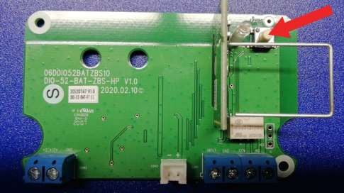
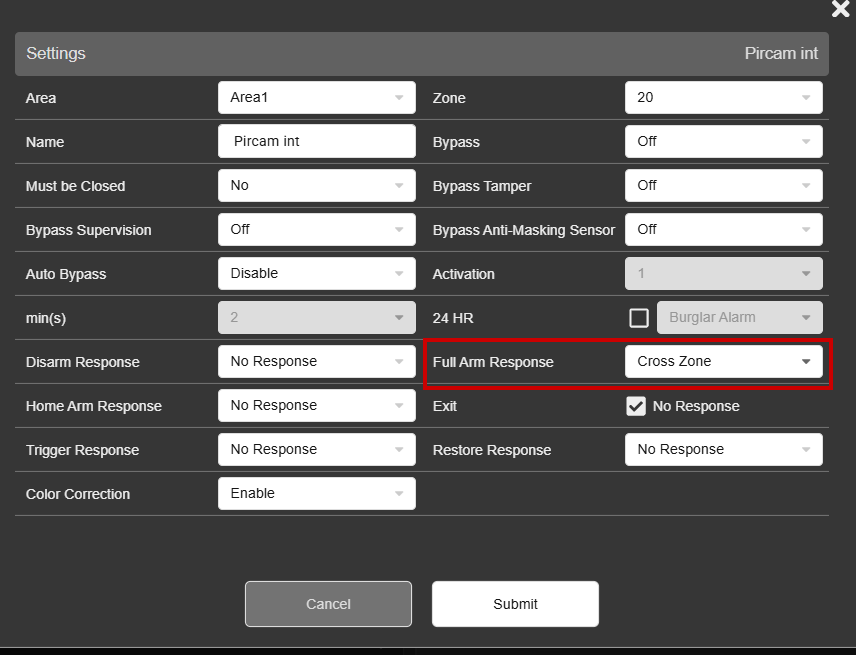

# VESTA-156

Manuel de configuration VESTA-156

<figure><figcaption></figcaption></figure>

### PREREQUIS:

#### Connectez la batterie au module Entrée/Sortie:

.jpeg>)


NOTE:

### Câblez la cartouche au bornier "SMOKE" uniquement APRES avoir réalisé les tests de fonctionnement.


### _<mark style="background-color:yellow;">Enregistrer le module dans la centrale</mark>_

1. Mettre la centrale en mode apprentissage (pour plus d'information, veuillez consulter le manuel de la centrale).

.png>)

.png>)

2. Appuyez sur le bouton du module installé dans le VESTA-156.

<figure><figcaption></figcaption></figure>

3. Sélectionner le périphérique détecté et cliquez sur OK.

.png>)

4. Configurez la partition appropriée à la sortie du périphérique (DO) et choisissez le numéro de zone et un nom pour le périphérique (ici : SMOKE ACTIVATION).

.png>)


Note: Le mode de fonctionnement du module DOIT ETRE configuré sur "Separate devices".


5. Configurez l'entrée du module (DI) de la même manière que la sortie  et nommez le périphérique (ici : SMOKE TAMPER).

.png>)

6. Configurez l'entrée du module en mode 24H instantané

### _<mark style="background-color:yellow;">Configuration de la règle d'activation</mark>_

Dans le menu "Règles", créez une nouvelle règle comme ci-dessous:

.png>)

### _<mark style="background-color:yellow;">Configuration de la double vérification</mark>_

Veuillez configurer au minimum 2 périphériques avec l'attribut "Zone Croisé" selon le mode de fonctionnement de la centrale (Total/Partiel/Arrêt) pour que le générateur de brouillard ne déclenche que si les 2 périphériques déclenchent dans un délai imparti et ainsi éviter toute activation inappropriée.

Exemple de configuration de l'attribut "Zone Croisé":

Dans le menu "Sécurité" de la centrale, veuillez configurer la temporisation de zone à 1 minutes ou plus (temporisation durant laquelle les 2 périphériques devront être déclenchés pour activer le statut d'alarm "vérifié", qui activera le générateur).
