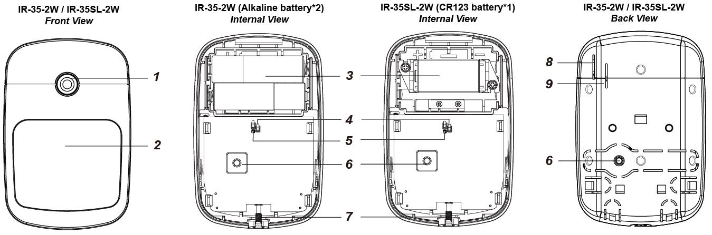
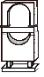
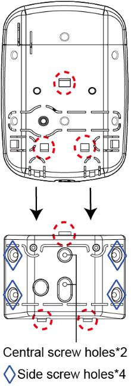

# VESTA 177

**Capteur de mouvement PIR série IR-35-2W / VESTA-177**

**Introduction**

Le PIR détecte la signature infrarouge pour capter les mouvements dans une zone assignée et signale au panneau de commande d'activer l'alarme si un intrus croise son chemin de détection.

Le PIR est conçu pour offrir une portée de détection typique de 12 mètres lorsqu'il est monté à 2,5 mètres au-dessus du sol. Le capteur PIR prend également en charge la fonction d'immunité aux animaux et ne détectera pas les animaux pesant jusqu'à 25 kg afin de minimiser les fausses alarmes.

Le PIR se compose d’une conception en deux parties composée d’un couvercle et d’une base. Le couvercle contient toute l'électronique et l'optique et la base fournit un moyen de fixation.

**Le capteur PIR série IR-35-2W comprend les modèles suivants :**

**IR-35-2W**– Capteur de mouvement PIR alimenté par deux piles alcalines

**Arakhsalu**– Capteur de mouvement PIR alimenté par une pile CR123

**Identification des pièces**

1. **Bouton de test/indicateur LED**
   * Le bouton de test est utilisé pour tester les performances de la radio et à des fins d'apprentissage.
   * L'indicateur LED est utilisé pour indiquer l'état du système.
2. **Capteur IR**

**3. Compartiment à piles**

**4. Commutateur d'activation/désactivation de l'immunité aux animaux (JP3)**

**Cavalier**

**Cavalier**

.png>)

* Lorsqu'elle est définie sur ON, l'immunité aux animaux est désactivée (valeur par défaut).
* Lorsqu'elle est réglée sur OFF, l'immunité aux animaux est activée.

1. **Commutateur de cavalier d'augmentation de sensibilité (JP4)**
   *
     * Lorsqu’il est réglé sur ON, la sensibilité de détection du PIR est élevée.
     * Lorsqu'elle est réglée sur OFF, la sensibilité de détection du PIR est au niveau normal. (Défaut de fabrication)
2. **Interrupteur anti-sabotage**
3. **Vis de fixation inférieure**
   1. **Trou d'isolant de batterie IR-35-2W**

**9. Trou d'isolant de batterie IR-35SL-2W**

**Caractéristiques**

* _**Indicateur LED**_

En mode de fonctionnement normal, le voyant LED s'allume dans les situations suivantes :

*
  * Lorsqu'un mouvement est détecté dans des conditions de batterie faible
  * Lorsque le couvercle est ouvert et que l'interrupteur anti-sabotage est déclenché
  * Lorsqu'un mouvement est détecté si la condition de sabotage persiste
  * Lorsqu'un mouvement est détecté en mode Test
  * Lorsque le bouton de test est enfoncé dans des conditions d'autoprotection ou si le PIR est sous batterie faible, la LED ne clignotera pas si l'autoprotection PIR et la batterie sont normales et que le PIR n'est pas en mode test.

Si la LED clignote pour indiquer la transmission du signal, elle clignotera deux fois rapidement après réception de l'accusé de réception du panneau de commande.

* _**Détection de batterie et de batterie faible**_

Le capteur de mouvement PIR série IR-35-2W utilise des piles alcalines ou au lithium comme source d'alimentation :

* Le modèle IR-35-2W utilise deux piles alcalines AA 1,5 V comme source d'alimentation.
* Le modèle IR-35SL-2W utilise une pile au lithium CR123 3V comme source d'alimentation.

Le PIR dispose d'une fonction de détection de batterie faible. Si une faible tension de batterie est détectée, un signal de batterie faible sera envoyé au panneau de commande avec les transmissions de signal régulières pour que le panneau de commande affiche l'état en conséquence.

Pour chaque installation, les batteries sont installées en usine avant expédition avec un isolant inséré.

* Lors du changement des piles, après avoir retiré les anciennes piles, appuyez deux fois sur l'interrupteur anti-sabotage pour les décharger complètement avant d'insérer de nouvelles piles.
* _**Autoprotection**_

Le PIR est protégé par un interrupteur anti-sabotage qui est compressé lorsque le PIR est correctement installé. Lorsque le PIR est retiré de la surface montée ou du support de montage, ou lorsque son couvercle est ouvert, l'interrupteur anti-sabotage sera activé et le PIR enverra un signal d'auto-surveillance au panneau de commande du système pour rappeler à l'utilisateur la condition. Si un mouvement est détecté lorsque l’interrupteur anti-sabotage est ouvert, la LED s’allumera.

* _**Fonction de surveillance**_

Lorsque le PIR est en mode de fonctionnement normal, il effectue périodiquement un auto-test en transmettant un signal de supervision toutes les 90 à 110 minutes.

Si la centrale ne parvient pas à recevoir les signaux de supervision transmis par un certain PIR pendant une durée prédéfinie, un message «**Hors service**r” sera généré.

* _**Mode d'essai**_

Le PIR peut être mis en mode test en appuyant sur le bouton Test. En mode test, il désactivera la minuterie de mise en veille et permettra à l'indicateur LED de s'allumer à chaque fois qu'un mouvement est détecté. Chaque fois que vous appuyez sur le bouton de test, le PIR transmettra un signal de test au panneau de commande pour un test de portée radio et entrera en mode test pendant 3 minutes. Le mode test expirera après 3 minutes.

* _**Minuterie de mise en veille**_
  * Le PIR a un «**Temps de sommeil**" d'environ**1 minute**pour économiser l'énergie.
  * En fonction du paramètre Mode veille (Normal ou Optimisé), le PIR entrera**Temps de sommeil**pour**1 minute**après avoir transmis un mouvement détecté ou 3 mouvements détectés en 1 minute.
  * Pendant le**1 minute de sommeil**, le PIR ne retransmettra aucun signal ; tout mouvement supplémentaire détecté pendant cette période de sommeil prolongera la durée du sommeil d'une minute supplémentaire. De cette façon, un mouvement continu devant le PIR n’épuisera pas indûment la batterie.
* Le paramètre du mode veille est configurable à distance. Lorsque le mode veille est réglé sur Normal, le PIR entre en veille pendant 1 minute après la transmission d'un mouvement détecté. Lorsque le mode veille est réglé sur Optimisé, le PIR entrera en veille pendant 1 minute après avoir transmis 3 mouvements détectés en 1 minute. Prière de se référer à\_**Réglage à distance**\_section ci-dessous pour plus de détails.
* _**Fonction d'immunité aux animaux de compagnie**_
  * Le capteur PIR prend en charge la fonction d'immunité aux animaux et ne détectera pas les animaux pesant jusqu'à 25 kg afin de minimiser les fausses alarmes.
  * La fonction d'immunité aux animaux peut être activée/désactivée en réglant la position du cavalier (JP3). Lorsque le cavalier (JP3) est réglé sur ON, l'immunité aux animaux est désactivée (par défaut d'usine). Lorsque le cavalier (JP3) est réglé sur OFF, l'immunité aux animaux est activée.
  * La fonction Pet Immunity peut également être configurée à distance. Prière de se référer à\_**Réglage à distance**\_section ci-dessous pour plus de détails.
* _**Fonction d'augmentation de la sensibilité**_
  * Vous pouvez utiliser la fonction d’augmentation de sensibilité pour augmenter la sensibilité de détection du PIR.
  * Pour augmenter la sensibilité de détection, réglez le cavalier (JP4) sur ON. Pour maintenir une sensibilité de détection normale, réglez le cavalier (JP4) sur OFF (valeur par défaut).
  * La sensibilité de détection du PIR peut également être configurée à distance. Prière de se référer à\_**Réglage à distance**\_section ci-dessous pour plus de détails.
* _**Réglage à distance**_
  * Le capteur de mouvement PIR prend en charge le réglage à distance de l'immunité, de la sensibilité et du mode veille des animaux.
  * Lorsque le PIR est allumé, sa fonction d'immunité aux animaux et sa sensibilité sont déterminées par les paramètres JP3 et JP4. Les utilisateurs peuvent soit ajuster les paramètres des cavaliers, soit modifier à distance les paramètres d'immunité et de sensibilité aux animaux à partir du panneau de commande. Le réglage à distance écrasera les paramètres du cavalier.

**Page Web du panneau de configuration**

1. Sur la page Web locale du panneau, accédez à la page Modifier le périphérique et saisissez la configuration du capteur de mouvement PIR dans la section Paramètres du capteur. Cliquez sur OK pour confirmer.

Please refer to the table below for configuration details. For example, if you want to enable Pet Immunity and set Sensitivity level and sleep mode to normal, you can input 02.

| **Configuration IR** | **Immunité aux animaux** | **Sensibilité** | **Mode veille**         |
| -------------------- | ------------------------ | --------------- | ----------------------- |
| 00                   | Non                      | Normale         | Normal (1 détection)    |
| 01                   | Non                      | Haut            | Normal (1 détection)    |
| 02                   | Oui                      | Normale         | Normal (1 détection)    |
| 03                   | Oui                      | Haut            | Normal (1 détection)    |
| 04                   | Non                      | Normale         | Optimisé (3 détections) |
| 05                   | Non                      | Haut            | Optimisé (3 détections) |
| 06                   | Oui                      | Normale         | Optimisé (3 détections) |
| 07                   | Oui                      | Haut            | Optimisé (3 détections) |

1. Appuyez une fois sur le bouton Test du capteur de mouvement PIR pour envoyer un signal au panneau de commande et les nouveaux paramètres seront appliqués immédiatement. Si le bouton n'est pas enfoncé, les nouveaux paramètres seront appliqués lors de la prochaine transmission du signal, c'est-à-dire la transmission du signal de supervision ou du signal de déclenchement IR.

**Serveur de portail domestique**

1. Sur Home Portal Server, accédez à la page des paramètres du périphérique, cliquez sur la ligne du périphérique IR-35-2W et sélectionnez « Configuration IR ».
2. Sélectionnez la fonction Immunité aux animaux (Activer/Désactiver), la fonction Sensibilité (Élevée/Normale) et le Mode veille optimisé (Normal/Optimisé) dans les listes déroulantes, cliquez sur « Soumettre » pour confirmer le paramètre.
3. Appuyez une fois sur le bouton Test du capteur de mouvement PIR pour envoyer un signal au panneau de commande et les nouveaux paramètres seront appliqués immédiatement. Si le bouton n'est pas enfoncé, les nouveaux paramètres seront appliqués lors de la prochaine transmission du signal, c'est-à-dire la transmission du signal de supervision ou du signal de déclenchement IR.

* _**Commencer**_
  * Retirez l'isolant de la batterie pour activer les batteries.
  * L'indicateur LED clignote pendant 30 secondes (le PIR se réchauffe). Pendant la période de préchauffage, le PIR ne sera pas activé. Une fois la période de préchauffage terminée, la LED s'éteindra et le PIR sera prêt à fonctionner.
  * Mettez le panneau de commande en mode apprentissage (reportez-vous au manuel du panneau de commande pour plus de détails).
  * Appuyez sur le bouton Test.
  * Reportez-vous au manuel du panneau de commande pour terminer le processus d'apprentissage.
  * Une fois le PIR appris, placez le panneau de commande sur «**Test de marche**mode » ; maintenez le PIR à l'emplacement souhaité et appuyez sur le bouton Test pour confirmer que cet emplacement se trouve dans la plage de signal du panneau de commande (reportez-vous au manuel du panneau de commande pour terminer le test de marche).
  * Lorsque vous êtes convaincu que le PIR fonctionne bien à l'emplacement choisi, vous pouvez procéder au montage.

**Installation**

_**Directive d'installation**_

.png>)

**Plage de détection IR-35-2W**

3

* _**Méthode de montage**_
* Le PIR est conçu pour être monté soit sur une surface plane, soit dans un coin.
* La base comporte deux découpes, où le plastique est plus fin et peut être cassé pour un montage en surface.
* Un support de montage comprend deux trous de vis centraux pour fixer le PIR sur une surface et quatre trous de vis latéraux

* Pour le montage en surface, un support rotatif en option est fourni pour permettre aux utilisateurs d'ajuster la plage de détection. Grâce au support rotatif, l'IR-35-2W peut être pivoté de 80 degrés horizontalement et de 70 degrés verticalement pour offrir une couverture optimale.
  * **Montage en surface sans support de montage :**
    1. Retirez la vis de fixation inférieure et l’ensemble couvercle.
    2. Percez les deux entrées défonçables depuis l'intérieur de la base
    3. Utilisez les trous comme gabarit et percez des trous dans la surface à monter.
    4. Insérez les chevilles murales si le PIR doit être fixé sur du plâtre ou des briques.
    5. Vissez la base sur les chevilles.
    6. Vissez le couvercle sur la base.
* **Montage en surface avec le support de montage :**
  1. Utilisez les deux trous de vis centraux du support comme gabarit et percez des trous dans la surface à monter.
  2. Insérez les chevilles murales si le PIR doit être fixé sur du plâtre ou des briques.
  3. Vissez le support de montage sur les chevilles murales avec les deux bâtons de pointage vers le haut et face à vous.
  4. Installez le PIR sur les crochets du support de montage.
* **Montage en surface avec le support rotatif (article en option, vendu séparément) :**
  * Pour le montage en surface, un support rotatif en option est fourni pour permettre aux utilisateurs d'ajuster la plage de détection. Grâce au support rotatif, l'IR-35-2W peut être pivoté de 80 degrés horizontalement et de 70 degrés verticalement pour offrir une couverture optimale.
  * Le support rotatif peut être monté au mur avec les vis fournies.
    1. Vissez le support rotatif dans le mur.
    2. Insérez les 3 crochets du support rotatif dans les 3 trous de la base en conséquence.
    3. Faites pivoter le support pour obtenir la plage de détection appropriée et serrez la vis de fixation.
* _**Recommandations d'installation**_
  * **Il est recommandé d'installer le PIR aux emplacements suivants :**
    * À une hauteur de 2,3 à 2,5 mètres pour de meilleures performances :
    * Aux endroits où les animaux ne peuvent pas accéder à la zone de détection en grimpant sur des meubles ou d'autres objets.
    * Ne dirigez pas le capteur vers des escaliers sur lesquels les animaux peuvent grimper.
    * À une position telle qu’un intrus se déplacerait normalement à travers le champ de vision du PIR d’un côté à l’autre.
    * Dans un coin pour donner la vue la plus large.
    * Dans une position où son champ de vision ne sera pas obstrué par des rideaux, des ornements, etc.
  * **Limites**

<figure><figcaption>
Do not install outdoors. / Avoid large obstacles in the detection area.
</figcaption></figure>

<figure><figcaption>
Do not install the PIR completely exposed to direct sunlight. / Avoid vapor or high humidity that can cause condensation.
</figcaption></figure>
