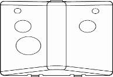

# VESTA 344

 (1) (1).png>)**Module WIEGAND (WGT-1-Combo)**

WGT-1-COMBO est un module WIEGAND qui peut être connecté au lecteur de carte HIKVISION pour dissimuler WIEGAND 26\[W26] Protocole vers des signaux sans fil RF ou des signaux filaires BUS. Lorsque le lecteur de carte WIEGAND lit une étiquette pour une demande d'armement/désarmement, le WGT-1-COMBO transmettra le signal d'armement/désarmement avec le numéro d'étiquette au panneau de commande.

 (1) (1).png>)

* _**Identifier les pièces**_
  1. **Terminal de BUS enfichable**
  2. **Indicateur LED**

La LED clignote une fois après la mise sous tension.

La LED clignote 3 fois lorsque vous appuyez sur le bouton d'apprentissage et transmet un signal RF.

*
  1. **Bouton Apprendre**
  2. **Commutateur de cavalier de résistance de borne**

Lorsque le module WIEGAND est connecté en tant que périphérique BUS le plus éloigné sur une ligne BUS, veuillez régler le cavalier de résistance terminal du module WIEGAND et le cavalier de résistance terminal du premier périphérique BUS (généralement celui du panneau hybride) sur ON pour servir de résistances de terminaison. La capacité de communication de la ligne BUS connectée sera améliorée.

* Si le cavalier est désactivé (si le lien du cavalier est retiré ou « garé » sur une broche), la capacité de communication est au niveau normal.
* Si le cavalier est activé, la capacité de communication sera améliorée.
* **Entrée DC 12 V / GND**

 (1) (1).png>)

Connectez-vous à l’alimentation 12V 1A.

1. **Sortie cc 12 V/GND**

Fournissez 12 V CC à 150 mA au lecteur de carte HIKVISION connecté.

1

1. **DATE0**

Connectez-vous à W0 du lecteur de carte HIKVISION.

**DONNÉES1**

Connectez-vous au W1 du lecteur de carte HIKVISION.

1. **Trou de câblage**
2. **Vis de base x 4**
3. **Trous de montage x 2 (pour support de montage)**
4. **Support de montage**

 (1).png>)

* _**Pouvoir**_

**Alimenté par un panneau hybride (pour les applications filaires BUS uniquement)**

* Lorsque le WGT-1-COMBO est en mode filaire (câblé au panneau hybride), une alimentation de 13,5 V (typique) sera fournie par le panneau hybride.

**Application d'adaptateur secteur (requis pour les applications sans fil ; en option pour les applications filaires)**

* Lorsque le WGT-1-COMBO est en mode sans fil (NON câblé au panneau hybride), veuillez allumer le WGT-1-COMBO en connectant l'adaptateur AC-DC 12 V à deux fils au**Entrée CC / GND**Terminal.
* Lorsque le WGT-1-COMBO est en mode filaire (câblé au panneau hybride), mais que le panneau est connecté à des charges qui nécessitent une consommation d'énergie plus importante, il est recommandé d'utiliser un adaptateur AC-DC 12 V à deux fils.

**Puissance de sortie :**

*
  *
    * Le WGT-1-COMBO peut fournir une alimentation 12 V, 150 mA au lecteur de carte HIKVISION connecté via la borne d'alimentation.
* _**Diagramme d'application**_
  * Les spécifications de câblage des trous d’insertion sont AWG 20-28 ou Ø 0,518-0,081 (mm²). Lorsque vous connectez le fil à la borne, serrez la vis pour fermer la tondeuse et maintenir le fil en place. Dévissez pour ouvrir la tondeuse et retirez le fil.
  * Le WGT-1-COMBO peut être connecté soit pour une application sans fil, soit pour une application filaire selon les schémas ci-dessous :
    *
      1. **Application sans fil RF (NON câblé au panneau hybride)**

 (1) (1).png>)

* Avant le câblage, assurez-vous que l'alimentation électrique a été débranchée.
  * Connecter**GND**borne du WGT-1-COMBO à la borne de terre d'une alimentation.
  * Connecter**Entrée CC**Borne d'entrée du WGT-1-COMBO à la borne de sortie de puissance de l'alimentation.
  * Connecter**SORTIE CC**borne du WGT-1-COMBO au**câble rouge**du lecteur de carte HIKVISION.
  * Connecter**GND**borne du WGT-1-COMBO au**câble noir**du lecteur de carte HIKVISION.
  * Connecter**DATE0**borne du WGT-1-COMBO au\*\*câble vert (W0)\*\*du lecteur de carte HIKVISION.
  * Connecter**DONNÉES1**borne du WGT-1-COMBO au\*\*câble blanc (W1)\*\*du lecteur de carte HIKVISION.

 (1).png>)

2

1. **Application filaire BUS (câblé au panneau hybride)**

* Avant de connecter le module WIEGAND au bus système, veuillez couper l'alimentation.
* Pour faciliter les connexions des câbles, les borniers de chaque module du système BUS sont codés par couleur.

.jpeg>)

| **Rouge** | VDD  |
| --------- | ---- |
| **Noir**  | GND  |
| **Jaune** | 485A |
| **Vert**  | 485B |

*
  * Connecter**SORTIE CC**borne du WGT-1-COMBO au**câble rouge**du lecteur de carte HIKVISION.
  * Connecter**GND**borne du WGT-1-COMBO au**câble noir**du lecteur de carte HIKVISION.
  * Connecter**DATE0**borne du WGT-1-COMBO au\*\*câble vert (W0)\*\*du lecteur de carte HIKVISION.
  * Connecter**DONNÉES1**borne du WGT-1-COMBO au\*\*câble blanc (W1)\*\*du lecteur de carte HIKVISION.
* Des connexions incorrectes entraîneront une panne ou un mauvais fonctionnement. Inspectez le câblage et assurez-vous que les connexions sont correctes avant de mettre sous tension.
* Allumez le panneau, le WGT-1-COMBO sera également allumé.

_\\_

*
  * La conception enfichable des borniers BUS améliore l'efficacité de l'installation. Avant le câblage, vous pouvez retirer les borniers de la carte PCB pour faciliter l'utilisation et les rebrancher après le câblage.
  * Après avoir débranché le terminal, lors de la réinstallation du terminal sur la carte, assurez-vous d'installer le terminal dans la même direction pour éviter les dangers potentiels.
* Le module WIEGAND peut être connecté en série avec d'autres appareils BUS au panneau hybride. Lorsqu'il est connecté à**VBUS**borne sans connexion à**Entrée CC**, la longueur totale du câblage ne doit pas dépasser 300 pieds. Lorsqu'il est connecté à**Entrée CC**, la longueur totale du câblage peut atteindre 3 000 pieds.
* Pour une communication optimale des appareils de ligne BUS connectés, assurez-vous que les cavaliers de résistance terminale du premier et du dernier appareil BUS sur une ligne BUS sont réglés sur ON pour servir de résistances de terminaison. Assurez-vous d'activer uniquement les 2 cavaliers susmentionnés et de ne pas régler les cavaliers sur ON pour tout autre périphérique BUS intermédiaire.

3

*  (1).png>)_**Apprentissage du WGT-1-COMBO dans le panneau de configuration**_

\*\*Étape 1.\*\*Mettez le panneau de configuration en mode apprentissage.

\*\*Étape 2.\*\*\*\*(Pour les applications sans fil)\*\*Appuyez sur le bouton d'apprentissage du WGT-1-COMBO. Le module WIEGAND transmettra un signal d'apprentissage au panneau de commande. Si le panneau de commande reçoit avec succès le signal d'apprentissage, le WGT-1-COMBO sera affiché dans le panneau de commande en tant que lecteur d'étiquettes.

\*\*(Pour application filaire BUS)\*\*Si le WGT-1-COMBO est correctement connecté au panneau, il sera automatiquement affiché dans le panneau de commande en tant que lecteur de tags.

\*\*Étape 3.\*\*Reportez-vous au manuel du panneau de commande pour terminer le processus d'apprentissage.

\*\*Étape 4.\*\*Naviguez dans le panneau de configuration dans «**Test de marche**mode ". Maintenez le WGT-1-COMBO à l'emplacement souhaité, appuyez sur le bouton d'apprentissage du module WIEGAND pour confirmer que cet emplacement est à portée du signal du panneau de commande.

 (1).png>)

* _**Identification (pour application filaire BUS)**_

Le "**Identifier**La fonction " est utilisée pour localiser un périphérique BUS spécifique dans le système filaire BUS. Cette fonction est utile pour distinguer quel appareil est quel appareil, en particulier dans une grande installation où de nombreux appareils BUS sont inclus.

Pour localiser le module WIEGAND dans le système BUS :

\*\*Étape 1.\*\*Sur la page Web du panneau hybride, cliquez sur « Identifier » sous la liste des appareils après l'entrée dans la colonne des appareils du Tag Reader.

\*\*Étape 2.\*\*Si le lecteur d'étiquettes reçoit le signal du panneau hybride, la page Web affichera un message de réussite et l'indicateur LED du WGT-1-COMBO clignotera 10 fois pour indiquer à l'utilisateur où il se trouve.

 (1) (1).png>)

_\\_

* Si un message de délai d'attente s'affiche sur la page Web, cela signifie que le module WIEGAND n'a pas reçu le signal du panneau.

Veuillez vérifier si le module WIEGAND est correctement connecté au panneau avec une distance de câblage appropriée.

* _**Test de marche**_
  * Pour vous assurer que le module WIEGAND est capable de communiquer avec le panneau après son apprentissage, placez le panneau de commande en mode test de marche et appuyez sur le bouton d'apprentissage du WGT-1-COMBO pour transmettre un signal de test au panneau de commande.
  * Lorsque le panneau reçoit le signal de test, il émet un bip et affiche les informations du module WIEGAND en conséquence en haut de la liste des appareils.

_\\_

* S'il n'y a pas de réponse du panneau après avoir appuyé sur le bouton d'apprentissage, cela signifie que le panneau n'a pas reçu le signal de test de l'appareil.

Veuillez vérifier si le WGT-1-COMBO est correctement connecté au panneau à une distance de câblage appropriée.

* _**Apprentissage/suppression des balises**_
  * Avant d'apprendre une balise dans le panneau de commande, assurez-vous que le WGT-1-COMBO a été appris dans le panneau de commande.
  * After first power on HIKVISION Card Reader, please wait until the buzzer sound a beep, indicating that the starting up process is completed.

 (1) (1).png>)

**Apprentissage des balises**

\*\*Étape 1.\*\*Désarmez le système.

**Étape 2.Allez auPage Web locale**>**Code PIN**. Sélectionnez le**Zone**. Passe-étiquette**Deux fois**via le lecteur de carte HIKVISION dans**moins de 4 secondes**, deux bips seront émis par le lecteur de carte, puis le WGT-1-COMBO transmettra le signal avec le numéro d'étiquette au panneau de commande. Cliquez sur**Charger**bouton sur la page Web.

 (1) (1).png>)

4

\*\*Étape 3.\*\*Lorsque le numéro d'identification de la balise s'affiche sur la page Web, entrez un code utilisateur à 4 ou 6 chiffres et attribuez un nom d'utilisateur à la balise.

 (1) (1).png>)

**Étape 4.Cliquez surD'ACCORD**bouton sur la page Web pour enregistrer.

**Étape 5.L'apprentissage des balises est terminé.**

**Suppression des balises**

\*\*Étape 1.\*\*Désarmez le système.

**Étape 2.Allez auPage Web locale**>**Code PIN**. Sélectionnez le**Zone**. Passe-étiquette**Deux fois**via le lecteur de carte HIKVISION dans**moins de 4 secondes**, deux bips seront émis par le lecteur de carte, puis le WGT-1-COMBO transmettra le signal avec le numéro d'étiquette au panneau de commande. Recherchez une ligne de numéro d'étiquette vide et cliquez sur le bouton Charger pour vérifier le numéro d'identification de l'étiquette que vous allez supprimer.**.**

 (1) (1).png>)

**Étape 3.En fonction du numéro d'identification de balise nouvellement chargé, recherchez le même numéro d'identification de balise dans la liste et sélectionnezSupprimer**.

* **Exemple:Comme l'image ci-dessous, les numéros 1 et 2 de la liste sont les balises apprises existantes. Après avoir passé le tagDeux fois**via le lecteur de carte et cliquez sur**Charger**dans la ligne vierge n°3, le numéro d'identification de l'étiquette sera affiché dans le numéro 3. Comme le numéro 3 est le même que le numéro 2, le numéro 2 est donc l'étiquette à supprimer. Sélectionner**Supprimer**sur la rangée n°2 pour supprimer l’étiquette.

 (1) (1).png>)

**Étape 4.Cliquez surD'ACCORD**sur la page Web pour enregistrer la modification.

\*\*Étape 5.\*\*La suppression du tag est terminée.

* _**Signal de surveillance**_
  * En mode filaire, le module WIEGAND transmettra automatiquement les signaux de supervision au panneau de commande à un intervalle de 20 à 30 secondes.
  * En mode sans fil, le module WIEGAND transmettra automatiquement les signaux de supervision au panneau de commande à un intervalle de 30 à 50 minutes.
  * Si la centrale n'a pas reçu le signal du module WIEGAND pendant une période de temps prédéfinie, la centrale considérera le module WIEGAND hors service et réagira en fonction des paramètres du panneau.

5

* **Pour armer le système :Passe-étiquetteune fois**via le lecteur de carte HIKVISION, un bip sera émis par le lecteur de carte. Après 4 secondes, WGT-1-COMBO transmettra le signal ARM avec le numéro d'étiquette au panneau de commande. Si le panneau de commande confirme que l'étiquette est attachée à l'utilisateur, il passera automatiquement en mode Armement.
* **Pour désarmer le système :Passe-étiquetteDeux fois**via le lecteur de carte HIKVISION dans**moins de 4 secondes**, deux bips seront émis par le lecteur de carte, puis le WGT-1-COMBO transmettra le signal DISARM avec le numéro d'étiquette au panneau de commande. Si le panneau de commande confirme que l'étiquette est attachée à l'utilisateur, il passera automatiquement en mode désarmement.
* _**Montage**_

**Montez le support**

\*\*Étape 1.\*\*Fixez le support de montage sur le mur à l'endroit souhaité.

\*\*Étape 2.\*\*Utilisez les trous comme gabarit et percez des trous dans la surface.

\*\*Étape 3.\*\*Vissez le support de montage sur les trous percés.

\*\*Étape 4.\*\*Accrochez le module WIEGAND au support de montage.

\*\*Étape 5.\*\*Faire glisser le module WIEGAND vers le bas lorsqu'il est accroché au support de montage pour serrer et sécuriser le module.
