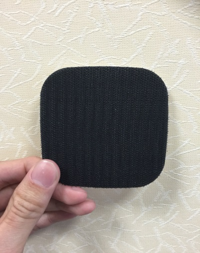
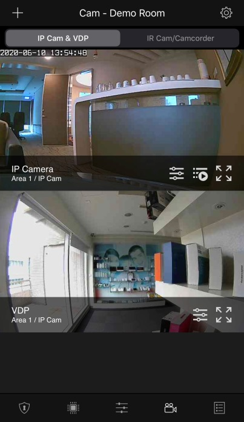

# VESTA 355

**Caméra filaire à capteur de mouvement PIR (VST-892-BUS)**

**Introduction**

VST-892-BUS est une caméra à capteur de mouvement infrarouge passif (PIR). Il est capable d'envoyer des signaux filaires et des images capturées (qualité d'image jusqu'à 640 x 480 pixels) via BUS au panneau de commande lors de la détection de mouvement.

La caméra PIR est conçue avec une portée de détection typique de 12 mètres lorsqu'elle est montée à une hauteur de 2,3 à 2,5 mètres au-dessus du sol. Lorsque la fonction Pet Immunity est activée, la caméra à capteur de mouvement ne détectera pas les animaux pesant jusqu'à 25 kg lorsqu'elle est montée à une hauteur de 2,3 à 2,5 mètres au-dessus du sol.

De plus, le VST-892-BUS est conçu avec le détecteur de proximité numérique. La fonction anti-masquage permet de détecter toute tentative d'aveuglement du détecteur en plaçant des objets dans son champ de vision.

La configuration à distance est prise en charge pour la caméra PIR. Outre le réglage des cavaliers, les utilisateurs peuvent également activer/désactiver la fonction d'immunité aux animaux et régler la sensibilité de la caméra PIR à partir de la page Web du panneau de commande ou du serveur de portail domestique.

La caméra PIR se compose d'une conception en deux parties composée d'un couvercle et d'une base. Le couvercle contient toute l'électronique et l'optique et la base fournit un moyen de fixation. La base comporte des découpes pour permettre un montage direct sur une surface plane, ou un support de montage est fourni pour le montage en coin et en surface.

**La série VST-892-BUS comprend les modèles suivants**:

VST-892-BUS – Caméra filaire à capteur de mouvement PIR avec flash LED VST-892-IL-BUS – Caméra filaire à capteur de mouvement PIR avec LED infrarouge

**Identification des pièces**

.jpeg>)

**1. LED flash/LED infrarouge**

La LED flash (pour le VST-892-BUS) ou la LED infrarouge (pour le VST-892-IL-BUS) fournit suffisamment de lumière pour la capture d'images dans des conditions de faible éclairage.

**2. LED bleue/bouton de fonction**

**LED bleue :**

(Prière de se référer à_**Indicateur LED**_description ci-dessous pour plus de détails)

**Utilisation du bouton de fonction :**

-   -   Appuyez une fois sur le bouton pour passer en mode test pendant 3 minutes.

1.  **Détecteur de proximité numérique**

Le détecteur de proximité numérique permet de détecter toute tentative de masquage (blocage) d'un intrus

1.  **Capteur IR**
2.  **Objectif de caméra PIR**
3.  **Terminal de bus**

.jpeg>)

Câblez les quatre bornes (VCC, GND, A, B) à la borne BUS du panneau de commande. Prière de se référer à_**Câblage de la caméra PIR**_pour plus de détails.

1

1.  **Commutateur de cavalier de résistance de borne**

Lorsque la caméra PIR est connectée en tant que périphérique BUS le plus éloigné sur une ligne BUS, veuillez régler le cavalier de résistance terminal de la caméra PIR et le commutateur de cavalier du premier périphérique BUS (généralement le panneau hybride) sur ON pour servir de résistances de terminaison. La capacité de communication de la ligne BUS connectée sera améliorée.

.jpeg>).png>)

**Cavalier**

Le cavalier est inséré, reliant les deux broches.

**Cavalier**

Le lien de cavalier est supprimé ou "**garé**» sur une épingle.

-   -   Si le cavalier est désactivé, la capacité de communication est au niveau normal.
    -   Si le cavalier est activé, la capacité de communication est améliorée.

1.  **Interrupteur anti-sabotage**
2.  **Commutateur d'activation/désactivation de l'immunité aux animaux (JP3)**

.png>)

**Cavalier**

 (1).jpeg>)

Le cavalier est inséré, reliant les deux broches.

**Cavalier**

Le lien de cavalier est supprimé ou "**garé**» sur une épingle.

Lorsqu'elle est réglée sur ON, l'immunité aux animaux est désactivée (valeur par défaut).

Lorsqu'il est réglé sur OFF, l'immunité aux animaux est activée.

**10. Cavalier d'augmentation de sensibilité (JP4)**

Lorsqu’il est réglé sur ON, la sensibilité de détection du PIR est élevée.

Lorsqu'elle est réglée sur OFF, la sensibilité de détection du PIR est au niveau normal (par défaut d'usine).

1.  **Vis de fixation inférieure**
2.  **Zone de sécurité pour interrupteur anti-sabotage**
3.  **Options de zone de séparation pour le câblage**
4.  **Support de montage**

**Caractéristiques**

 (1) (1).png>)

-   _**Indicateur LED**_
    -   La LED bleue clignote pendant 1 seconde lorsque la caméra PIR entre en mode test. Pendant le mode Test, la LED bleue clignote une fois à chaque fois qu'un mouvement est détecté.
    -   La LED ne clignotera pas si la caméra PIR est normale et n'est pas en mode test.
-   _**Capture d'image**_

.png>)

Lorsque le système d'alarme est armé, la caméra PIR capturera 1, 3 ou 6 images d'alarme avec une résolution de 640 x 480 ou 320 x 240 (programmable depuis le panneau de commande) lors de la détection de mouvement. Vous pouvez également demander manuellement à la caméra PIR de prendre une photo via le panneau de configuration. Les images capturées seront transférées vers le panneau de configuration pour que les utilisateurs puissent les visualiser.

.png>)

_\\<NOTE>_

-   -   Si votre caméra PIR est installée à un endroit où le champ de vision de la caméra est un environnement complexe avec une lumière intense ou beaucoup de couleurs, les images capturées seront de grande taille, ce qui pourrait entraîner une troncature lorsque les images sont transmises au panneau de commande. .
-   _**Période d'échauffement**_

.png>)

Lorsque le système du panneau de commande passe en mode armé ou lorsque la caméra PIR est mise en mode test, la caméra PIR se réchauffe pendant 30 secondes.

-   _**Source de courant**_

Lorsque le VST-892-BUS est câblé à un panneau hybride, une alimentation de 13,5 V peut être fournie par le panneau hybride.

.png>)

-   _**Anti-masquage**_
    -   La caméra PIR dispose d'un détecteur de proximité numérique capable de détecter toute tentative de masquage (blocage) d'un intrus.
    -   Lorsqu'un événement de masquage est détecté et que la condition de masquage dure 3 minutes, le VST-892-BUS enverra un signal d'alarme de masquage au panneau de commande pour informer l'utilisateur de la condition de masquage.
    -   Une fois le masquage/blocage supprimé pendant 3 minutes, le VST-892-BUS enverra un signal de restauration au panneau de commande.
-   _**Autoprotection**_

.png>)

La caméra PIR est protégée par un interrupteur anti-sabotage qui est enfoncé lorsque la caméra PIR est correctement installée. Lorsque la caméra PIR est retirée de la surface de montage ou que son couvercle est ouvert, le commutateur d'autoprotection sera activé et la caméra PIR enverra un signal d'autoprotection au panneau de commande du système pour rappeler à l'utilisateur la condition.

2

-   .png>)_**Surveillance**_

La caméra PIR effectuera périodiquement un auto-test en transmettant un signal de supervision toutes les 20 à 30 secondes.

.png>)

-   _**Mode d'essai**_
    -   -   Le mode test vous permet de vérifier la plage de détection de la caméra PIR (et non la couverture de prise de vue).
        -   Appuyez une fois sur le bouton Fonction pour passer en mode test pendant 3 minutes. La LED bleue clignotera pendant 1 seconde.
        -   La caméra PIR se réchauffera pendant 30 secondes. Veuillez ne pas déclencher la caméra pendant cette période de préchauffage.
        -   Après la période de préchauffage, vous pouvez déclencher la caméra PIR pour vérifier la plage de détection IR. Si la caméra PIR est déclenchée, la LED bleue clignote une fois.
-   _**Prudence**_
    -   Le câblage de la caméra PIR ne doit être effectué que par des techniciens certifiés possédant les connaissances et la formation appropriées en matière d'équipement électrique.
    -   Avant l'installation ou tout travail de maintenance, assurez-vous que l'alimentation électrique du panneau de commande a été débranchée.
-   _**Câblage de la caméra PIR**_
    -   -   Avant la connexion, assurez-vous que l'alimentation électrique du panneau a été débranchée et que l'interrupteur de batterie du panneau a été glissé en position OFF.
        -   Pour faciliter les connexions des câbles, les borniers de chaque module du système BUS sont codés par couleur.

.png>).png>)

| **Rouge** | VDD  |
| --------- | ---- |
| **Noir**  | GND  |
| **Jaune** | 485A |
| **Vert**  | 485B |

-   Plusieurs appareils BUS peuvent être connectés en série au panneau hybride. Pour une communication optimale des dispositifs de ligne BUS connectés, assurez-vous que les cavaliers de résistance terminale du premier (généralement le panneau hybride) et des dispositifs BUS les plus éloignés sur une ligne BUS sont réglés sur ON pour servir de résistances de terminaison. Assurez-vous d'activer uniquement les 2 cavaliers susmentionnés et de ne pas régler les cavaliers sur ON pour tout autre périphérique BUS intermédiaire.

.png>)

_\\<NOTE>_

-   -   La conception enfichable des borniers BUS améliore l'efficacité de l'installation. Avant le câblage, vous pouvez retirer les borniers de la carte PCB pour faciliter l'utilisation et les rebrancher après le câblage.
    -   Après avoir débranché le terminal, lors de la réinstallation du terminal sur la carte, assurez-vous d'installer le terminal dans la même direction pour éviter les dangers potentiels.
-   Des connexions incorrectes entraîneront une panne ou un mauvais fonctionnement. Inspectez le câblage et assurez-vous que les connexions sont correctes avant de mettre sous tension.
-   Il existe huit options de zone de séparation sur le capot arrière et sur le couvercle de la batterie permettant aux fils de sortir en détachant l'un d'entre eux.

3

-   _**Apprentissage**_

Veuillez suivre les étapes ci-dessous pour intégrer l'appareil au panneau hybride.

Étape 1. Connectez l'appareil au panneau. Ensuite, allumez le panneau.

Étape 2. Sur la page Web du Panel, cliquez sur «**Apprentissage**» pour accéder à la page d'apprentissage.

Étape 3. Cliquez sur «**Commencer**» pour passer en mode apprentissage.

Étape 4. Cliquez sur «**Ajouter**» pour inclure l'appareil dans le panneau.

Étape 5. Si le périphérique est correctement appris dans le panneau, il sera affiché dans la section « Périphérique appris ».

-   _**Identification**_

La fonction « Identifier » permet de localiser un périphérique BUS spécifique dans le système filaire BUS. Cette fonction est utile pour distinguer quel appareil est quel appareil, en particulier dans une grande installation où de nombreux appareils BUS sont inclus.

Pour localiser la caméra PIR dans le système BUS :

**Étape 1.**Sur la page Web du panneau hybride, cliquez sur « Identifier » sous la liste des appareils après l'entrée dans la colonne des appareils de la caméra infrarouge.

**Étape 2.**Si le VST-892-BUS reçoit le signal du panneau hybride, la page Web affichera un message de réussite et l'indicateur LED du VST-892-BUS clignotera 10 fois pour indiquer à l'utilisateur où il se trouve.

_\\<NOTE>_

-   -   -   Si un message de délai d'attente s'affiche sur la page Web, cela signifie que le VST-892-BUS n'a pas reçu le signal du panneau.

Veuillez vérifier si le VST-892-BUS est correctement connecté au panneau à une distance de câblage appropriée.

-   _**Test de marche**_
    -   Pour vous assurer que la caméra PIR est capable de communiquer avec le panneau après son apprentissage, placez le panneau de commande en mode test de marche et appuyez sur le bouton de fonction du VST-892-BUS pour transmettre un signal de test au panneau.
    -   Lorsque le panneau reçoit le signal de test, il émet un bip et affiche les informations de la caméra PIR en conséquence en haut de la liste des appareils.

_\\<NOTE>_

-   -   S'il n'y a pas de réponse du panneau après avoir appuyé sur le bouton de fonction, cela signifie que le panneau n'a pas reçu le signal de test de l'appareil.

Veuillez vérifier si le VST-892-BUS est correctement connecté au panneau à une distance de câblage appropriée.

-   _**Fonction d'immunité aux animaux de compagnie**_

Le capteur PIR prend en charge la fonction d'immunité aux animaux et ne détectera pas les animaux pesant jusqu'à 25 kg afin de minimiser les situations de fausses alarmes. La fonction d'immunité aux animaux peut être activée/désactivée en réglant la position du cavalier (JP3). Lorsque le cavalier (JP3) est réglé sur ON, l'immunité aux animaux est désactivée (par défaut d'usine). Lorsque le cavalier (JP3) est réglé sur OFF, l'immunité aux animaux est activée. La fonction d’immunité aux animaux peut également être réglée à distance comme décrit ci-dessous.

-   _**Fonction d'augmentation de la sensibilité**_

Vous pouvez utiliser la fonction d’augmentation de sensibilité pour augmenter la sensibilité de détection du PIR. Pour augmenter la sensibilité de détection, réglez le cavalier (JP4) sur ON. Pour maintenir une sensibilité de détection normale, réglez le cavalier (JP4) sur OFF (valeur par défaut). La fonction d'augmentation de sensibilité peut également être ajustée par réglage à distance comme décrit ci-dessous.

-   _**Réglage à distance**_
    -   La caméra PIR prend en charge le réglage à distance de l'immunité et de la sensibilité des animaux.
    -   Lorsque la caméra PIR est allumée, sa fonction d'immunité aux animaux et sa sensibilité sont déterminées par les paramètres JP3 et JP4. Les utilisateurs peuvent soit ajuster les paramètres des cavaliers, soit modifier à distance les paramètres d'immunité et de sensibilité aux animaux à partir du panneau de commande. Le réglage à distance écrasera les paramètres du cavalier.

**Page Web du panneau de configuration**:

-   -   1.  Sur la page Web locale du panneau, accédez à la page Modifier le périphérique et saisissez la configuration de la caméra PIR dans la section Paramètres du capteur. Cliquez sur OK pour confirmer.

Veuillez vous référer au tableau ci-dessous pour les détails de configuration. Par exemple, si vous souhaitez activer l'immunité aux animaux et définir le niveau de sensibilité sur élevé, vous pouvez saisir 02.

| **Configuration IR** | **Immunité aux animaux** | **Sensibilité** |
| -------------------- | ------------------------ | --------------- |
| 00                   | Non                      | Haut            |
| 01                   | Non                      | Normale         |
| 02                   | Oui                      | Haut            |
| 03                   | Oui                      | Normale         |

**Serveur de portail domestique**:

1.  Sur Home Portal Server, accédez à la page Paramètres du périphérique, cliquez sur la ligne du périphérique VST-892 et sélectionnez « Configuration IR ».

4

1.  Sélectionnez la fonction Immunité aux animaux (Activer/Désactiver) et la Sensibilité (Élevée/Normale) dans le menu déroulant, puis cliquez sur « Soumettre » pour confirmer le paramètre.

**Installation**

-   _**Directive d'installation**_
    -   La caméra PIR est conçue pour être montée sur une surface plane ou dans un coin.
    -   La base comporte des découpes, là où le plastique est plus fin, à des fins de montage. Deux découpes sur la base sont destinées à la fixation en surface et un support de montage peut être utilisé pour la fixation en coin.
    -   La portée de détection peut atteindre 12 mètres si la caméra PIR est montée à une hauteur de 2,3 à 2,5 mètres au-dessus du sol.
    -   Lorsque la fonction d'immunité aux animaux est activée, elle ne détectera pas les animaux pesant jusqu'à 25 kg lorsqu'ils sont montés à une hauteur de 2,3 à 2,5 mètres au-dessus du sol. Si nécessaire, vous pouvez régler la hauteur de la caméra PIR en fonction de la taille de votre animal pour une performance immunitaire optimale. Un emplacement d'installation plus élevé fournira un plus grand espace immunisé contre les animaux de compagnie, mais augmentera également l'angle mort sous la caméra PIR.
    -   Lorsque le VST-892-BUS est monté avec le support rotatif, il n'aura pas la zone de détection normale ni la plage d'immunité typique aux animaux de compagnie.

**Il est recommandé d'installer la caméra PIR aux emplacements suivants :**

-   -   À un endroit où les animaux ne peuvent pas accéder à la zone de détection en grimpant sur des meubles ou d'autres objets.
    -   N'installez pas l'appareil dans des escaliers où les animaux peuvent grimper.
    -   À une position où un intrus se déplacerait normalement dans le champ de vision du PIR.
    -   À une hauteur comprise entre 2,3 et 2,5 mètres du sol pour de meilleures performances.
    -   Dans un coin pour donner la vue la plus large.
    -   Dans une position où son champ de vision ne sera pas obstrué par, par exemple, des rideaux, des ornements, etc.
-   **Limites**

|  | Ne pas installer à l'extérieur.                                               |  | Évitez les gros obstacles dans la zone de détection.                              |
| - | ----------------------------------------------------------------------------- | - | --------------------------------------------------------------------------------- |
|   |                                                                               |   |                                                                                   |
|  | N'exposez pas complètement la caméra PIR à la lumière directe                 |  | Évitez la vapeur ou l'humidité élevée qui peuvent causer                          |
|   | lumière du soleil.                                                            |   | condensation.                                                                     |
|   |                                                                               |   |                                                                                   |
|  | Évitez de déplacer des objets, par exemple des rideaux, des tentures murales, |  | Évitez la lumière réfléchie par des surfaces lumineuses, par exemple des miroirs, |
|   | etc., dans la zone de détection.                                              |   | fenêtres, etc                                                                     |
|   |                                                                               |   |                                                                                   |

5

-   Évitez d'installer la caméra PIR dans des zones où des machines telles que des climatiseurs ou des radiateurs peuvent provoquer un changement rapide de température dans la zone de détection.
-   Évitez les surfaces réfléchissantes dans la zone de détection. Les signatures infrarouges réfléchies peuvent conduire à de fausses alarmes.

6

6.Remettez le couvercle sur la base et serrez la vis de fixation inférieure.

-   **Montage en surface avec le support de montage :**
    1.  Utilisez les deux trous de vis centraux du support comme gabarit et percez des trous dans la surface à monter.
    2.  Insérez les chevilles murales si la caméra PIR doit être fixée sur du plâtre ou des briques.
    3.  Vissez le support de montage sur les chevilles murales avec les deux bâtons de pointage vers le haut et face à vous.
    4.  Accrochez la caméra PIR aux crochets du support de montage.
-   **Montage en angle avec le support de montage :**
    1.  Utilisez les 4 trous de vis latéraux sur le support comme gabarit et percez des trous sur la surface du coin.
    2.  Insérez les chevilles murales si la caméra PIR doit être fixée sur du plâtre ou des briques.
    3.  Vissez le support de montage sur les chevilles murales avec les deux bâtons de pointage vers le haut et face à vous.
        1.  Accrochez la caméra PIR aux crochets du support de montage.

7

-   **Montage en surface avec support rotatif (article en option, vendu séparément) :**

Le support rotatif peut être monté au mur avec les vis fournies.

1.  Vissez le support rotatif au mur.
2.  Accrochez la caméra PIR au support rotatif en conséquence.
3.  Faites pivoter le support pour obtenir la plage de détection appropriée et serrez la vis de fixation.

8
