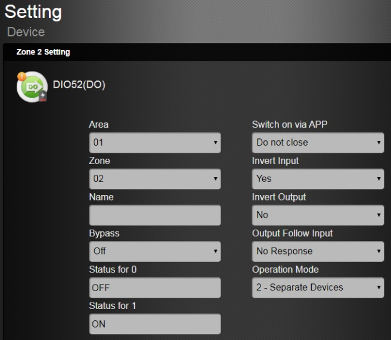

# VESTA 358

**Capteur de mouvement PIR filaire (IR-35-BUS)**

**Introduction**

Le PIR détecte la signature infrarouge pour capter les mouvements dans une zone assignée et signale à la centrale via BUS d'activer l'alarme si un intrus croise son chemin de détection.

Le PIR est conçu pour offrir une portée de détection typique de 12 mètres lorsqu'il est monté à 2,5 mètres au-dessus du sol. Le capteur PIR prend également en charge la fonction d'immunité aux animaux et ne détectera pas les animaux pesant jusqu'à 25 kg afin de minimiser les fausses alarmes.

Le PIR se compose d’une conception en deux parties composée d’un couvercle et d’une base. Le couvercle contient toute l'électronique et l'optique et la base fournit un moyen de fixation.

**Identification des pièces**

 (1).jpeg>)

1.  **Bouton de test/indicateur LED**
    -   Appuyez une fois sur le bouton test pour passer en mode test pendant 3 minutes.
    -   L'indicateur LED est utilisé pour indiquer l'état du système.
2.  **Capteur IR**
3.  **Commutateur de cavalier de résistance de borne**

Lorsque le capteur de mouvement PIR est connecté en tant que périphérique BUS le plus éloigné sur une ligne BUS, veuillez régler le cavalier de résistance terminal du capteur de mouvement PIR et le commutateur de cavalier du premier périphérique BUS (généralement le panneau hybride) sur ON pour servir de résistances de terminaison. La capacité de communication de la ligne BUS connectée sera améliorée.

-   -   -   Si le cavalier est désactivé (le lien du cavalier est retiré ou « garé » sur une broche), la capacité de communication est au niveau normal.
            -   Si le cavalier est activé, la capacité de communication sera améliorée.

1.  **Terminal de bus**
2.  **Commutateur d'activation/désactivation de l'immunité aux animaux (JP3)**
    -   Lorsqu'elle est définie sur ON, l'immunité aux animaux est désactivée (valeur par défaut).
    -   Lorsqu'elle est réglée sur OFF, l'immunité aux animaux est activée.

.png>)

**Cavalier**

.jpeg>)

Le cavalier est inséré, reliant les deux broches.

**Cavalier**

.jpeg>)

Le lien de cavalier est supprimé ou "**garé**» sur une épingle.

**6. Cavalier d'augmentation de sensibilité (JP4)**

-   -   Lorsqu’il est réglé sur ON, la sensibilité de détection du PIR est élevée.
    -   Lorsqu'elle est réglée sur OFF, la sensibilité de détection du PIR est au niveau normal. (Défaut de fabrication)

1.  **Interrupteur anti-sabotage**
2.  **Vis de fixation inférieure**

1

**Caractéristiques**

.jpeg>)

-   _**Indicateur LED**_

En mode de fonctionnement normal, l'indicateur LED clignote 3 fois dans les situations suivantes :

-   Lorsque le couvercle est ouvert et que l'interrupteur anti-sabotage est déclenché.
-   Lorsqu'un mouvement est détecté si la condition de sabotage persiste.
-   Lorsqu'un mouvement est détecté en mode Test
-   Lorsque le bouton de test est enfoncé dans des conditions d'autoprotection

La LED ne clignotera pas si l'autoprotection PIR est normale et si le PIR n'est pas en mode test.

.jpeg>)

-   _**Autoprotection**_

Le PIR est protégé par un interrupteur anti-sabotage qui est compressé lorsque le PIR est correctement installé. Lorsque le PIR est retiré de la surface montée ou du support de montage, ou que son couvercle est ouvert, l'interrupteur d'autoprotection sera activé et le PIR enverra un signal d'autoprotection au panneau de commande du système pour rappeler à l'utilisateur la condition. Si un mouvement est détecté lorsque l'interrupteur anti-sabotage est ouvert, la LED clignote 3 fois.

.jpeg>)

-   _**Fonction de surveillance**_

Après l'installation, le PIR transmettra automatiquement et périodiquement des signaux de supervision au panneau de commande à des intervalles aléatoires de 20 à 30 secondes.

.png>)

-   _**Mode d'essai**_

Le PIR peut être mis en mode Test en appuyant sur le bouton Test. Chaque fois que le bouton de test est enfoncé, le PIR transmettra un signal de test au panneau de commande pour un test de portée radio et entrera en mode test pendant 3 minutes. Le mode test expirera après 3 minutes.

.png>)

-   _**Fonction d'immunité aux animaux de compagnie**_
    -   Le capteur PIR prend en charge la fonction d'immunité aux animaux et ne détectera pas les animaux pesant jusqu'à 25 kg afin de minimiser les fausses alarmes.
    -   La fonction d'immunité aux animaux peut être activée/désactivée en réglant la position du cavalier (JP3). Lorsque le cavalier (JP3) est réglé sur ON, l'immunité aux animaux est désactivée (par défaut d'usine). Lorsque le cavalier (JP3) est réglé sur OFF, l'immunité aux animaux est activée.
    -   La fonction Pet Immunity peut également être ajustée par réglage à distance, veuillez vous référer au_**Réglage à distance**_section ci-dessous.
-   _**Fonction d'augmentation de la sensibilité**_
    -   Vous pouvez utiliser la fonction d’augmentation de sensibilité pour augmenter la sensibilité de détection du PIR.
    -   Pour augmenter la sensibilité de détection, réglez le cavalier (JP4) sur ON. Pour maintenir une sensibilité de détection normale, réglez le cavalier (JP4) sur OFF (valeur par défaut).
    -   La fonction de sensibilité peut également être ajustée par réglage à distance, veuillez vous référer au_**Réglage à distance**_section ci-dessous.
-   _**Réglage à distance**_
    -   Le capteur de mouvement PIR prend en charge le réglage à distance de l'immunité et de la sensibilité des animaux de compagnie.
    -   Lorsque le PIR est allumé, sa fonction d'immunité aux animaux et sa sensibilité sont déterminées par les paramètres JP3 et JP4. Les utilisateurs peuvent soit ajuster les paramètres des cavaliers, soit modifier à distance les paramètres d'immunité et de sensibilité aux animaux à partir du panneau de commande. Le réglage à distance écrasera les réglages des cavaliers.

**Page Web du panneau de configuration**:

-   -   1.  Sur la page Web locale du Panel, accédez à la page Modifier le périphérique.
        2.  Saisissez la configuration du capteur de mouvement PIR dans la section Paramètres du capteur. Cliquez sur OK pour confirmer.
        3.  Veuillez vous référer au tableau ci-dessous pour les détails de configuration. Par exemple, si vous souhaitez activer l'immunité aux animaux et définir le niveau de sensibilité sur élevé, vous pouvez saisir 03.

.png>).png>)

| **Configuration IR** | **Immunité aux animaux** | **Sensibilité** |
| -------------------- | ------------------------ | --------------- |
| 00                   | Désactiver               | Normale         |
| 01                   | Désactiver               | Haut            |
| 02                   | Activer                  | Normale         |
| 03                   | Activer                  | Haut            |

**Serveur de portail domestique**:

-   -   -   1.  Sur Home Portal Server, accédez à la page des paramètres du périphérique, cliquez sur la ligne du périphérique IR-35 et sélectionnez « Configuration IR ».
            2.  Sélectionnez la fonction Immunité aux animaux (Activer/Désactiver) et la Sensibilité (Élevée/Normale) dans les listes déroulantes, cliquez sur « Soumettre » pour confirmer le réglage.
-   _**Source de courant**_
    -   -   Lorsque l'IR-35-BUS est câblé à un panneau hybride, une alimentation de 13,5 V peut être fournie par le panneau hybride.
-   _**Prudence**_
    -   Le câblage du capteur de mouvement PIR ne doit être effectué que par un technicien certifié possédant les connaissances et la formation appropriées en matière d'équipement électrique.
    -   Avant l'installation ou tout travail de maintenance, assurez-vous que l'alimentation électrique a été débranchée.

.jpeg>).png>)

2

-   .png>)_**Câblage du capteur de mouvement PIR**_
    -   Avant de connecter le capteur de mouvement PIR au bus système, veuillez couper l'alimentation.
    -   Pour faciliter les connexions des câbles, les borniers de chaque module du système BUS sont codés par couleur.

.jpeg>)

| **Rouge** | VDD  |
| --------- | ---- |
| **Noir**  | GND  |
| **Jaune** | 485A |
| **Vert**  | 485B |

-   Plusieurs appareils BUS peuvent être connectés en série au panneau hybride. Pour une communication optimale des dispositifs de ligne BUS connectés, assurez-vous que les cavaliers de résistance terminale du premier (généralement le panneau hybride) et des dispositifs BUS les plus éloignés sur une ligne BUS sont réglés sur ON pour servir de résistances de terminaison. Assurez-vous d'activer uniquement les 2 cavaliers susmentionnés, et

ne réglez pas les cavaliers sur ON pour tout autre périphérique BUS intermédiaire.

_\\<NOTE>_

-   -   La conception enfichable des borniers BUS améliore l'efficacité de l'installation. Avant le câblage, vous pouvez retirer les borniers de la carte PCB pour faciliter l'utilisation et les rebrancher après le câblage.
    -   Après avoir débranché le terminal, lors de la réinstallation du terminal sur la carte, assurez-vous d'installer le terminal dans la même direction pour éviter les dangers potentiels.
-   Des connexions incorrectes entraîneront une panne ou un mauvais fonctionnement. Inspectez le câblage et assurez-vous que les connexions sont correctes avant de mettre sous tension.

.png>)

-   _**Mise en route – Apprentissage du capteur de mouvement PIR dans le panneau de commande**_

Veuillez suivre les étapes ci-dessous pour intégrer l'appareil au panneau hybride.

Étape 1. Connectez l'appareil au panneau. Ensuite, allumez le panneau.

Étape 2. Sur la page Web du Panel, cliquez sur «**Apprentissage**» pour accéder à la page d'apprentissage.

Étape 3. Cliquez sur «**Commencer**» pour passer en mode apprentissage.

Étape 4. Cliquez sur «**Ajouter**» pour inclure l'appareil dans le panneau.

Étape 5. Si le périphérique est correctement appris dans le panneau, il sera affiché dans la section « Périphérique appris ».

.jpeg>)

-   _**Identification**_

Le "**Identifier**La fonction " est utilisée pour localiser un périphérique BUS spécifique dans le système filaire BUS. Cette fonction est utile pour distinguer quel appareil est quel appareil, en particulier dans une grande installation où de nombreux appareils BUS sont inclus.

Pour localiser le capteur de mouvement PIR dans le système BUS :

**Étape 1.**Sur la page Web du panneau hybride, cliquez sur « Identifier » sous la liste des appareils après l'entrée dans la colonne des appareils de la caméra infrarouge.

**Étape 2.**Si le capteur de mouvement PIR reçoit le signal du panneau hybride, la page Web affichera un message de réussite et l'indicateur LED du capteur de mouvement PIR clignotera 10 fois pour indiquer à l'utilisateur où il se trouve.

.png>)

_\\<NOTE>_

-   Si un message de délai d'attente s'affiche sur la page Web, cela signifie que le capteur de mouvement PIR n'a pas reçu le signal du panneau.

Veuillez vérifier si la connexion filaire entre le panneau et le capteur de mouvement PIR est correctement connectée.

3

-   _**Test de marche**_
    -   Pour vous assurer que le capteur de mouvement PIR est capable de communiquer avec le panneau après son apprentissage, placez le panneau de commande en mode test de marche et appuyez sur le bouton Test de l'IR-35-BUS pour transmettre un signal de test au panneau de commande.
    -   Lorsque le panneau reçoit le signal de test, il émet un bip et affiche les informations du capteur de mouvement PIR en conséquence en haut de la liste des appareils.

.png>)

_\\<NOTE>_

-   -   S'il n'y a pas de réponse du panneau après avoir appuyé sur le bouton de test, cela signifie que le panneau n'a pas reçu le signal de test de l'appareil.

Veuillez vérifier si l'IR-35-BUS est correctement connecté au panneau à une distance de câblage appropriée.

-   _**Retour aux paramètres d'usine**_

Le capteur de mouvement PIR peut être réinitialisé en usine à l'immunité et à la sensibilité par défaut des animaux de compagnie en fonction des paramètres JP3 et JP4. Suivez les étapes ci-dessous pour continuer.

Étape 1. Débranchez l'alimentation électrique du capteur de mouvement PIR.

Étape 2. Appuyez et maintenez enfoncé le bouton de test du capteur de mouvement PIR, puis allumez l'appareil. Continuez à maintenir le bouton de test enfoncé pendant 5 secondes. Relâchez le bouton de test après que la LED clignote 5 fois. La réinitialisation d'usine est terminée.

**Installation**

-   _**Directive d'installation**_
    -   Le PIR est conçu pour être monté sur une surface plane ou dans un coin.
    -   La portée de détection peut atteindre 12 mètres si le PIR est monté entre 2,3 et 2,5 mètres au-dessus du
    -   Lorsque la fonction Pet-Immunity est activée, le PIR ne détectera pas les animaux pesant jusqu'à 25 kg lorsqu'il est monté à 2,3-2,5 mètres au-dessus du sol. Si nécessaire, vous pouvez ajuster la hauteur du PIR en fonction de la taille de votre animal pour une performance optimale d'immunité de l'animal. Un emplacement d'installation plus élevé offrira un plus grand espace immunisé contre les animaux domestiques, mais augmentera l'angle mort sous le PIR.
    -   Lorsque le PIR est monté avec le support rotatif, il n'aura pas la zone de détection normale (comme dans le schéma ci-dessous) ni la plage immunitaire typique des animaux de compagnie.
    -   Une fois le site d'installation sélectionné, appuyez sur le bouton Test pour passer en mode test. Parcourez la zone protégée en notant quand la LED s'allume et vérifiez que la couverture de détection est adéquate.
    -   Lorsque la couverture de détection s'avère satisfaisante, suivez les étapes décrites dans_**Méthode de montage**_section ci-dessous pour monter le PIR.

**Portée de détection IR-35-BUS**

4

-   _**Méthode de montage**_
    -   Le PIR est conçu pour être monté soit sur une surface plane, soit dans un coin.
    -   La base comporte deux découpes, où le plastique est plus fin et peut être cassé pour un montage en surface.
    -   Un support de montage comprend deux trous de vis centraux pour fixer le PIR sur une surface et quatre trous de vis latéraux pour fixer le PIR sur un coin.
    -   Pour le montage en surface, un support rotatif en option est fourni pour permettre aux utilisateurs d'ajuster la plage de détection. Grâce au support rotatif, l'IR-35-BUS peut être pivoté de 80 degrés horizontalement et de 70 degrés verticalement pour offrir une couverture optimale.
-   **Montage en surface sans support de montage :**
    1.  Retirez la vis de fixation inférieure et l’ensemble couvercle.
    2.  Percez les deux entrées défonçables depuis l'intérieur de la base
    3.  Utilisez les trous comme gabarit et percez des trous dans la surface à monter.
    4.  Insérez les chevilles murales si le PIR doit être fixé sur du plâtre ou des briques.
    5.  Vissez la base sur les chevilles.
    6.  Vissez le couvercle sur la base.
-   **Montage en surface avec le support de montage :**
    1.  Utilisez les deux trous de vis centraux du support comme gabarit et percez des trous dans la surface à monter.
    2.  Insérez les chevilles murales si le PIR doit être fixé sur du plâtre ou des briques.
    3.  Vissez le support de montage sur les chevilles murales avec les deux bâtons de pointage vers le haut et face à vous.
    4.  Installez le PIR sur les crochets du support de montage.

5

-   Pour le montage en surface, un support rotatif en option est fourni pour permettre aux utilisateurs d'ajuster la plage de détection. Grâce au support rotatif, l'IR-35-BUS peut être pivoté de 80 degrés horizontalement et de 70 degrés verticalement pour offrir une couverture optimale.
-   Le support rotatif peut être monté au mur avec les vis fournies.
    1.  Vissez le support rotatif dans le mur.
    2.  Insérez les 3 crochets du support rotatif dans les 3 trous de la base en conséquence.
    3.  Faites pivoter le support pour obtenir la plage de détection appropriée et serrez la vis de fixation.

**Recommandations d'installation**

-   **Il est recommandé d'installer le PIR aux emplacements suivants :**
    -   À une hauteur de 2,3 M à 2,5 M pour de meilleures performances :
    -   Aux endroits où les animaux ne peuvent pas accéder à la zone de détection en grimpant sur des meubles ou d'autres objets.
    -   Ne dirigez pas le capteur vers des escaliers sur lesquels les animaux peuvent grimper.
    -   À une position telle qu’un intrus se déplacerait normalement à travers le champ de vision du PIR d’un côté à l’autre.
    -   Dans un coin pour donner la vue la plus large.
    -   Dans une position où son champ de vision ne sera pas obstrué par des rideaux, des ornements, etc.
-   **Limites**

|  | Ne pas installer à l'extérieur.                        |  | Évitez les gros obstacles dans la zone de détection.     |
| - | ------------------------------------------------------ | - | -------------------------------------------------------- |
|   |                                                        |   |                                                          |
|  | N'exposez pas complètement le PIR à la lumière directe |  | Évitez la vapeur ou l'humidité élevée qui peuvent causer |
|   | lumière du soleil.                                     |   | condensation.                                            |
|   |                                                        |   |                                                          |
|   |                                                        | 6 |                                                          |

|  | Évitez de déplacer des objets, par exemple des rideaux, des murs |  | Évitez la lumière réfléchie par des surfaces brillantes, par ex.    |
| - | ---------------------------------------------------------------- | - | ------------------------------------------------------------------- |
|   | tentures, etc., dans la zone de détection.                       |   | miroirs, fenêtres, etc.                                             |
|   |                                                                  |   |                                                                     |
|  | Évitez d'installer le PIR dans des zones où                      |  | Évitez les surfaces réfléchissantes dans la zone de détection.      |
|   | machines telles que climatiseurs ou radiateurs                   |   | Les signatures infrarouges réfléchies peuvent conduire à de fausses |
|   | peut provoquer un changement rapide de température dans          |   | alarme.                                                             |
|   | zone de détection.                                               |   |                                                                     |
|   |                                                                  |   |                                                                     |

7
