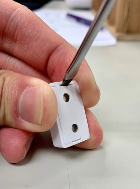

# VESTA 360

**Contact de porte filaire/capteur de choc (DCSV-29-BUS)**

DCSV-29-BUS est un capteur de contact/choc de porte filaire capable d'envoyer des signaux filaires via BUS au panneau de commande lors de la détection d'une ouverture de porte/fenêtre ou d'un bris de vitre et d'une détection de choc.

La conception du contact de porte filaire/capteur de choc se compose d'un couvercle et d'une base. Le couvercle contient tous les composants électroniques et la base fournit un moyen de fixation de l'appareil. Un interrupteur anti-sabotage sur circuit imprimé fourni offre une protection contre l'ouverture et/ou le retrait non autorisé de l'appareil.

**Identification des pièces**

.png>)

1.  **Indicateur LED/bouton de test**

\-Appuyez une fois sur le bouton pour passer en mode test pendant 3 minutes.

1.  **Vis de fixation du couvercle**
2.  **Commutateur de cavalier de résistance de borne**

Lorsque le contact de porte/capteur de choc est connecté en tant que périphérique BUS le plus éloigné sur une ligne BUS, veuillez régler le cavalier de résistance de borne du contact de porte/capteur de choc et le commutateur de cavalier du premier périphérique BUS (généralement le panneau hybride) sur ON pour servir de résistances de terminaison. La capacité de communication de la ligne BUS connectée sera améliorée.

.jpeg>).png>)

**Cavalier**

.jpeg>)

Le cavalier est inséré, reliant les deux broches.

**Cavalier**

Le cavalier est retiré ou « garé » sur une broche.

-   -   Si le cavalier est activé, la capacité de communication est améliorée.
    -   Si le cavalier est désactivé, la capacité de communication est au niveau normal.

1.  **Terminal de bus**
2.  **Interrupteur anti-sabotage**
    -   Fournit une protection contre l’ouverture et/ou le retrait non autorisé de l’appareil de la surface de montage.
3.  **Commutateur à lames interrupteur à cavalier**

.jpeg>).png>)

**Cavalier**

.jpeg>)

Le cavalier est inséré, reliant les deux broches.

**Cavalier**

Le cavalier est retiré ou « garé » sur une broche.

-   -   Cavalier activé : le commutateur à lames est**activé**. L'appareil fonctionne comme un contact de porte et un capteur de choc (par défaut).
    -   Cavalier OFF : le commutateur à lames est**désactivé**et l'appareil fonctionne uniquement comme capteur de choc.

1.  **Trous de montage**
2.  **Trous de câblage**
3.  **Aimant**
4.  **Aimant Trou de vis**
5.  **Entretoise magnétique**

1

**Caractéristiques**

.jpeg>)

-   _**Indicateur LED**_
    -   En mode de fonctionnement normal, la LED ne s'allume pas lorsque l'appareil est activé.
    -   Lorsque l'interrupteur anti-sabotage est déclenché, la LED clignote une fois. Lorsque la condition de sabotage persiste, la LED clignote une fois à chaque fois que l'appareil est déclenché.
    -   En mode Test, la LED clignote une fois à chaque fois que l'appareil est déclenché.
    -   La LED ne clignotera pas si l'autoprotection de l'appareil est normale et si l'appareil n'est pas en mode test.
-   _**Détection d'ouverture de porte et détection de choc**_

 (1).jpeg>)

Le dispositif se déclenche lors de l'ouverture d'une porte/fenêtre ou d'une détection de choc dépassant le seuil de détection.

.jpeg>)

-   _**Matériaux de surface de montage**_

L'appareil prend en charge la détection des chocs sur divers matériaux, notamment le verre, le bois, le métal et le béton. Après l'installation, vous pouvez sélectionner le matériau de la surface de montage sur le panneau de commande. La valeur par défaut est définie comme**Bois**.

.png>)

-   _**Sensibilité**_
    -   La sensibilité requise pour activer le contact de porte filaire/capteur de choc est déterminée par le panneau de commande.
    -   Trois niveaux de sensibilité sont sélectionnables :**Faible**,**Moyen**, et**Haut**. La valeur par défaut est définie comme**Moyen**.
-   _**Source de courant**_
    -   Lorsque le DCSV-29-BUS est câblé à un panneau hybride, une alimentation de 13,5 V peut être fournie par le panneau hybride.
-   _**Autoprotection**_
    -   Le contact de porte/capteur de choc filaire est protégé par un interrupteur anti-sabotage qui est enfoncé contre la surface de montage lorsque le contact de porte/capteur de choc est monté en place. Chaque fois que le contact de porte filaire/capteur de choc est retiré de la surface de montage ou que son couvercle est ouvert, l'interrupteur d'autoprotection sera activé et l'appareil enverra un signal d'ouverture d'autoprotection pour rappeler à l'utilisateur la condition.
    -   Le signal d’autoprotection sera transmis avec la transmission régulière du signal de l’appareil au panneau de commande. L'état de défaut d'autoprotection sera affiché dans la zone du dispositif DC et dans la zone du dispositif Shock Sensor sur le panneau de commande.
-   _**Surveillance**_
    -   En fonctionnement normal, le contact de porte filaire/capteur de choc enverra un signal de supervision au panneau de commande séparément à des intervalles aléatoires de 20 à 30 secondes.
    -   Si le panneau de commande n'a pas reçu le signal de supervision du contact de porte filaire/capteur de choc pendant une période de temps prédéfinie, le panneau de commande indiquera que le contact de porte filaire/capteur de choc particulier rencontre un problème de manque de signal.
-   _**Mode d'essai**_
    -   En mode normal, appuyez sur le bouton Test pour transmettre un signal de test au panneau de commande. Le contact de porte filaire/capteur de choc entrera en mode test pendant 3 minutes.
    -   En mode test, la LED clignote une fois chaque fois que le contact de porte filaire/capteur de choc est déclenché.
    -   Chaque pression supplémentaire sur le bouton Test réinitialisera la durée du mode Test à 3 minutes.
-   _**Prudence**_
    -   -   Le câblage du contact de porte/capteur de choc ne doit être effectué que par des techniciens certifiés possédant les connaissances et la formation appropriées en matière d'équipement électrique.
        -   Avant l'installation ou tout travail de maintenance, assurez-vous que l'alimentation électrique a été débranchée.

.jpeg>).jpeg>).jpeg>).jpeg>).png>)

2

-   .jpeg>)_**Câblage du contact de porte/capteur de choc**_
    -   Avant de connecter le contact de porte filaire/capteur de choc au BUS du système, veuillez couper l'alimentation.
    -   Pour faciliter les connexions des câbles, les borniers de chaque module du système BUS sont codés par couleur.

| **Rouge** | VDD  |
| --------- | ---- |
| **Noir**  | GND  |
| **Jaune** | 485A |
| **Vert**  | 485B |

-   Plusieurs appareils BUS peuvent être connectés en série au panneau hybride. Pour une communication optimale des appareils de ligne BUS connectés, assurez-vous que les commutateurs de cavalier de résistance terminale du premier (généralement le panneau hybride) et des appareils BUS les plus éloignés sur une ligne BUS sont réglés. sur ON pour servir de résistances de terminaison. Assurez-vous d'activer uniquement les 2 cavaliers susmentionnés et de ne pas régler les cavaliers sur ON pour tout autre périphérique BUS intermédiaire.

_\\<NOTE>_

-   -   La conception enfichable des borniers BUS améliore l'efficacité de l'installation. Avant le câblage, vous pouvez retirer les borniers de la carte PCB pour faciliter l'utilisation et les rebrancher après le câblage.
    -   Après avoir débranché le terminal, lors de la réinstallation du terminal sur la carte, assurez-vous d'installer le terminal dans la même direction pour éviter les dangers potentiels.
-   Des connexions incorrectes entraîneront une panne ou un mauvais fonctionnement. Inspectez le câblage et assurez-vous que les connexions sont correctes avant de mettre sous tension.

.png>)

-   _**Apprentissage**_

Veuillez suivre les étapes ci-dessous pour intégrer l'appareil au panneau hybride.

Étape 1. Connectez l'appareil au panneau. Ensuite, allumez le panneau.

Étape 2. Sur la page Web du Panel, cliquez sur «**Apprentissage**» pour accéder à la page d'apprentissage.

Étape 3. Cliquez sur «**Commencer**» pour passer en mode apprentissage.

_Une fois appris dans le panneau de commande, le DCSV-29-BUS sera reconnu comme 2 appareils distincts (contact de porte et capteur de choc) et occupera 2 zones dans le panneau._

Étape 4. Cliquez sur «**Ajouter**» pour inclure l'appareil dans le panneau.

3

Étape 5. Si le périphérique est correctement appris dans le panneau, il sera affiché dans la section « Périphérique appris ».

.jpeg>)

-   _**Matériau de réglage et niveau de sensibilité**_

Étape 1. Sélectionnez le matériau et le niveau de sensibilité sur la page Web du panneau de commande (page Paramètres du capteur).

Étape 2. Lorsque le DCSV-29-BUS reçoit la commande de programmation du panneau, la LED s'éteint d'abord, puis s'éclaire et s'assombrit. Le réglage des niveaux de matériau et de sensibilité est maintenant terminé.

-   _**Identification**_

Le "**Identifier**La fonction " est utilisée pour localiser un périphérique BUS spécifique dans le système filaire BUS. Cette fonction est utile pour distinguer quel appareil est quel appareil, en particulier dans une grande installation où de nombreux appareils sont inclus.

Pour localiser le DCSV-29-BUS dans le système BUS :

**Étape 1.**Sur la page Web du panneau hybride, cliquez sur « Identifier » sous la liste des appareils après l'entrée dans la colonne des appareils du DCSV-29-BUS.

**Étape 2.**Si le contact de porte filaire/capteur de choc reçoit le signal du panneau hybride, la page Web affichera un message de réussite et l'indicateur LED du contact de porte filaire/capteur de choc clignotera 10 fois pour indiquer à l'utilisateur où il se trouve.

_\\<NOTE>_

-   -   -   Si un message de délai d'attente s'affiche sur la page Web, cela signifie que le contact de porte filaire/capteur de choc n'a pas reçu le signal du panneau.

Veuillez vérifier si le DCSV-29-BUS est correctement connecté au panneau à une distance de câblage appropriée.

-   _**Test de marche**_
    -   Pour vous assurer que le contact de porte filaire/capteur de choc est capable de communiquer avec le panneau après son apprentissage, placez le panneau de commande en mode test de marche et appuyez sur le bouton Test du DCSV-29-BUS pour transmettre un signal de test au Panneau de contrôle.
    -   Lorsque le panneau reçoit le signal de test, il émet un bip et affiche les informations du contact de porte filaire/capteur de choc en conséquence en haut de la liste des appareils.

_\\<NOTE>_

-   S'il n'y a pas de réponse du panneau après avoir appuyé sur le bouton de test, cela signifie que le panneau n'a pas reçu le signal de test de l'appareil.

Veuillez vérifier si le DCSV-29-BUS est correctement connecté au panneau à une distance de câblage appropriée.

**Installation**

-   _**Montage du contact de porte filaire/capteur de choc**_

**Montage comme contact de porte :**

-   Le contact de porte doit être installé avec le côté marqué par la nervure face à l'aimant.
-   La distance entre le contact de porte et l'aimant ne doit pas dépasser 15 mm lorsque la porte est fermée.
-   Montez l'appareil le plus haut possible.

4

**Montage comme capteur de choc :**

Reportez-vous au tableau ci-dessous pour obtenir des informations sur l'emplacement d'installation et l'épaisseur des différents matériaux :

|                                |                  |                        | Fenêtre  | Porte en bois/métal | Mur en béton |   |
| ------------------------------ | ---------------- | ---------------------- | -------- | ------------------- | ------------ | - |
|                                |                  |                        |          |                     |              |   |
|                                | **Épaisseur**    | >5mm                   | &lt;40mm | -                   |              |   |
|                                |                  |                        |          |                     |              |   |
| **Emplacement d'installation** | Cadre de fenêtre | Porte                  | Mur      |                     |              |   |
|                                |                  |                        |          |                     |              |   |
|                                |                  | **Faible sensibilité** | 0,5M     | 0,5M                | 0,25 M       |   |
| **Détection des chocs**        |                  |                        |          |                     |              |   |
| **Sensibilité moyenne**        | 1M               | 1M                     | 0,5M     |                     |              |   |
| **Rayon**                      |                  |                        |          |                     |              |   |
|                                |                  |                        |          |                     |              |   |
|                                |                  | **Haute sensibilité**  | 1,5M     | Une mere            | 1M           |   |
|                                |                  |                        |          |                     |              |   |

-   _**Procédure de montage**_
    1.  Utilisez les 2 trous de montage sur le capot arrière comme modèle et percez des trous dans la surface à monter.
    2.  Insérez les chevilles murales fournies lorsque l'appareil doit être monté sur des cadres de fenêtre/mur en béton.
    3.  Vissez le contact de porte filaire/capteur de choc sur les chevilles murales. (Le perçage est recommandé lors du montage sur de l'acier, ou vous pouvez également utiliser l'autocollant fourni dans l'emballage).
    4.  Fixez l'aimant sur la porte à l'aide d'un petit morceau de ruban adhésif double face ou avec les vis fournies.
    5.  Pour monter l'aimant, utilisez les 2 trous de vis de l'aimant comme modèle pour le positionnement et le perçage des trous._\\<NOTE>_
        -   L'aimant doit s'aligner avec le côté marqué des nervures du contact de porte. Si nécessaire, appliquez l'entretoise magnétique à l'arrière de l'aimant pour mieux aligner l'aimant sur les marques de nervures.
    6.  Vissez l'aimant et insérez les deux capuchons blancs dans les trous de vis de l'aimant pour une intégrité esthétique.
    7.  L'installation est maintenant terminée.

5
