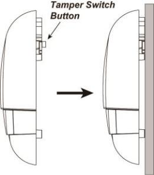

# VESTA 361

**Boîte de sonnette extérieure filaire (BX-32-BUS)**

BX-32-BUS est un boîtier de sonnerie câblé utilisé pour l'indication d'alarme système à l'extérieur d'un bâtiment. Lorsqu'un signal d'alarme est reçu du panneau de commande, la Bell Box activera sa sirène et sa lumière stroboscopique pour attirer l'attention.

La Bell Box peut également fonctionner avec le panneau de commande pour émettre des sons de délai d'entrée et de sortie, et également vous alerter en cas de violation de sabotage.

.png>)

**Identification des pièces**

1.  **Trous de montage mural x 3**
2.  **Interrupteur anti-sabotage**

L'interrupteur anti-sabotage sera activé lorsque le boîtier Bell est retiré de la surface montée ou lorsque son couvercle est ouvert.

1.  **Bouton Apprendre**
2.  **LED 3 & 2 & 1 (de gauche à droite)**
3.  **Cavalier de résistance de borne (J3)**

Lorsque la Bell Box est connectée en tant que périphérique BUS le plus éloigné sur une ligne BUS, veuillez régler le cavalier de résistance terminal de la Bell Box et le commutateur de cavalier du premier périphérique BUS (généralement le panneau hybride) sur ON pour servir de résistances de terminaison. La capacité de communication de la ligne BUS connectée sera améliorée.

.jpeg>).png>)

**Cavalier**

.jpeg>)

Le cavalier est inséré, reliant les deux broches.

**Cavalier**

Le lien de cavalier est supprimé ou "**garé**» sur une épingle.

-   -   Si le cavalier est désactivé, la capacité de communication est au niveau normal.
    -   Si le cavalier est activé, la capacité de communication est améliorée.

1.  **Borne de connexion au bus**
2.  **Trou de câblage (pour terminal BUS)**
3.  **Borne d'alimentation (entrée DC 12 V / GND) (en option)**

Connectez-vous à l'alimentation électrique.

1.  **Trou de câblage (pour borne d'alimentation)**

**Source de courant**

-   Lorsque le BX-32-BUS est câblé à un panneau hybride, une alimentation de 13,5 V peut être fournie par le panneau hybride.
-   Le BX-32-BUS peut également être alimenté en se connectant à un adaptateur AC-DC 12 V à deux fils via la borne DC 12 V. Il est recommandé d'utiliser l'adaptateur lorsqu'il est connecté à des charges nécessitant une consommation d'énergie plus importante.

1

**Supervision**

Le boîtier Bell transmettra un signal de supervision toutes les 20 à 30 secondes en mode de fonctionnement normal. Si ce signal n'est pas reçu, le panneau de commande indiquera que le boîtier Bell particulier rencontre un problème de panne.

**Aperçu des fonctions**

.png>)

-   **Mémoire d'alarme**

Si une alarme s'est déclenchée en votre absence et que le système n'a pas été désarmé avant l'expiration de la durée de l'alarme, la cloche émettra une courte alarme lorsque le système est désarmé pour avertir l'utilisateur qu'une alarme s'est déclenchée en son absence. Cela suggère que l’intrus pourrait toujours se trouver dans les locaux.

-   **Durée de l'alarme**

Lorsqu'une alarme est activée par le panneau de commande, celui-ci demandera au boîtier de sonnerie de déclencher l'alarme en fonction du réglage de la durée d'alarme du panneau. Lorsque la durée de l’alarme du panneau expire, il demandera au boîtier Bell d’arrêter l’alarme.

Si le boîtier Bell ne reçoit pas le signal du panneau de commande pour arrêter l'alarme, il déclenchera l'alarme pendant 15 minutes maximum, puis arrêtera l'alarme.

Par exemple:

-   -   Si la durée de l'alarme du panneau est réglée sur plus de 15 minutes, après l'activation d'une alarme, au lieu d'attendre l'expiration de la durée de l'alarme du panneau, la cloche cessera de déclencher l'alarme après 15 minutes.
    -   Si la centrale est en mode désarmé et que l'interrupteur anti-sabotage du boîtier Bell est déclenché, le boîtier Bell n'activera pas l'alarme puisque la centrale est en mode désarmé et activera l'alarme pendant 15 minutes en raison du déclenchement d'une auto-surveillance.
-   **Anti-sabotage de sirène**

Le boîtier Bell est protégé contre toute tentative d’ouverture du couvercle ou de détachement du boîtier Bell de sa surface de montage.

Si le boîtier Bell détecte une condition de sabotage, il activera la sirène et la lumière stroboscopique pendant la durée d'alarme programmée. Un signal d'autoprotection sera envoyé au panneau de commande avec des transmissions de signaux régulières pour que le panneau de commande affiche l'état en conséquence. Si la condition de sabotage persiste, le boîtier Bell émettra une série de cinq bips soit à chaque fois que le système est armé, soit lorsque le sabotage est activé, pour indiquer un défaut.

-   **Indication d'état audio et visuel**

Lors de l'armement/désarmement du système, le boîtier Bell utilise différentes méthodes pour distinguer différents statuts pour l'utilisateur, comme indiqué dans le tableau ci-dessous.

.png>).png>).png>)

|                           | **Son de la sirène** |                                            | **Indication de lumière stroboscopique** |
| ------------------------- | -------------------- | ------------------------------------------ | ---------------------------------------- |
|                           |                      |                                            |                                          |
| Bras/Accueil              | 1 bip                | 3                                          | Les groupes de LED clignotent une fois   |
| Désarmer                  | 2 bips               | Clignote séquentiellement pendant 1 cycle  |                                          |
| Bras (autoprotection)     | 5 bips               | 3                                          | Les groupes de LED clignotent 5 fois     |
| Désarmer (autoprotection) | 5 bips               | Clignote séquentiellement pendant 5 cycles |                                          |
| Délai d'entrée/sortie     | Compte à rebours     |                                            |                                          |
| Son                       | bips                 |                                            |                                          |

.jpeg>) (1).jpeg>).png>)

**Prudence**

-   Le câblage de la cloche extérieure ne doit être effectué que par des techniciens certifiés possédant les connaissances et la formation appropriées en matière d'équipement électrique.
-   Avant l'installation ou tout travail de maintenance, assurez-vous que l'alimentation électrique a été débranchée.

**Câblage de la boîte à cloche**

2

-   Avant de connecter le boîtier Bell au bus système, veuillez couper l'alimentation.
-   Pour faciliter les connexions des câbles, les borniers de chaque module du système BUS sont codés par couleur.

.jpeg>)

| **Rouge** | VDD  |
| --------- | ---- |
| **Noir**  | GND  |
| **Jaune** | 485A |
| **Vert**  | 485B |

-   Plusieurs appareils BUS peuvent être connectés en série au panneau hybride. Pour une communication optimale des appareils de ligne BUS connectés, assurez-vous que les commutateurs de cavalier de résistance terminale du premier (généralement le panneau hybride) et des appareils BUS les plus éloignés sur une ligne BUS sont réglés. sur ON pour servir de résistances de terminaison. Assurez-vous d'activer uniquement les 2 cavaliers susmentionnés et de ne pas régler le cavalier

passe sur ON pour tout autre appareil BUS intermédiaire.

.png>)

_\\<NOTE>_

-   -   La conception enfichable des borniers BUS améliore l'efficacité de l'installation. Avant le câblage, vous pouvez retirer les borniers de la carte PCB pour faciliter l'utilisation et les rebrancher après le câblage.
    -   Après avoir débranché le terminal, lors de la réinstallation du terminal sur la carte, assurez-vous d'installer le terminal dans la même direction pour éviter les dangers potentiels.
-   Des connexions incorrectes entraîneront une panne ou un mauvais fonctionnement. Inspectez le câblage et assurez-vous que les connexions sont correctes avant de mettre sous tension.

.jpeg>)

**Apprentissage**

Veuillez suivre les étapes ci-dessous pour intégrer le boîtier Bell au panneau hybride.

Étape 1 : Connectez le boîtier Bell au panneau. Ensuite, allumez le panneau.

Étape 2 : Sur la page Web du Panel, cliquez sur «**Apprentissage**» pour accéder à la page d'apprentissage.

Étape 3 : Cliquez sur «**Commencer**» pour passer en mode apprentissage.

Étape 4 : Cliquez sur «**Ajouter**» pour inclure le boîtier Bell dans le panneau.

Étape 5 : Si la boîte Bell est apprise avec succès dans le panneau, elle sera affichée dans la section « Appareil appris ».

3

**Identification**

La fonction « Identifier » permet de localiser un périphérique BUS spécifique dans le système filaire BUS. Cette fonction est utile pour distinguer quel appareil est quel appareil, en particulier dans une grande installation où de nombreux appareils BUS sont inclus.

Pour localiser la Bell Box dans le système BUS :

**Étape 1.**Sur la page Web du panneau hybride, cliquez sur « Identifier » sous la liste des appareils après l'entrée dans la colonne des appareils de Bell Box.

**Étape 2.**Si la Bell Box reçoit le signal du panneau hybride, la page Web affichera un message de réussite et les 3 groupes de LED de la Bell Box clignoteront 10 fois pour indiquer à l'utilisateur où elle se trouve.

.png>)

_\\<NOTE>_

-   Si un message de délai d'attente s'affiche sur la page Web, cela signifie que la Bell Box n'a pas reçu le signal du panneau.

Veuillez vérifier si la Bell Box est correctement connectée au panneau à une distance de câblage appropriée.

**Test de marche**

-   Pour vous assurer que la Bell Box est capable de communiquer avec le panneau après son apprentissage, placez le panneau de commande dans**Test de marche**mode et appuyez sur le bouton d'apprentissage de la Bell Box pour transmettre un signal de test au panneau de commande.
-   Lorsque le panneau reçoit le signal de test, il émet un bip et affiche les informations de la Bell Box en conséquence en haut de la liste des appareils.

.png>)

_\\<NOTE>_

-   S'il n'y a pas de réponse du panneau après avoir appuyé sur le bouton d'apprentissage, cela signifie que le panneau n'a pas reçu le signal de test de l'appareil.

Veuillez vérifier si Bell Box est correctement connecté au panneau à une distance de câblage appropriée.

**Installation**

Étape 1. Trouvez l'emplacement où le boîtier Bell doit être monté.

Étape 2. Dévissez la vis inférieure avec un tournevis cruciforme et retirez le capot supérieur.

Étape 3. Maintenez le boîtier Bell à l'endroit où il doit être monté.

Étape 4. Identifiez les 3 trous de montage, montez et fixez le boîtier Bell au mur à l'aide des grosses vis et chevilles fournies. Fixez les vis avec un tournevis cruciforme. Assurez-vous que l'interrupteur anti-sabotage est complètement enfoncé contre le mur.

.png>)

_\\<NOTE>_

-   L'interrupteur anti-sabotage dépasse de l'arrière de la sirène lorsque le boîtier Bell n'est pas monté en place. Lorsque la sirène est retirée du mur, l'alarme sera activée. Assurez-vous qu'il est complètement enfoncé lorsque la sirène est montée. S'il y a un espace, emballez avec un matériau d'espacement approprié.

Étape 5. Remettez en place le capot supérieur et serrez la vis inférieure avec un tournevis cruciforme.

Étape 6. Vérifiez si l'installation a réussi en testant à partir du panneau de commande avec fonction d'armement et de désarmement.

Un armement/désarmement réussi sera indiqué par le tableau fourni ci-dessus dans**Indication d'état audio et visuel**section.

.png>)

_\\<NOTE>_

-   Si 5 bips courts sont entendus lors de l'armement/désarmement, cela signifie que l'autoprotection n'est pas complètement enfoncée. Vérifiez que l'autoprotection est correctement configurée et testez à nouveau à partir du panneau de commande.

Étape 7. L'installation est maintenant terminée.

4
