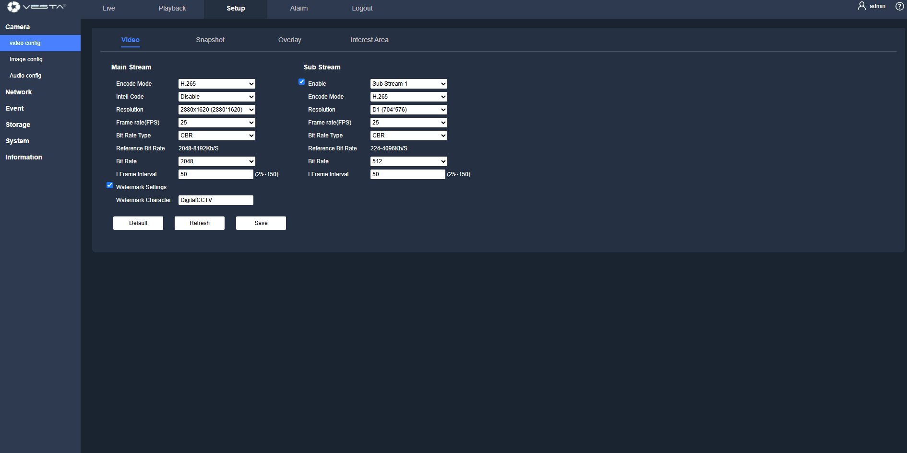

# Gamme Vesta Advanced (avec SmartHomeSec)

## Etes-vous prêt à découvrir la nouvelle gamme de caméras VESTA ADVANCED SERIES?



### Qu'est-ce que cette intégration VESTA apporte?

<figure><figcaption></figcaption></figure>

### _<mark style="background-color:yellow;">**Démarrage avec la centrale VESTA en 3 étapes**</mark>_



### Mise à jour de la caméra IP ([vidéo rapide](./#videos-rapides))

Pour mettre à jour la caméra, suivre les étapes suivantes:

1.  **Téléchargement du firmware**: Assurez-vous d'avoir téléchargé le firmware qui correspond à votre modèle de caméra depuis la liste ci-dessous:\

    <table><thead><tr><th>Modèles</th><th width="114">Firmware</th></tr></thead><tbody><tr><td><ul><li>IPC-T38-ZAS-PV-B</li><li>IPC-T38-ZAS-PV</li><li>IPC-B38-ZAS-PV-B</li><li>IPC-B38-ZAS-PV</li></ul></td><td><a href="https://gofile.me/7yryF/u9fVnKEjg">Download</a></td></tr><tr><td><ul><li>IPC-T35-AS-PV-B</li><li>IPC-T35-AS-PV</li><li>IPC-B35-AS-PV-B</li><li>IPC-B35-AS-PV</li></ul></td><td><a href="https://gofile.me/7yryF/LJPMxKDbU">Download</a></td></tr><tr><td><ul><li>IPC-D24-ZAS-L-B</li><li>IPC-D24-ZAS-L</li></ul><ul><li>IPC-T24-L</li><li>IPC-B24-L</li></ul></td><td><a href="https://gofile.me/7yryF/HYczagZrp">Download</a></td></tr></tbody></table>

2. [**Accéder à l'interface locale**](./#connexion-a-linterface-locale): Se connecter à l'interface web locale de la caméra (IP par défaut: _192.168.1.86_).
3. **Se rendre dans la configuration**: Cliquez sur le menu "Setup".
4. **Se rendre dans le menu Système**: Cliquez sur "System'.
5. **Se rendre dans le menu Mise à jour**: Cliquez sur "Upgrade" et sélectionnez le fichier précédemment téléchargé pour démarrer le processus de mise à jour.

<figure><figcaption></figcaption></figure>



### Mise à jour centrale et application SmartHomeSec


Il est important de s'assurer que la **centrale utilise  la version** **34F ou plus** et que l'**application soit en version 3.6.0 ou plus**. Ces mises à jour disposent de l'intégration. Vérifiez et mettez à jour régulièrement vos périphériques pour conserver la compatibilité et maintenir une performance optimale.




### Ajouter une caméra à la centrale

1. **Vérification réseau:** Assurez-vous que la caméra et le centrale VESTA soient connectées sur le même réseau.
2. **Configuration app SmartHomeSec:**
   * Ouvrir l'app et se connecter avec le **compte utilisateur maître**.
   * Se rendre dans le menu "**Caméras**" et choisir l'option "**VESTA ADVANCED**."
3. **Recherche de caméra:**
   * Le système commencera à **scanner le réseau pour trouver les nouvelles caméras automatiquement**.
4. **Choix de la caméra:**
   * Choisir l'une des caméras de la liste et saisir **l'identifiant et le mot de passe**. Utilisez les mêmes identifiants que ceux utilisés lors de la connexion à l'interface web locale de la caméra.



<figure><figcaption></figcaption></figure>

## Vidéos rapides

### Comment mettre à jour une caméra ou un NVR VESTA ADV - étape par étape



### _<mark style="background-color:yellow;">Comment configurer l'enregistrement continu sur la carte MicroSD de la caméra IP:</mark>_

1. **Configuration du stockage:**
   * Se rendre dans le menu "**Storage**".
   * Cliquez sur "Destination" et assurez-vous que "**Schedule**" soit activé.
   * Dans "**Schedule**" assurez-vous tout soit activé 24/7 ou sur les jours désirés.

<figure><figcaption></figcaption></figure>

### **Connexion à l'interface locale:**&#x20;


**Etape 1:** Ouvrir un navigateur, saisir l'adresse IP de la caméra dans la barre d'adresse (par défaut **192.168.1.86**) puis valider.

**Etape 2:** Saisir l'identifiant et le mot de passe, **l'identifiant pas défaut est “admin”**.

.png>)

**Etape 3:** Lorsque vous vous connectez pour la première fois, la caméra affichera une demande de changement mot de passe. Veuillez saisir un mot de passe pour le compte administrateur et le conserver.

.png>)

**Reset du mot de passe:** Si l'utilisateur oublie le mo de passe, cliquez sur Reset Password pour obtenir une clé. Une fois cette clé envoyé à nos techniciens, une nouvelle clé de décodage sera générée pour l'utilisateur et le **mot de passe** sera forcé à sa valeur **par défaut** **“123456”.**


### _<mark style="background-color:yellow;">Gamme VESTA ADVANCED manuel complet (anglais)</mark>_



### _<mark style="background-color:yellow;">Guide rapide (anglais)</mark>_




_**Plus d'informations prochainement disponibles.**_


