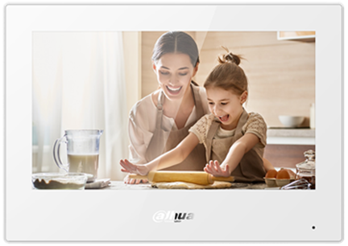

# Integration Guide for DAHUA VTH Monitors with VESTA

<figure><figcaption></figcaption></figure>

<figure><figcaption>
VTH
</figcaption></figure>

This is an integration guide for VTH monitors (models VTH5321GW-W, VTH5321GB-W, VTH5341G-W) with VESTA. This integration allows you to control the panel—Security, Scenes, and device listing—directly from the VTH monitor.

### Integration features

<figure><figcaption>
VTH5321GW-W; VTH5321GB-W; VTH5341G-W
</figcaption></figure>

* Change panel modes from VTH
* Check Status of each partition&#x20;
* List devices that can be overridden&#x20;
* Apply Scenes&#x20;
* Review event log

### Before You Start

Before beginning the integration, you must update the VTH to include the integration package:

**VERSION 1.0 (**<mark style="color:red;">Deprecated</mark>**)**\
**Customer\_VTH53X1\_MultiLang\_SIP\_V4.400.00BY000.0.R.20241203.bin**\
[Download the update](https://drive.google.com/file/d/1ZrdeRizv-VHpTvorulqKDoywTdrPXQCa/view?usp=drive_link)

**VERSION 2.0** (<mark style="color:green;">NEW</mark>)

Customer\_VTH53X1\_MultiLang\_SIP\_V4.400.00BY000.0.T.20250327.zip

[Download the update](https://drive.google.com/file/d/1f4012VX1Ealt-zi62zF4abYr2YLzi9ug/view)

### **Adding VESTA to VTH**&#x20;

Follow these steps to add your VESTA security system to the VTH:

1. **Access VTH Settings:** On your VTH device, press and hold the settings button (usually located on the right). This button is often represented by a gear icon.
2. **Enter Password:** When prompted, enter the default password: `123456`
3. **Select VESTA:** From the settings menu, choose the "VESTA" option.
4. **Enter Panel Information:** You will need to provide the following information:
   * **Local IP of Panel:** Enter the local IP address of your VESTA panel. This is the IP address assigned to the panel on your home network.
   * **Port:** 80
   * **User:** Enter the username for accessing the VESTA panel. This is often 'admin'.
   * **Password:** Enter the password for accessing the VESTA panel.
   * **Mac**: Mac adress of your VESTA panel


**Important:** It's crucial to initialize the panel before use. Access the local web portal by entering the VESTA panel's IP address in your browser. Use the default credentials to log in, initialize the panel, and set a new password to ensure security.

**Default local web access information:**

User: admin
\
Password: cX+HsA\*7F1



Remember that if the web interface is not accessible, restart the control panel.


1. **Save Settings:** After entering the information, save the settings within the VTH device.

### Troubleshooting:

* **Unable to Connect:**
  * Ensure the VTH device and the VESTA panel are on the same local network.
  * Double-check the IP address of the VESTA panel.
  * Verify the username and password are correct.
  * Check your router's firewall settings to ensure that the VTH device can communicate with the VESTA panel.
* **Incorrect Password:**
  * If you have changed the password on the VESTA panel's local web interface, ensure you are using the correct, updated password.
