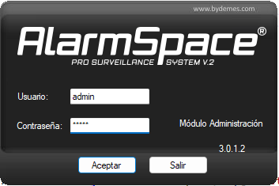

# VESTA006

-   Manuale dell'utente del contatto ottico per porta (OPDC-1).

Il contatto ottico della porta, che integra un sensore a infrarossi, monitora l'apertura/chiusura di dispositivi specifici (ad esempio porta o finestra). Utilizzando la tecnologia di rilevamento a infrarossi, l'OPDC può rilevare se la porta o la finestra è aperta o chiusa, senza la necessità di un magnete aggiuntivo. L'OPDC trasmetterà segnali di allarme quando rileva un cambiamento e manterrà la tua casa protetta.

Il contatto ottico per porta è costituito da una copertura e da una base. La base contiene tutta l'elettronica e fornisce un mezzo per fissare il dispositivo. Un interruttore antimanomissione PCB incluso fornisce protezione contro l'apertura non autorizzata del dispositivo.

_**Identificazione delle parti**_

1.  **Indicatore LED**
2.  **Pulsante Impara/Test**
    -   Premere il pulsante Test per trasmettere un codice di apprendimento.
    -   Premere una volta il pulsante Test per accedere alla modalità Test per 3 minuti.
3.  **Manomettere**
4.  **Batteria**
5.  **Area di rilevamento degli infrarossi**
6.  **Adesivo riflettente**

-   _**Indicatore LED**_

Nella modalità di funzionamento normale, l'indicatore LED rimane spento tranne nelle seguenti situazioni:

-   Quando viene attivato l'interruttore antimanomissione del contatto ottico della porta.
-   Ogni volta che il contatto ottico della porta viene attivato in condizioni di manomissione o batteria scarica.
-   Ogni volta che il contatto della porta viene attivato e trasmette il segnale in modalità test.
-   _**Supervisione**_
-   Il contatto ottico della porta trasmetterà automaticamente periodicamente i segnali di supervisione al pannello di controllo a intervalli casuali da 30 a 50 minuti in modalità di funzionamento normale.
-   Se il pannello di controllo non ha ricevuto il segnale dal contatto ottico della porta per un periodo di tempo prestabilito, il pannello di controllo indicherà che quel particolare contatto della porta sta riscontrando un problema di segnale assente.
-   _**Interruttore antimanomissione**_
-   È progettato per proteggere dall'apertura non autorizzata del coperchio. Quando viene attivato il tamper, il contatto ottico della porta emetterà un segnale alla centrale di controllo per la segnalazione, inoltre il LED si accenderà.
-   _**Batteria**_

Il contatto ottico della porta ne utilizza uno**Batteria alcalina AAA da 1,5 V**come fonte di alimentazione ed è anche in grado di rilevare la batteria scarica. Quando la batteria è scarica, un segnale di batteria scarica verrà inviato alla centrale insieme alla trasmissione regolare. Il LED si accenderà quando il contatto della porta viene attivato in condizioni di batteria scarica. Quando la batteria è scarica, il contatto ottico della porta interromperà tutte le funzioni e il LED lampeggerà ogni 4 secondi.

-   _**Sostituzione della batteria**_

Tenere premuta l'area del pulsante Apprendimento/Test e sollevare delicatamente il coperchio anteriore. Rimuovere la vecchia batteria come mostrato nella Figura 1, quindi premere il pulsante Impara/Test 5-6 volte per scaricarla completamente. Inserire una nuova batteria e riposizionare il coperchio, come mostrato nella Figura 2.

| Figura 1                                                      | figura 2                                                      |
| ------------------------------------------------------------- | ------------------------------------------------------------- |
|  |  |

-   _**Modalità di prova**_

Il contatto ottico della porta può essere messo in modalità test per 3 minuti premendo una volta il pulsante test sul coperchio anteriore. Durante la modalità Test, l'indicatore LED si accenderà al momento dell'attivazione. Ad ogni pressione del pulsante Test, il contatto ottico della porta trasmetterà un segnale di test al pannello di controllo per il test della portata radio e ripristinerà la modalità test alla durata di 3 minuti. Uscirà automaticamente dalla modalità test dopo 3 minuti e ritornerà alla modalità di funzionamento normale.

-   _**Iniziare**_

Passaggio 1: utilizzare un cacciavite a testa piatta per inserirlo nel foro di apertura del coperchio nella parte inferiore.

Passaggio 2: spingere delicatamente il cacciavite a testa piatta verso l'alto e rimuovere il coperchio superiore.

Passaggio 3: inserire la batteria nel vano batteria. Si prega di evitare di fissare direttamente l'area di rilevamento degli infrarossi

quando è in funzione.

Passo 4: Mettere il Pannello di Controllo in modalità apprendimento, fare riferimento al manuale del Pannello di Controllo per i dettagli.

Passaggio 5: premere il pulsante Test sul contatto ottico della porta per inviare il segnale al pannello di controllo.

Passo 6: Se il Pannello di Controllo riceve correttamente il segnale, il Pannello di Controllo dovrebbe rispondere (ad esempio emettendo dei segnali acustici). Fare riferimento al manuale del pannello di controllo per completare il processo di apprendimento.

Passo 7: Dopo aver appreso il contatto ottico della porta, inserire il pannello di controllo in “**Prova della camminata**" modalità. Tenere il contatto ottico della porta nella posizione desiderata e premere il pulsante Test per confermare se questa posizione rientra nel raggio del segnale del pannello di controllo.

Passaggio 8: quando sei soddisfatto del contatto ottico della porta nella posizione scelta, procedi con l'installazione.

-   _**Montaggio del contatto porta**_

Trovare un luogo adatto per installare il contatto porta. Si consiglia di installare il contatto ottico della porta sull'oggetto più fisso (come il telaio della porta o del telaio della finestra). Assicurarsi che la posizione rientri nel raggio del segnale del pannello di controllo prima del montaggio.

Passaggio 1: la superficie di montaggio deve essere pulita, asciutta e liscia. Se necessario, pulire la superficie di montaggio con uno sgrassatore adatto.

Passaggio 2: rimuovere la copertura protettiva da un lato del cuscinetto biadesivo. Applicare sul retro del dispositivo e premere con decisione per 30 secondi per garantire un buon contatto.

Passaggio 3: rimuovere l'altro coperchio e premere con decisione il contatto ottico della porta nella posizione desiderata. Si prega di evitare di applicare il tampone adesivo su una superficie irregolare o di riapplicarlo.

Passaggio 4: contrassegnare la posizione per l'adesivo riflettente. L'adesivo rifrangente va applicato sul**opposto**lato dell'area di rilevamento degli infrarossi. Il divario non dovrebbe essere superiore a**zm**quando la porta/finestra è chiusa.

Passaggio 5: applicare l'adesivo riflettente. Si prega di evitare di applicare l'adesivo riflettente su una superficie irregolare o di riapplicarlo.

\\<Note>

-   Si prega di NON applicare il tampone adesivo su una superficie con vernice scrostata o screpolata o su una superficie ruvida.
-   Si prega di notare che il nastro adesivo 3M non può essere riutilizzato.
-   Si prega di NON esporre l'area di rilevamento a infrarossi alla luce solare diretta.
