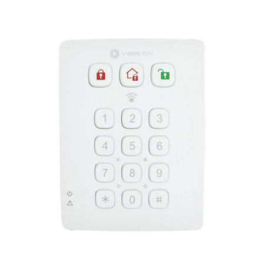

# vesta-012\_it

***

coperturaY: 0 disposizione: copertina: visibile: falso dimensione: eroe titolo: visibile: vero descrizione: visibile: falso sommario: visibile: vero contorno: visibile: vero impaginazione:

```
visible: true
```

***

## VESTA012

### GUIDA VELOCE

<figure><figcaption><p>VESTA-012 - KPT-39N-F1</p></figcaption></figure>

**Per aggiungere la tastiera nel pannello VESTA:**

Passaggio 0: inserire il pannello**modalità apprendimento**

Passaggio 1: premere\[\*] +\[# ] per 3 secondi per far apprendere la tastiera alla centrale

\[❓] Come mettere il pannello in modalità apprendimento da**SmartHomeSec**



### CERTIFICAZIONI

EN50131 Grado 2, Classe II

### MANUALE

TASTIERA REMOTA (KPT-39N) Si tratta di VESTA-012

* _**Identificazione delle parti**_

 (1).png>)

| <ol><li>Chiave del braccio</li><li>Chiave di casa</li><li>Tasto di disinserimento</li><li>Allarme Panico (se abilitato)</li></ol><p>- premere sia 1 che 3 per attivare l'allarme antipanico</p><ol><li>Allarme incendio (se abilitato)</li></ol><p>- premere sia 4 che 6 per attivare l'allarme antincendio</p><ol><li>Allarme medico (se abilitato)</li></ol><p>- premere sia 7 che 9 per attivare l'allarme medico</p><ol><li>Invia codice di apprendimento</li></ol><p>- premere ＊ quindi il tasto 7 (in modalità test)</p><p>- premere entrambi i tasti # e 🞸 (in modalità di funzionamento normale)</p> | <ol><li># Chiave</li></ol><p>- premere per verificare la modalità corrente del sistema</p><ol><li>🞸 Chiave</li><li>LED di errore (LED arancione)</li><li>LED di alimentazione (LED verde)</li><li>Area di rilevamento per etichetta NFC</li></ol><ul><li>avvicinare l'etichetta NFC all'area di rilevamento per accedere al sistema di allarme</li></ul><ol><li>Interruttore antimanomissione</li><li>Fori di montaggio</li><li>Etichetta NFC</li></ol> |
| ------------------------------------------------------------------------------------------------------------------------------------------------------------------------------------------------------------------------------------------------------------------------------------------------------------------------------------------------------------------------------------------------------------------------------------------------------------------------------------------------------------------------------------------------------------------------------------------------------------- | -------------------------------------------------------------------------------------------------------------------------------------------------------------------------------------------------------------------------------------------------------------------------------------------------------------------------------------------------------------------------------------------------------------------------------------------------------- |

\\

* Verrà emesso un breve segnale acustico insieme alla pressione del tasto per indicare che il pulsante premuto è valido.
* Verranno emessi 4 segnali acustici continui che indicano l'errore e l'utente dovrà ripetere nuovamente il processo.
* _**Indicatore LED**_
* **LED di alimentazione (verde):**
  *
    * Acceso per 5 secondi: dopo il completamento con successo di una sequenza di tasti valida.
    * Lampeggia per 5 secondi: batteria scarica in modalità di funzionamento normale.
    * Se il LED di alimentazione si spegne prima del completamento di una sequenza di tasti valida, i tasti immessi in precedenza verranno ignorati.
* **LED di guasto (arancione):**
  *
    * Tasto di disinserimento e LED arancione accesi insieme a 5 segnali acustici: memoria allarme (dipende dalla centrale).
    * Veloce:
* Solo Flash: Nessuna risposta inviata dalla centrale entro 10 secondi.
* Lampeggia insieme a 2 segnali acustici: Richiesta di modalità Home durante la modalità Arm.
* Lampeggia insieme a 3 segnali acustici: richiesta di modalità Home o Arm quando esiste una condizione di guasto.
* Lampeggia insieme a 4 bip: il codice PIN non è corretto.
* _**Operazione generale**_
* Accedere alla modalità Test: inserire il codice PIN della tastiera e quindi premere il tasto ＊.
* Allarme panico — Premere**1**tasto +**3**chiave contemporaneamente. (se la funzione è abilitata)
* Allarme incendio — Premere**4**tasto +**6**chiave contemporaneamente. (se la funzione è abilitata)
* Allarme medico — Premere**7**tasto +**9**chiave contemporaneamente. (se la funzione è abilitata)
* Controllare lo stato del pannello di controllo - Modalità normale Premere\*\*#\*\*chiave.
* Abilita/Disabilita il suono di ingresso e uscita: premere**1**tasto +**2**contemporaneamente per 2 secondi. (La tastiera emetterà un segnale acustico lungo per indicare che la funzione è abilitata ed emetterà 2 segnali acustici brevi per indicare che la funzione è disabilitata.)
* _**Energia**_
* La tastiera remota utilizza una batteria al litio CR123 da 3 V come fonte di alimentazione.
* La tastiera remota può anche rilevare lo stato della batteria. Se la tensione della batteria è bassa, il LED di alimentazione lampeggerà per 5 secondi durante il funzionamento. Il segnale di batteria scarica verrà inviato insieme alle regolari trasmissioni di segnali al pannello di controllo per visualizzare di conseguenza lo stato.
* Prima della spedizione, la batteria viene preinstallata in fabbrica.
* Quando si cambia la batteria, premere un tasto qualsiasi un paio di volte per scaricarla prima di inserire la nuova batteria.
* _**Funzionalità di risparmio energetico**_
* Quando è inattivo, la tastiera remota è inserita**Stand-by**modalità e non consuma energia. Si attiverà e**svegliati**per 5 secondi quando si preme un tasto qualsiasi.
* Dopo 5 secondi di inattività dei tasti, l'alimentazione si spegne e ritorna t**o In attesa**modalità.
* _**Protezione antisabotaggio**_
* La tastiera è protetta contro qualsiasi tentativo di aprire il coperchio o di staccare la tastiera dalla superficie di montaggio.
* La protezione antimanomissione è disabilitata quando la tastiera è in modalità test.
* _**Iniziare**_

Passo 1. Mettere il pannello di controllo in modalità apprendimento.

Passaggio 2. Aggiunta della tastiera remota al pannello di controllo:

**Modalità di prova:**

1. Mettere la tastiera remota in modalità Test inserendo il codice PIN KP (predefinito:**0000**), quindi premere\*\*＊\*\*chiave.

I tre.png>).png>).png>)I LED si accenderanno insieme ad un lungo segnale acustico.

1. Premere quindi il tasto ＊**7**tasto per trasmettere il segnale di apprendimento. La tastiera remota emetterà un lungo segnale acustico.

**Funzione modalità test:**

1. Premere il tasto ＊ e quindi il tasto 1: accedere alla modalità di apprendimento/gestione dell'etichetta NFC.
2. Premere il tasto ＊ e poi il tasto 2 — Abilita la funzione Allarme antipanico a doppio tasto
3. Premere il tasto ＊ e poi il tasto 3: attiva la funzione Allarme incendio a doppio tasto
4. Premere il tasto ＊ e poi il tasto 4: attiva la funzione di allarme medico a doppio tasto
5. Premere il tasto ＊ e poi il tasto 5: disabilita tutte le funzioni Dual Key (impostazione predefinita)
6. Premere il tasto ＊ e poi il tasto 6: modifica il codice PIN della tastiera

..Accedere**Vecchio**Codice PIN tastiera, quindi premere\*\*＊\*\*chiave

..Accedere**Nuovo**un nuovo codice PIN della tastiera a 4 cifre, quindi premere\*\*#**chiave**.\*\*

1. Premere il tasto ＊ e poi il tasto 8 — Abilita la funzione Inserimento/Casa senza codice PIN.

_(Per favore riferisci a "**Inserimento/Home senza codice PIN del pannello di controllo**" per i dettagli, pagina 4)._

1. Premere il tasto ＊ e poi il tasto 9 — Abilita la funzione Inserimento/Casa con il codice PIN utente del pannello di controllo (impostazione predefinita).

(_Per favore riferisci a "**Inserimento/Home con codice PIN del pannello di controllo**" per i dettagli, pagina 4_).

\\

* Se la tastiera remota non emette un segnale acustico lungo, significa che la tastiera remota non ha inviato il codice di apprendimento al pannello di controllo, premere il tasto ＊ quindi**7**premere nuovamente il tasto per inviare il codice di apprendimento.
* Se il pannello di controllo riceve il codice di apprendimento, visualizzerà le informazioni di conseguenza. Fare riferimento al manuale operativo del pannello di controllo per completare il processo di apprendimento.
* Dopo che la centrale di controllo ha ricevuto il segnale dalla tastiera remota, invierà un riconoscimento alla tastiera remota. La tastiera remota emetterà quindi 3 segnali acustici per confermare che la conferma è stata ricevuta. Se la tastiera remota non emette 3 segnali acustici, riavviare la procedura di apprendimento.

Passo 3. Dopo aver appreso la tastiera remota, inserire il pannello di controllo**Prova della camminata**modalità, tenere la tastiera remota nella posizione desiderata e inviare il codice di apprendimento al pannello di controllo per confermare che questa posizione rientra nel raggio del segnale del pannello di controllo. Per inviare il codice di apprendimento, premere il pulsante\*\*＊**chiave allora**7**tasto in modalità test o premerli entrambi**#**E**＊\*\*tasti insieme in modalità di funzionamento normale.

Passaggio 4. Quando si è soddisfatti del funzionamento della tastiera remota nella posizione scelta, è possibile procedere con il montaggio della tastiera remota seguendo i passaggi descritti di seguito (fare riferimento a "_**Montaggio Tastiera remota**" per dettagli)_.

Passaggio 5. Premere il tasto Disarma**due volte**per uscire dalla modalità Test e l'installazione sarà completata. La tastiera remota emetterà un lungo segnale acustico e tre LED della modalità sistema si spegneranno. La tastiera remota ritorna alla modalità di funzionamento normale.

\\

* La tastiera remota uscirà automaticamente dalla modalità Test dopo 5 minuti di inattività e tornerà alla modalità Stand-by. Tutti i LED si spegneranno e la tastiera emetterà un lungo bip.
* _**Procedure di apprendimento/cancellazione/installazione delle etichette NFC**_

NFC sta per Near Field Communication, ovvero una tecnologia di comunicazione wireless che stabilisce la connessione tra due dispositivi avvicinandoli. È possibile memorizzare un codice PIN utente in un'etichetta NFC e utilizzare l'etichetta NFC per accedere al sistema di allarme senza inserire un codice PIN utente su KPT-39N. La tastiera può apprendere fino a 100 etichette NFC con un massimo di 50 codici PIN.

_**A. Procedura di apprendimento NFC:**_

Passaggio 1. Abilitare prima la tastiera remota per accedere alla modalità Test. Immettere il codice PIN della tastiera (predefinito:**0000**) seguito dal tasto ＊. Durante l'immissione del codice PIN, il**LED di alimentazione**(Verde) si accenderà. IL**LED di alimentazione**si spegnerà ed emetterà un lungo segnale acustico.

Passaggio 2. Premere il tasto ＊ e poi**1**per accedere alla modalità di apprendimento dell'etichetta NFC. IL**LED di guasto**(Arancione) si accenderà ed emetterà un lungo segnale acustico.

Passaggio 3. Immettere un nuovo codice PIN seguito dal tasto #. La tastiera emetterà un lungo segnale acustico e il LED arancione inizierà a lampeggiare per 5 secondi per indicare che è pronta per apprendere un'etichetta NFC.

Passaggio 4. Entro 5 secondi, posizionare un'etichetta NFC vicino all'area di rilevamento della tastiera per associarla al codice PIN utente appena inserito.

* Ciascuna etichetta abbinata ripristinerà il tempo di apprendimento dell'etichetta NFC a 5 secondi. Puoi abbinare più etichette ad un unico Codice Utente applicando le etichette una per una.
* La tastiera uscirà dalla modalità di apprendimento delle etichette NFC dopo 5 secondi di inattività.
* Se l'etichetta appresa è nuova la Tastiera emetterà 2 beep brevi.
* Se l'etichetta appresa esiste già in Tastiera (assegnata ad un altro Codice PIN), la Tastiera emetterà 1 breve beep.

Passaggio 5. Per apprendere un'altra etichetta, ripetere dal passaggio 3 al passaggio 4. La tastiera uscirà automaticamente dalla modalità di apprendimento etichetta NFC dopo essere rimasta inattiva per 5 secondi.

Passaggio 6. Premere.png>)tasto per uscire dalla modalità di apprendimento dell'etichetta NFC.

* Condizione di errore:
* Se il codice utente della centrale inserito supera il numero massimo di cifre del codice PIN, il LED arancione lampeggerà insieme a 4 brevi segnali acustici per indicare l'errore.
* Se la tastiera ha già memorizzato 50 codici PIN della centrale, emetterà 4 brevi segnali acustici per indicare l'errore quando si tenta di inserire il 51° codice PIN.
* Se la tastiera ha già appreso 100 etichette NFC, emetterà 4 brevi segnali acustici per indicare l'errore quando si tenta di apprendere la 101a etichetta NFC.

_**B. Procedura di cancellazione NFC:**_

È possibile cancellare le informazioni sull'etichetta NFC.

Passaggio 1. Abilitare prima la tastiera remota per accedere alla modalità Test. Immettere il codice PIN della tastiera (predefinito:**0000**) seguito dal tasto ＊. Durante l'immissione del codice PIN, il**LED di alimentazione**(Verde) si accenderà. IL**LED di alimentazione**si spegnerà ed emetterà un lungo segnale acustico.

Passaggio 2. Premere il tasto ＊ e poi**1**per accedere alla modalità di apprendimento dell'etichetta NFC. IL**LED di guasto**(Arancione) si accenderà ed emetterà un lungo segnale acustico.

Passaggio 3. Se si desidera rimuovere un codice PIN del pannello di controllo memorizzato nella tastiera e tutte le etichette NFC assegnate a questo codice PIN, inserire il codice utente del pannello di controllo e premere il tasto ＊, verrà emesso un lungo segnale acustico.

Se desideri cancellare solo un'etichetta NFC specifica, premi il tasto ＊ con un lungo segnale acustico e il LED arancione lampeggerà per 5 secondi. Posiziona un'etichetta NFC vicino all'area di rilevamento della tastiera entro 5 secondi:

* Se l'etichetta NFC applicata esiste nella tastiera, la tastiera emetterà 2 brevi segnali acustici per indicare che i dati dell'etichetta NFC sono stati rimossi.
* Se l'etichetta NFC applicata non esiste nella tastiera, la tastiera emetterà 4 brevi segnali acustici per indicare l'errore.
* Ogni etichetta NFC applicata ripristinerà il timer di rimozione dell'etichetta NFC su 5 secondi; è possibile rimuovere più NFC

etichette applicandole una per una.

Passaggio 4. La tastiera uscirà automaticamente dalla modalità di rimozione dell'etichetta NFC dopo essere rimasta inattiva per 5 secondi.

 (1) (1).jpeg>)Passaggio 5. Premere (1).png>)tasto per uscire dalla modalità di apprendimento dell'etichetta NFC.

_**C. Procedura di installazione NFC**_

Le piccole etichette NFC possono essere posizionate sul retro di smartphone, carte o portachiavi per un facile accesso.

Passaggio 1. Apprendi l'etichetta NFC sulla tastiera remota

Passaggio 2. Rimuovere la copertura protettiva sull'etichetta NFC.

Passaggio 3. Applica l'etichetta NFC sulla cover posteriore del tuo cellulare, ecc.

Passaggio 4. Ora puoi utilizzare l'etichetta NFC per accedere al sistema.

**\\**

* Fare attenzione a non piegare l'etichetta NFC, altrimenti potrebbe danneggiarsi e diventare inutilizzabile.
* KPT-39N supporta solo il protocollo ISO 14443A per l'etichetta NFC.
* _**Controllo della modalità di sistema**_

Dopo aver terminato l'apprendimento della tastiera nel pannello di controllo del sistema di allarme, l'utente può modificare il sistema utilizzando la tastiera.

Esistono due modi per inserire il sistema.

1. Inserimento Totale/Home Inserimento del sistema inserendo il codice PIN utente del pannello di controllo.
2. Inserimento Totale/Home Inserimento del sistema senza inserire il codice PIN utente del pannello di controllo.

Il disinserimento del sistema richiede sempre l'immissione del codice PIN utente del pannello di controllo.

**Inserimento/Home con codice PIN del pannello di controllo:**

In modalità Test, premendo il tasto ＊ e poi**9**Tasto per abilitare la funzione Inserimento/Casa con codice PIN.

Etichetta NFC. Se la centrale non presenta guasti e l'inserimento è avvenuto con successo, il (1).png>)Il LED si accenderà insieme a

un lungo segnale acustico.

emette un segnale acustico.

5 bip.

**Inserimento/Home senza codice PIN del pannello di controllo:**

Nella modalità Test, premendo il tasto ＊ e poi**8**Tasto per abilitare la funzione Inserimento/Home senza codice PIN

insieme ad un lungo segnale acustico.

insieme a 3 segnali acustici.

un'etichetta. Se il disarmo ha esito positivo, il.png>)Il LED si accenderà insieme a 2 segnali acustici. Se c'è\*\*Memoria allarme,\*\*IL.png>)Il LED e il LED di guasto si accendono insieme a 5 segnali acustici.

* _**Suono di entrata/uscita**_
* Dopo che il suono di entrata/uscita è stato attivato premendo**1**tasto +**2**contemporaneamente per 2 secondi (indicato da un lungo segnale acustico), la tastiera emetterà dei segnali acustici quando il timer di entrata/uscita è attivato.
* Dopo che il suono di entrata/uscita è stato disattivato premendo**1**tasto +**2**contemporaneamente per 2 secondi (indicati da due brevi segnali acustici), la tastiera rimarrà silenziosa quando viene attivato il timer di ingresso/uscita.
* _**Condizioni di guasto**_

_Quando la tastiera remota è sotto**MODALITÀ DI FUNZIONAMENTO NORMALE,**_

*
  1. Quando esiste una condizione di guasto nella centrale di controllo, se si utilizza la tastiera per inserire la centrale, il LED guasto lampeggerà insieme a 3 segnali acustici per indicare la condizione di guasto.
  2. Quando la tastiera disinserisce la centrale, il.png>)Il LED si accenderà insieme a due segnali acustici che indicano il normale funzionamento.
  3. Se si immette un codice PIN KP errato per 4 volte entro 10 minuti in modalità test, KP disabiliterà la funzione del tasto per 1 minuto e tutti i LED lampeggeranno 3 volte insieme a 6 segnali acustici. Dopo 1 minuto, emetterà un lungo segnale acustico per indicare che la funzione dei tasti è tornata alla normalità.
  4. Se si immette un codice PIN KP errato per 4 volte entro 10 minuti quando si cambia la modalità di sistema, KP disabiliterà la funzione chiave per 5 minuti. Dopo 5 minuti, la tastiera emetterà un lungo segnale acustico per indicare che la funzione della chiave è tornata normale.
* _**Ripristino delle impostazioni di fabbrica**_

Il ripristino della tastiera alle impostazioni di fabbrica ripristinerà il codice PIN della tastiera su 0000 e cancellerà tutta la memoria di apprendimento della centrale.

_**Ripristina le impostazioni di fabbrica:**_

Passaggio 1 Rimuovere le batterie e rilasciare il tamper.

Passaggio 2 Se “**Inserimento/Home con codice PIN del pannello di controllo**" è selezionato il metodo, tenere premuto**3**chiave mentre si reinserisce la batteria.

.Se "**Inserimento/Home senza codice PIN del pannello di controllo**" è selezionato il metodo, tenere premuto**4**chiave mentre si reinserisce la batteria.

Passaggio 3 Continuare a premere**3**finché il KP non emette 3 segnali acustici per indicare l'avvenuto ripristino.

.Continuare a premere il tasto 4 finché KP non emette 4 segnali acustici per indicare il ripristino avvenuto con successo.

Passaggio 4 Rilascio**3**o 4, il processo di ripristino è completo. Dopo il ripristino, il codice PIN ritorna ai valori predefiniti di fabbrica,**0000**.

.La tastiera remota avrà bisogno di un nuovo processo di apprendimento per iniziare a funzionare.

* Ogni volta che la tastiera viene rimossa dal pannello di controllo, è necessario ripristinare anche le impostazioni di fabbrica per cancellare la memoria del pannello di controllo.
* _**Montaggio della tastiera remota**_

Per montare la tastiera remota:

1. Rimuovere il coperchio anteriore.
2. Utilizzando i 2 fori di montaggio della cover posteriore come modello, delimitare le posizioni nel punto più appropriato.
3. Inserire i tasselli se si fissa su una superficie in gesso o mattoni.
4. Avvitare la tastiera remota ai tasselli.
5. Sostituire il coperchio anteriore.
