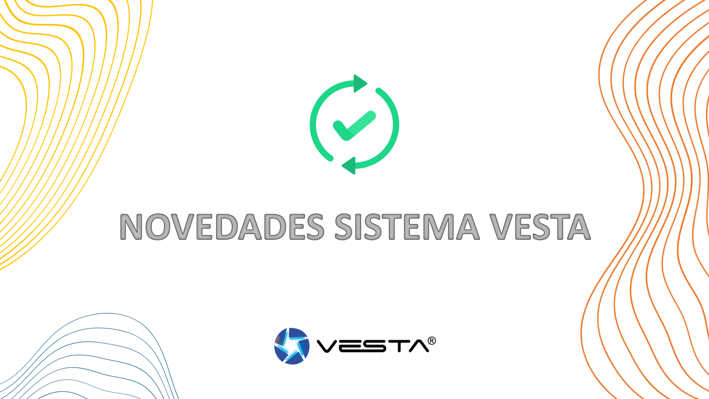

# VESTA028

DI/DO Module (DIO-52-B)

Questo modello è VESTA-028

introduzione

DIO-52-B è un modulo DI/DO che integra dispositivi cablati in reti wireless per creare risposte automatizzate e migliorare la sicurezza e la comodità.

Il modulo DI/DO dispone di terminali di ingresso digitale e di uscita digitale integrati. Può essere collegato a un singolo sensore, interruttore o dispositivo per ricevere il comando di accensione/spegnimento dal pannello di controllo tramite DO e restituire lo stato corrente tramite DI al pannello.

Il DIO-52-B può anche essere collegato a dispositivi separati. Con la regola Home Automation impostata nel Pannello, il dispositivo collegato al suo punto DI può essere trasformato nel trigger di eventi e il suo punto DO nel risponditore di eventi. Quando viene selezionata la “Modalità Follower ingresso” nel pannello di controllo, il terminale DO è interconnesso al terminale DI e il dispositivo terminale DO verrà attivato dal trigger del dispositivo terminale DI.

**Coperchio superiore****Base**

.png>)

**Identificazione delle parti**

1.  **Pulsante di prova**

Premere una volta per inviare un codice di apprendimento al pannello di controllo.

1.  **Indicatore LED**

L'indicatore LED si accende nelle seguenti condizioni:

-   Lampeggia 6 volte:

Quando il terminale di ingresso viene attivato o quando l'interruttore trasmette un segnale.

-   Lampeggia 3 volte:

Quando viene attivato il terminale di uscita.

-   Lampeggia una volta ogni 4 secondi:

Le batterie sono estremamente scariche e devono essere sostituite.

1.  **Compartimento della batteria**
2.  **Terminale di alimentazione**
3.  **Digital Input (DI) Terminal**
4.  **Terminale di uscita digitale (DO).**

-   Quando si collega il cavo a ciascun terminale, utilizzare un mini cacciavite Phillips per avvitare/svitare il terminale. Evitare l'uso di un cacciavite a testa piatta, che potrebbe causare graffi.

1.  **Fori di montaggio**
2.  **Morsetti antistrappo**

I morsetti vengono utilizzati per fissare i cavi e fornire un pressacavo per proteggere i cavi dalle parti metalliche.

1.  **Fori di cablaggio**

Caratteristiche

-   _**Alimentazione elettrica**_

**Alimentazione CA e batteria**

-   DIO-52-B può essere alimentato da un adattatore CC da 5-12 V a due fili quando collegato al terminale di alimentazione, oppure può essere alimentato a batteria da tre batterie al litio CR123.
-   Quando il terminale di alimentazione e le batterie sono entrambi in uso, DIO-52-B si alimenterà solo tramite l'adattatore.

**Rilevamento batteria scarica**

-   DIO-52-B è dotato della funzione di rilevamento della batteria scarica. Quando la tensione della batteria è bassa, DIO-52-B trasmetterà il segnale di batteria scarica per avvisare l'utente. Quando si sostituiscono le batterie, dopo aver rimosso quelle vecchie, premere due volte il pulsante Test per scaricarle completamente prima di inserire nuove batterie.
-   _**Supervisione**_

DIO-52-B trasmetterà regolarmente un segnale di supervisione ogni 30-50 minuti per segnalare la sua condizione.

-   _Iniziare_

1.  Inserisci le batterie o collega l'adattatore CC a due fili da 5-12 V per accendere DIO-52-B.
2.  Mettere il pannello di controllo in modalità apprendimento, fare riferimento al manuale del pannello di controllo per i dettagli.
3.  Premere una volta il pulsante Test, il LED lampeggerà 6 volte.
4.  Se il pannello di controllo riceve il segnale, visualizzerà le informazioni di conseguenza, fare riferimento al manuale del pannello di controllo per completare il processo di apprendimento.

\\<NOTE>

-   Una volta acquisito nella centrale, il DIO-52-B verrà riconosciuto come 2 dispositivi separati (DI e DO), che occupano 2 zone nella centrale.
-   _**Prova della camminata**_
-   Dopo aver appreso il DIO-52-B, inserire il pannello di controllo in (**Prova della camminata**), tenere il modulo DI/DO nella posizione desiderata e premere il pulsante Test per trasmettere il segnale di test al pannello di controllo. Se il pannello di controllo si trova all'interno della portata del segnale DIO-52-B, il pannello visualizzerà le informazioni DI\\&DO di conseguenza.
-   Procedere con il montaggio e l'installazione una volta accertato che il modulo DI/DO funzioni correttamente nella posizione desiderata.
-   _**Modalità di funzionamento**_

Il modulo DI/DO può funzionare in base alla diversa modalità selezionata sulla pagina Web del pannello di controllo o sul server Home Portal (la funzione di selezione della modalità non è disponibile nell'app Vesta Home 5). Selezionare la modalità in**FARE Modifica dispositivo**pagina.

| **Pagina web del Pannello di controllo**                           | **Server del portale domestico**                                   |
| ------------------------------------------------------------------ | ------------------------------------------------------------------ |
|  |  |

-   **Controllo dell'apparecchio:**

Quando DIO-52-B viene utilizzato per il controllo dell'apparecchio, i terminali di ingresso e di uscita sono collegati allo stesso dispositivo, ad es. una valvola dell'acqua.

Il terminale di uscita viene utilizzato per ricevere il segnale di accensione/spegnimento dal pannello di controllo per accendere/spegnere il dispositivo collegato, mentre il terminale di ingresso viene utilizzato per trasmettere lo stato corrente del dispositivo collegato al pannello.

Quando è selezionata la modalità "Controllo apparecchio", è possibile accendere/spegnere in remoto il dispositivo connesso dalla pagina web del Pannello di controllo, da Home Portal Server o dall'app Vesta Home 5, ma l'impostazione dell'uscita che segue l'ingresso in DO sarà disattivata. È possibile programmare le regole di automazione domestica, le scene sulla pagina web del pannello o il server del portale domestico per integrare il dispositivo collegato a DIO-52-B con altri dispositivi nel pannello di controllo.

Esempio di pratica DI/DO per il controllo degli elettrodomestici:

.png>)

-   **Dispositivi separati:**

In questa modalità, i terminali di ingresso e uscita di DIO-52-B sono collegati a dispositivi separati. Il terminale di ingresso viene utilizzato per monitorare l'attivazione del dispositivo collegato e trasmettere il segnale di attivazione al pannello di controllo. Il terminale di uscita viene utilizzato per ricevere il segnale di accensione/spegnimento dal pannello di controllo per accendere/spegnere il dispositivo collegato.

Quando DIO-52-B funziona in questa modalità, l'impostazione dell'ingresso successivo all'uscita in DO è disattivata. Gli utenti possono programmare le regole di automazione domestica, le scene sulla pagina web del pannello o il server del portale domestico per trasformare il punto DI in un trigger di eventi e il punto DO in un risponditore di eventi.

Esempio di pratica DI/DO per dispositivi separati:

Il terminale di ingresso DI è collegato a un sensore di perdite d'acqua e l'uscita DO è collegata a una valvola dell'acqua. Impostando una regola di Domotica su HPS, il Pannello spegnerà automaticamente la valvola dell'acqua quando viene attivato il sensore di perdite d'acqua.

| **DI settings**                                                    | **Impostazioni DO**                                                   |
| ------------------------------------------------------------------ | --------------------------------------------------------------------- |
|  |  |

| **Regola della domotica**                                             |
| --------------------------------------------------------------------- |
|  |

 (1).png>)

-   **Seguace di input:**

In questa modalità, i terminali di ingresso e uscita di DIO-52-B sono collegati a dispositivi separati. Il dispositivo terminale di uscita è interconnesso con il dispositivo terminale di ingresso.

Quando il dispositivo terminale di ingresso viene attivato, il dispositivo terminale di uscita si attiverà in base all'impostazione Segui ingresso uscita. Si prega di fare riferimento alla sezione seguente_**DI and DO Settings**_per dettagli.

Dopo aver selezionato la modalità “Input Follower”, la funzione Regola Home Automation e Applica scena su Home Portal Server verrà disattivata. Dovrai programmare il**L'uscita segue l'ingresso**impostazione nella pagina DO Device Edit, in modo che il dispositivo terminale di uscita si attivi di conseguenza in seguito all'attivazione del dispositivo terminale di ingresso.

Esempio di pratica DI/DO per Input Follower:

Dopo aver selezionato la modalità "Input Follower" nella pagina di modifica del dispositivo DO, selezionare "Latch" per l'impostazione Output Follow Input. Il dispositivo terminale di uscita verrà attivato immediatamente quando viene attivato il dispositivo terminale di ingresso.

 (1).png>)

 (1) (1) (1).png>)

-   _**DI and DO Settings**_
-   **Terminale di uscita (DO):**

Programmare le impostazioni DO in**FARE Modifica dispositivo**sulla pagina web del Pannello o sul server Home Portal.

| **Pagina web del Pannello di controllo**                                       | **Server del portale domestico**                                    |
| ------------------------------------------------------------------------------ | ------------------------------------------------------------------- |
|  |  |

Accensione tramite APP:

-   **Fare niente**– Il dispositivo di uscita Do non può essere acceso tramite APP.
-   **Non spegnere**- Il dispositivo di uscita Do non si spegnerà dopo essere stato acceso tramite APP.
-   **Spegnimento dopo 1-240 sec/5-30 min**– Dopo essere stato acceso tramite APP per il tempo selezionato, il dispositivo di uscita Do si spegnerà.

Stato per 0: immettere la descrizione dello stato 0 per il terminale di uscita.

Stato per 1: immettere la descrizione dello stato 1 per il terminale di uscita.

Inverti ingresso: selezionare per modificare l'ordine di Stato 0 e Stato 1 per l'ingresso DI. Quando è selezionato “Sì”, l'ordine di Stato 0 e Stato 1 per l'ingresso DI verrà modificato.

Inverti uscita: selezionare per modificare l'ordine di Stato 0 e Stato 1 per l'uscita DO. Quando si seleziona “Sì”, l'ordine dello Stato 0 e dello Stato 1 per l'uscita DO verrà modificato.

Ingresso Follow uscita: questa funzione è disponibile solo quando è selezionata la modalità operativa "Follower a 3 ingressi".

-   **NO**- Quando il dispositivo terminale di ingresso viene attivato, il dispositivo terminale di uscita non verrà attivato.
-   **Fermo**- Il dispositivo terminale di uscita verrà attivato immediatamente quando viene attivato il dispositivo terminale di ingresso.
-   **Acceso per 10-240 secondi/5-30 minuti**- Quando il dispositivo terminale di ingresso viene attivato, il dispositivo terminale di uscita verrà attivato per una durata impostata.

Modalità operativa: selezionare la modalità operativa per DIO-52-B. Per i dettagli fare riferimento alla sezione precedente.

-   **Input Terminal (DI):**

Program the DI settings in**DI Device Edit**sulla pagina web del Pannello o sul server Home Portal.

| **Pagina web del Pannello di controllo**                                       | **Server del portale domestico**                                               |
| ------------------------------------------------------------------------------ | ------------------------------------------------------------------------------ |
|  |  |

Stato per 0: immettere la descrizione dello stato 0 per il terminale di ingresso.

Stato per 1: immettere la descrizione dello stato 1 per il terminale di ingresso.

Installazione

DIO-52-B può essere utilizzato su una superficie piana o montato a parete. Dopo aver terminato il test di copertura e se sei sicuro che il dispositivo sia in grado di comunicare con la centrale nella posizione prescelta, procedi con l'installazione.

1.  Scollegare l'alimentazione principale.
2.  Allentare la vite di fissaggio inferiore e rimuovere il coperchio superiore di DIO-52-B.
3.  Utilizzare i fori sulla base per contrassegnare la posizione di montaggio sulla parete.
4.  Praticare i fori nella posizione contrassegnata e inserire i tasselli se necessario, avvitare la base nella posizione di montaggio.
5.  Riposizionare il coperchio superiore e serrare la vite di fissaggio inferiore.
