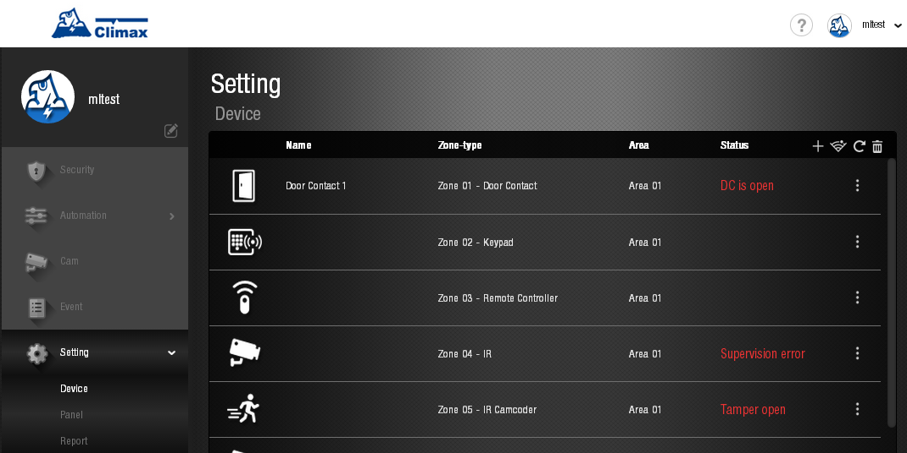

# VESTA 109

.gif>)

**VDP-3**

**Videocitofono**

**Manuale d'uso**

17 settembre 2020

**Sommario**

Introduzione 2

1.Panoramica dell'applicazione 3

1.1. Identificazione delle parti 3

1.2. L'alimentatore 3

1.3. Indicatore LED 4

1.4. Attrezzatura necessaria 4

1.5. Installazione dell'hardware 5

1.6. Configurazione 6

2.Operazione 9

2.1. Accesso al browser web 9

2.2. Accesso tramite smartphone 10

2.3. Notifica del campanello 12

2.4. Acquisizione di video/immagini e cronologia eventi 13

3.Programmazione remota 14

3.1. Impostazione utente app 14

3.2. Informazioni utente account 15

3.3. Impostazione video 15

3.4. Impostazione VDP 18

### introduzione

Il videocitofono VDP-3 è progettato per sostituire il campanello convenzionale fornendo accesso remoto allo streaming video e comunicazione bidirezionale tramite rete Wi-Fi. Il videocitofono funziona come parte del sistema di allarme Climax collegandosi al pannello di controllo del sistema di sicurezza Climax. La configurazione e l'accesso remoto del videocitofono vengono eseguiti tramite l'applicazione per smartphone sviluppata da Climax Technology.

### Panoramica dell'applicazione

### Identificazione delle parti

| **Vista frontale**                                                 | 
<strong>Vista frontale</strong>

<strong>(coperchio rimosso)</strong>
 | **Vista posteriore** |
| ------------------------------------------------------------------ | --------------------------------------------------------------------------------- | -------------------- |
|  |                                                                                   |                      |

1.  **Cover protettiva**
2.  **Lenti della macchina fotografica**
3.  **Pulsante funzione/indicatore LED (blu/ambra)**
4.  **Obiettivo IR**
5.  **Vite di fissaggio del coperchio**
6.  **Foro di montaggio**
7.  **12~24 V CC o 16~Ingresso alimentazione CA 24 V**

Si prega di notare che la coppia sulla vite deve essere inferiore a 24,5 Nm (2,5 kg-m).

1.  **12~24 V CC o 16~Ingresso alimentazione CA 24 V**

Si prega di notare che la coppia sulla vite deve essere inferiore a 24,5 Nm (2,5 kg-m).

1.  **Riservato**
2.  **Riservato**

### L'alimentatore

Il VDP ne utilizza 12~24 V CC o 16~Alimentazione CA 24 V come fonte di alimentazione. Spegnere prima l'alimentazione di rete. Allentare le due viti del 12~24 V CC o 16~Ingresso alimentazione CA 24 V e conservare le viti per un uso successivo. Collegare i cavi agli ingressi sul lato posteriore del coperchio posteriore**\***; installare il VDP per accendere il dispositivo.

**\*Nota:**Si consiglia di utilizzare un cavo con un diametro inferiore a 15 mm per il collegamento all'ingresso di alimentazione. La coppia sulla vite deve essere inferiore a 24,5 nm (2,5 kg-m).

### Indicatore LED

Il videocitofono è dotato di LED blu e rossi integrati per indicare lo stato del dispositivo.

| Colore LED                                 | Comportamento                                        | Indicazione                                                                         |
| ------------------------------------------ | ---------------------------------------------------- | ----------------------------------------------------------------------------------- |
| Blu                                        | Lampeggia ogni 3 secondi                             | VDP in modalità di configurazione Wi-Fi (modalità AP)                               |
| Filatura                                   | Pulsante VDP premuto, in attesa di risposta          |                                                                                     |
| SU                                         | VDP in streaming video e comunicazione bidirezionale |                                                                                     |
| Ambra                                      | ACCESO per 3 secondi                                 | Il VDP termina il riscaldamento all'accensione, entrando nel funzionamento normale. |
| Lampeggia ogni 3 secondi                   | Problema di connettività Wi-Fi**\***                 |                                                                                     |
| Lampeggia ogni secondo                     | VDP non è in grado di connettersi al server          |                                                                                     |
| 3 Lampeggia e poi si accende per 6 secondi | VDP ripristinato alle impostazioni di fabbrica       |                                                                                     |

**\*Nota:**È necessario circa 1 minuto affinché VDP si connetta al Wi-Fi dopo l'accensione. Prima che venga stabilita la connessione Wi-Fi, il LED rosso potrebbe lampeggiare momentaneamente.

### Attrezzatura richiesta

Per utilizzare VDP è necessaria la seguente attrezzatura:

-   Un router che supporta la rete Wi-Fi a 2,4 GHz. Il VDP deve essere connesso a questo router con accesso a Internet e Home Portal Server.
-   Un iPhone o uno smartphone Android

Requisito della versione Android: Android**5.1**o sopra.

Requisiti della versione iPhone: iOS**9**o sopra.

-   Per utilizzare il VDP, è necessario un pannello di allarme del sistema di sicurezza basato su IP Climax – Il pannello deve essere registrato in Climax Home Portal Server con un account utente valido. Fare riferimento alla guida utente del pannello e di Home Portal Server per completare il processo di configurazione e registrazione del pannello.

### Installazione dell'hardware

**Passo 1.**Prima di iniziare, trova l'interruttore automatico o la scatola dei fusibili.

**Passo 2.**Una volta trovato, apri la porta e spegni l'interruttore principale.

**Passaggio 3.**Estrarre il VDP dalla confezione. Rimuovere la copertura protettiva e inserirla

da parte per un uso successivo.

**Passaggio 4.**Capovolgi il VDP sottosopra e individua le 4 viti vicino alla parte inferiore del VDP.

**Passaggio 5.**Allentare le 2 viti del 12~24 V CC o 16~Ingresso alimentazione CA 24 V e conservare le viti

per un uso successivo.

**Passaggio 6.**Collegare i cavi agli ingressi sul lato posteriore del coperchio posteriore, come mostrato in

Figura 1. Si consiglia di utilizzare filo con un diametro inferiore a 15 mm

collegare all'ingresso di alimentazione. Si prega di notare che la coppia sulla vite dovrebbe essere inferiore

superiore a 24,5 nm (2,5 kg-m)

**Passaggio 7.**Individuare i 2 fori di montaggio sul VDP, come mostrato nella Figura 2, e avvitarli

VDP nel muro.

| Figura 1                                                                                                                             | figura 2 |
| ------------------------------------------------------------------------------------------------------------------------------------ | -------- |
|  |          |

**Passaggio 8.**Riposizionare il coperchio protettivo sulla parte superiore del VDP e serrare il fissaggio del coperchio

vite.

**Passaggio 9.**Accendere l'interruttore automatico per fornire alimentazione al VDP.

### Impostare

Il videocitofono può essere incorporato nel sistema di sicurezza Climax esistente come dispositivo accessorio. Per utilizzare il VDP, è necessario un pannello di allarme del sistema di sicurezza basato su IP Climax.

Per incorporare il videocitofono nel sistema di sicurezza Climax esistente, il pannello di controllo del sistema di sicurezza deve essere prima registrato nel Climax Home Portal Server con un account utente funzionale.

Uno smartphone con**Vesta Home 5 TW / Vesta Home 5 USA**O**Vesta Home 5 UE**per eseguire la configurazione è necessaria l'app installata. Cerca l'app su Google Play o Apple App Store, digita**Vesta Home 5 TW/USA/UE**sulla barra di ricerca in base al tuo server, quindi scarica l'applicazione. Fare riferimento alla guida per l'utente di Climax Home Portal Server per i dettagli.

.png>)

1.  Apri l'app Vesta Home 5 e inserisci l'account utente e la password esistenti del pannello di controllo che desideri utilizzare per ulteriori configurazioni.
2.  Tocca l'icona della fotocamera nella barra di navigazione e l'icona + nell'angolo in alto a sinistra per aggiungere il VDP al tuo sistema esistente. Selezionare l'icona VDP e toccare "Avanti".

 (1).jpeg>).jpeg>)

1.  Accendi il videocitofono applicando l'alimentazione CA. Il dispositivo si riscalderà inizialmente per circa 30 secondi e il LED blu inizierà a lampeggiare.

Il LED lampeggiante indica che il videocitofono non dispone ancora di un'impostazione Wi-Fi funzionante. Entrerà automaticamente nella modalità di configurazione Wi-Fi (modalità AP) all'accensione.

1.  Seleziona il percorso per configurare la tua rete Wi-Fi e segui le istruzioni visualizzate sullo schermo. Tieni presente che se il VDP è già stato configurato su un'altra rete Wi-Fi, assicurati di ripristinare il dispositivo prima di aggiungerlo al tuo sistema di allarme esistente.

4.1. Manuale: utilizza il tuo VDP come AP. Connettiti alla tua rete Wi-Fi. Assicurati che il Wi-Fi del tuo smartphone sia abilitato. Segui le istruzioni visualizzate sullo schermo e attendi che il VDP si connetta alla rete Wi-Fi. Dopo essersi collegata con successo alla tua rete Wi-Fi, l'app procede con l'apprendimento del VDP nel Pannello di controllo. Una volta completato l'apprendimento, accedi nuovamente all'app e inizia a utilizzare il tuo VDP.

.png>) (1).png>) (1).png>) (1).png>) (1).png>) (1).png>)

 (1).png>)

4.2. Codice QR: inserisci le informazioni SSID per generare il codice QR per la scansione di VDP. Il QR Code include informazioni sulla rete Wi-Fi e sul Pannello di Controllo. Seguire le istruzioni sullo schermo. Tocca "QR Code" per il tuo smartphone per visualizzarlo. VDP emetterà un breve segnale acustico per indicare che la scansione ha avuto successo. Quando il LED smette di lampeggiare, toccare "Fine" per completare la configurazione. Dopo che VDP si è connesso con successo alla tua rete Wi-Fi, l'app procederà ad apprendere il VDP nel Pannello di controllo. Una volta completato l'apprendimento, il VDP può essere visualizzato sull'app.

 (1).jpeg>) (1).png>) (1).png>)

### Operazione

È possibile accedere al videocitofono tramite browser web e/o applicazione per smartphone. La funzione di comunicazione vocale bidirezionale è disponibile solo tramite accesso tramite smartphone.

### Accesso al browser Web

Quando si accede all'account Home Portal Server del Pannello di controllo utilizzando un browser web, VDP si trova nella pagina Telecamera e ha la stessa funzione di una telecamera IP Climax.

_Le funzioni voce bidirezionale e campanello non sono abilitate per l'accesso tramite browser web. Per utilizzare queste funzioni è necessaria un'app per smartphone. Perfavore guarda**22. Accesso tramite smartphone**per i dettagli._

 (1) (1) (1).png>)

### Accesso tramite smartphone

Utilizzo**Vesta Home 5**app per accedere all'account del portale Home registrato dal pannello di controllo. Selezionare la pagina Cam per visualizzare la miniatura dello streaming VDP. Premere l'immagine in miniatura per ingrandirla a schermo intero.

Quando viene premuto il pulsante del campanello video, tutti gli account associati con la funzione di chiamata in arrivo abilitata saranno in grado di vedere il popup della chiamata in arrivo e rispondere alla chiamata.

.jpeg>)

Per accedere alla configurazione delle funzioni della fotocamera, toccare.png>)icona e seguire le istruzioni riportate di seguito.

-   **Nome del dispositivo**

**Questo ti serve per nominare o rinominare la tua telecamera IP per una facile identificazione. Inserisci il nome desiderato e tocca Salva.**

-   **Regolazione video**

Qui puoi regolare le impostazioni video della telecamera IP, come luminosità, saturazione e contrasto. La regolazione video ora consente l'opzione di capovolgere il video dall'alto/dal basso, consentendo così agli utenti di capovolgere il video senza dover spostare fisicamente la telecamera di sicurezza stessa.

-   **Rilevamento del movimento**

Serve per impostare la Regione 1 e la Regione 2 e i livelli di sensibilità per ciascuna regione. Se viene rilevato qualsiasi movimento quando il sistema è armato, verrà registrato un video. Tocca Salva per confermare l'impostazione.

-   **Volume dell'altoparlante**

Questo serve per regolare il volume dell'altoparlante. Tocca il cursore per regolare il volume al livello desiderato.

-   **Legatura della serratura della porta**

Qui puoi selezionare la serratura che desideri associare al sistema. Nota: la serratura disponibile verrà visualizzata dopo che è stata appresa nel pannello di controllo. Tocca Invia per completare. Assicurarsi di disconnettersi e accedere nuovamente affinché le modifiche siano effettive.

-   **Configurazione Wi-Fi**

**Per aggiungere un nuovo dispositivo, tocca l'icona nell'angolo in alto a sinistra per configurare il WiFi per la tua IP Cam o VDP. Prima di procedere, assicurati di aggiornare il firmware del dispositivo alla versione più recente.**

**Per impostare la funzione WiFi per il modello esistente, toccare****icona e seguire le istruzioni passo passo.**

**Per ingrandire la visualizzazione a schermo intero, toccare****icona per le diverse impostazioni delle funzioni. Il menu a sinistra ti consente di accendere o spegnere il microfono, registrare un video o scattare una foto o sbloccare da remoto la serratura elettrica collegata al sistema. Tocca l'icona per tornare alla pagina principale.**

### Notifica del campanello

La funzione di notifica del campanello consente a VDP di informare l'utente da remoto quando viene premuto il pulsante del campanello. Con Doorbell Notification l'utente potrà rispondere al campanello da remoto e conversare con l'ospite tramite VDP utilizzando lo smartphone anche quando è lontano da casa.

Prima di utilizzare la notifica del campanello, è necessario completare le seguenti impostazioni:

-   Il VDP deve essere configurato correttamente come descritto nel capitolo precedente.
-   L'account del server del portale Home del pannello di controllo deve essere registrato e funzionare correttamente.
-   L'impostazione di notifica push dell'account del server portale Home del pannello di controllo deve essere abilitata. Per accedere alla pagina Varie, accedi alla tua applicazione e tocca l'icona nell'angolo in alto a destra e tocca Notifica.

-   La pagina Notifica consente agli utenti di modificare le impostazioni di notifica push, chiamata in arrivo e notifica e-mail. L'impostazione Push influisce solo sul rapporto di notifica push per questo specifico account utente e non influisce su altri account correlati allo stesso pannello.
-   Puoi anche abilitare o disabilitare la notifica via email dell'evento VDP con la tua app.

\\<NOTE>

-   Se non si risponde alla notifica del campanello entro 1 minuto dalla pressione del pulsante, il VDP scade e il LED smette di girare
-   Quando si preme il pulsante, VDP scatterà un'istantanea e la caricherà sul server del portale domestico.

### Cattura video/immagini e cronologia eventi

Il VDP scatterà una foto o un video nelle occasioni successive. Tutte le foto e i videoclip ripresi verranno caricati sul server.

**video**

**Immagine**

-   Premere il pulsante funzione davanti al VDP per scattare una foto
-   Premi l'icona della fotocamera nel menu a sinistra dell'applicazione per scattare una foto.

Tutte le attività del videocitofono, incluse le notifiche del campanello, le immagini e i video clip, verranno archiviate nell'account utente di Home Portal Server. Tocca la scheda Media nella pagina Evento per controllare la cronologia delle operazioni.

1.  **Programmazione remota**

### Impostazione utente dell'app

È possibile accedere alla pagina di impostazione dell'account premendo l'icona nell'angolo in alto a destra.

-   **Elenco account (disponibile per l'account Master)**

La pagina di elenco degli account consente la configurazione dell'utente secondario. In questa pagina, fare clic sull'icona per aggiungere un utente secondario al pannello. Puoi creare un nuovo account o collegarti a un account esistente.

### Informazioni utente account

-   **Informazioni utente account**

Tocca il**Informazioni sull'utente dell'account**barra per visualizzare la pagina Informazioni utente account. Puoi modificare le informazioni registrate in questa pagina.

### Impostazione video

Le opzioni di impostazione video sono disponibili solo quando VDP è incluso in un sistema di sicurezza. È possibile accedere alle opzioni dalla pagina Fotocamera dell'interfaccia utente Web di Home Portal Server.

-   Regolazione video

Fare clic sull'icona per regolare le impostazioni video. La regolazione video ora consente l'opzione di capovolgere il video dall'alto/dal basso, consentendo così agli utenti di capovolgere il video senza dover spostare fisicamente la telecamera di sicurezza stessa.

-   Posizione del timestamp

Posizione timestamp consente all'utente di modificare il formato timestamp sul video. Gli utenti possono regolare la posizione del timestamp, il formato della data e il formato dell'ora.

-   Rilevamento del movimento

Il rilevamento del movimento consente all'utente di aggiungere la configurazione del rilevamento del movimento. Gli utenti possono quindi impostare la Regione 1 e la Regione 2 e i livelli di sensibilità per ciascuna regione. Se viene rilevato un movimento quando il sistema è armato, un video verrà registrato come evento video.

-   Registra video

Fare clic sull'icona per registrare un video clip. La telecamera IP registrerà il video clip in base alle sue impostazioni interne (fare riferimento a**3.4. Impostazione VDP**per i dettagli).

### Impostazione VDP

Le opzioni di impostazione del VDP sono disponibili solo se incluse nel sistema di sicurezza e accessibili dalla pagina Modifica dispositivo dell'interfaccia utente Web di Home Portal Server.

-   **Collocamento**

La pagina delle impostazioni viene utilizzata per impostare il numero di zona VDP, il nome del dispositivo e l'impostazione del fuso orario. Fare riferimento alla pagina Web di configurazione del pannello di controllo per i dettagli delle opzioni.

-   **Video registrati**

La pagina Video registrato memorizza i video clip precedentemente ripresi da VDP per il download. Fare clic sull'icona del collegamento per il download per scaricare il file sul computer.

-   **Impostazione video**

**Durata della registrazione video**

-   **Tempo totale:**Il tempo totale di ciascun video registrato può essere impostato facoltativamente su 5/10/15 secondi.

**Allarme**

-   **Avviso IR:**Quando questa funzione è abilitata, un evento verrà visualizzato nella pagina Evento quando viene rilevato un movimento.

**Attivazione della registrazione**

-   **Avviso IR:**Quando questa funzione è abilitata, verrà registrato un video quando viene rilevato un movimento.
-   **Pulsante VDP premuto:**Quando questa funzione è abilitata, verrà registrato un video quando si preme il pulsante funzione.

**Flusso video**

-   **Qualità:**Imposta la qualità del video.
-   **FPS:**Imposta gli FPS del video.

**Movimento JPEG**

-   **Qualità:**Imposta la qualità dell'immagine.

**Rete senza fili**

La pagina Web Rete wireless visualizza l'impostazione Wi-Fi VDP corrente.

Le impostazioni Wi-Fi possono essere modificate solo ripristinando le impostazioni di fabbrica VDP e utilizzando l'app Vesta Home 5 per riprogrammare le impostazioni Wi-Fi. L'impostazione Wi-Fi non può essere modificata sulla pagina web.
