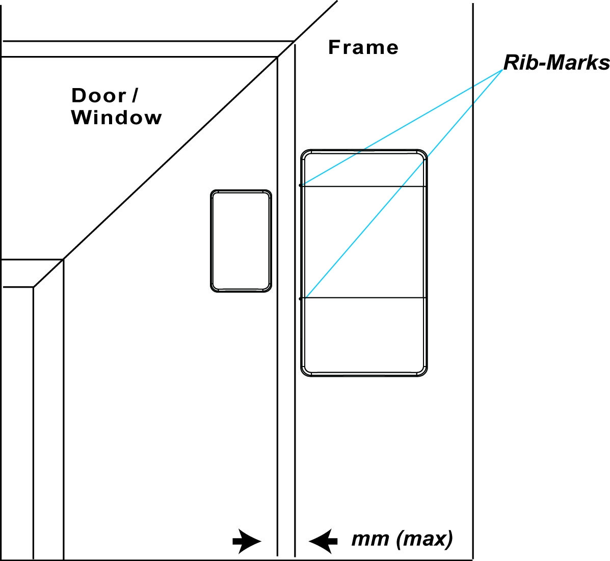

# VESTA 114

.jpeg>)**TASTIERA COMBO CABLATA/SENZA FILI (KP-35-COMBO)**

KP-35-COMBO è una tastiera cablata e wireless progettata per avere un controllo rapido dell'accesso al pannello di controllo del sistema. La tastiera può inviare segnali cablati e wireless e ricevere segnali dalla centrale di controllo entro la distanza del cavo, a seconda della sezione del cavo e del consumo energetico totale di tutti i dispositivi cablati. Lo schermo LCD visualizzerà le informazioni inviate dal pannello di controllo del sistema.

La tastiera cablata/senza fili può essere montata su una superficie piana o a parete con viti. Dispone inoltre di un interruttore di protezione contro la manomissione che verrà attivato in caso di qualsiasi tentativo non autorizzato di aprire il coperchio posteriore.

.jpeg>)

* **Identificazione delle parti**

.jpeg>)

1. **Display LCD retroilluminato**
2. **LED verde**
   * Il LED verde è spento in modalità stand-by.
   * Il LED verde si accenderà quando verrà premuto un tasto qualsiasi.
3. **LED giallo**
   * Il LED giallo lampeggerà una volta ogni 3 secondi quando viene rilevata una situazione di guasto e si spegnerà quando tutte le condizioni di guasto verranno ripristinate. Il comportamento del LED è controllato dal pannello di controllo.
4. **Tasti numerici retroilluminati**
5. **Tasto Stella retroilluminato (＊).**
6. **Tasto cancelletto (＃) retroilluminato**
7. **Tasto OK retroilluminato**
   * Per confermare i dati digitati o confermare la selezione.
8. **Ripristino retroilluminato (**.jpeg>))**Chiave**
   * Questo tasto viene utilizzato per cancellare una cifra, annullare la selezione, abbandonare la schermata corrente, tornare alla schermata precedente, ecc.
9. **Tasto braccio/ retroilluminato**
   * Utilizzare questo tasto per spostare il cursore e scorrere il display verso l'alto
   * Il tasto viene utilizzato anche per accedere alla modalità “Inserito Totale”.
10. **Tasto Home/ retroilluminato**
    * Utilizzare questo tasto per spostare il cursore e scorrere il display verso il basso.
    * Il tasto viene utilizzato anche per accedere alla modalità “Inserito in Casa”.
11. **Cicalino**
12. **Compartimento della batteria**
13. **Capolinea autobus**

* Cablare i quattro terminali (V, G, A, B) collegati in serie. Per il cablaggio della tastiera, fare riferimento a

Morsetto BUS sulla Centrale. Possono esserlo fino a quattro KP-35-Combo\_**Cablaggio della tastiera**\_sezione nella pagina successiva per i dettagli.

1. **Foro per la gestione dei cavi**
   * Foro preforato utilizzato per migliorare la flessibilità di gestione del cablaggio.
2. **Interruttore a ponticello della resistenza terminale**
   * Quando la tastiera è collegata come dispositivo BUS più lontano su una linea BUS, impostare il ponticello del resistore terminale della tastiera e l'interruttore ponticello del primo dispositivo BUS su ON per fungere da resistori di terminazione. La capacità di comunicazione della linea BUS connessa verrà potenziata.

.jpeg>) .jpeg>)

**Ponticello acceso**

.jpeg>)

Se il ponticello è su ON, la capacità di comunicazione verrà migliorata.

**Ponticello spento**

.jpeg>)

Se il ponticello è disattivato (il collegamento del ponticello è rimosso o “parcheggiato” su un pin), la capacità di comunicazione è a livello normale.

1. **Interruttore antimanomissione**
2. **Fori di montaggio x 4**
3. **Vite di fissaggio inferiore x 1**

1

.jpeg>)**Attenzione**

* Il cablaggio della tastiera cablata/senza fili deve essere eseguito solo da tecnici certificati con conoscenza e formazione adeguate sulle apparecchiature elettriche.
* Prima dell'installazione o di qualsiasi intervento di manutenzione, assicurarsi che l'alimentazione elettrica del Pannello di Controllo sia stata scollegata.

**Caratteristiche**

* _**Alimentazione elettrica**_

Quando il KP-35-Combo è cablato alla centrale, l'alimentazione da 13,5 V (tipica) può essere fornita dalla centrale al KP-35-Combo.

.jpeg>)

* _**Rilevamento batteria e batteria scarica**_
  * Due batterie al litio AA L91 da 1,5 V possono essere installate all'interno del vano batterie per fungere da fonte di alimentazione di riserva in caso di interruzione di corrente. Prima di inserire le batterie, accertarsi del corretto posizionamento delle batterie per proteggere il dispositivo.
  * La tastiera cablata/senza fili può anche monitorare la durata della batteria. Quando le batterie sono scariche, verrà inviato un segnale di batteria scarica insieme alla regolare trasmissione del segnale al pannello di controllo per avvisare gli utenti della sostituzione della batteria.

_\\_

*
  * Utilizzare solo le batterie specificate con il dispositivo. Quando si sostituiscono le batterie, sostituire sempre l'intero set e non mischiare tipi diversi di batterie o batterie nuove e usate per evitare di danneggiare il dispositivo.
* _**Funzionalità di risparmio energetico**_
  * Quando è inattivo, la tastiera cablata/wireless è inserita**stand-by**modalità e non consuma energia. Si sveglierà quando viene premuto un tasto qualsiasi.
  * Dopo essere entrati nel Menu Utente, se nessuno dei due**Braccio**chiave/**Braccio domestico**viene premuto il tasto , la tastiera cablata/wireless tornerà a**stand-by**modalità entro 5 secondi. Se uno o entrambi i**Braccio**chiave/**Braccio domestico**viene premuto/vengono premuto un tasto, la tastiera cablata/senza fili tornerà in modalità stand-by entro tale termine**20**secondi.
  * Dopo che sullo schermo LCD viene visualizzato "Inserisci codice PIN", se non viene premuto alcun tasto, la tastiera cablata/senza fili tornerà alla schermata**stand-by**modalità entro 5 secondi.
  * Dopo aver inviato la richiesta di cambio modalità, se non viene ricevuto alcun segnale dalla centrale, la tastiera tornerà a**stand-by**modalità entro 15 secondi.
  * Al termine dell'immissione di un comando, la tastiera cablata/wireless tornerà a**stand-by**modalità.
* _**Cablaggio della tastiera**_
  *
    * Per collegare il KP-35-COMBO al pannello di controllo, aprire il coperchio anteriore utilizzando un cacciavite Phillips per allentare la vite di fissaggio del coperchio.
    * Prima di collegare i terminali “V”, “G”, “A”, “B”, rimuovere le batterie dal KP-35-COMBO e assicurarsi che l'alimentazione del Pannello di Controllo sia stata scollegata.
    * Allentare il terminale “V” del KP-35-COMBO e il terminale “VDD” del pannello di controllo. Collegare il terminale “V” al terminale “VDD” e serrare entrambe le viti del terminale.
    * Allentare il terminale “G” del KP-35-COMBO e il terminale “GND” del pannello di controllo. Collegare il terminale “G” al terminale “GND” e serrare entrambe le viti del terminale.
    * Allentare il terminale “A” del KP-35-COMBO e il terminale “485A” del pannello di controllo. Collegare il terminale “A” al terminale “485A” e serrare entrambe le viti del terminale.
    * Allentare il terminale “B” del KP-35-COMBO e il terminale “485B” del pannello di controllo. Collegare il terminale “B” al terminale “485B” e serrare entrambe le viti del terminale.
    * Accendere la centrale e attendere che sullo schermo LCD della tastiera cablata/wireless venga visualizzato il messaggio "KP-35 COMBO".

.jpeg>)

2

* Il terminale della tastiera può essere cablato al pannello di controllo. È possibile collegare in serie fino a quattro KP-35-Combo. La lunghezza massima del cavo dipende dalla sezione del cavo e dal consumo energetico totale di tutti i dispositivi cablati, ad esempio: cavo massimo 3000 piedi a 22 AWG per un KP-35-COMBO; cavo massimo da 1500 piedi a 22 AWG per 2 KP-35-COMBO; o cavo massimo da 1.000 piedi a 22 AWG per 3 KP-35-COMBO.
* Nella foto sotto, KP-35-COMBO-**UN**e KP-35-COMBO-**B**siano cablati correttamente in serie poiché la distanza totale del cavo di due tastiere dal pannello di controllo è entro 1500 piedi. Per il KP-35-COMBO-**C**nella foto qui sotto, lo è**NON**cablato correttamente poiché è a una distanza superiore a 1000 piedi dal pannello di controllo.
* Per una comunicazione ottimale dei dispositivi della linea BUS collegati, assicurarsi che i ponticelli della resistenza terminale del primo e del dispositivo BUS più lontano su una linea BUS siano impostati su ON per fungere da resistenze di terminazione. Assicurarsi di abilitare solo i 2 interruttori jumper sopra menzionati e di non impostare gli interruttori jumper su ON per nessun altro dispositivo BUS intermedio.

Ad esempio, per KP-35-COMBO-**B**nella foto sotto è il dispositivo più lontano sulla linea BUS, mentre il Pannello Ibrido è il primo dispositivo sulla linea BUS. Assicurarsi di impostare KP-35-COMBO-**B**l'interruttore ponticello della resistenza terminale e l'interruttore ponticello J53 del pannello ibrido su ON per fungere da resistori terminali.

.png>)

* _**Protezione antisabotaggio**_
  * La tastiera cablata/senza fili è protetta contro qualsiasi tentativo non autorizzato di aprire il coperchio posteriore con un interruttore antimanomissione. Quando il coperchio posteriore viene aperto, l'interruttore antimanomissione verrà attivato e la tastiera cablata/wireless trasmetterà un segnale di apertura antimanomissione al pannello di controllo del sistema.
  * Dopo aver riposizionato il coperchio posteriore, la tastiera cablata/wireless trasmetterà un segnale di ripristino della manomissione alla centrale di controllo.
  * Quando la tastiera cablata/senza fili è montata correttamente con il coperchio posteriore avvitato al muro, rimuovendo con forza la tastiera si romperà il coperchio posteriore dalla sezione cava attorno alla posizione della vite e si attiverà l'interruttore antimanomissione.
* _**Segnale di supervisione**_
  * In modalità cablata, la tastiera cablata/senza fili trasmetterà automaticamente i segnali di supervisione alla centrale ad un intervallo di 20-30 secondi.
  * In modalità wireless, la tastiera cablata/wireless trasmetterà automaticamente i segnali di supervisione alla centrale di controllo a intervalli di 30-50 minuti.
  * Se la Centrale di Controllo non riceve il segnale dalla tastiera cablata/senza fili per un periodo di tempo preimpostato, la Centrale considererà la tastiera cablata/senza fili fuori servizio e reagirà in base alle impostazioni della centrale.

3

* _**Partecipazione alla rete di sistema**_

**Funzionamento senza fili:**

* Per aggiungere la tastiera cablata/senza fili alla rete del sistema, mettere prima la Centrale in modalità apprendimento.
* Premere una volta il tasto OK. Quando sullo schermo LCD viene visualizzato "Inserisci codice PIN", tenere premuto il tasto**OK**tasto per 10 secondi.
* Sullo schermo LCD verrà visualizzato il messaggio "KP verrà ripristinato tra 2 secondi" insieme ad un lungo segnale acustico.
* Sullo schermo LCD verrà visualizzato “Scansione rete” mentre la tastiera cablata/senza fili invia il codice di apprendimento alla centrale di controllo.
* Quando la tastiera viene aggiunta al pannello di controllo, sullo schermo LCD verrà visualizzato il messaggio "Apprendimento riuscito" insieme a 2 segnali acustici.

_\\_

* Se il pannello di controllo risponde prontamente alla tastiera cablata/wireless, il processo di “Scansione rete” verrà saltato e “Apprendimento riuscito” verrà visualizzato direttamente sullo schermo LCD.
* Se la tastiera cablata/senza fili non riceve alcun segnale dalla centrale di controllo entro 20 secondi, lo schermo LCD si spegnerà e la tastiera cablata/senza fili tornerà in modalità stand-by.

**Operazione di cablaggio:**

Oltre all'operazione wireless per connettersi alla rete del sistema come sopra indicato, l'utente può farlo tramite cablaggio.

\*\*Passo 1.\*\*Collegare la tastiera al pannello tramite cablaggio.

\*\*Passo 2.\*\*Scegli un'area localizzata e una zona franca per aderire alla rete del sistema.

**Scegliere\*\*\*\*Area e zona**

**EAccedereCodici**

* **Zona 1 Zona 2**
* **Zona 1 Zona 3**

\*\*Passaggio 3.\*\*Immettere il codice PIN dell'area individuata.

**Ent**

**e r**

**SPILLO**

**C o d e**

\*\*Passaggio 4.\*\*Inserisci il codice installatore. (Impostazione di fabbrica: 7982)

**Ent**

**e r**

**IO**

**-**

**C o d e**

\*\*Passaggio 5.\*\*La tastiera viene aggiunta all'area individuata e alla zona scelta.

**Aggiunto e dT astieraA**

**A r e a 1\*\*\*\*Zona 1**

* _**Identificazione**_

IL "**Identificare**” viene utilizzata per localizzare uno specifico dispositivo cablato nell'intero sistema cablato. Questa funzione è utile per distinguere quale dispositivo è, soprattutto in un'installazione di grandi dimensioni in cui sono inclusi numerosi dispositivi cablati.

Per individuare KP-35-Combo nel sistema cablato:

\*\*Passo 1.\*\*Nella pagina web del Pannello, fare clic su "Identifica" sotto l'elenco dei dispositivi dopo la voce della colonna del dispositivo della Tastiera.

\*\*Passo 2.\*\*Se KP-35- Combo riceve il segnale dalla centrale, la pagina web visualizzerà un messaggio di successo e la retroilluminazione bianca della tastiera cablata/senza fili lampeggerà 10 volte per indicare dove si trova all'utente.

_\\_

*
  *
    * Se sulla pagina web viene visualizzato un messaggio di timeout, significa che la tastiera cablata/wireless non ha ricevuto il segnale dalla centrale.

Verificare se il KP-35-Combo è collegato correttamente al pannello entro una distanza di cablaggio adeguata.

* _**Controllo dello stato dell'area**_
  * La tastiera cablata/wireless consente all'utente di verificare la modalità di stato di ciascuna area. Quando il pannello di controllo è in modalità stand-by, premere il tasto OK e lo stato corrente di ciascuna area verrà visualizzato sullo schermo LCD per 3 secondi.

 Esistono tre diversi stati: A = Inserito fuori casa / H = Inserito in casa / D = Sistema disinserito.

* Un punto interrogativo "?" verrà visualizzato se non è possibile identificare lo stato dell'area.
* Esempio:

4

|   | **1**  | **\|** | **2** | **\|** | **3** | **\|** | **4** | **\|** | **5** | **\|** | **6** | **\|** | **7** | **\|** | **8** |
| - | ------ | ------ | ----- | ------ | ----- | ------ | ----- | ------ | ----- | ------ | ----- | ------ | ----- | ------ | ----- |
|   | **UN** | **\|** | **H** | **\|** | **D** | **\|** | **?** | **\|** | **D** | **\|** | **H** | **\|** | **?** | **\|** | **?** |

* _**Modifica della modalità di sistema**_

Gli utenti possono utilizzare la tastiera per modificare la modalità del sistema tramite un codice PIN.

* **Per modificare la modalità del sistema con un codice PIN:**

Dopo aver inserito il codice PIN, premere il tasto**Inserimento/Inserimento Home/OK**chiave per entrare**Inserito fuori casa/Inserito in casa/Sistema disinserito**modalità.

*
  * Quando la modalità del sistema viene modificata in modalità disinserita, il display LCD mostrerà "Memoria allarme n. area" e il LED giallo lampeggerà una volta ogni 3 secondi con 5 segnali acustici se sono stati attivati ​​degli allarmi in precedenza. Gli utenti possono accedere manualmente al Menu Utente per visualizzare la memoria degli allarmi (fare riferimento alla sezione Menu Utente di seguito per i dettagli).
  * **Funzione di inserimento rapido:Gli utenti possono accedere al menu Impostazioni per attivare la funzione di inserimento rapido (scegliereImpostazioni > Inserimento rapido > Abilita**, quindi premere OK), che consentirà agli utenti di modificare la modalità premendo il tasto Arm o il tasto Home senza inserire il codice PIN. Per disinserire il sistema, gli utenti devono comunque inserire il codice PIN.
  * Dopo essere entrati nel Menu Utente con il sistema disinserito, gli utenti possono anche selezionare**Braccio assente**O**Braccio domestico**e premere OK per modificare la modalità del sistema.
* _**Menu utente**_
  * La tastiera comunicherà con il sistema per recuperare le informazioni prima di accedere al Menu Utente. Le seguenti opzioni verranno visualizzate sullo schermo LCD per la selezione. Utilizzo****E****per selezionare e premere il tasto**OK**tasto per confermare la selezione.
  * Per accedere al Menu Utente, tenere premuto “**＊**" per 2 secondi in modalità inattiva della tastiera quando il sistema dell'area in cui si trova KP-35-Combo è già in**Modalità disarmata**.
  * La tastiera uscirà automaticamente dal Menu Utente dopo 20 secondi di inattività.

|   | **UN** | **In** | **UN** | **E**  |        | **UN** | **R** | **M**  |       |       |       |        |       |   |   |
| - | ------ | ------ | ------ | ------ | ------ | ------ | ----- | ------ | ----- | ----- | ----- | ------ | ----- | - | - |
|   | **H**  | **O**  | **M**  | **e**  |        | **UN** | **R** | **M**  |       |       |       |        |       |   |   |
|   | **UN** | **l**  | **UN** | **R**  | **M**  |        | **M** | **e**  | **M** | **O** | **R** | **E**  |       |   |   |
|   | **F**  | **UN** | **In** | **l**  | **T**  |        | **D** | **io** | **S** | **P** | **l** | **UN** | **E** |   |   |
|   | **L**  | **O**  | **G**  |        |        |        |       |        |       |       |       |        |       |   |   |
|   | **B**  | **E**  | **P**  | **UN** | **S**  | **S**  |       |        |       |       |       |        |       |   |   |
|   | **S**  | **e**  | **T**  | **T**  | **io** | **N**  | **G** |        |       |       |       |        |       |   |   |

* \*\*Braccio lontano:\*\*Selezionare "Inserimento Totale" e premere il tasto OK per modificare la modalità del sistema in "Inserimento Totale".
* \*\*Braccio domestico:\*\*Selezionare "Inserimento in casa" e premere il tasto OK per modificare la modalità del sistema in "Inserimento in casa".
* **Memoria allarmi:Questa opzione diventerà disponibile dopo l'attivazione di un allarme. Entrando nel Menu Utente si verrà indirizzati automaticamente all'opzione Memoria Allarme. PremereOK**per confermare la selezione, quindi utilizzare****E****tasti per visualizzare la memoria allarmi.
* \*\*Visualizzazione guasto:\*\*Questa opzione diventerà disponibile quando si verifica un evento di guasto nel sistema. Per visualizzare gli eventi di guasto, selezionare “Visualizzazione guasti” e premere OK per confermare la selezione. Utilizzare i tasti  e  per visualizzare gli eventi di guasto e premere il tasto per tornare al Menu Utente.

_\\_

* Il LED giallo lampeggerà una volta ogni 3 secondi quando viene rilevata una situazione di guasto e si spegnerà quando tutte le situazioni di guasto saranno state risolte.
* Se si tenta di inserire il sistema quando esiste un evento di guasto, l'inserimento verrà impedito e lo schermo LCD passerà alla visualizzazione del guasto. Se si desidera inserire forzatamente il sistema, eseguire nuovamente l'azione di inserimento entro 30 secondi. Il sistema ignorerà l'evento di guasto ed entrerà nella modalità di inserimento selezionata.
  * **Tronco d'albero**: Selezionare “Log” e premere OK per visualizzare il registro di sistema. Utilizzare i tasti  e  per visualizzare gli eventi e premere il tasto per tornare al Menu Utente.
  * **Circonvallazione:Questa funzione è disponibile solo con la connessione cablata. Sullo schermo LCD verrà visualizzato "Inserisci codice M" (il codice M predefinito è1111**). La centrale ignorerà tutti i segnali ricevuti dal dispositivo bypassato e non risponderà affatto quando tale dispositivo viene attivato.
  * \*\*Collocamento:\*\*Per la connessione wireless, dopo essere entrati nel menu Unser, inserire il codice M. predefinito “**1111**" per accedere al menu delle impostazioni. Per la connessione cablata, inserire il codice I. predefinito “**7982**" per accedere al menu delle impostazioni. Utilizzare i tasti  e  per selezionare le opzioni di impostazione e premere il tasto per tornare al Menu Utente.

|   | **B** | **e**  | **e**  | **P**  |        | **C**  | **O**  | **N**  | **T**  | **R** | **O**  | **l** |       |       |   |
| - | ----- | ------ | ------ | ------ | ------ | ------ | ------ | ------ | ------ | ----- | ------ | ----- | ----- | ----- | - |
|   | **P** | **UN** | **N**  | **io** | **C**  |        | **UN** | **l**  | **UN** | **R** | **M**  |       |       |       |   |
|   | **F** | **io** | **R**  | **e**  |        | **UN** | **l**  | **UN** | **R**  | **M** |        |       |       |       |   |
|   | **M** | **e**  | **D**  | **io** | **C**  | **UN** | **l**  |        | **UN** | **l** | **UN** | **R** | **M** |       |   |
|   | **Q** | **In** | **io** | **C**  | **K**  |        | **UN** | **R**  | **M**  |       |        |       |       |       |   |
|   | **L** | **UN** | **N**  | **G**  | **In** | **UN** | **G**  | **e**  |        |       |        |       |       |       |   |
|   | **C** | **H**  | **UN** | **N**  | **G**  | **e**  |        | **M**  | **.**  |       | **C**  | **O** | **D** | **e** |   |

* \*\*Lingua:\*\*Selezionare "Lingua" e premere OK per accedere al menu della lingua. Utilizzare i tasti  e  per selezionare la lingua di visualizzazione e premere il tasto per tornare al Menu Utente.

**Inglese**

**E s p a ñ o l**

5

|   | **P** | **O** | **R**  | **T** | **In**       | **G**  | **In** | **eh** | **S** |       |   |   |   |   |   |
| - | ----- | ----- | ------ | ----- | ------------ | ------ | ------ | ------ | ----- | ----- | - | - | - | - | - |
|   | **F** | **R** | **UN** | **N** | **Che cosa** | **UN** | **io** | **S**  |       |       |   |   |   |   |   |
|   | **D** | **e** | **In** | **T** | **S**        | **C**  | **H**  | **e**  |       |       |   |   |   |   |   |
|   | **L** | **T** | **UN** | **l** | **io**       | **UN** | **N**  | **O**  |       |       |   |   |   |   |   |
|   | **N** | **e** | **D**  | **e** | **R**        | **l**  | **UN** | **N**  | **D** | **S** |   |   |   |   |   |

*
  * \*\*Modifica codice M.:\*\*Questa funzione è disponibile solo con la connessione wireless. Il codice M. predefinito è 1111. Gli utenti possono modificarlo manualmente e solo quando viene inserito il codice M. corretto l'utente può accedere al menu di impostazione.
* _**Risultato della modifica della modalità**_
  *
    * \*\*Armato in trasferta:\*\*Quando il sistema passa alla modalità “Inserito Totale”, sullo schermo LCD verrà visualizzato “Area n. Inserito Totale” insieme ad un lungo segnale acustico che indica l'operazione riuscita.
    * \*\*Armato a casa:\*\*Quando il sistema passa alla modalità “Inserito in casa”, sullo schermo LCD verrà visualizzato “Area n. Inserito in casa” insieme a 3 segnali acustici che indicano l'operazione riuscita.
    * \*\*Sistema disinserito:\*\*Quando il sistema passa alla modalità “Sistema disinserito”, sullo schermo LCD verrà visualizzato “Area n. Sistema disinserito” insieme a 2 segnali acustici che indicano l'operazione riuscita.
    * \*\*Ritardo di uscita/entrata:\*\*Quando il timer del ritardo di ingresso/uscita è abilitato nella centrale di controllo e la funzione segnale acustico di ingresso/uscita è abilitata sulla tastiera cablata/senza fili, la tastiera cablata/senza fili effettuerà il conto alla rovescia insieme al sistema quando inizia il timer del ritardo di ingresso/uscita. "Conteggio alla rovescia N. area." verrà visualizzato sullo schermo LCD per 10 secondi. Anche il LED verde si accenderà per 10 secondi insieme ad 1 segnale acustico ogni secondo. Dopo 10 secondi, lo schermo LCD e il LED verde si spegneranno, ma i segnali acustici di avviso continueranno con il sistema effettua il conto alla rovescia.
    * **Errore di operazione:Sullo schermo LCD verrà visualizzato "Errore di operazione" insieme a 2 segnali acustici che indicano un'operazione non riuscita; ad esempio, quando invii la richiesta di modifica della modalità daBraccio assente**A**Braccio domestico**modalità.
    * **Visualizzazione dei guasti**: Quando il sistema si inserisce in caso di guasto, sullo schermo LCD verrà visualizzato il messaggio "Visualizzazione guasto" insieme a 3 segnali acustici che indicano il guasto di inserimento.
    * \*\*Codice PIN errato:\*\*Quando viene inserita una password errata, sullo schermo LCD verrà visualizzato "Codice PIN errato" insieme a 4 segnali acustici che indicano la password errata inserita.

_\\_

*
  * Dopo aver inviato la richiesta di cambio modalità, se non viene ricevuto alcun segnale dalla centrale, la tastiera tornerà in modalità stand-by entro 15 secondi.
  * Se vengono effettuati 5 tentativi di codice PIN errati entro 10 minuti, la tastiera cablata/wireless verrà automaticamente bloccata per 5 minuti. Durante questo periodo, qualsiasi operazione non sarà valida. Allo scadere del tempo di blocco, la tastiera cablata/wireless emetterà un segnale acustico. 1 segnale acustico lungo.
* _**Funzioni di allarme a doppio tasto**_
  *
    * La funzione doppio tasto è disabilitata per impostazione predefinita. Per abilitarlo, accedere al menu di impostazione della tastiera cablata/wireless per impostare l'attivazione dell'allarme (Scegli**Impostazioni > Allarme panico/Allarme incendio/Allarme medico > Abilita**, quindi premere OK).
    * Allarme panico: premere "1 + 3" per attivare un allarme panico.
    * Allarme incendio: premi "4 + 6" per attivare un allarme incendio.
    * Allarme medico: premi "7 + 9" per attivare un allarme medico.
    * Quando viene attivato un allarme, “Allarme! Allarme!" verrà visualizzato sullo schermo LCD e il LED verde si accenderà

10 secondi.

* _**Controllo del segnale acustico:**_

Questa funzione serve per impostare le funzioni del segnale acustico di avviso della tastiera.

*
  * **Segnale acustico di ingresso/uscita:La funzione è disabilitata per impostazione predefinita. Per abilitarlo, selezionaImpostazioni > Controllo segnale acustico > Segnale acustico di entrata/uscita > Abilita**nel Menu Utente e premere OK per confermare l'impostazione. La durata del segnale acustico di ingresso/uscita è di 4 minuti al massimo.
  * **Segnale acustico di allarme:La funzione è disabilitata per impostazione predefinita. Per abilitarlo, selezionaImpostazioni > Controllo segnale acustico > Segnale acustico allarme > Abilita**nel Menu Utente e premere OK per confermare l'impostazione. La durata del segnale acustico di allarme è di 15 minuti al massimo.
* _**Condizioni di guasto**_

_Quando la tastiera cablata/wireless è sotto**MODALITÀ DI FUNZIONAMENTO NORMALE,**_

*
  *
    * Se la centrale è in modalità Inserito Totale, NON è possibile attivare la modalità Inserito In Casa tramite la tastiera cablata/senza fili. In tal caso, la tastiera cablata/senza fili emetterà 2 bip indicando che la centrale di controllo è in modalità Inserito Totale.
    * Quando viene rilevata una situazione di guasto, il LED giallo lampeggia una volta ogni 3 secondi. Il comportamento del LED giallo è deciso dalla centrale.
    * Se vengono effettuati 5 tentativi di codice PIN errati entro 10 minuti, la tastiera cablata/wireless verrà automaticamente bloccata per 5 minuti. Durante questo periodo, qualsiasi operazione non sarà valida. Allo scadere del tempo di blocco, la tastiera cablata/wireless emetterà 1 bip lungo.
* _**Cambio delle batterie**_
  1. Andare al menu di programmazione della centrale per escludere l'allarme manomissione KP.
  2. Smontare la tastiera cablata/wireless.
  3. Estrarre le due batterie usate e premere l'interruttore antimanomissione per più di 3 secondi per scaricarle completamente prima di inserire nuove batterie. Non mischiare batterie nuove e usate.
  4. Estrarre la batteria usata e premere l'interruttore antimanomissione per scaricarla prima di inserire nuove batterie.
  5. Riavvitare la tastiera cablata/wireless alla superficie di montaggio con le viti di montaggio.

6

*
  1. Riportare il pannello di controllo alla modalità di funzionamento normale.
* _**Ripristinare la tastiera cablata/wireless alle impostazioni di fabbrica**_

La tastiera cablata/senza fili può essere ripristinata per cancellare tutti i dati memorizzati e riportare tutte le impostazioni ai valori predefiniti procedendo come segue:

1. Per favore Segui\_**Cambio della batteria**\_passaggi per le impostazioni di fabbrica.
2. Entro 10 secondi dall'inserimento delle batterie, inserire “0000”. Quando l'ultima cifra di "0000" diventa "" sullo schermo LCD, premere "#" per ripristinare i valori predefiniti della tastiera cablata/senza fili.
3. Sullo schermo LCD verrà visualizzato "Reset Default" insieme a 3 segnali acustici che indicano l'operazione riuscita.
4. Tutti i dati memorizzati verranno cancellati.
5. I segnali acustici di entrata/uscita verranno disabilitati.
6. Il segnale acustico di allarme verrà disabilitato.
7. La funzione di allarme Dual Key verrà disabilitata.

_\\_

*
  * L'impostazione predefinita di fabbrica può essere eseguita solo entro 10 secondi dall'inserimento delle batterie. Se la tastiera non si riattiva entro 10 secondi dall'inserimento delle batterie, rimuovere le batterie e riprovare.
  * Ogni volta che la tastiera viene rimossa dal pannello di controllo, è necessario ripristinarne le impostazioni di fabbrica per cancellare la memoria del pannello di controllo.
* _**Montaggio della tastiera cablata/wireless**_

Per montare la tastiera cablata/wireless:

1. Rimuovere il coperchio anteriore allentando la vite di fissaggio del coperchio utilizzando un cacciavite.
2. Utilizzare i 4 fori di montaggio sul coperchio posteriore come modello per contrassegnare e praticare i fori di montaggio.
3. Praticare 4 fori e inserire i tasselli. Assicurarsi che i tasselli siano a filo con la superficie di montaggio.
4. Avvitare il coperchio posteriore sui tasselli.
5. Riposizionare la copertura anteriore sulla copertura posteriore. Avvitare la vite di fissaggio del coperchio.
6. L'installazione è ora completata.

7
