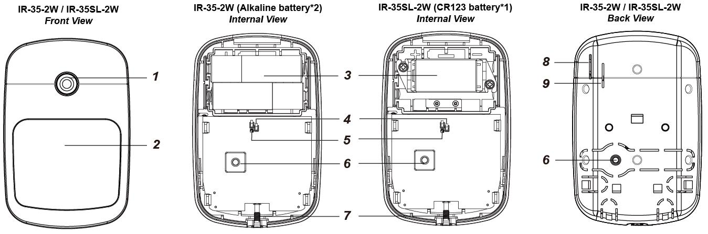
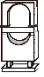

# VESTA177

**Sensore di movimento PIR Serie IR-35-2W / VESTA-177**

**introduzione**

Il PIR rileva la firma a infrarossi per rilevare i movimenti all'interno di un'area assegnata e segnala al pannello di controllo di attivare l'allarme se un intruso attraversa il suo percorso di rilevamento.

Il PIR è progettato per fornire un raggio di rilevamento tipico di 12 metri se montato a 2,5 metri dal suolo. Il sensore PIR supporta anche la funzione di immunità agli animali domestici e non rileva animali domestici fino a 25 kg per ridurre al minimo la situazione di falsi allarmi.

Il PIR è costituito da un design in due parti composto da una copertura e una base. Il coperchio contiene tutta l'elettronica e l'ottica e la base fornisce un mezzo di fissaggio.

**Il sensore PIR serie IR-35-2W comprende i seguenti modelli:**

**IR-35-2W**– Sensore di movimento PIR alimentato da due batterie alcaline

**Arakhsalu**– Sensore di movimento PIR alimentato da una batteria CR123

**Identificazione delle parti**

1. **Pulsante di prova/indicatore LED**
   * Il pulsante di test viene utilizzato per testare le prestazioni della radio e per scopi di apprendimento.
   * L'indicatore LED viene utilizzato per indicare lo stato del sistema.
2. **Sensore IR**

**3. Vano batteria**

**4. Interruttore ponticello di attivazione/disattivazione dell'immunità agli animali domestici (JP3)**

**Ponticello acceso**

**Ponticello spento**

.png>)

* Se impostato su ON, l'immunità agli animali domestici è disabilitata (impostazione di fabbrica).
* Se impostato su OFF, l'immunità agli animali domestici è abilitata.

1. **Interruttore ponticello per aumento sensibilità (JP4)**
   *
     * Quando impostato su ON, la sensibilità di rilevamento del PIR è alta.
     * Quando impostato su OFF, la sensibilità di rilevamento del PIR è a livello normale. (Impostazione di fabbrica)
2. **Interruttore antimanomissione**
3. **Vite di fissaggio inferiore**
   1. **Foro isolante batteria IR-35-2W**

**9. Foro isolante batteria IR-35SL-2W**

**Caratteristiche**

* _**Indicatore LED**_

Nella modalità di funzionamento normale, l'indicatore LED si accende nelle seguenti situazioni:

*
  * Quando viene rilevato un movimento in condizioni di batteria scarica
  * Quando il coperchio viene aperto e l'interruttore antimanomissione viene attivato
  * Quando viene rilevato un movimento se la condizione di manomissione continua
  * Quando viene rilevato un movimento in modalità Test
  * Quando si preme il pulsante Test in condizione di manomissione o se la batteria del PIR è scarica, il LED non lampeggerà se la manomissione del PIR e la batteria sono normali e il PIR non è in modalità test.

Se il LED lampeggia per indicare la trasmissione del segnale, lampeggerà due volte rapidamente dopo aver ricevuto la conferma dalla centrale.

* _**Rilevamento batteria e batteria scarica**_

Il sensore di movimento PIR serie IR-35-2W utilizza batterie alcaline o al litio come fonte di alimentazione:

* Il modello IR-35-2W utilizza due batterie alcaline AA da 1,5 V come fonte di alimentazione.
* Il modello IR-35SL-2W utilizza una batteria al litio CR123 da 3 V come fonte di alimentazione.

Il PIR è dotato di funzione di rilevamento della batteria scarica. Se viene rilevata una tensione della batteria bassa, un segnale di batteria scarica verrà inviato al pannello di controllo insieme alle normali trasmissioni di segnali affinché il pannello di controllo visualizzi di conseguenza lo stato.

Per ogni installazione, le batterie vengono installate in fabbrica prima della spedizione con un isolante inserito.

* Quando si sostituiscono le batterie, dopo aver rimosso quelle vecchie, premere due volte l'interruttore antimanomissione per scaricarle completamente prima di inserire le nuove batterie.
* _**Protezione antisabotaggio**_

Il PIR è protetto da un interruttore antimanomissione che viene compresso quando il PIR è installato correttamente. Quando il PIR viene rimosso dalla superficie montata o dalla staffa di montaggio, o quando il suo coperchio viene aperto, l'interruttore antimanomissione verrà attivato e il PIR invierà un segnale di apertura antimanomissione al pannello di controllo del sistema per ricordare all'utente la condizione. Se viene rilevato un movimento quando l'interruttore antimanomissione è aperto, il LED si accenderà.

* _**Funzione di supervisione**_

Quando il PIR è in modalità operativa normale, effettuerà periodicamente un autotest trasmettendo un segnale di supervisione una volta ogni 90-110 minuti.

Se la Centrale non riesce a ricevere i segnali di supervisione trasmessi da un certo PIR per un tempo prestabilito, appare un “**Fuori servizio**r” verrà generato il messaggio di errore.

* _**Modalità di prova**_

Il PIR può essere messo in modalità test premendo il pulsante Test. In modalità test, disabiliterà il timer di spegnimento e consentirà all'indicatore LED di accendersi ogni volta che viene rilevato un movimento. Ogni volta che si preme il pulsante Test, il PIR trasmetterà un segnale di test al pannello di controllo per il test della portata radio ed entrerà in modalità test per 3 minuti. La modalità test scade dopo 3 minuti.

* _**Sveglia**_
  * Il PIR ha un “**ora di dormire**" di circa**1 minuto**per risparmiare energia.
  * A seconda dell'impostazione della modalità di sospensione (normale o ottimizzata), entrerà il PIR**ora di dormire**per**1 minuto**dopo aver trasmesso uno o 3 movimenti rilevati entro 1 minuto.
  * Durante**1 minuto di sonno**, il PIR non ritrasmetterà alcun segnale; qualsiasi ulteriore movimento rilevato durante questo periodo di sonno prolungherà la durata del sonno di un altro minuto. In questo modo, il movimento continuo davanti al PIR non scaricherà eccessivamente la batteria.
* L'impostazione della modalità di sospensione è configurabile da remoto. Quando la modalità di sospensione è impostata su Normale, il PIR entrerà in modalità di sospensione per 1 minuto dopo aver trasmesso un movimento rilevato. Quando la modalità di sospensione è impostata su Ottimizzata, il PIR entrerà in modalità di sospensione per 1 minuto dopo aver trasmesso 3 movimenti rilevati entro 1 minuto. Per favore riferisci a\_**Impostazione remota**\_sezione seguente per i dettagli.
* _**Funzione di immunità agli animali domestici**_
  * Il sensore PIR supporta la funzione di immunità agli animali domestici e non rileva animali domestici fino a 25 kg per ridurre al minimo la situazione di falsi allarmi.
  * La funzione Pet Immunity può essere abilitata/disabilitata impostando la posizione dell'interruttore Jumper (JP3). Quando l'interruttore jumper (JP3) è impostato su ON, l'immunità agli animali domestici è disabilitata (impostazione di fabbrica). Quando l'interruttore jumper (JP3) è impostato su OFF, l'immunità agli animali domestici è abilitata.
  * La funzione Pet Immunity può essere configurata anche da remoto. Per favore riferisci a\_**Impostazione remota**\_sezione seguente per i dettagli.
* _**Funzione di aumento della sensibilità**_
  * È possibile utilizzare la funzione di aumento della sensibilità per aumentare la sensibilità di rilevamento del PIR.
  * Per aumentare la sensibilità di rilevamento, impostare l'interruttore jumper (JP4) su ON. Per mantenere la sensibilità di rilevamento normale, impostare l'interruttore jumper (JP4) su OFF (impostazione di fabbrica).
  * La sensibilità di rilevamento del PIR può anche essere configurata da remoto. Per favore riferisci a\_**Impostazione remota**\_sezione seguente per i dettagli.
* _**Impostazione remota**_
  * Il sensore di movimento PIR supporta l'impostazione remota dell'immunità agli animali domestici, della sensibilità e della modalità di sospensione.
  * Quando il PIR è acceso, la sua funzione di immunità agli animali domestici e la sensibilità sono determinate dalle impostazioni JP3 e JP4. Gli utenti possono regolare le impostazioni dei ponticelli o modificare in remoto le impostazioni di immunità e sensibilità degli animali domestici dal pannello di controllo. L'impostazione remota sovrascriverà le impostazioni del ponticello.

**Pagina Web del Pannello di controllo**

1. Nella pagina web locale del pannello, andare alla pagina Modifica dispositivo e inserire la configurazione del sensore di movimento PIR nella sezione Impostazione sensore. Fare clic su OK per confermare.

Fare riferimento alla tabella seguente per i dettagli di configurazione. Ad esempio, se desideri abilitare l'immunità agli animali domestici e impostare il livello di sensibilità e la modalità di sospensione su normale, puoi inserire 02.

| **Configurazione IR** | **Immunità agli animali domestici** | **Sensibilità** | **Modalità risparmio**      |
| --------------------- | ----------------------------------- | --------------- | --------------------------- |
| 00                    | NO                                  | Normale         | Normale (1 rilevamento)     |
| 01                    | NO                                  | Alto            | Normale (1 rilevamento)     |
| 02                    | SÌ                                  | Normale         | Normale (1 rilevamento)     |
| 03                    | SÌ                                  | Alto            | Normale (1 rilevamento)     |
| 04                    | NO                                  | Normale         | Ottimizzato (3 rilevamenti) |
| 05                    | NO                                  | Alto            | Ottimizzato (3 rilevamenti) |
| 06                    | SÌ                                  | Normale         | Ottimizzato (3 rilevamenti) |
| 07                    | SÌ                                  | Alto            | Ottimizzato (3 rilevamenti) |

1. Premere una volta il pulsante Test sul sensore di movimento PIR per inviare un segnale al pannello di controllo e le nuove impostazioni verranno applicate immediatamente. Se il pulsante non viene premuto, le nuove impostazioni verranno applicate alla successiva trasmissione del segnale, ovvero alla trasmissione del segnale di supervisione o del segnale di attivazione IR.

**Server del portale domestico**

1. Su Home Portal Server, vai alla pagina Impostazioni dispositivo, fai clic sulla riga del dispositivo IR-35-2W e seleziona "Configurazione IR".
2. Selezionare la funzione Pet Immunity (Abilita/Disabilita), Sensibilità (Alta/Normale) e Modalità di sospensione ottimizzata (Normale/Ottimizzata) dagli elenchi a discesa, fare clic su “Invia” per confermare l'impostazione.
3. Premere una volta il pulsante Test sul sensore di movimento PIR per inviare un segnale al pannello di controllo e le nuove impostazioni verranno applicate immediatamente. Se il pulsante non viene premuto, le nuove impostazioni verranno applicate alla successiva trasmissione del segnale, ovvero alla trasmissione del segnale di supervisione o del segnale di attivazione IR.

* _**Iniziare**_
  * Estrarre l'isolante della batteria per attivare le batterie.
  * L'indicatore LED lampeggerà per 30 secondi (il PIR si sta riscaldando). Durante il periodo di riscaldamento, il PIR non verrà attivato. Al termine del periodo di riscaldamento, il LED si spegnerà e il PIR sarà pronto per il funzionamento.
  * Mettere il Pannello di Controllo in modalità apprendimento (fare riferimento al manuale del Pannello di Controllo per i dettagli).
  * Premere il pulsante di prova.
  * Fare riferimento al manuale del pannello di controllo per completare il processo di apprendimento.
  * Dopo aver appreso il PIR, inserire il Pannello di Controllo in “**Prova della camminata**" modalità; tenere il PIR nella posizione desiderata e premere il pulsante Test per confermare che questa posizione rientra nel raggio del segnale della centrale (consultare il manuale della centrale per completare il test di copertura).
  * Quando sei soddisfatto che il PIR funzioni bene nella posizione scelta, puoi procedere con il montaggio.

**Installazione**

_**Linee guida per l'installazione**_

.png>)

**Gamma di rilevamento IR-35-2W**

3

* _**Metodo di montaggio**_
* Il PIR è progettato per essere montato su una superficie piana o in un angolo.
* La base ha due fori, dove la plastica è più sottile e può essere rotta per il montaggio su superficie.
* Una staffa di montaggio include due fori per viti centrali per fissare il PIR su una superficie e quattro fori per viti laterali

* Per il montaggio su superficie, viene fornita una staffa rotante opzionale per consentire agli utenti di regolare il campo di rilevamento. Grazie alla staffa rotante, l'IR-35-2W può essere ruotato di 80 gradi in orizzontale e di 70 gradi in verticale per fornire una copertura ottimale.
  * **Montaggio su superficie senza staffa di montaggio:**
    1. Rimuovere la vite di fissaggio inferiore e il gruppo del coperchio.
    2. Attraversa i due fori dall'interno della base
    3. Utilizzare i fori come modello e praticare i fori sulla superficie da montare.
    4. Inserire i tasselli se il PIR deve essere fissato su intonaco o mattoni.
    5. Avvitare la base sui tasselli.
    6. Avvitare il coperchio sulla base.
* **Montaggio su superficie con la staffa di montaggio:**
  1. Utilizzare i due fori centrali per le viti sulla staffa come modello e praticare i fori nella superficie da montare.
  2. Inserire i tasselli se il PIR deve essere fissato su intonaco o mattoni.
  3. Avvita la staffa di montaggio sui tasselli con i due bastoncini di puntamento in alto e rivolti verso di te.
  4. Montare il PIR sui ganci della staffa di montaggio.
* **Montaggio su superficie con staffa rotante (articolo opzionale, venduto separatamente):**
  * Per il montaggio su superficie, viene fornita una staffa rotante opzionale per consentire agli utenti di regolare il campo di rilevamento. Grazie alla staffa rotante, l'IR-35-2W può essere ruotato di 80 gradi in orizzontale e di 70 gradi in verticale per fornire una copertura ottimale.
  * La staffa rotante può essere montata a parete con le viti fornite.
    1. Avvitare la staffa rotante al muro.
    2. Montare opportunamente i 3 ganci della staffa rotante nei 3 fori della base.
    3. Ruotare la staffa per il campo di rilevamento corretto e serrare la vite di fissaggio.
* _**Raccomandazioni per l'installazione**_
  * **Si consiglia di installare il PIR nelle seguenti posizioni:**
    * Ad un'altezza di 2,3-2,5 metri per le migliori prestazioni:
    * Nei luoghi in cui gli animali non possono raggiungere l'area di rilevamento arrampicandosi su mobili o altri oggetti.
    * Non puntare il sensore verso scale sulle quali gli animali potrebbero arrampicarsi.
    * In una posizione tale che un intruso normalmente si sposterebbe attraverso il campo visivo del PIR da un lato all'altro.
    * In un angolo per avere la visuale più ampia.
    * In una posizione in cui il campo visivo non sia ostruito, ad esempio, da tende, ornamenti, ecc.
  * **Limitazioni**

<figure><figcaption>
Do not install outdoors. / Avoid large obstacles in the detection area.
</figcaption></figure>

<figure><figcaption>
Do not install the PIR completely exposed to direct sunlight. / Avoid vapor or high humidity that can cause condensation.
</figcaption></figure>
