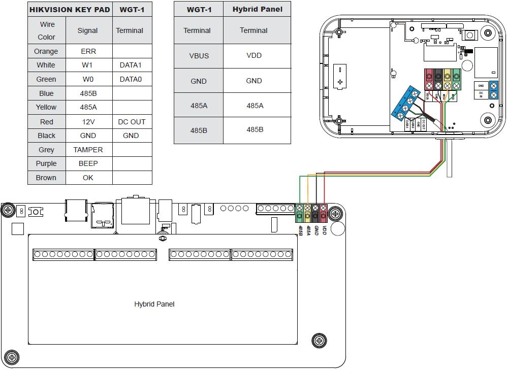

# VESTA 344

 (1) (1).png>)**Modulo WIEGAND (WGT-1-Combo)**

WGT-1-COMBO è un modulo WIEGAND che può essere collegato al lettore di schede HIKVISION per nascondere WIEGAND 26\[W26] Protocollo per segnali wireless RF o segnali cablati BUS. Quando il lettore di schede WIEGAND legge un tag per la richiesta di inserimento/disinserimento, WGT-1-COMBO trasmetterà il segnale di inserimento/disinserimento con il numero di tag alla centrale di controllo.

 (1) (1).png>)

* _**Identificazione delle parti**_
  1. **Terminale BUS collegabile**
  2. **Indicatore LED**

Il LED lampeggia per una volta dopo l'accensione.

Il LED lampeggia per 3 volte quando si preme il pulsante di apprendimento e trasmette il segnale RF.

*
  1. **Pulsante Impara**
  2. **Interruttore a ponticello della resistenza terminale**

Quando il modulo WIEGAND è collegato come dispositivo BUS più lontano su una linea BUS, impostare il ponticello della resistenza terminale del modulo WIEGAND e il ponticello della resistenza terminale del primo dispositivo BUS (normalmente il pannello ibrido) su ON per fungere da resistenze terminali. La capacità di comunicazione della linea BUS connessa verrà potenziata.

* Se il ponticello è disattivato (se il collegamento del ponticello è rimosso o “parcheggiato” su un pin), la capacità di comunicazione è a livello normale.
* Se il ponticello è su ON, la capacità di comunicazione verrà migliorata.
* **Ingresso 12 V CC/GND**

 (1) (1).png>)

Connect to 12V 1A power supply.

1. **Uscita 12 V CC/GND**

Fornire 12 V CC a 150 mA al lettore di schede HIKVISION collegato.

1

1. **DATA0**

Connettersi a W0 del lettore di schede HIKVISION.

**DATI1**

Connettersi a W1 del lettore di schede HIKVISION.

1. **Foro di cablaggio**
2. **Viti di base x 4**
3. **Fori di montaggio x 2 (per staffa di montaggio)**
4. **Staffa di fissaggio**

 (1).png>)

* _**Energia**_

**Alimentato da pannello ibrido (solo per applicazioni cablate BUS)**

* Quando il WGT-1-COMBO è in modalità cablata (cablato al pannello ibrido), l'alimentazione da 13,5 V (tipica) verrà fornita dal pannello ibrido.

**Applicazione adattatore di alimentazione (richiesto per l'applicazione wireless; opzionale per l'applicazione cablata)**

* Quando il WGT-1-COMBO è in modalità wireless (NON collegato al pannello ibrido), accendere il WGT-1-COMBO collegando l'adattatore CA-CC da 12 V a due fili al**Ingresso CC/TERRA**terminale.
* Quando il WGT-1-COMBO è in modalità cablata (cablato al pannello ibrido), ma il pannello è collegato a carichi che richiedono un assorbimento di energia maggiore, si consiglia di utilizzare un adattatore CA-CC da 12 V a due fili.

**Potenza in uscita:**

*
  *
    * WGT-1-COMBO può fornire alimentazione a 12 V, 150 mA al lettore di schede HIKVISION collegato tramite il terminale di alimentazione.
* _**Diagramma dell'applicazione**_
  * La specifica del cablaggio dei fori di inserimento è AWG 20-28 o Ø 0,518-0,081 (mm²). Quando si collega il filo al terminale, serrare la vite per chiudere il clipper e tenere il filo in posizione. Svitare per aprire il tagliacapelli e rimuovere il filo.
  * Il WGT-1-COMBO può essere collegato sia per l'applicazione wireless che per l'applicazione cablata secondo gli schemi seguenti:
    *
      1. **Applicazione wireless RF (NON cablato al pannello ibrido)**

 (1) (1).png>)

* Prima del cablaggio assicurarsi che l'alimentazione sia stata disconnessa.
  * Collegare**GND**terminale del WGT-1-COMBO al terminale di terra di un alimentatore.
  * Collegare**Ingresso CC**Terminale di ingresso del WGT-1-COMBO al terminale di uscita dell'alimentazione dell'alimentatore.
  * Collegare**USCITA CC**terminale di WGT-1-COMBO al**cavo rosso**del lettore di schede HIKVISION.
  * Collegare**GND**terminale di WGT-1-COMBO al**cavo nero**del lettore di schede HIKVISION.
  * Collegare**DATA0**terminale di WGT-1-COMBO al\*\*cavo verde (W0)\*\*del lettore di schede HIKVISION.
  * Collegare**DATI1**terminale di WGT-1-COMBO al\*\*cavo bianco (W1)\*\*del lettore di schede HIKVISION.

 (1).png>)

2

1. **Applicazione BUS Cablato (cablato al pannello ibrido)**

* Prima di collegare il modulo WIEGAND al bus di sistema, spegnere l'alimentazione.
* Per facilitare i collegamenti dei cavi, le morsettiere su ciascun modulo del sistema BUS sono codificate a colori.

.jpeg>)

| **Rosso**  | VDD  |
| ---------- | ---- |
| **Nero**   | GND  |
| **Giallo** | 485A |
| **Verde**  | 485B |

*
  * Collegare**USCITA CC**terminale di WGT-1-COMBO al**cavo rosso**del lettore di schede HIKVISION.
  * Collegare**GND**terminale di WGT-1-COMBO al**cavo nero**del lettore di schede HIKVISION.
  * Collegare**DATA0**terminale di WGT-1-COMBO al\*\*cavo verde (W0)\*\*del lettore di schede HIKVISION.
  * Collegare**DATI1**terminale di WGT-1-COMBO al\*\*cavo bianco (W1)\*\*del lettore di schede HIKVISION.
* Collegamenti errati causeranno guasti o un funzionamento improprio. Ispezionare il cablaggio e verificare che i collegamenti siano corretti prima di applicare l'alimentazione.
* Accendendo il pannello, si accenderà anche il WGT-1-COMBO.

_\\_

*
  * Il design innestabile delle morsettiere BUS migliora l'efficienza dell'installazione. Prima del cablaggio, è possibile rimuovere le morsettiere dalla scheda PCB per facilità d'uso e ricollegarle dopo il cablaggio.
  * Dopo aver scollegato il terminale, quando si reinstalla il terminale sulla scheda, assicurarsi di installare il terminale nella stessa direzione per evitare potenziali pericoli.
* Il modulo WIEGAND può essere collegato in serie con altri dispositivi BUS al Pannello Ibrido. Quando connesso a**VBUS**terminale senza connessione a**Ingresso CC**, la lunghezza totale del cablaggio non deve superare i 300 piedi. Quando connesso a**Ingresso CC**, la lunghezza totale del cablaggio può arrivare fino a 3000 piedi.
* Per una comunicazione ottimale dei dispositivi della linea BUS collegati, assicurarsi che i ponticelli della resistenza terminale del primo e del dispositivo BUS più lontano su una linea BUS siano impostati su ON per fungere da resistenze di terminazione. Assicurarsi di abilitare solo i 2 interruttori jumper sopra menzionati e di non impostare gli interruttori jumper su ON per nessun altro dispositivo BUS intermedio.

3

*  (1).png>)_**Apprendimento di WGT-1-COMBO nel Pannello di controllo**_

\*\*Passo 1.\*\*Metti il ​​Pannello di Controllo in Modalità Apprendimento.

\*\*Passo 2.\*\*\*\*(Per applicazioni wireless)\*\*Premere il pulsante di apprendimento del WGT-1-COMBO. Il modulo WIEGAND trasmetterà un segnale di apprendimento al pannello di controllo. Se il pannello di controllo riceve con successo il segnale di apprendimento, il WGT-1-COMBO verrà visualizzato nel pannello di controllo come lettore di tag.

\*\*(Per applicazioni BUS cablate)\*\*Se il WGT-1-COMBO è collegato correttamente al Pannello, verrà automaticamente visualizzato nel Pannello di Controllo come lettore di tag.

\*\*Passaggio 3.\*\*Fare riferimento al manuale del Pannello di controllo per completare il processo di apprendimento.

\*\*Passaggio 4.\*\*Naviga nel Pannello di controllo in “**Prova della camminata**" modalità. Tenere il WGT-1-COMBO nella posizione desiderata, premere il pulsante di apprendimento sul modulo WIEGAND per confermare che questa posizione sia all'interno del raggio del segnale del pannello di controllo.

 (1).png>)

* _**Identificazione (per applicazioni BUS cablate)**_

IL "**Identificare**La funzione ” permette di localizzare uno specifico dispositivo BUS nell'impianto BUS cablato. Questa funzione è utile per distinguere di quale dispositivo si tratta soprattutto in un impianto di grandi dimensioni in cui sono presenti numerosi dispositivi BUS.

Per individuare il modulo WIEGAND nel sistema BUS:

\*\*Passo 1.\*\*Nella pagina Web del pannello ibrido, fare clic su "Identifica" nell'elenco dei dispositivi dopo la voce della colonna del dispositivo del lettore di tag.

\*\*Passo 2.\*\*Se il lettore di tag riceve il segnale dalla centrale ibrida, la pagina web visualizzerà un messaggio di successo e l'indicatore LED del WGT-1-COMBO lampeggerà 10 volte per indicare dove si trova all'utente.

 (1) (1).png>)

_\\_

* Se sulla pagina web viene visualizzato un messaggio di timeout, significa che il modulo WIEGAND non ha ricevuto il segnale dal pannello.

Verificare se il modulo WIEGAND è collegato correttamente al pannello con la distanza di cablaggio adeguata.

* _**Prova della camminata**_
  * Per assicurarsi che il modulo WIEGAND sia in grado di comunicare con la centrale dopo l'apprendimento, posizionare la centrale in modalità Walk Test e premere il pulsante di apprendimento su WGT-1-COMBO per trasmettere un segnale di test alla centrale.
  * Quando il pannello riceve il segnale di test, emette un segnale acustico e visualizza le informazioni del modulo WIEGAND in cima all'elenco dei dispositivi.

_\\_

* Se non c'è risposta dal pannello dopo aver premuto il pulsante di apprendimento, significa che il pannello non ha ricevuto il segnale di test dal dispositivo.

Verificare se il WGT-1-COMBO è collegato correttamente al pannello entro una distanza di cablaggio adeguata.

* _**Apprendimento/rimozione dei tag**_
  * Prima di apprendere un tag nel Pannello di controllo, assicurarsi che il WGT-1-COMBO sia stato appreso nel Pannello di controllo.
  * Dopo aver acceso per la prima volta il lettore di schede HIKVISION, attendere finché il cicalino non emette un segnale acustico, indicando che il processo di avvio è completato.

 (1) (1).png>)

**Apprendimento dei tag**

\*\*Passo 1.\*\*Disinserire il sistema.

**Passo 2.Vai aPagina web locale**>**Codice PIN**. Seleziona il**La zona**. Passa l'etichetta**due volte**tramite il lettore di schede HIKVISION in**meno di 4 secondi**, verranno emessi due bip dal lettore di carte, quindi WGT-1-COMBO trasmetterà il segnale con il numero del tag al pannello di controllo. Clic**Carico**pulsante sulla pagina web.

 (1) (1).png>)

4

\*\*Passaggio 3.\*\*Quando il numero ID del tag viene visualizzato sulla pagina web, inserire un codice utente di 4 o 6 cifre e assegnare un nome utente per il tag.

 (1) (1).png>)

**Passaggio 4.ClicOK**pulsante sulla pagina Web per salvare.

**Passaggio 5.L'apprendimento dei tag è completo.**

**Rimozione dell'etichetta**

\*\*Passo 1.\*\*Disinserire il sistema.

**Passo 2.Vai aPagina web locale**>**Codice PIN**. Seleziona il**La zona**. Passa l'etichetta**due volte**tramite il lettore di schede HIKVISION in**meno di 4 secondi**, verranno emessi due bip dal lettore di carte, quindi WGT-1-COMBO trasmetterà il segnale con il numero del tag al pannello di controllo. Trova una riga vuota del numero di tag e fai clic sul pulsante Carica per verificare il numero ID del tag che intendi eliminare\*\*.\*\*

 (1) (1).png>)

**Passaggio 3.In base al numero ID del tag appena caricato, trova lo stesso numero ID del tag nell'elenco e selezionaEliminare**.

* **Esempio:Come mostrato nell'immagine di seguito, il n. 1 e il n. 2 nell'elenco sono i tag appresi esistenti. Dopo aver passato il tagdue volte**tramite il lettore di schede e fare clic**Carico**nella riga vuota N.3, il numero ID dell'etichetta verrà mostrato in N. 3. Poiché N.3 è uguale a N.2, quindi N.2 è l'etichetta da rimuovere. Selezionare**Eliminare**sulla riga n.2 per rimuovere l'etichetta.

 (1) (1).png>)

**Passaggio 4.ClicOK**sulla pagina Web per salvare la modifica.

\*\*Passaggio 5.\*\*La rimozione del tag è completata.

* _**Segnale di supervisione**_
  * In modalità cablata, il modulo WIEGAND trasmetterà automaticamente i segnali di supervisione alla centrale ad intervalli di 20-30 secondi.
  * In modalità wireless, il modulo WIEGAND trasmetterà automaticamente i segnali di supervisione alla centrale ad intervalli di 30-50 minuti.
  * Se la centrale di controllo non riceve il segnale dal modulo WIEGAND per un periodo di tempo preimpostato, la centrale considererà il modulo WIEGAND fuori servizio e reagirà in base alle impostazioni della centrale.

5

* **Per inserire il sistema:Passa l'etichettaUna volta**tramite il lettore di carte HIKVISION, il lettore di carte emetterà un segnale acustico. Dopo 4 secondi, WGT-1-COMBO trasmetterà il segnale ARM con il numero del tag al pannello di controllo. Se il Pannello di Controllo conferma che il tag è collegato all'utente, passerà automaticamente alla Modalità Inserimento.
* **Per disinserire il sistema:Passa l'etichettadue volte**tramite il lettore di schede HIKVISION in**meno di 4 secondi**, verranno emessi due bip dal lettore di carte, quindi WGT-1-COMBO trasmetterà il segnale di DISINSERIMENTO con il numero di tag al Pannello di Controllo. Se il Pannello di Controllo conferma che il tag è attaccato all'utente, passerà automaticamente alla Modalità Disinserimento.
* _**Montaggio**_

**Montare la staffa**

\*\*Passo 1.\*\*Fissare la staffa di montaggio alla parete nella posizione desiderata.

\*\*Passo 2.\*\*Utilizzare i fori come modello e praticare dei fori sulla superficie.

\*\*Passaggio 3.\*\*Avvita la staffa di montaggio sui fori praticati.

\*\*Passaggio 4.\*\*Agganciare il modulo WIEGAND alla staffa di montaggio.

\*\*Passaggio 5.\*\*Scorrimento verso il basso del modulo WIEGAND quando agganciato alla staffa di montaggio per serrare e fissare il modulo.
