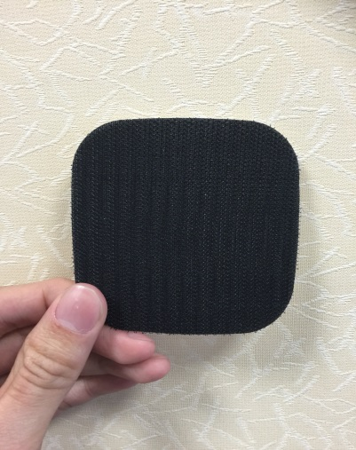
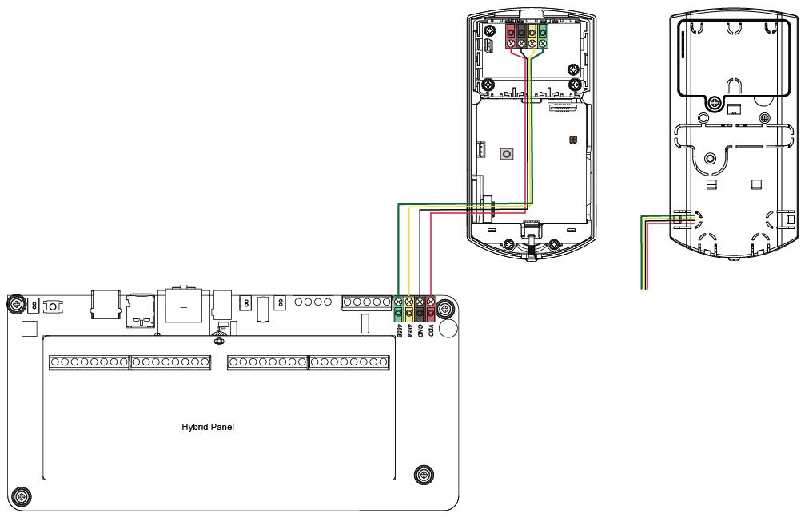

# VESTA 355

**Telecamera con sensore di movimento PIR cablata (VST-892-BUS)**

**introduzione**

VST-892-BUS è una telecamera con sensore di movimento a infrarossi passivi (PIR). È in grado di inviare segnali filari e immagini catturate (qualità dell'immagine fino a 640 x 480 pixel) su BUS alla Centrale al rilevamento del movimento.

La telecamera PIR è progettata con un raggio di rilevamento tipico di 12 metri se montata ad un'altezza di 2,3-2,5 metri dal suolo. Quando la funzione Pet Immunity è abilitata, la telecamera con sensore di movimento non rileverà animali domestici fino a 25 kg se montata ad un'altezza di 2,3-2,5 metri dal suolo.

Inoltre, VST-892-BUS è progettato con il rilevatore di prossimità digitale. La funzione antimascheramento consente di rilevare eventuali tentativi di accecamento del rilevatore posizionando oggetti nel suo campo visivo.

La configurazione remota è supportata per la telecamera PIR. Oltre a regolare gli interruttori jumper, gli utenti possono anche abilitare/disabilitare la funzione di immunità agli animali domestici e regolare la sensibilità della telecamera PIR dalla pagina Web del pannello di controllo o dal server del portale domestico.

La telecamera PIR è costituita da un design in due parti composto da una copertura e una base. Il coperchio contiene tutta l'elettronica e l'ottica e la base fornisce un mezzo di fissaggio. La base è dotata di fori per consentire il montaggio direttamente su una superficie piana oppure viene fornita una staffa di montaggio per il montaggio ad angolo e su superficie.

**La serie VST-892-BUS comprende i seguenti modelli**:

VST-892-BUS – Telecamera con sensore di movimento PIR cablata con LED flash VST-892-IL-BUS – Telecamera con sensore di movimento PIR cablata con LED a infrarossi

**Identificazione delle parti**

.jpeg>)

**1. LED flash/LED a infrarossi**

Il LED flash (per VST-892-BUS) o il LED a infrarossi (per VST-892-IL-BUS) fornisce luce sufficiente per l'acquisizione di immagini in condizioni di scarsa illuminazione.

**2. LED blu/pulsante funzione**

**LED blu:**

(Per favore riferisci a_**Indicatore LED**_descrizione qui sotto per i dettagli)

**Utilizzo dei pulsanti funzione:**

-   -   Premere il pulsante una volta per accedere alla modalità test per 3 minuti.

1.  **Rilevatore di prossimità digitale**

Il rilevatore di prossimità digitale viene utilizzato per rilevare qualsiasi tentativo di mascheramento (blocco) da parte di un intruso

1.  **Sensore IR**
2.  **Obiettivo della fotocamera PIR**
3.  **Capolinea autobus**

.jpeg>)

Cablare i quattro terminali (VCC, GND, A, B) al terminale BUS sul pannello di controllo. Per favore riferisci a_**Cablaggio telecamera PIR**_sezione per i dettagli.

1

1.  **Interruttore a ponticello della resistenza terminale**

Quando la telecamera PIR è collegata come dispositivo BUS più lontano su una linea BUS, impostare il ponticello del resistore terminale della telecamera PIR e l'interruttore ponticello del primo dispositivo BUS (solitamente il pannello ibrido) su ON per fungere da resistori di terminazione. La capacità di comunicazione della linea BUS connessa verrà potenziata.

.jpeg>).png>)

**Ponticello acceso**

Viene inserito il ponticello che collega i due pin.

**Ponticello spento**

Il collegamento del ponticello viene rimosso o “**parcheggiato**"su un perno.

-   -   Se il ponticello è su OFF, la capacità di comunicazione è a livello normale.
    -   Se il ponticello è su ON, la capacità di comunicazione è migliorata.

1.  **Interruttore antimanomissione**
2.  **Interruttore ponticello di attivazione/disattivazione dell'immunità agli animali domestici (JP3)**

.png>)

**Ponticello acceso**

 (1).jpeg>)

Viene inserito il ponticello che collega i due pin.

**Ponticello spento**

Il collegamento del ponticello viene rimosso o “**parcheggiato**"su un perno.

Quando impostato su ON, l'immunità agli animali domestici è disabilitata (impostazione di fabbrica).

Se impostato su OFF, l'immunità agli animali domestici è abilitata.

**10. Interruttore a ponticello per l'aumento della sensibilità (JP4)**

Quando impostato su ON, la sensibilità di rilevamento del PIR è alta.

Quando impostato su OFF, la sensibilità di rilevamento del PIR è a livello normale (impostazione di fabbrica).

1.  **Vite di fissaggio inferiore**
2.  **Area di separazione per interruttore antimanomissione**
3.  **Opzioni dell'area di separazione per il cablaggio**
4.  **Staffa di fissaggio**

**Caratteristiche**

 (1) (1).png>)

-   _**Indicatore LED**_
    -   Il LED blu lampeggerà per 1 secondo quando la telecamera PIR entra in modalità test. Durante la modalità Test, il LED blu lampeggerà una volta ogni volta che viene rilevato un movimento.
    -   Il LED non lampeggerà se la telecamera PIR è normale e non è in modalità test.
-   _**Acquisizione di immagini**_

.png>)

Quando il sistema di allarme è armato, la telecamera PIR catturerà 1, 3 o 6 immagini di allarme con risoluzione di 640 x 480 o 320 x 240 (programmabili dal pannello di controllo) al rilevamento del movimento. Puoi anche richiedere manualmente alla telecamera PIR di scattare una foto tramite il pannello di controllo. Le immagini catturate verranno trasferite al Pannello di controllo affinché gli utenti possano visualizzarle.

.png>)

_\\<NOTE>_

-   -   Se la tua telecamera PIR è installata in un luogo in cui il campo visivo della telecamera è un ambiente complesso con luce intensa o molti colori, le immagini catturate avranno dimensioni di file elevate, il che potrebbe comportare un troncamento quando le immagini vengono trasmesse al pannello di controllo .
-   _**Periodo di riscaldamento**_

.png>)

Quando il sistema della centrale entra in modalità armata o quando la telecamera PIR viene messa in modalità test, la telecamera PIR si riscalda per 30 secondi.

-   _**Alimentazione elettrica**_

Quando il VST-892-BUS è cablato a un pannello ibrido, l'alimentazione da 13,5 V può essere fornita dal pannello ibrido.

.png>)

-   _**Antimascheramento**_
    -   La telecamera PIR è dotata di un rilevatore di prossimità digitale in grado di rilevare eventuali tentativi di mascheramento (blocco) da parte di un intruso.
    -   Quando viene rilevato un evento di mascheramento e la condizione di mascheramento dura 3 minuti, VST-892-BUS invierà un segnale di allarme di mascheramento al pannello di controllo per notificare all'utente la condizione di mascheramento.
    -   Dopo che il mascheramento/blocco è stato rimosso per 3 minuti, VST-892-BUS invierà un segnale di ripristino al Pannello di Controllo.
-   _**Protezione antisabotaggio**_

.png>)

La telecamera PIR è protetta da un interruttore antimanomissione che viene premuto quando la telecamera PIR è installata correttamente. Quando la telecamera PIR viene rimossa dalla superficie di montaggio o il suo coperchio viene aperto, l'interruttore antimanomissione verrà attivato e la telecamera PIR invierà un segnale di apertura antimanomissione al pannello di controllo del sistema per ricordare all'utente la condizione.

2

-   .png>)_**Supervisione**_

La telecamera PIR effettuerà periodicamente un autotest trasmettendo un segnale di supervisione ogni 20-30 secondi.

.png>)

-   _**Modalità di prova**_
    -   -   La modalità test consente di verificare il raggio di rilevamento della telecamera PIR (non la copertura delle riprese).
        -   Premere una volta il pulsante Funzione per accedere alla modalità test per 3 minuti. Il LED blu lampeggerà per 1 secondo.
        -   La telecamera PIR si riscalderà per 30 secondi. Si prega di non attivare la fotocamera durante questo periodo di riscaldamento.
        -   Dopo il periodo di riscaldamento, è possibile attivare la telecamera PIR per verificare il raggio di rilevamento IR. Se la telecamera PIR viene attivata, il LED blu lampeggerà una volta.
-   _**Attenzione**_
    -   Il cablaggio della telecamera PIR deve essere eseguito solo da tecnici certificati con conoscenza e formazione adeguate sulle apparecchiature elettriche.
    -   Prima dell'installazione o di qualsiasi intervento di manutenzione, assicurarsi che l'alimentazione dal Pannello di Controllo sia stata scollegata.
-   _**Cablaggio telecamera PIR**_
    -   -   Prima del collegamento, assicurarsi che l'alimentazione del pannello sia stata scollegata e che l'interruttore della batteria del pannello sia stato spostato in posizione OFF.
        -   Per facilitare i collegamenti dei cavi, le morsettiere su ciascun modulo del sistema BUS sono codificate a colori.

.png>).png>)

| **Rosso**  | VDD   |
| ---------- | ----- |
| **Nero**   | TERRA |
| **Giallo** | 485A  |
| **Verde**  | 485B  |

-   È possibile collegare più dispositivi BUS in serie alla centrale ibrida. Per una comunicazione ottimale dei dispositivi della linea BUS collegati, assicurarsi che gli interruttori a ponticello della resistenza terminale del primo (normalmente il pannello ibrido) e dei dispositivi BUS più lontani su una linea BUS siano impostati su ON per fungere da resistenze di terminazione. Assicurarsi di abilitare solo i 2 interruttori jumper sopra menzionati e di non impostare gli interruttori jumper su ON per nessun altro dispositivo BUS intermedio.

.png>)

_\\<NOTE>_

-   -   Il design innestabile delle morsettiere BUS migliora l'efficienza dell'installazione. Prima del cablaggio, è possibile rimuovere le morsettiere dalla scheda PCB per facilità d'uso e ricollegarle dopo il cablaggio.
    -   Dopo aver scollegato il terminale, quando si reinstalla il terminale sulla scheda, assicurarsi di installare il terminale nella stessa direzione per evitare potenziali pericoli.
-   Collegamenti errati causeranno guasti o un funzionamento improprio. Ispezionare il cablaggio e verificare che i collegamenti siano corretti prima di applicare l'alimentazione.
-   Sono presenti otto opzioni per l'area di separazione sul coperchio posteriore e sul coperchio della batteria per consentire l'uscita dei cavi staccandone uno qualsiasi.

3

-   _**Apprendimento**_

Seguire i passaggi seguenti per apprendere il dispositivo al pannello ibrido.

Passaggio 1. Collegare il dispositivo al pannello. Quindi, accendere il pannello.

Passaggio 2. Nella pagina Web del Pannello, fare clic su "**Apprendimento**" per accedere alla pagina di apprendimento.

Passaggio 3. Fare clic su "**Inizio**" per accedere alla modalità di apprendimento.

Passaggio 4. Fare clic su "**Aggiungere**" per includere il dispositivo nel Pannello.

Passaggio 5. Se il dispositivo viene acquisito con successo nel Pannello, verrà visualizzato nella sezione "Dispositivo acquisito".

-   _**Identificazione**_

La funzione “Identifica” permette di localizzare uno specifico dispositivo BUS nell'impianto BUS cablato. Questa funzione è utile per distinguere di quale dispositivo si tratta soprattutto in un impianto di grandi dimensioni in cui sono presenti numerosi dispositivi BUS.

Per localizzare la Telecamera PIR nel sistema BUS:

**Passo 1.**Nella pagina Web del pannello ibrido, fare clic su "Identifica" nell'elenco dei dispositivi dopo la voce della colonna del dispositivo della telecamera IR.

**Passo 2.**Se VST-892-BUS riceve il segnale dal pannello ibrido, la pagina web visualizzerà un messaggio di successo e l'indicatore LED del VST-892-BUS lampeggerà 10 volte per indicare dove si trova all'utente.

_\\<NOTE>_

-   -   -   Se sulla pagina web viene visualizzato un messaggio di timeout, significa che il VST-892-BUS non ha ricevuto il segnale dal pannello.

Verificare se il VST-892-BUS è collegato correttamente al pannello entro una distanza di cablaggio adeguata.

-   _**Prova della camminata**_
    -   Per assicurarsi che la telecamera PIR sia in grado di comunicare con il pannello dopo l'apprendimento, posizionare il pannello di controllo in modalità Walk Test e premere il pulsante funzione sul VST-892-BUS per trasmettere un segnale di test al pannello.
    -   Quando il pannello riceve il segnale di test, emetterà un segnale acustico e visualizzerà di conseguenza le informazioni della telecamera PIR in cima all'elenco dei dispositivi.

_\\<NOTE>_

-   -   Se non c'è risposta dal pannello dopo aver premuto il pulsante funzione, significa che il pannello non ha ricevuto il segnale di test dal dispositivo.

Verificare se il VST-892-BUS è collegato correttamente al pannello entro una distanza di cablaggio adeguata.

-   _**Funzione di immunità agli animali domestici**_

Il sensore PIR supporta la funzione di immunità agli animali domestici e non rileva animali domestici fino a 25 kg per ridurre al minimo le situazioni di falsi allarmi. La funzione Pet Immunity può essere abilitata/disabilitata impostando la posizione dell'interruttore Jumper (JP3). Quando l'interruttore jumper (JP3) è impostato su ON, l'immunità agli animali domestici è disabilitata (impostazione di fabbrica). Quando l'interruttore jumper (JP3) è impostato su OFF, l'immunità agli animali domestici è abilitata. La funzione immunità agli animali domestici può essere regolata anche tramite impostazione remota come descritto di seguito.

-   _**Funzione di aumento della sensibilità**_

È possibile utilizzare la funzione di aumento della sensibilità per aumentare la sensibilità di rilevamento del PIR. Per aumentare la sensibilità di rilevamento, impostare l'interruttore jumper (JP4) su ON. Per mantenere la sensibilità di rilevamento normale, impostare l'interruttore jumper (JP4) su OFF (impostazione di fabbrica). La funzione di aumento della sensibilità può essere regolata anche tramite impostazione remota come descritto di seguito.

-   _**Impostazione remota**_
    -   La telecamera PIR supporta l'impostazione remota dell'immunità e della sensibilità degli animali domestici.
    -   Quando la telecamera PIR è accesa, la sua funzione di immunità agli animali domestici e la sensibilità sono determinate dalle impostazioni JP3 e JP4. Gli utenti possono regolare le impostazioni dei ponticelli o modificare in remoto le impostazioni di immunità e sensibilità degli animali domestici dal pannello di controllo. L'impostazione remota sovrascriverà le impostazioni del ponticello.

**Pagina Web del Pannello di controllo**:

-   -   1.  Nella pagina web locale del pannello, andare alla pagina Modifica dispositivo e inserire la configurazione della telecamera PIR nella sezione Impostazione sensore. Fare clic su OK per confermare.

Fare riferimento alla tabella seguente per i dettagli di configurazione. Ad esempio, se desideri abilitare l'immunità agli animali domestici e impostare il livello di sensibilità su alto, puoi inserire 02.

| **Configurazione IR** | **Immunità agli animali domestici** | **Sensibilità** |
| --------------------- | ----------------------------------- | --------------- |
| 00                    | NO                                  | Alto            |
| 01                    | NO                                  | Normale         |
| 02                    | SÌ                                  | Alto            |
| 03                    | SÌ                                  | Normale         |

**Server del portale domestico**:

1.  Su Home Portal Server, vai alla pagina Impostazioni dispositivo, fai clic sulla riga del dispositivo VST-892 e seleziona "Configurazione IR".

4

1.  Selezionare la funzione Pet Immunity (Abilita/Disabilita) e Sensibilità (Alta/Normale) dal menu a discesa e fare clic su "Invia" per confermare l'impostazione.

**Installazione**

-   _**Linee guida per l'installazione**_
    -   La telecamera PIR è progettata per essere montata su una superficie piana o in un angolo.
    -   La base è dotata di fori, dove la plastica è più sottile, per il montaggio. Due fori sulla base servono per il fissaggio su superficie, mentre una staffa di montaggio può essere utilizzata per il fissaggio ad angolo.
    -   Il raggio di rilevamento arriva fino a 12 metri se la telecamera PIR è montata ad un'altezza di 2,3-2,5 metri dal suolo.
    -   Quando la funzione di immunità agli animali domestici è abilitata, non rileverà animali domestici fino a 25 kg se montati ad un'altezza di 2,3-2,5 metri dal suolo. Se necessario, puoi regolare l'altezza della telecamera PIR in base alle dimensioni del tuo animale domestico per prestazioni immunitarie ottimali. Una posizione di installazione più alta fornirà uno spazio più ampio immune agli animali domestici, ma aumenterà anche l'angolo cieco sotto la telecamera PIR.
    -   Quando il VST-892-BUS è montato con la staffa rotante, non avrà la normale area di rilevamento o il tipico range di immunità agli animali domestici.

**Si consiglia di installare la telecamera PIR nelle seguenti posizioni:**

-   -   In una posizione in cui gli animali non possano raggiungere l'area di rilevamento arrampicandosi su mobili o altri oggetti.
    -   Non montare il dispositivo su scale dove gli animali possono salire.
    -   In una posizione in cui un intruso normalmente si sposterebbe attraverso il campo visivo del PIR.
    -   Ad un'altezza compresa tra 2,3 e 2,5 metri dal suolo per le migliori prestazioni.
    -   In un angolo per avere la visuale più ampia.
    -   In una posizione in cui il campo visivo non sia ostruito, ad esempio, da tende, ornamenti, ecc.
-   **Limitazioni**

|  | Non installare all'aperto.                                    |  | Evitare ostacoli di grandi dimensioni nell'area di rilevamento.     |
| - | ------------------------------------------------------------- | - | ------------------------------------------------------------------- |
|   |                                                               |   |                                                                     |
|  | Non esporre completamente la telecamera PIR alla luce diretta |  | Evitare vapori o umidità elevata che potrebbero causare             |
|   | luce del sole.                                                |   | condensazione.                                                      |
|   |                                                               |   |                                                                     |
|  | Evitare di spostare oggetti, ad esempio tende, arazzi,        |  | Evitare la luce riflessa da superfici luminose, ad esempio specchi, |
|   | ecc., nell'area di rilevamento.                               |   | finestre, ecc.                                                      |
|   |                                                               |   |                                                                     |

5

-   Evitare di installare la telecamera PIR in aree in cui macchinari come condizionatori o riscaldatori possono causare rapidi cambiamenti di temperatura nell'area di rilevamento.
-   Evitare superfici riflettenti nell'area di rilevamento. Le tracce infrarosse riflesse possono portare a falsi allarmi.

6

6.Riposizionare il coperchio sulla base e serrare la vite di fissaggio inferiore.

-   **Montaggio su superficie con la staffa di montaggio:**
    1.  Utilizzare i due fori centrali per le viti sulla staffa come modello e praticare i fori nella superficie da montare.
    2.  Inserire i tasselli se la telecamera PIR deve essere fissata su intonaco o mattoni.
    3.  Avvita la staffa di montaggio sui tasselli con i due bastoncini di puntamento in alto e rivolti verso di te.
    4.  Agganciare la telecamera PIR ai ganci della staffa di montaggio.
-   **Montaggio ad angolo con la staffa di montaggio:**
    1.  Utilizzare i 4 fori per viti laterali sulla staffa come modello e praticare i fori sulla superficie dell'angolo.
    2.  Inserire i tasselli se la telecamera PIR deve essere fissata su intonaco o mattoni.
    3.  Avvita la staffa di montaggio sui tasselli con i due bastoncini di puntamento in alto e rivolti verso di te.
        1.  Agganciare la telecamera PIR ai ganci della staffa di montaggio.

7

-   **Montaggio su superficie con staffa rotante (articolo opzionale, venduto separatamente):**

La staffa rotante può essere montata a parete con le viti in dotazione.

1.  Avvitare la staffa rotante al muro.
2.  Agganciare opportunamente la telecamera PIR alla staffa rotante.
3.  Ruotare la staffa per il campo di rilevamento corretto e serrare la vite di fissaggio.

8
