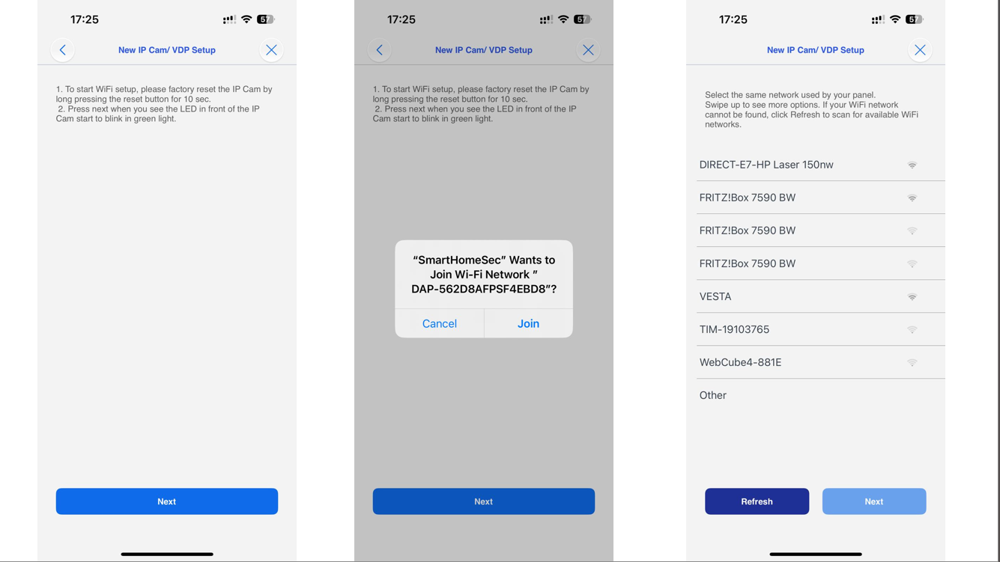
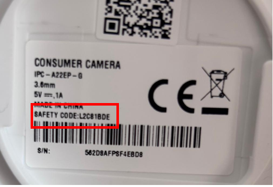

# SETUP VESTA CAMERAS 291-292-293

<figure><figcaption></figcaption></figure>

STEP 1  Plug the power cable&#x20;

STEP 2: Wait for the LED to remain in solid <mark style="color:green;">GREEN</mark> colour for Ethernet connection or flashing  <mark style="color:green;">GREEN</mark> in case of Wi-Fi Setup

<figure><figcaption></figcaption></figure>

Use the SmartHomeSec app to initialise the camera and **add** it to the system

<figure><figcaption>
STEP 1                                                                     STEP  2                                                            STEP 3            
</figcaption></figure>

STEP 1: Login as User in the SmarthomeSec App

STEP 2: Press Camera logo

STEP 3: Press + Icon to add a camera

<figure><figcaption>
STEP 4                                                                                              STEP 5                                      
</figcaption></figure>

STEP 4: Press Imou/Vesta icon

STEP 5: Scan the Camera QR code  and press NEXT&#x20;

<figure><figcaption>
STEP 6
</figcaption></figure>

STEP 6: Choose the communication path of the camera (Ethernet or Wi-Fi)


The camera and the panel must be in the same network, please check before procede&#x20;



In case of Ethernet communication jump directly to STEP 11


STEP 7 Wi-Fi connection

<figure><figcaption>
STEP 7                                                                STEP 8                                                                 STEP 9
</figcaption></figure>


The mobile must be connected to the Wi-Fi network that you want to connect the camera


STEP 7: press next&#x20;

STEP 8: Connet your mobile to the camera network by pressing join

STEP 9: Select the network and press next

<figure><figcaption>
STEP 7
</figcaption></figure>

STEP 10: Write the Wi-Fi password

STEP 11: The app will show you the camera&#x20;

<figure><figcaption></figcaption></figure>

STEP 12:  User name: admin and Password: (Safety code of the camera, label below)

<figure><figcaption></figcaption></figure>

SETUP COMPLETED

