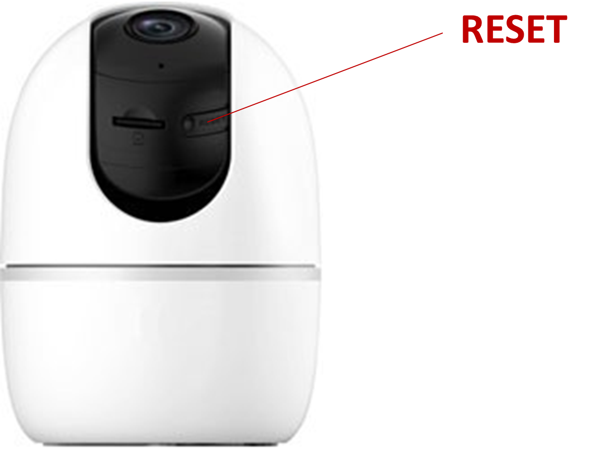

# SETUP VESTA CAMERAS 291-292-293

<figure><figcaption></figcaption></figure>


We will show how to add the camera Vesta-292, but the steps to add the camera Vesta-291 or Vesta-293 are similar


## Camera 292

<figure><figcaption></figcaption></figure>

#### STEP 1:  Plug the power cable&#x20;

#### STEP 2: Wait for the LED to remain in solid <mark style="color:green;">GREEN</mark> colour for Ethernet connection or flashing  <mark style="color:green;">GREEN</mark> in case of Wi-Fi Setup

Use the SmartHomeSec app to initialise the camera and **add** it to the system

<figure><figcaption>
STEP 1                                                                STEP 2                                                           STEP 3
</figcaption></figure>

### STEP 1: Login as User in the SmarthomeSec App

### STEP 2: Press Camera logo

### STEP 3: Press + Icon to add a camera

<figure><figcaption>
STEP 4                                                                                              STEP 5                                      
</figcaption></figure>

### STEP 4: Press the Imou/Vesta icon

### STEP 5: Scan the Camera QR code  and press NEXT&#x20;

<figure><figcaption>
STEP 6
</figcaption></figure>

### STEP 6: Choose the communication path of the camera (Ethernet or Wi-Fi)


The camera and the panel must be in the same network, please check before proceeding&#x20;



In case of Ethernet communication jump directly to STEP 11


### STEP 7: Wi-Fi connection

<figure><figcaption>
STEP 7                                                                STEP 8                                                                 STEP 9
</figcaption></figure>


The mobile must be connected to the Wi-Fi network that you want to connect the camera


### STEP 8: Connet your mobile to the camera network by pressing join

### STEP 9: Select the network and press next

<figure><figcaption>
STEP 7
</figcaption></figure>

### STEP 10: Write the Wi-Fi password

### STEP 11: The app will show you the camera&#x20;

<figure><figcaption></figcaption></figure>

### STEP 12:  User name: admin and Password: (Safety code of the camera, label below)

<figure><figcaption></figcaption></figure>

SETUP COMPLETED

<figure><figcaption></figcaption></figure>

## TROUBLESHOOTING&#x20;

### **I cannot find the IP of the camera on the setup steps:**

1\.   Ensure that the VESTA central controller is connected to the same network as the camera.

2\.   Restart the switch or router where the VESTA panel and Camera are connected.

***

### **I cannot complete the setup via WIFI**

1\.   Check that you have the latest firmware in the VESTA control unit.

2\.   Make sure to enable the location for the SmartHomeSec APP.

3\.   Make sure you give the APP permissions to connect to a WIFI network, and if it asks for connection permissions allow them.

***

### **The camera is not ready:**

1. Reset the camera to factory settings

To reset the VESTA camera:  Press the button RESET located on the back and hold for 10 seconds (The camera will make a BEEP and the LED will turn red) NOTES: In the VESTA-292 model, the button is located under the optics

<figure><figcaption></figcaption></figure>
