# SmartHomeSec WIZARD


This wizard is coming soon


## Configuration Wizard

<figure><figcaption></figcaption></figure>

Press **No**, we will end the Wizard and we can proceed to configure the control panel manually

Press **Yes**, and the panel configuration Wizard will start

Enter the default installer code: **7982** and press **Login**

<figure><figcaption></figcaption></figure>


NOTE: During the Wizard we could at any time access the various steps of the guided configuration by pressing the icon with three lines at the top left


<figure>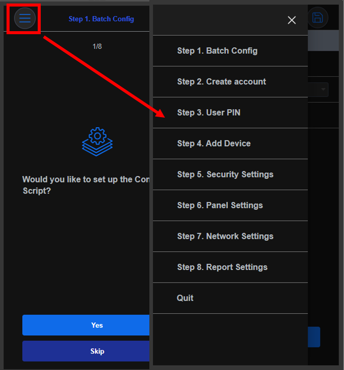<figcaption></figcaption></figure>

## 1. Batch Config

We may have created one or more programming templates to recall them at this stage and avoid always setting the same parameters during a system configuration.

Press **Skip**, we will go forward in the wizard

Press **Yes**, we will load a previously saved programming template.

<figure>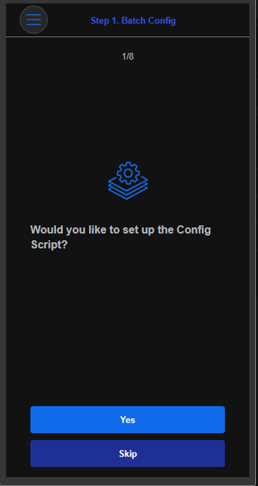<figcaption></figcaption></figure>

Select a script model (previously created).\
All parameters set in the template will be automatically sent to the control panel.

<figure>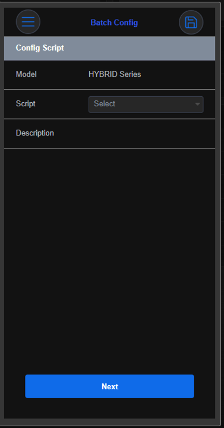<figcaption></figcaption></figure>

You can see the parameters of the model simply by clicking on the three dots



<figure><figcaption></figcaption></figure>



<figure>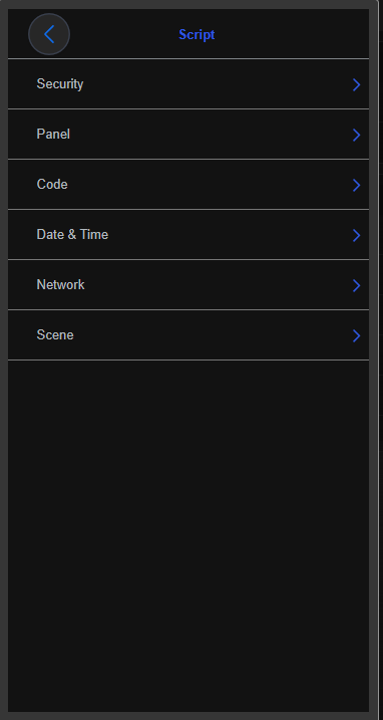<figcaption></figcaption></figure>



Press **Save** and **Next**

## 2. Create Account

In this phase we will create a new account for the customer, the account will be his login to be able to connect with the SmartHomeSec App or through the WEB portal to be able to manage the system.

Press **Skip**, we will go forward in the wizard

Press **Yes**, we could add a new account or link the control panel to an existing customer account

<figure><figcaption></figcaption></figure>

On this screen, we could decide whether to create a new user account or connect the control panel to an existing customer account

<figure>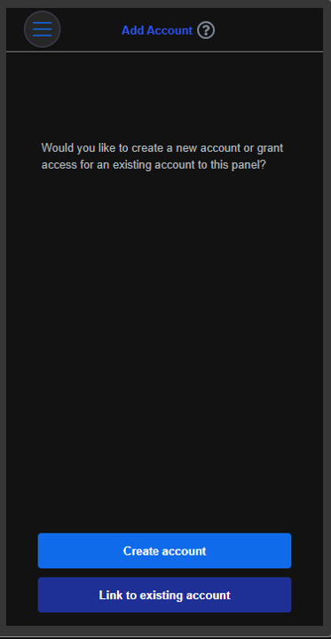<figcaption></figcaption></figure>

**Create Account**

1. ID: Customer name or email
2. &#x20;Password
3. &#x20;Customer email
4. &#x20;Customer Access Privilege

<figure>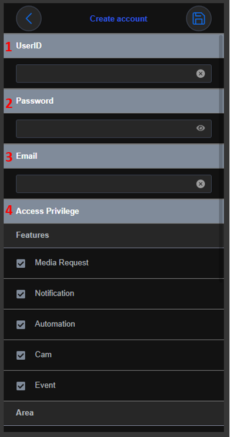<figcaption></figcaption></figure>

Customer Access Privilege. The customer will be able to:

Media Request – Request images from PIRCAM&#x20;

Notification – Receive notifications&#x20;

Automation – Access the automation section

&#x20;Camera – Access the camera view

&#x20;Event – Access the events page of the control panel

&#x20;Area (1,... 8) – The user will have access to the specified partitions of the system

**Link to an existing account**

By clicking “link to an existing account”, we could enter the customer's (ID and Password) and configure the access rights and associated areas.

<figure>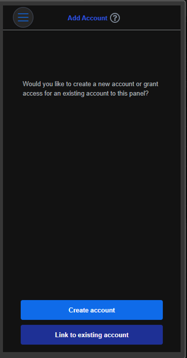<figcaption></figcaption></figure>

<figure>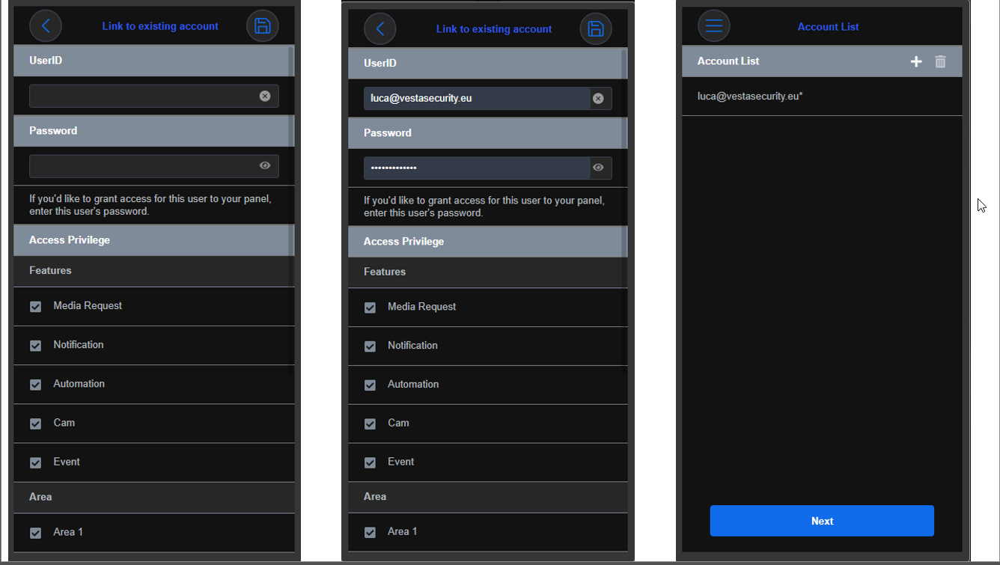<figcaption></figcaption></figure>

## 3. User PIN

In this tab, we can customize the customer's PIN code.

**Skip**, we will jump to the next step

Press **Yes**, and we will configure the name and code of the end user.

<figure><figcaption></figcaption></figure>

## 4. Add Device

In this screen, we could add any magnetic contact, PIR, detectors, PirCam, Cameras, and other accessories to the control panel

Press **Skip**, we will go forward in the wizard

Press **Yes**, the control panel will ask you which device you want to add

<figure><figcaption></figcaption></figure>

Select the device type you want to add, e.g., Motion Detector. Press and hold the pairing button on the device until the LED flashes (refer to the device's manual for specific instructions).

<figure>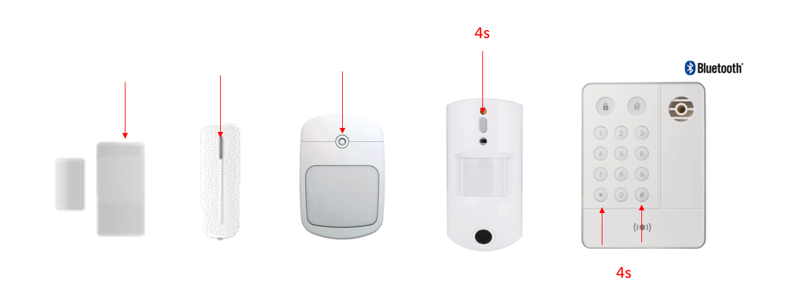<figcaption></figcaption></figure>


Important! In case of PIRCAMS and keyboards: The keystroke must be 3 or 4 seconds. While the rest of the devices with a short press is enough to add them.


Follow the on-screen instructions to complete the pairing process. The panel will confirm the successful addition of the device.

Select the device and press **Submit**

<figure>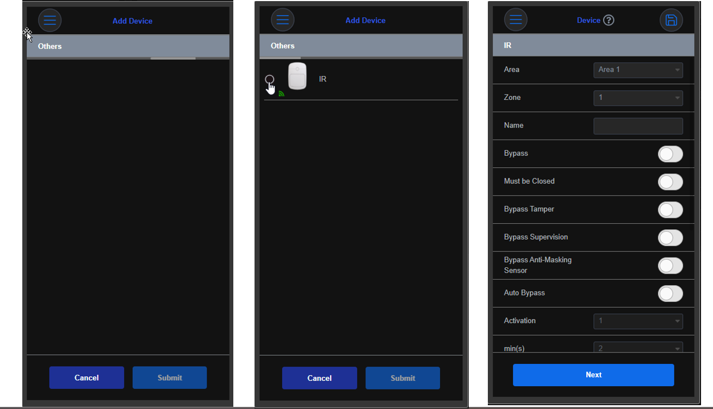<figcaption></figcaption></figure>


To configure the zones correctly, it is important to be familiar with the available attributes and their impact on the behavior of the alarm system.

For example: Interior is an instant zone and Entry is a delayed zone; we can assign these attributes in the section Response on arming which means "When the system is armed."


## 5. Security Setting

In this tab, we will define the security settings relating the partition of the control panel.

\
e.g. Entry time, exit time, ....

<figure><figcaption></figcaption></figure>

## 6. Panel Settings

In this tab, we could customize the options of the control panel

<figure><figcaption></figcaption></figure>

## 7. Network Settings

In this tab, we will be able to enable the GSM module of the control panel

Press **Skip** will cause the panel to use the Ethernet connection

Press **Yes**, we could enable SIM detection and set the APN if necessary

<figure><figcaption></figcaption></figure>

## 8. Report Settings

This tab allows us to configure the sending of events and any images of the pircams to a Central Monitoring Station.

Press **Skip**, the control panel will send all events to the end user's app

Press **YES**, we will configure the control panel to send events to a Central Monitoring Station.

<figure><figcaption></figcaption></figure>

1. We can apply a template already configured with the settings for the connection to the  Central Monitoring Station.

<figure>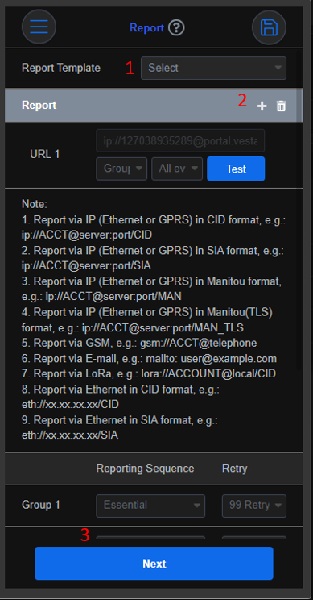<figcaption></figcaption></figure>

2. Click on the + icon to add a second communication method (the first is always the cloud and cannot be changed), select "Group 2" and set the parameters provided by the Central Monitoring Station.

<figure>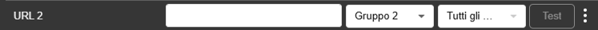<figcaption></figcaption></figure>

3. Set up group 2 with 3 attempts, at the end press S**ave** and then **Next**

## End WIZARD

<figure>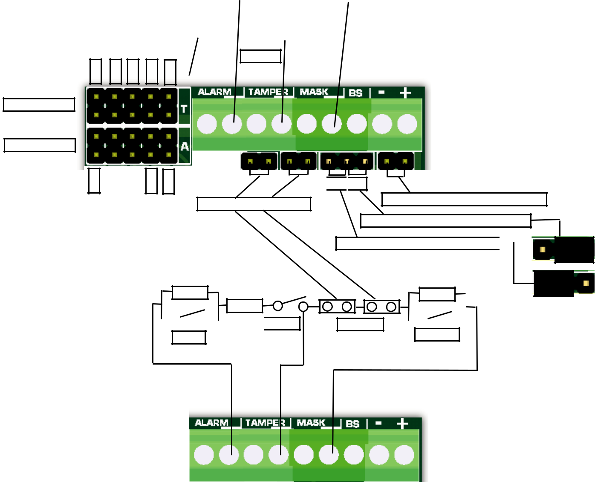<figcaption></figcaption></figure>

***
