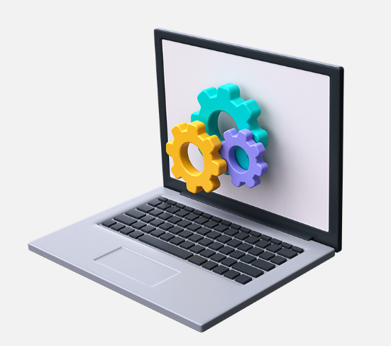
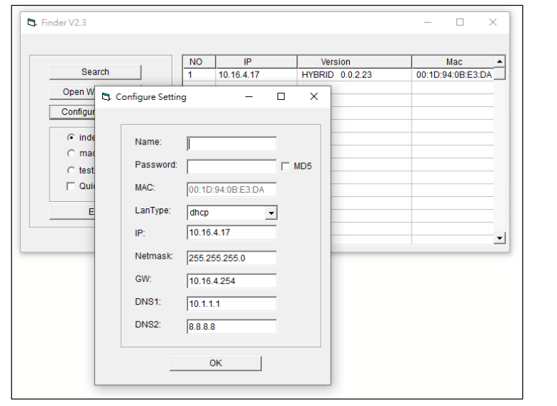

# Finder - Vesta Intrusion Software

It is software that enables connection to Vesta control units via the integrated web server.

<figure><figcaption></figcaption></figure>

**DOWNLOAD**



## Instructions

<figure><figcaption></figcaption></figure>

The LanType is default to **DHCP** and does not require manual input of IP/Netmask/Gateway/DNS setting. If you wish to configure these setting manually, change LanType to **Static.**

After finish changing network setting, enter the user name (default: **admin** ) and password (default: **cX+HsA\*7F1** ), then click OK to confirm. The user name and password can be changed later in the panel configuration webpage. Click the panel information column and click on "**Open Web Page**" or double-click on the panel column to link the panel configuration webpage. Your default browser will start automatically to connect to the LAN IP displayed in Finder.

