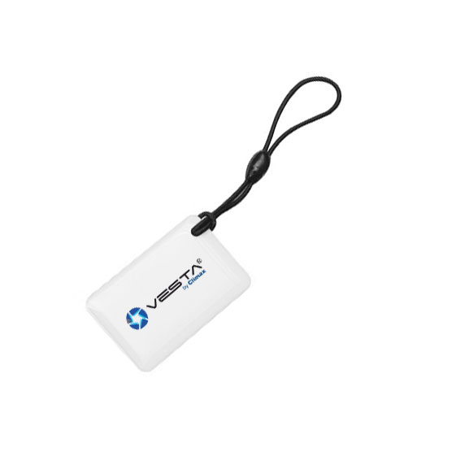

# 💡 Trubleshouting & tips \[Cameras]

## I can't find the IP of the camera in the configuration steps


1. Make sure that the VESTA control panel is connected to the same network as the camera.
2. Reboot the switch or router to which the VESTA panel and camera are connected.&#x20;
3. Restart the VESTA Panel.


## Cannot complete configuration via WIFI


1. Check that you have the **latest firmware** in the VESTA control panel.&#x20;
2. Make sure you have **enabled the location** for the SmartHomeSec APP.&#x20;
3. Make sure you give the **APP permissions to connect to a WIFI network**, and if it asks for connection permissions, allow them.&#x20;
4. Make sure to **enable the connectivity permissions** in the SmartHomeSEC APP check _\[Trouble sheet 1]_.


<figure><figcaption>
[Trouble sheet 1]
</figcaption></figure>

