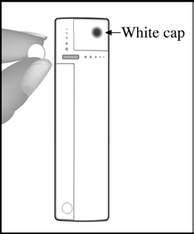

# VESTA 006

* Optical Door Contact (OPDC-1) User Manual

The Optical Door Contact, integrating infrared sensor, monitors the opening/closing of specified devices (e.g. door or window). By using infrared detection technology, the OPDC can detect if the door or window is open or closed, without the need of an additional magnet. The OPDC will transmit alarm signals when it detects a change, and keep your home protected.

The Optical Door Contact consists of a cover and base. The base contains all electronics and provides a means for fixing the device. An enclosed PCB tamper switch provides tamper protection against unauthorized device opening. 5v

_**Identifying the parts**_

1. **LED Indicator**
2. **Learn / Test Button**
   * Press the Test button to transmit a learn code.
   * Press the Test button once to enter Test Mode for 3 minutes.
3. **Tamper**
4. **Battery**
5. **Infrared Detection Area**
6. **Reflecting Sticker**

* _**LED Indicator**_

In Normal operation mode, the LED indicator remains off except in the following situations:

* When the Optical Door Contact’s tamper switch is triggered.
* Every time the Optical Door Contact is activated under Tamper or Low battery condition.
* Every time the Door Contact is activated and transmitting the signal under the Test mode.
* _**Supervision**_
* The Optical Door Contact will automatically transmit Supervisory signals periodically to the Control Panel at random intervals of 30 to 50 minutes in Normal Operation Mode.
* If the Control Panel has not received the signal from the Optical Door Contact for a preset period time, the Control Panel will indicate that particular Door Contact is experiencing an out-of-signal problem.
* _**Tamper Switch**_
* It is designed to protect against unauthorized cover opening. When the tamper is triggered, the Optical Door Contact will emit a signal to the Control Panel for reporting, the LED will also light up.
* _**Battery**_

The Optical Door Contact uses one **1.5V AAA Alkaline battery** as its power source, and it is also capable of detecting low battery. When the battery is low, a low battery signal will be sent to the Control Panel along with regular transmission. The LED will light up when the Door Contact is activated under low battery status. When battery is exhausted, the Optical Door Contact will stop all function and the LED will flash every 4 seconds.

* _**Changing Battery**_

Hold the Learn / Test button area and gently pull up the front cover. Remove the old battery as shown in Figure 1, and then press the Learn / Test button 5-6 times to fully discharge. Insert a new battery and replace the cover, as shown in Figure 2.

| Figure 1                                                      | Figure 2                                                      |
| ------------------------------------------------------------- | ------------------------------------------------------------- |
|  |  |

* _**Test Mode**_

The Optical Door Contact can be put into Test mode for 3 minutes by pressing the Test Button on the front cover once. During Test mode, the LED indicator will turn on upon triggering. Each press on the Test Button, the Optical Door Contact will transmit a test signal to the Control Panel for radio range test and resets the test mode back to the 3-minute duration. It will exit Test Mode automatically after the 3 minutes and returns to Normal Operation mode.

* _**Getting Started**_

Step 1: Use a flat-headed screwdriver to fit into the cover opening hole at the bottom.

Step 2: Gently push the flat-headed screwdriver upwards and remove the top cover.

Step 3: Insert the battery into the battery compartment. Please avoid staring directly at the Infrared Detection Area

when in operation.

Step 4: Put the Control Panel into learning mode, refer to Control Panel manual for detail.

Step 5: Press the Test Button on the Optical Door Contact to send signal to the Control Panel.

Step 6: If the Control Panel successfully receives the signal, the Control Panel should respond (e.g. emitting beeps). Refer to your Control Panel manual to complete the learning process.

Step 7: After the Optical Door Contact is learnt-in, put the Control Panel into “**Walk Test**” mode. Hold the Optical Door Contact at the desired location, and press the Test button to confirm if this location is within signal range of the Control Panel.

Step 8: When you are satisfied with the Optical Door Contact at the chosen location, proceed to installation.

* _**Mounting the Door Contact**_

Find a suitable place to install the Door Contact. It is recommended to install the Optical Door Contact on the more stationary object (such as door frame or window frame). Please make sure the location is within signal range of the Control Panel before mounting.

Step 1: The mounting surface should be clean, dry, and smooth. Clean the mounting surface with a suitable degreaser if needed.

Step 2: Remove the protective covering from one side of the double-sided adhesive pad. Apply to the back of the device and press firmly for 30 seconds to ensure good contact.

Step 3: Remove the other cover and firmly press the Optical Door Contact onto the desired location. Please avoid applying the adhesive pad on uneven surface or re-apply it.

Step 4: Mark the location for the reflecting sticker. The reflecting sticker has to be applied on the **opposite** side of the Infrared Detection Area. The gap should be no more than **3mm** when the door/window is closed.

Step 5: Apply the reflecting sticker. Please avoid applying the reflecting sticker on uneven surface or re-apply it.

\<Note>

* Please DO NOT apply the adhesive pad on a surface with peeling or cracked paint, or on a rough surface.
* Please note the 3M adhesive tape cannot be reused.
* Please DO NOT expose the Infrared Detection Area to direct sunlight.
