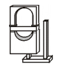

# VESTA-009N

IR-16SL-F1

## **PIR Motion Sensor**

Our Digitalized Adaptive Signal Processor algorithm enables this PIR to pick up movements within an assigned area and signals the Control Panel to activate the alarm if an intruder crosses its path of detection.

The PIR consists of a two-part design made up of a cover and a base. The cover contains all the electronics and optics and the base provides a means of fixing. The base has knockouts to allow mounting on either a flat surface or in a corner situation with a triangular bracket for corner mounting.

Provision for a tamper switch that will be activated when the cover is detached from the base prevents unauthorized access and removal from the mounting surface. The PIR can also alert you to signal communication problems and low battery situations.

The PIR is designed to give a typical detection range of 12 meters when mounted at 2 meters above ground.

**The IR-16 Series PIR Sensor includes the following models**:

&#x20;   IR-16 – PIR sensor with 3.6V Lithium battery

&#x20;   IRP-16 – Pet Immune PIR sensor with 3.6V Lithium battery

&#x20;   IR-16SL – PIR sensor with 3V Lithium battery

&#x20;   IRP-16SL – Pet Immune PIR sensor with 3V Lithium battery

## _**Identifying the parts.**_

<figure><figcaption></figcaption></figure>

#### **1. Test Button / LED indicator**

&#x20; The test button is used to test the radio performance and for learning purposes.

&#x20; The LED indicator is used to indicate the status of the system.

#### **2. Tamper Switch**

&#x20; The Tamper switch protects the enclosure from being opened.

#### **3. Battery Insulator**

#### **4. Corner mounting bracket**

#### **5. Supervision Enable/Disable Jumper Switch (JP2)**

* If the jumper is OFF (if the jumper link is removed or “**parked**” on one pin), the Supervision function is enabled. **(Factory Default for 868 WF frequency models)**

<figure><figcaption></figcaption></figure>

* If the jumper is ON, IR-16’s Supervision function is disabled. **(Factory Default for 433AM & 868AM frequency models)**
* **433FM** / **868FM frequency models** do not support JP2 Jumper Switch, Supervision is always enabled and cannot be disabled.

<figure><figcaption></figcaption></figure>

#### **6. Sensitivity Increaser Jumper Switch (JP3)**

* If the jumper is OFF (if the jumper link is removed or “**parked**” on one pin), the IR-16SL’s detection sensitivity is at a normal level. (**Factory Default for Non-Pet-immune models**)
* If the jumper is ON, IR-16’s detection sensitivity is high. **(Factory Default for Pet-immune models)**

#### **7. Tamper Switch**

## _**Sleep Timer**_

The PIR has a “**sleep time**” of approximately 1 minute to conserve power. After transmitting a detected movement, the PIR will not retransmit for 1 minute; any further movement detected during this sleep period will reset the 1-minute sleep timer. In this way, continuous movement in front of a PIR will not unduly exhaust the battery.

## _**Supervision Function**_

If enabled, when the PIR is in Normal operation mode it will conduct a Self-test Periodically by transmitting a supervisory signal once every 30 to 50 minutes

If the Control Panel fails to receive the Supervisory signals transmitted from a certain PIR for a preset time, an “**Out-Of-Orde**r” fault message will be generated.

## _**Sensitivity Increaser Function**_

You can use the sensitivity increaser function to increase the IR’s detection sensitivity. To increase detection sensitivity, please reconnect the Sensitivity Increaser Jumper Switch to **ON** position. To maintain the normal detection sensitivity, reconnect the Jumper to **OFF** position (factory default).

## _**Test mode**_

The PIR can be put into Test mode by pressing the Test Button on the front cover. In Test mode, it will disable the sleep timer and will enable the LED indicator to flash every time a movement is detected. Each time press the Test Button, the PIR will transmit a test signal to the Control Panel for radio range test and enter the test mode for 3 mins. It will exit Test Mode automatically after 3 mins and returns to normal mode.

## _**LED Indicator**_

In Normal operation mode, the LED Indicator will not light except in the following situations:

* When the PIR is in low battery condition, every time it transmits a detected movement, the LED will light up for about 2 seconds.
* When the cover is opened and the tamper switch is violated, the LED will light up for 2 sec. to indicate it is transmitting the“**Tamper**” signal.
* When the Tamper condition persists, every time it transmits a detected movement, the LED will light up.
* When if the PIR is in Test mode, the LED will light up every time a movement is detected.

## _**Battery**_

IR-16 Series PIR Motions sensor uses different lithium batteries as power source:

* The Non-SL models use one 3.6V AA (ER14505) Lithium battery as its power source.
* The SL models use one 3V 2/3A (CR123) Lithium battery as its power source.

When low battery voltage is detected, a low battery signal will be sent to the Control Panel along with regular signal transmissions for the Control Panel to display the status accordingly.

The battery is installed in by the factory before shipment with an Insulator inserted.


Note:

When changing batteries, after removing the old batteries, press the Tamper Switch twice to fully discharge before inserting new batteries.


## _**Getting Started**_

* Pull out the battery insulator to activate battery.
* The LED indicator will flash for 30 seconds. (The PIR is warming up). During the warm up period, the PIR will not be activated. It is recommended that you stay away from the detection area during this time. After the warm up period is over, the LED will turn off and the PIR will be ready for operation.
* Put the Control Panel into learning mode, refer to Control Panel manual for detail..
* Press the test button on the front cover.
* Refer to Control Panel manual to complete the learn-in process.
* After the PIR is learnt-in, put the Control Panel into “**Walk Test**” mode, hold the PIR in the desired location, and press the Test button to confirm this location is within signal range of the Control Panel, refer to Control Panel manual to complete Walk Test.
* When you are satisfied that the PIR work in the chosen location, you can proceed to mounting.

## _**Mounting Method**_

* The PIR is designed to be mounted on either a flat surface or in a corner situation with fixing screws and plugs provided.
* The base has knockouts, where the plastic is thinner, for mounting purpose. Four knockouts are for surface fixing.
* For corner mounting, a triangular bracket is provided to add Back Tamper Protection. Mount the triangular bracket on the wall first with the two pointing sticks on top facing you. Fit the PIR onto the hooks of the triangular bracket or screw the PIR onto it.
* For surface mounting, an optional rotating bracket is provided for users to adjust the range of detection. With the rotating bracket, the IR-16 can be rotated 80 degrees horizontally and 70 degrees vertically to provide optimal coverage.

**Corner mounting:**

<figure><figcaption></figcaption></figure>

1. Break through the two knockouts on the triangular bracket.
2. Using the two holes as a template, drill holes in the surface of the corner.
3. Insert the wall plugs.
4. &#x20;Screw the triangular bracket into the wall plugs with the two pointing sticks on top facing you (use a Philips screwdriver).
5. Fit the PIR onto the hooks of the triangular bracket.
6. If necessary, open the PIR by removing the fixing screw and cover assembly using a Philips screwdriver.
7. Break through the appropriate corner fixing knockouts.
8. Using the corner fixing knockouts as a template, drill holes in the surface in the corner again.
9. Insert the wall plugs if fixing it into plaster or brick.
10. Fit the PIR onto the hooks of the triangular bracket.
11. Screw the base into the wall plugs using a Philips screwdriver.
12. Screw the cover back onto its base using a Philips screwdriver.

### **Surface mounting:**

.jpeg>)

1. Remove the fixing screw and cover assembly using a Philips screwdriver.
2. Break through the appropriate knockouts on the base.
3. Using the holes as a template, drill holes in the surface.
4. Insert the wall plugs if fixing it into plaster or brick.
5. Screw the base into the wall plugs using a Philips screwdriver.
6. Screw the cover back onto its base using a Philips screwdriver.

### **Surface mounting with rotating bracket (optional item, sold separately):**&#x20;

The rotating bracket can be mounted on the wall with provides screws.

1. Screw the rotating bracket into the wall.
2. Fit the 3 hooks of the rotating bracket into the 3 holes of the base accordingly.
3. Rotate the bracket for the proper range of detection and tighten the fixing screw.

## _**Installation**_

* Decide on the location of the PIR and if it is to be corner or surface mounted.
* After the installation site is selected, follow the steps described above to mount the PIR.
* Press the Test Button to enter Test Mode. Walk around the protected area noting when the LED lights up and check that the detection coverage is adequate.
* When detection coverage is found to be satisfying, installation is now completed.

## _**Installation Recommendations**_

### **Regular PIR**

* The detection range is up to 12 meters if the PIR is mounted 2 meters above ground.

### **Pet-Immune PIR**

* The Pet-Immune PIR supports the pet immunity feature and will not detect pets of up to 27 kg within 7 meter range to minimize false alarm situation.
* If required, you can adjust the height of the PIR according to the size of your pet for optimal pet immune performance. A higher installation location will provide a larger pet-immune space but also increase the blind spot under the PIR.

.jpeg>)

To take full advantage of PIR, the following guidelines should be considered:

* **It is recommended to install the PIR at the following locations**
  * Mount the detector at 1.9M-2.0M height for best performance:


_IMPORTANT NOTE_

* When deciding on the height of the PIR mounting site, remember to take the possible blind spot into consideration. The blind spot underneath the PIR enlarges proportionally to the height of the PIR mounting site.
* Please note that performance is affected by external factors, such as the height of detected object, desired detection range, installation area…etc. The suggested mounting height could be adjusted according to actual installation environment factors.
* When IR-16 is mounted with a rotating bracket, it will not have the regular detection area (as in the above diagram), or the typical pet immune range


* Mount where the animals cannot come to the detection area by climbing on furniture or other objects.
* Don’t aim the detector at stairways the animals can climb on.
* In a position such that an intruder would normally move across the PIR’s field of view from side to side.
* In a corner to give the widest view.
* Where its field of view will not be obstructed e.g. by curtains, ornaments etc.

## **Limitations**

* Do not position a PIR to look directly at a door protected by a Door Contact, this could cause the Door Contact and PIR radio signals to be transmitted at the same instant when entering, cancelling each other out.
* Do not install the PIR completely exposed to direct sunlight.
* Avoid installing the PIR in areas where devices may cause rapid changes of temperature in the detection area, i.e. air conditioner, heaters, etc.
* Avoid large obstacles in the detection area.
* Not pointing directly at sources of heat e.g. fires or boilers, and not above radiators.
* Avoid moving objects in the detection area i.e. curtain, wall hanging etc.
