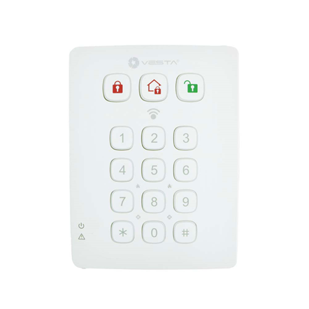

# VESTA-012

KPT-39N-F1

## REMOTE KEYPAD WIRELESS

## QUICK GUIDE

<figure><figcaption>
VESTA-012 - KPT-39N-F1
</figcaption></figure>


**To add keypad in VESTA panel:**

Step 0: Put panel in **learn Mode**&#x20;

Step 1: Press \[ \* ] + \[ # ] for 3 seconds to learn keypad to panel


\[ ❓] How to put panel en learn mode from **SmartHomeSec**&#x20;



## CERTIFICATIONS


EN50131 Grade 2, Class II


## MANUAL

## _**Parts Identification**_

<figure><figcaption></figcaption></figure>


Note:

A short beep will sound along with key pressing to indicate that the button pressed is valid.

4 continuous beeps will sound indicating mistake and the user should repeat the process again.


## _**LED Indicator**_

* **Power LED (Green):**
  * On for 5 seconds: after successful completion of a valid keystroke sequence.
  * Flash for 5 seconds: low battery in Normal Operation Mode.
  * If the Power LED turns off before a valid keystroke sequence is completed, the previous entered keys are ignored.
* **Fault LED (Orange):**
  * Disarm Key and Orange LED On along with 5 beeps: Alarm Memory (depend on Control Panel).
  * Flash:
* &#x20;         Flash only: No response sent by the control panel within 10 seconds.
* &#x20;         Flash along with 2 beeps: Request for Home mode during Arm mode.
* &#x20;         Flash along with 3 beeps: Request for Home or Arm Mode when fault condition exists.
* &#x20;         Flash along with 4 beeps: PIN code was incorrect.

## _**General Operation**_

* Enter Test mode — Enter Keypad PIN code and then press ＊ key.
* Panic Alarm — Press **1** key + **3** key at the same time. (if the function is enabled)
* Fire Alarm — Press **4** key + **6** key at the same time. (if the function is enabled)
* Medical Alarm — Press **7** key + **9** key at the same time. (if the function is enabled)
* Check Control Panel Status — Normal Mode Press **#** key.
* Enable/Disable Entry & Exit Sound —Press **1** key + **2** key at the same time for 2 seconds. (The Keypad will emit one long beep to indicate the function is enabled and emit 2 short beeps to indicate the function is disabled.)

## _**Power**_

* Remote keypad uses one CR123 3V Lithium battery as its power source.
* Remote keypad can also detect the battery status. If the battery voltage is low, the Power LED will flash for 5 seconds during operation. The Low battery signal will be sent along with regular signal transmissions to the Control Panel for displaying the status accordingly.
* Before shipment, the battery is pre-installed by the factory.
* When changing battery, press any key a couple times to discharge before inserting new battery.

## _**Power Saving Feature**_

* When idle, remote keypad is in **Stand-by** mode and uses no power. It will activate and **wake-up** for 5 seconds when any key is pressed.
* After 5 seconds of key inactivity, the power goes off and it returns t**o Stand-by** mode.

## _**Tamper Protection**_

* The keypad is protected against any attempt to open the lid or to detach keypad from its mounting surface.
* Tamper protection is disabled when the keypad is in Test Mode.

## _**Getting Started**_

Step 1. Put the Control panel into learning mode, .

Step 2. Adding remote keypad into the Control Panel:

### **Test Mode:**

1. Put remote keypad in Test mode by entering KP PIN code (default: **0000**), then press **＊** key.

The three.png>).png>).png>) LEDs will turn on along with a long beep.

1. Press ＊ key then **7** key to transmit learning signal. Remote keypad will sound a long beep.

### **Test Mode Function:**

1. Press ＊ key and then 1 key — Enter NFC Label learning/ management mode.
2. Press ＊ key and then 2 key — Enable Dual-key Panic Alarm function
3. Press ＊ key and then 3 key — Enable Dual-key Fire Alarm function
4. Press ＊ key and then 4 key — Enable Dual-key Medical Alarm function
5. Press ＊ key and then 5 key — Disable all Dual Key function (Default)
6. Press ＊ key and then 6 key — Edit Keypad Pin Code

&#x20;                                                              ..Enter **Old** Keypad Pin Code and then press **＊** key

&#x20;                                                              ..Enter **New** a new 4-digit Keypad Pin Code and then press **#** ke&#x79;**.**

7. Press ＊ key and then 8 key — Enable Arm/ Home without PIN Code function.

&#x20;      _(Please refer to “**Arm/Home without Control Panel PIN Code**” for details, page 4)._

8. Press ＊ key and then 9 key — Enable Arm/ Home with Control Panel User PIN Code function (Default).

&#x20;       (_Please refer to “**Arm/Home with Control Panel PIN Code**” for details, page 4_).


Note:

If the remote keypad did not sound a long beep, it means the remote keypad did not send the learning code to the Control Panel, please press ＊ key then **7** key again to send the learning code.

If the Control Panel receives the learning code, it will display the info accordingly. Refer to the operation manual of your Control Panel to complete the learn-in process.

After Control Panel receives the signal from remote keypad, it will send an acknowledgement back to remote keypad. The remote keypad will then beep 3 times to confirm the acknowledgement has been received. If remote keypad does not perform 3 beeps, please restart the learning procdeure


Step 3. After the remote keypad is learnt-in, put the Control Panel into **Walk Test** mode, hold the remote keypad in the desired location, and send the learning code to the Control Panel to confirm this location is within the signal range of the Control Panel. To send the learning code, either press the **＊** key then **7** key under Test Mode or press both **#** and **＊** keys together under Normal Operation Mode.

Step 4. When you are satisfied that the remote keypad works in the chosen location, you can proceed with mounting the remote keypad following the steps described below (please refer to “_**Mounting Remote keypad**” for details)_.

Step 5. Press Disarm key **twice** to leave Test mode and the installation is completed. Remote keypad will sound a long beep and three system mode LEDs will turn off. The remote keypad returns to Normal Operation mode.


Note:

The remote keypad will automatically exit Test mode after 5 minutes of inactivity and return to Stand-by mode. All the LEDs will turn off, and the Keypad will emit one long beep.


## _**NFC Label Learning/Clearing/Installation Procedures**_

NFC stands for Near Field Communication, which is a wireless communication technology that establishes connection between two devices by putting them close together. You can store a User PIN Code in a NFC label and use the NFC label to access the alarm system without entering a User PIN Code on KPT-39N. The Keypad can learn up to 100 NFC labels with up to 50 PIN Codes.

### _**A. NFC Learning Procedure:**_

Step 1. Enable remote keypad to enter Test mode first. Enter the Keypad PIN code (default: **0000**) followed by ＊ key. While entering the PIN code, the **Power LED** (Green) will turns on. The **Power LED** will then turn off and sound a long beep.

Step 2. Press ＊ key and then **1** key to enter NFC label Learning mode. The **Fault LED** (Orange) will turn on and sound a long beep.

Step 3. Enter a new PIN code followed by # key. The Keypad will emit a long beep, and the orange LED will begin to flash for 5 seconds to indicate it is ready to learn a NFC label.

Step 4. Within 5 seconds, put a NFC label close to the Keypad detection area to pair it with the User PIN Code just entered.

* Each label paired will reset NFC label learning time to 5 seconds. You can pair multiple labels with a single User Code by applying the labels one by one.
* The Keypad will exit NFC label learning mode after 5 seconds of inactivity.
* If the label learnt in is new, the Keypad will emit 2 short beeps.
* If the label learnt in already exists in Keypad (assigned to another PIN Code), the Keypad will emit 1 short beep.

Step 5. To learn in another label, please repeat step 3 to step 4. The keypad will exit NFC label learning mode automatically after idling for 5 seconds.

Step 6. Press .png>) key to exit NFC label learning mode.

* Error Condition:
* If the Control Panel User Code entered exceeds maximum PIN code digits, the Orange LED will flash along with 4 short beeps to indicate error.
* If the Keypad has already stored 50 Control Panel PIN Codes, it will emit 4 short beeps to indicate error when you attempt to enter the 51st PIN Code.
* If the Keypad has already learnt in 100 NFC labels, it will emit 4 short beeps to indicate error when you attempt to learn in the 101st NFC label.

### _**B. NFC Clearing Procedure:**_

You can clear NFC label information.

Step 1. Enable remote keypad to enter Test mode first. Enter the Keypad PIN code (default: **0000**) followed by ＊ key. While entering the PIN code, the **Power LED** (Green) will turn on. The **Power LED** will then turn off and sound a long beep.

Step 2. Press ＊ key and then **1** key to enter the NFC label Learning mode. The **Fault LED** (Orange) will turn on and sound a long beep.

Step 3. If you wish to remove a Control Panel PIN Code stored in the Keypad and all NFC labels assigned to this PIN Code, enter Control Panel User code and press ＊ key, a long beep will sound.

If you wish to clear only a specific NFC label, press ＊ key with a long beep and Orange LED will flash for 5 seconds. Put a NFC label close to the Keypad detection area within 5 seconds:

* If the NFC label applied exists in Keypad, the Keypad will sound 2 short beeps to indicate the NFC label data has been removed.
* If the NFC label applied does not exist in Keypad the Keypad will sound 4 short beeps to indicate error.
* Each NFC label applied will reset the NFC label removal timer to 5 seconds, you can remove multiple NFC

labels by applying them one by one.

Step 4. The Keypad will exit NFC label removal mode automatically after idling for 5 seconds.

Step 5. Press .png>) key to exit NFC label learning mode.

### _**C. NFC Installation Procedure**_

.jpeg>)

The small NFC labels can be placed on the back of smartphones, cards or keychains for easy access.

Step 1. Learn in the NFC label to Remote Keypad

Step 2. Remove the protective cover on the NFC label.

Step 3. Apply the NFC label to the back cover of your cell phone, etc.

Step 4. You can now use the NFC label to access the system.

**\<NOTE>**


Note:

Take care not to bend the NFC label, or it could be damaged and become unusable.

KPT-39N supports only ISO 14443A protocol for NFC label.


### _**System Mode Control**_

After finish learning the Keypad into the alarm system Control Panel, the user may change the system using the Keypad.

There are two ways to arm the system.

1. Away Arm/Home Arm the system by entering the Control Panel User PIN Code.
2. Away Arm/Home Arm the system without entering the Control Panel User PIN Code.

Disarming the system always requires entering the Control Panel User PIN Code.

### **Arm/Home with Control Panel PIN Code:**

Under Test mode, press ＊ key and then **9** key to enable Arm/ Home with PIN Code function.

**Enter Arm Mode:**  Enter any one of Control Panel user code and press (arming away button) key, or press (arming away button) key and apply a NFC label. If the panel has no fault and arming is successful, the .png>) LED will turn ON along with a long beep.

**Enter Home Mode:** Enter any one of the Control Panel user code and (arm stay button) key, or press (arm stay button) key and apply a NFC
&#x20;label. If panel has no fault and arming is successful, the LED will turn ON along with 3
&#x20;beeps.

**Return to Disarm Mode**: Enter any one of Control Panel user code and press (disarm button) key, or press (disarm button) key and
&#x20;apply a NFC label. If disarm is successful, the LED will turn ON along with 2
&#x20;beeps.  If there is Alarm Memory, the LED and fault LED will turn ON along with
&#x20;5 beeps.

### **Arm/Home without Control Panel PIN Code:**

In the Test mode, Pressing ＊ key and then **8** key to enable Arm/Home without PIN Code function

**Enter Arm Mode**: Press (arm away button) key. If the panel has no fault and arming is successful, the (arm away button )LED will turn ON
&#x20;along with one long beep.

**Enter Home Mode**: Press (arm stay button) key. If the panel has no fault and arming is successful, the (arm stay button) LED will turn ON
&#x20;along with 3 beeps.

Return to Disarm Mode: Enter any one of Control Panel user code and (disarm button) Key, or press (disarm button) key and apply
&#x20;a label. If disarm is successful, the (disarm button) LED will turn ON along with 2 beeps.  If there is **Alarm Memory,** the .png>) LED and fault LED will turn ON along with 5 beeps.

## _**Entry/Exit Sound**_

* After the Entry/Exit Sound is enabled by pressing **1** key + **2** key at the same time for 2 seconds (indicated by one long beep), the keypad will sound beeps when the Entry/exit timer is activated.
* After the Entry/Exit Sound is disabled by pressing **1** key + **2** key at the same time for 2 seconds (indicated by two short beeps), the keypad will remain silent when the Entry/exit timer is activated.

## _**Fault Conditions**_

_When Remote Keypad is under **NORMAL OPERATION MODE,**_

1. When fault condition exists within Control Panel, if the Keypad is used to arm the panel, the Fault LED will flash along with 3 beeps to indicate fault condition.
2. When the Keypad disarms the panel, the .png>) LED will turn ON along with two beeps indicating normal operation.
3. If you input incorrect KP Pin code for 4 times within 10 minutes under test mode, KP will disable the key function for 1 minute and all the LEDs will flash 3 times along with 6 beeps. After 1 minute, it will emit a long beep to indicate that the key function is back to normal.
4. If you input incorrect KP Pin code for 4 times within 10 minutes when changing system mode, KP will disable key function for 5 minutes. After 5 minutes, the keypad will emit a long beep to indicate that the key function is back to normal.

## _**Factory Reset**_

Resetting the Keypad to factory default will restore Keypad’s own PIN Code to 0000 and clear all panel learning memory.

### _**Reset to factory default:**_

Step 1   Remove the batteries and release the tamper.

Step   2 If “**Arm/Home with Control Panel PIN Code**” method is selected, press & hold the **3** key while inserting the battery back.

&#x20;            .If “**Arm/Home without Control Panel PIN Code**” method is selected, press & hold **4** key while inserting the battery back.

Step 3   Continue pressing **3** key until KP emit 3 beeps to indicate successful reset.

.Continue pressing 4 key until KP emit 4 beeps to indicate successful reset.

Step 4   Release **3** or 4 key, the reset process is complete. After reset, PIN code reverts to factory default values, **0000** .Remote keypad will need a new learn-in process to start functioning.

* Whenever the Keypad is removed from the Control Panel, it should be put to factory reset as well to clear its Control Panel memory.

## _**Mounting Remote Keypad**_

To mount the remote keypad:

1. Remove the front cover.
2. Using the 2 mounting holes of the back cover as a template, mark off the positions in the most appropriate place.
3. Insert the wall plugs if fixing into a plaster or brick surface.
4. Screw the remote keypad onto the wall plugs.
5. Replace the front cover.
