# VESTA-025

TSP-3&#x20;

## Touchscreen Keypad&#x20;

<figure><figcaption></figcaption></figure>

## Introduction 

The Touchscreen Keypad provides easy-to-use, on-premises security system control for enhanced flexibility and convenience.

When connected to the system Control Panel via Wi-Fi network, the Touchscreen Keypad enables quick access to the Control Panel, allowing users to easily arm, disarm, or home arm their security system and control home devices.

## System Overview 

## Parts Identification 

.png>)

1. **Camera -** Slide up or down the switch to reveal or hide the camera.
2. **Power Button**
3. **Micro USB Port**
4. **Micro SD Card Slot**
5. **Earphone Jack**
6. **Cable Managing Space**
7. **Notch**
8. **Desktop Deployment Bracket**

&#x20; &#x20;

<figure><figcaption></figcaption></figure>

9. **Wall Mounting Bracket**

## Power Supply 

The Touchscreen Keypad is powered by a rechargeable battery. To charge the battery, press the latch to open the compartment and plug in a 5V/1.5A adapter to the Micro USB port of the device and connect the other end to mains power.

<figure><figcaption></figcaption></figure>

## Getting Started 

### Equipment required 

The following equipment is required to use your Touchscreen Keypad:

* A router supporting 2.4 GHz Wi-Fi network. The hub should be connected to this router with access to the internet.

### Setup 

To set up your Touchscreen Keypad for accessing the hub:

**Step 1.** Power on the Touchscreen Keypad.

**Step 2.** Select language.

<figure>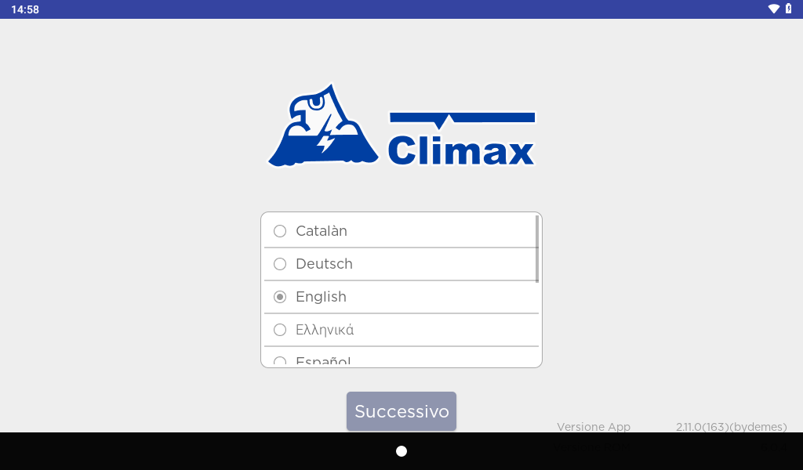<figcaption></figcaption></figure>

**Step 3.** Select the WiFi SSID of the router that the hub is connected to. Enter the WiFi network password if required, and click “OK”.

<figure>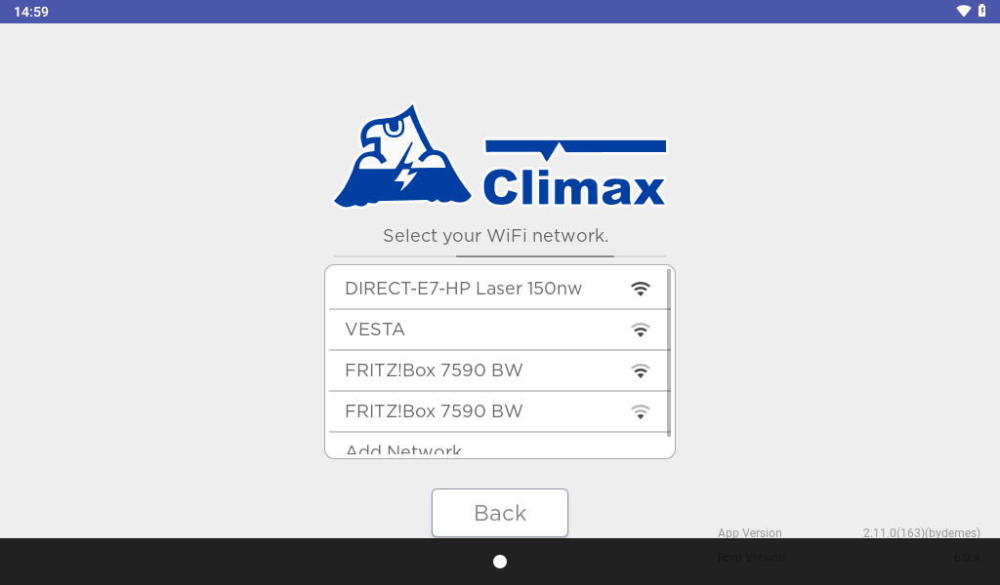<figcaption></figcaption></figure>

<figure>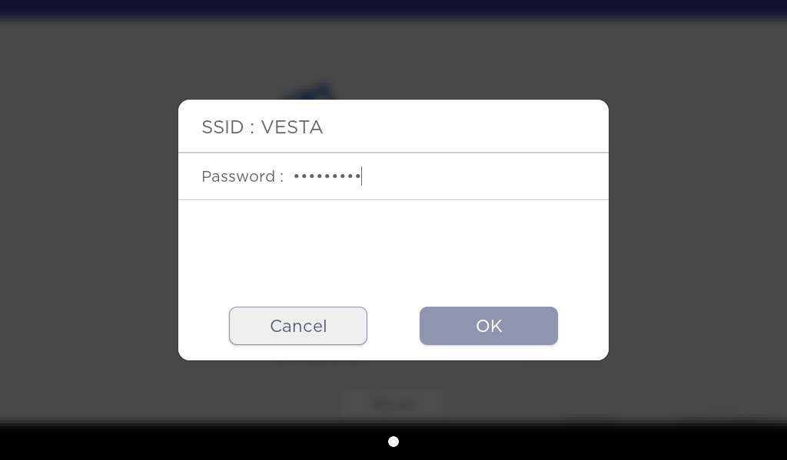<figcaption></figcaption></figure>

**Step 4.** Put your Hub into learning mode (refer to Hub’s user manual for details). Please note that the Learning process is only required for first-time setup.

**Step 5.** Your Touchscreen Keypad will automatically search for available hubs. Select the hub you’d like to access to.

<figure>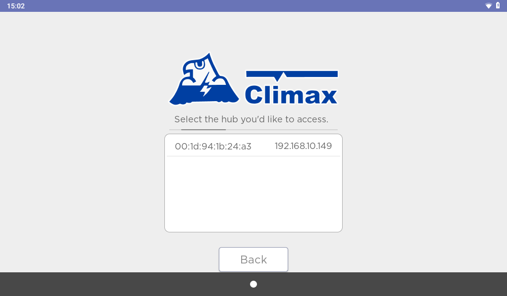<figcaption></figcaption></figure>


Note:

The Touchscreen Keypad is compatible with the Climax Video Door Phone (Vesta-109) and IP Camera. Up to 6 IP Cameras and VDPs are supported. Be sure to update the device and panel firmware to the latest version for compatibility.

Ensure your Control Panel, VDP, and Touchscreen Keypad are in the same Local Area Network (LAN). Moreover, both of the VDP and the Touchscreen Keypad should be added into the same Control Panel, or the devices will not be identified.


**Step 6.** You will enter the dashboard that displays the current date and time. Now you can access and control your Hub and smart devices directly on your Touchscreen Keypad.

<figure>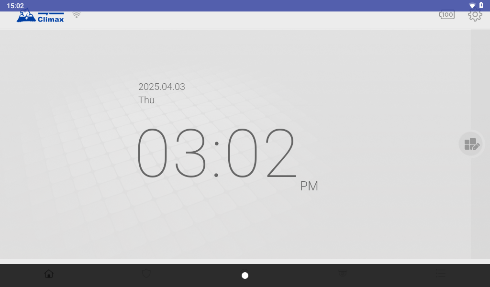<figcaption></figcaption></figure>

## Hardware Installation 

### **Installation Instructions**

There are two mounting options available for installing the Touchscreen Keypad. Users can choose to install their device anywhere in their home or office to suit their needs. Moreover, a wall mounting bracket is also provided to enhance installation flexibility for uses to install the Touchscreen Keypad at a particular place.

**Desktop Deployment**

A desktop deployment bracket is provided for users to place their Touchscreen Keypad at a desired place. Please follow the steps below:

**Step 1.** Attach the desktop deployment bracket to the rear side of the Touchscreen Keypad in the direction of the arrows as shown below until you hear a “click” .sound. If you wish to remove the bracket, simply press the notches at both sides  and gently lift upward.

.png>) .png>)

**Step 2.** Place the Touchscreen Keypad at the desired location.

.png>)

**Wall Mounting**

A wall mounting bracket is also included for users to place their Touchscreen Keypad at a fixed place when not in use. Please follow the steps below:

**Step 1.** Use the three mounting holes on the bracket as a template to drill holes.

**Step 2.** Insert the wall plugs if fixing into plaster or brick.

**Step 3.** Screw the bracket into the wall with the 3 screws provided.

.png>)

**Step 4.** Attach the Touchscreen Keypad onto the bracket.

.png>)

**Step 5.** Hold the Touchscreen Keypad and gently push downwards until you hear a “click” sound.

.png>)

### Low Battery Notification 

When the battery is running low, a low battery notification will be displayed to inform you to recharge the battery. Please refer to the Power Supply to recharge the Touchscreen Keypad.

<figure><figcaption></figcaption></figure>

## Operation 

### Home 

<figure><figcaption></figcaption></figure>

* **Date & Time**: The Home page displays the current Date & Time.
* **Home Widget**: The Home Widget list is for you to control or check currents status of the HVAC sensors or devices which have been learned into the system.

To set the list:

**Step 1.** Tap the Home Widget icon. Check the devices that you are going to display on the list. Up to six devices can be displayed here.

<figure>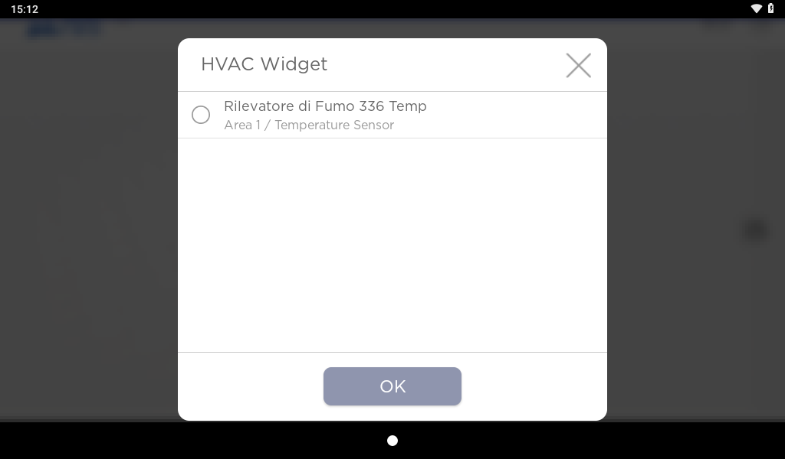<figcaption></figcaption></figure>

**Step 2.** When finishing selecting the devices, tap OK to confirm.

<figure>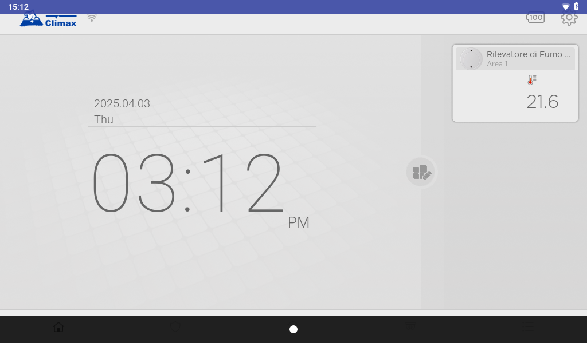<figcaption></figcaption></figure>

**Step 3.** The devices that you selected are displayed on the widget list.

**Step 4.** Tap the widget that you want to check. When there is a fault or supervision failure, an orange exclamation mark icon will be displayed on the widget. The color of the widget will also fade.

<figure>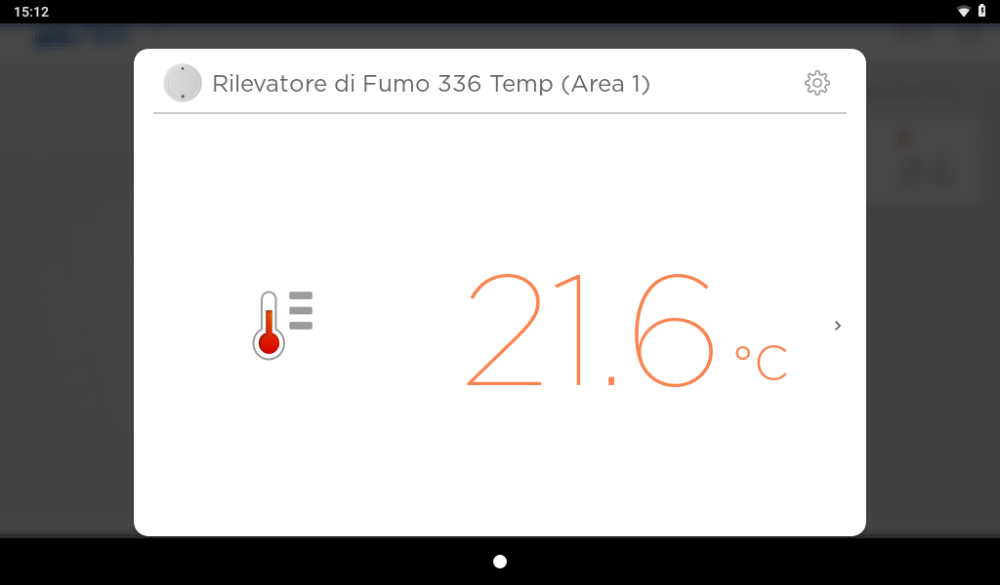<figcaption></figcaption></figure>

### Security 

The current system status is displayed on top of the screen.

<figure><figcaption></figcaption></figure>

* **System Mode:** The system mode is indicated by the 3 icons at the top. The current system mode will light up. When a user disarms the system, the Touchscreen Keypad will take a photo, and the image can be viewed in the Event page.

### &#x20;**Change System Mode**

* Tap the desired mode icon and enter the PIN code. You will be required to enter one of the Control Panel User PIN Code to confirm the action.

<figure>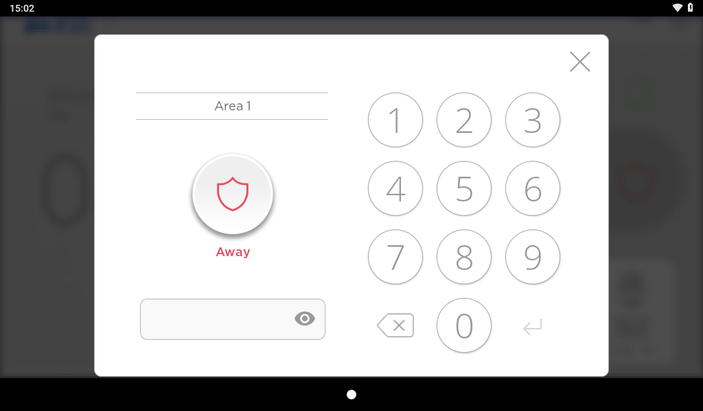<figcaption></figcaption></figure>

If an incorrect PIN Code is entered, the Touchscreen Keypad will display an error message, and arming will be aborted.

* If the system has existing fault events when arming, the Touchscreen Keypad will display a fault message. Tap OK to view the fault list.

By checking all faults and tapping “Bypass”, the faults are bypassed, and the system is armed now.

### **3.2.2. Alarm Dashboard**

When there is an alarm, the Alarm dashboard will be displayed:

<figure>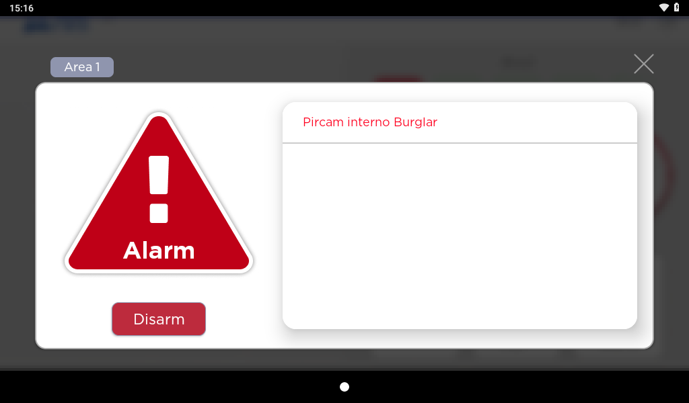<figcaption></figcaption></figure>

* **Area**: It will be indicated that the alarm is occurred in area 1 and/or area 2. When there are alarms in both areas, you can tap the icon to view the alarm list for each area respectively.
* **Alarm list**: The devices that have been triggered will be displayed here.
* **Disarm**: Tap the icon and then enter the PIN code to disarm the system.

<figure>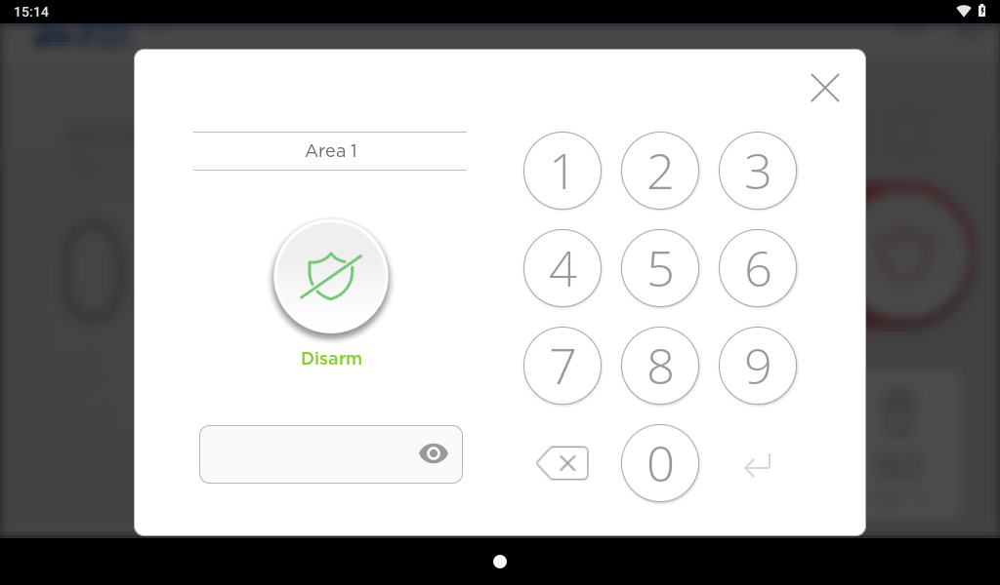<figcaption></figcaption></figure>

After disarming the system, you can view these events again through the list. Tap the Close icon to close the alarm dashboard and go back to the Security page.

<figure>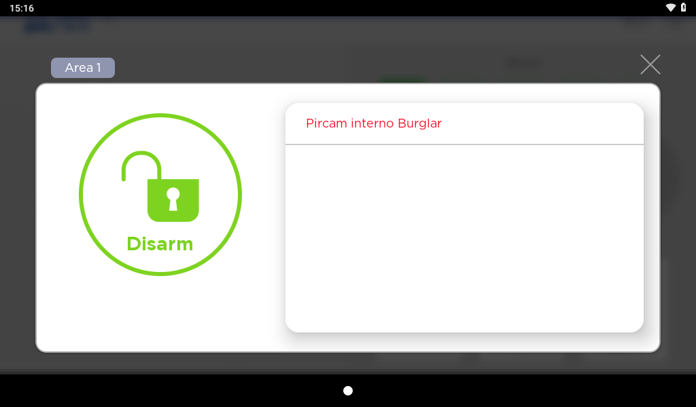<figcaption></figcaption></figure>

### Automation 

The Automation page includes Scene, Room, Group, Automation Device, and Rule.&#x20;

<figure>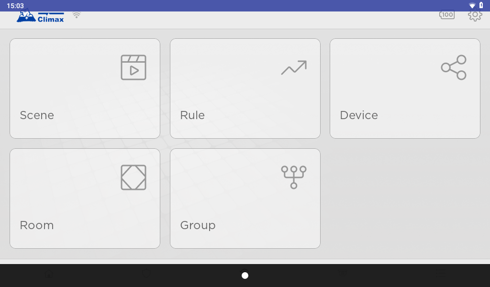<figcaption></figcaption></figure>

#### **Scene**

The Scene function allows users to view and activate the preset scenes.

<figure>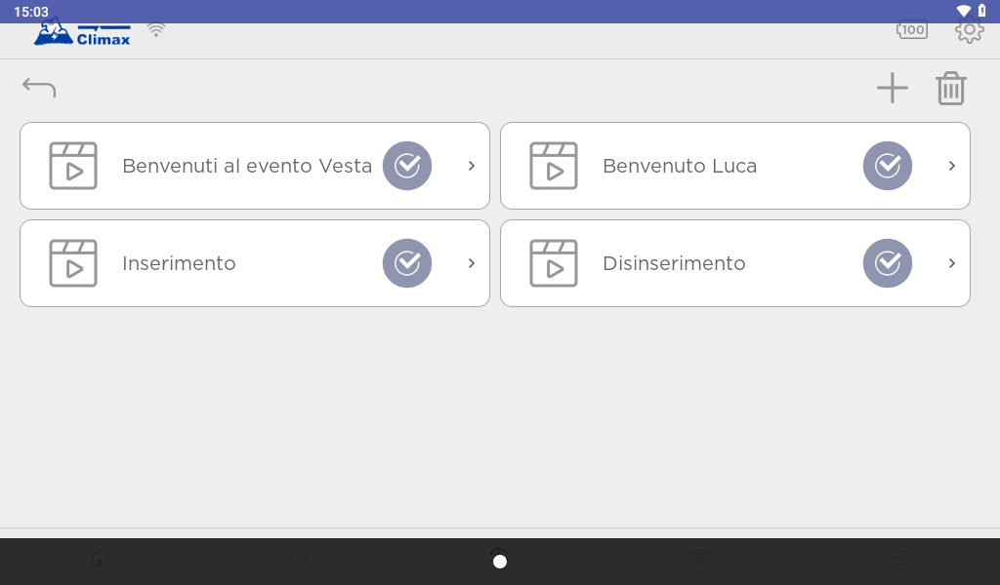<figcaption></figcaption></figure>

Users can add, edit, delete, and view details in Scene.

#### **Room**

The Room function allows users to add, name, delete, view, edit and activate the preset rooms.

<figure><figcaption></figcaption></figure>

* Add and name a room:
* Delete a room:

Users can add, remove, view, and edit devices for each room.

* Add a device in a room
* Remove a device in a room:
* Edit a device in a room:

#### **Group**

The Group function allows the user to control the same type of devices. The user can control over 6 types of devices, including Switch, Dimmer, Hue, Shutter, Radiator, and Thermostat. Up to 10 subgroups can be created under each type.

<figure>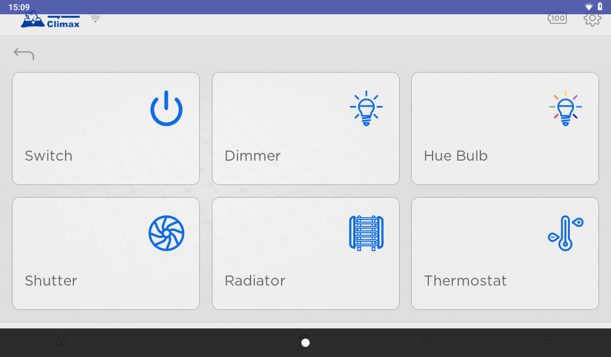<figcaption></figcaption></figure>

* **Switch**

Tap to turn on/off the switch of each Group. To add/delete a group, tap . To view details, add/remove a device or rename a group, tap .

* **Dimmer**

Tap to control Dimmer of each group. To view details, control a group, add/remove a device or rename a group, tap .

In the Group Control page, the user can change the brightness of the devices by adjust the bar.

* **HUE Bulb**

Tap to control the hue of the bulbs in each group. To view details, control a group, add/remove a device or rename a group, tap .

In the Group Control page, the user can control Hue by adjusting the bar or tap Color, Whites, or Preset to change the color of devices in a preset group.

**Color**: Tap the color directly to set the group with your desired color.

**Whites**: Tap the color directly to set the group with your desired color temperature.

**Preset**: Tap the color directly to set the group with the preset certain color.

* **Shutter**

Tap to control Sthe hutter of each group. To view details, control a group, add/remove a device or rename a group, tap .

On the Group Control page, the user can control the shutters by adjusting the bar.

* **Radiator**

Tap to turn on/off the radiator of each group. To view details, control a group, add/remove a device or rename a group, tap.

In the Group Control page, the user can control the radiator by adjusting the bar. The mode set points are displayed on the bar. Toggle the bar to increase or decrease the mode set points.

* **Thermostat**

Tap to turn on/off the Thermostat of each group. To view details, control a group, add/remove a device or rename a group, tap .

In the Group Control page, the user can check the list of devices and toggle 2 bars to increase or decrease the mode set points. Tap Auto, Cool, Heat, Away button to change the modes.

#### &#x20;**Device**

The devices are displayed under different tabs according to the following categories: **All, Sensors, Automation Device, Siren, Keypads, ...** The device list under the category tab displays all available devices according to each different category. Tap the device category tab to view the devices.

<figure>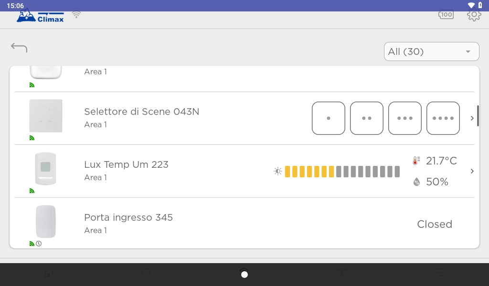<figcaption></figcaption></figure>

<figure>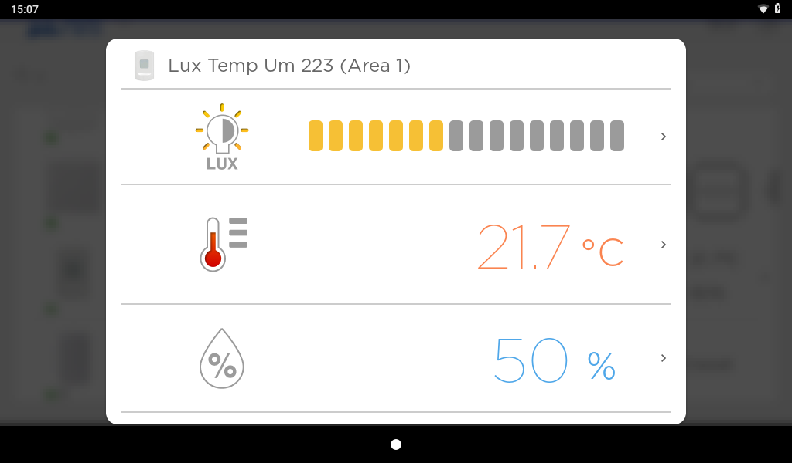<figcaption></figcaption></figure>

#### **Rule**

The Rule function allows users to view and activate the preset rules under certain conditions. To enable or disable the rules, tap .

<figure>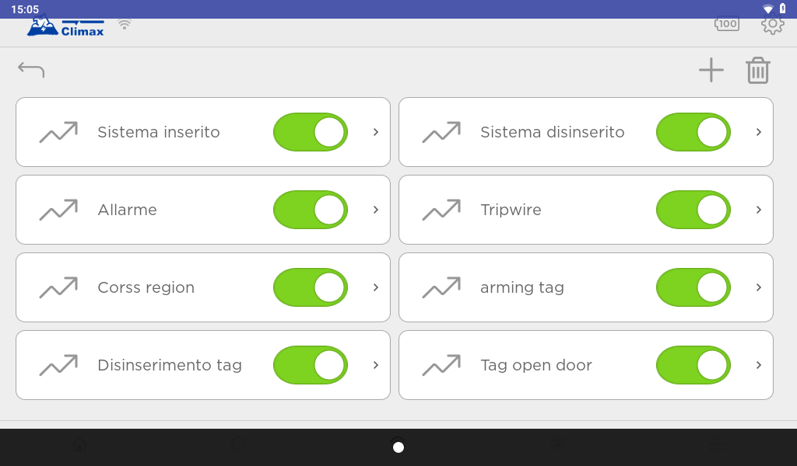<figcaption></figcaption></figure>

Users can add, edit, delete, and view details in Rule.

<figure>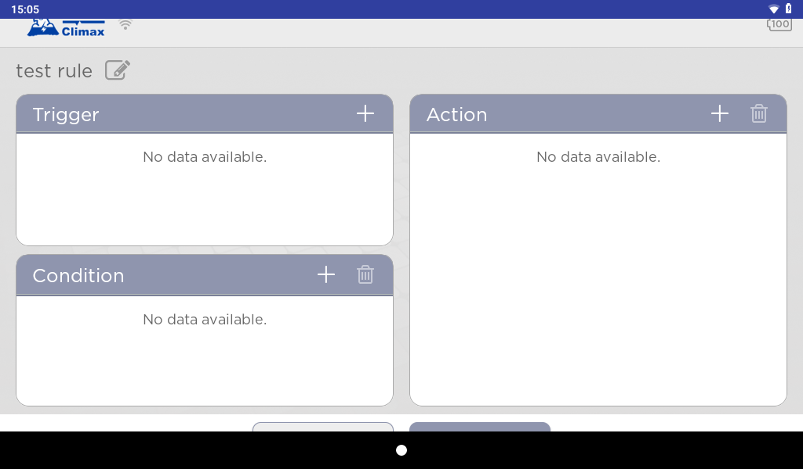<figcaption></figcaption></figure>

### Cam 

The page provides access to VDP and IP Camera live streaming video.

<figure>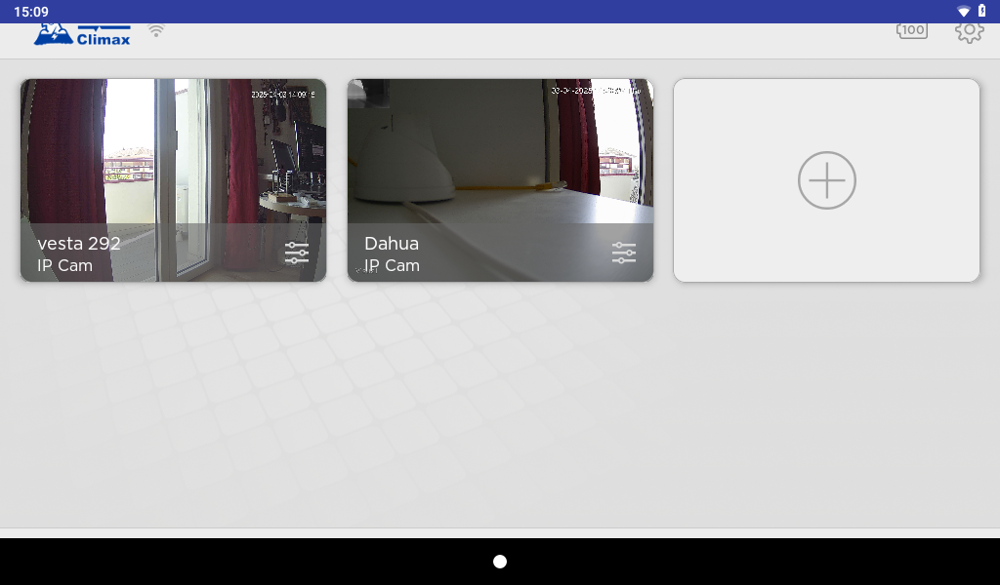<figcaption></figcaption></figure>

#### **Add New VDP**

**Step 1.** Tap the icon to add a new VDP.

**Step 2.** Select the icon of VDP and tap “Next.”

<figure>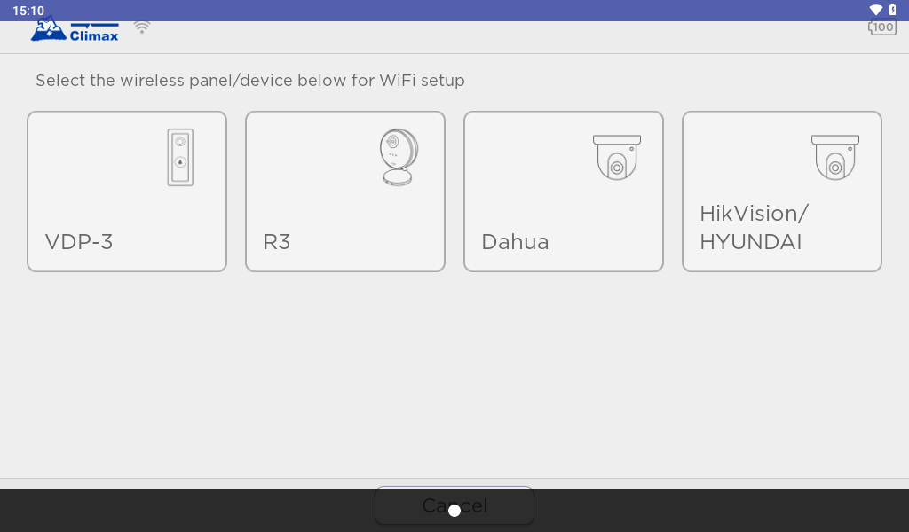<figcaption></figcaption></figure>

**Step 3.** Follow the instructions for adding a new VDP on the next page. Tap “Next” to continue. Tap “Reset” if your VDP has been previously set up to another Wi-Fi network.


Note:

To reset the VDP, please follow the instructions of the VDP  (VESTA-109)


#### **Add New IP Cam**

**Step 1.** You can tap the icon to add a new IP cam.

<figure><figcaption></figcaption></figure>

#### **Monitoring Mode**

The Touchscreen Keypad provides a full screen 3-minute real-time live streaming video. Tap the device you want to check and have a full view on the screen.

<figure>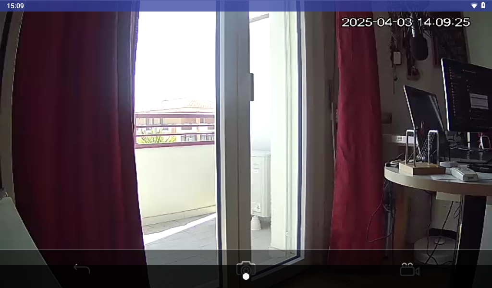<figcaption></figcaption></figure>

#### &#x20;**Cam Settings**

To change the settings of the IP Cam, click the button on each device.

<figure>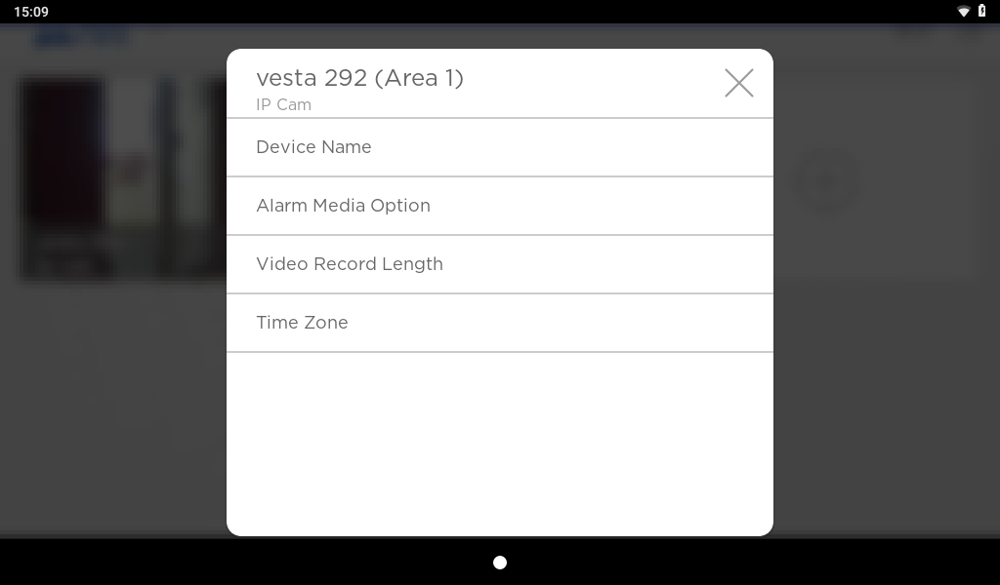<figcaption></figcaption></figure>

* **Device Name**: **Name or rename your device for easy identification. Enter a desired name and tap Submit.**
* **Alarm Media Option**: Tap the slider to select photo or video options
* **Video Record Length**:  Tap the slider to select the video recording length&#x20;
* **Time Zone**:  Tap the slider to set the time zone.

### Events 

The Event page records all alarm/status event, pictures and video transmitted by the Control Panel. You can view the image or video by tapping the icons.

<figure>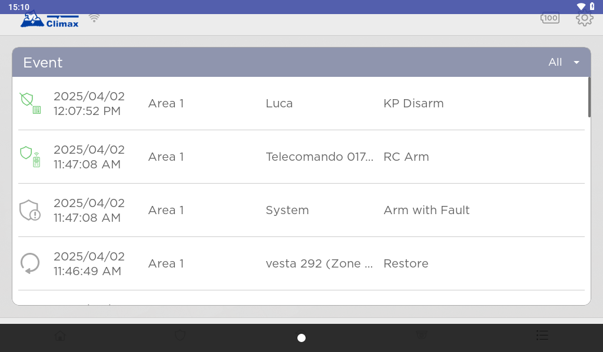<figcaption></figcaption></figure>

### Settings 

Tap on the gear icon on the top-right corner of the screen to access the Settings menu.

<figure><figcaption></figcaption></figure>

* Brightness: Change the brightness of the screen by tapping the slider.
* Volume: Change the volume of the Touchscreen Keypad by tapping the slider.
* Face Detection: Tap the slider to enable or disable this function. When it is enabled, your face needs to be detected so that the virtual keypad will be enabled for you to enter the PIN Code.

When the virtual keypad is able to be tapped, you can disarm the system as the steps stated above. Please refer to Change System Mode.

* Display Home Screen: Enable this function to display the home screen when the Touchscreen Keypad has been idle for 1 minute/3 minutes, or select Never to disable this function.
* Screen Saver: Enable this function after the Touchscreen Keypad has been idle for 1 minute/5 minutes, or select Never to disable this function. The Touchscreen Keypad will display the images stored in the SD card.
* Date & Time Format: Change the date and time format.
* Unpair: This feature allows you to clear the Touchscreen Keypad’s WiFi and Control Panel’s .information that the Touchscreen Keypad is connected to.
* Tablet Setting: This function is currently reserved.
* Language: Change the language setting.
* About: The information about the App version / ROM version will be displayed here.

### OTA Firmware Upgrade 

When a new firmware version is released, users are able to update it via OTA automatically or manually.

* **Auto OTA Firmware Upgrade** _(Enabled by Home Portal Server Backend)_

**Step 1.** When a new version of firmware is released from the Home Portal Server Backend, the user will be informed to install it. Tap **Install** or **Not Now** to update the firmware later.

**Step 2.** If the device is set not to install the unknown apps for security concerns, please tap **SETTING** to change the setting to allow the device to install unknown apps.

**Step 3.** When the request for installation of unknown apps is permitted, tap **INSTALL** to update the firmware.

**Step 4.** Tap **OPEN** when the installation is completed.

**Step 5.** Tap the gear icon on the top-right corner of the screen to access the Settings menu.

**Step 6.** Tap **About** in the Setting menu.

**Step 7.** The user can confirm if the firmware is updated to the latest version when a GREEN check mark is shown in the **App version** column.

* **Manual OTA Firmware Upgrade**

**Step 1.** Tap the gear icon on the top-right corner of the screen to access the Settings menu.

**Step 2.** Tap **About** in the Setting menu, TSP will check if the firmware version is the latest or not.

**Step 3.** If the version is not the latest, TSP will ask you to update the firmware. Tap **Install** for the upgrade. If you want to install it later, tap **Not Now**.

**Step 4.** Tap **INSTALL** to update the firmware.

**Step 5.** Tap the gear icon on the top-right corner of the screen to access the Settings menu.

**Step 6.** Tap **About** in the Settings menu.

**Step 7.** The user can confirm if the firmware is updated to the latest version when a GREEN check mark is shown in the **App version** column.
