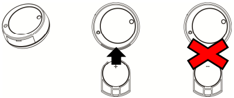

# VESTA-040

SVGS-5

## &#x20;Shock, Vibration & Glass Break Sensor

SVGS-5 is a Shock, Vibration/Glass Break Sensor. It is capable of sending wireless signals to the Control Panel upon detection of window glass break or shock/vibration.

## Parts Identification

<figure><figcaption></figcaption></figure>

1. **Learn/Test Button**

(Press the button with a sharp tool such as paper clip.)

* Press the Button once to transmit a Learn/Test code.
* Press the Button once to enter Test Mode for 3 minutes.
* Press the Button for 5 seconds to adjust sensitivity settings from the Control Panel.

2. **LED Indicator**

* **Lights up for 1 second:** When the Sensor is powered on.
* **Flashes once:** Transmitting signal.
* **Flashes three times slowly:** Low battery detected when powering on.

## **Features**

* _Battery and Low Battery Detection_
* The Sensor uses one **CR2477 3V** Lithium battery as its power source.
* The Sensor can detect low battery voltage. When the Battery is low, a low battery signal will be sent to the Control Panel along with regular transmission.
* When changing battery, use a sharp tool to open the battery slot to remove and insert battery.
* When inserting battery, the **positive(+)** side of the battery must face upward. **NEVER** insert the battery with negative(-) side facing upward.

<figure><figcaption></figcaption></figure>

## _**Supervision**_

The Sensor will transmit a supervision signal to report its condition regularly according to the user’s setting. The factory default interval is 30-50 minutes.

## _**Sensitivity Adjustment**_

The Sensor can send alarm signal to the Control Panel according to different sensitivity levels set in the Control Panel. The Sensitivity levels include high, medium, and low (default is medium if no sensitivity level is set in the Control Panel). The higher the sensitivity the easier to trigger the Sensor when window/glass break or shock vibration detected.

After the Sensor is added into the Control Panel, you can further set its sensitivity level from the Control Panel or Home

Portal Server webpage.

1. Use a sharp tool such as a paper clip to press the Test Button on the Sensor for 5 seconds. The Sensor’s LED will be solid lit.
2. Refer to your Control Panel operation manual to edit the device. Users will be able to adjust sensitivity settings within 10 seconds.
3. Go to **Type & Sensitivity** and select a desired setting from the dropdown menu.
4. Click **OK** to confirm. The Sensor’s LED will dim to indicate successful operation.

For details on shock/vibration detection mode range, see section Installation in later section.

## _**Detection Mode**_

* The device’s shock/vibration detection feature may be triggered according to different mode selected in the Control Panel.

### **Single Pulse Shock Mode&#x20;**_**(default mode for SVGS-5 If no detection mode is set in Control Panel)**_

The device is triggered by a single shock detection which exceeds detection threshold.

### **Multi Pulse / Accumulated Vibration Mode**

The device is triggered by either of the following condition:

1. When **3** pulse counts are detected within **20** **seconds**.
2. When accumulated minor vibration detected with **2 minutes** exceeds detection threshold.

* For details on shock/vibration detection mode range, see section **Installation** in later section.

## _**Test Mode**_

The Sensor can be put into 3 minutes Test Mode by pressing the test button:

* Press the Learn/Test button once, the LED will flash to indicate the Sensor is put into Test Mode.
* Under Test Mode, every time when the Sensor is triggered, the LED will flash.
* The Sensor will exit Test Mode after 3 minutes.

## _**Sleep Timer**_

The Sensor will enter a sleep time of 2 minutes after each trigger. The sensor will not retransmit detection signal during this 2-minute period. Each shock detection trigger during this period will rest the sleep timer back to 2 minutes. The sleep time will only expire if no shock is detected for 2 minutes, then the Sensor will return to normal operation and transmit the next shock detection signal.

Learning and Installation

## _**Learning**_

1. Pull out the battery insulator power on the sensor.
2. Refer to Control Panel manual to put panel into learning mode.
3. Press the Learn/Test button once to transmit a learn code.
4. Refer to your Control Panel operation manual to complete the learn-in process.

## _**Mounting Surface and Material**_

The Sensor should be mounted direct on glass or plywood surface.

* Glass thickness: Plated, tempered and laminated glass: Minimum 5 mm.
* Plywood thickness: Maximum 9mm.
* Safety Box thickness: Minimum 3mm

## _**Sensitivity and Detection Range**_

The Sensor sensitivity is adjusted via Control Panel. The detection range of different sensitivity varies depending on the mounting surface materials.

<table><thead><tr><th width="149"></th><th width="104"></th><th width="175">Glass</th><th width="169">Plywood</th><th width="151">Safety Box</th></tr></thead><tbody><tr><td><mark style="color:blue;">Material</mark></td><td> </td><td>Plated/Tempered/Laminated/Wired Glass</td><td>Plywood</td><td>Steel / Silicon Dioxide</td></tr><tr><td>Thickness</td><td> </td><td>Minimum 5mm</td><td>Maximum 9mm</td><td>Minimum 3mm</td></tr><tr><td>Shock/Vibration   Detection Mode</td><td> </td><td>Single Pulse Mode</td><td>Single Pulse Mode</td><td>Multi Pulse /Accumulated Vibration Mode</td></tr><tr><td><mark style="color:red;">Sensitivity</mark></td><td>Low</td><td> 8000mm</td><td>2000mm</td><td>-</td></tr><tr><td><mark style="color:red;">Sensitivity</mark></td><td>Medium</td><td> 10000mm</td><td>2500mm</td><td>-</td></tr><tr><td><mark style="color:red;">Sensitivity</mark></td><td>High</td><td> 12000mm</td><td>3000mm</td><td>1400mm</td></tr></tbody></table>

## _**Installation Steps and Guideline**_

1. Adjust the sensor’s sensitivity as desired according to mounting surface material using table supplied in previous section.

### **Window/Wall Installation:**

Determine the mounting location on window or wall. The sensor may be mounted at the center of or at the corner. If one sensor is unable to cover the entire surface, use multiple sensors.


Note:

When mounting at corner, make sure to keep at least 10mm distance between the sensor and the edge of window or wall. Adjust the battery slot direction (**Do not face the corner**) to avoid difficulty when removing the battery slot.


<figure><figcaption></figcaption></figure>

### **Safety Box Installation:**

When mounting on Safety Box, mount the Sensor no more than 2cm away from the door pivot.

2. Clean and dry the mounting location. Do not install on dirty or web surface.
3. Use the provided double-sided adhesive tape (Ø35mm x 8mm) to apply to the back cover of SVGS and stick the sensor onto the mounting location.

<figure><figcaption></figcaption></figure>


Note:

Please do not apply the double-sided adhesive tape to the front cover where Test Button and LED indicator are located, and do not apply the tape twice.


.png>)

### _**Installation Guideline**_

* Always make sure to test detection range after installation to confirm the actual detection range.
* The adhesive tape may lose its stickiness over time. Make sure to check the sensor at least once every 6 months.
* Avoid mounting at location prone to strong wind that could dislocate the Sensor.
* Avoid mounting at location prone to shaking or vibration, which will cause false alarm.
* Set the Sensor to low sensitivity when installing on movable windows to prevent false alarming.
* Avoid mounting at location where the Sensor could easily collide with object.
* When mounting on plywood:

1. Use only high sensitivity setting.
2. Mounting on wall next to large furniture may affect the sensor’s detection range and signal transmission range. Make sure to test the sensor if choose to mount at such location.

* Sensor detection range is affected by adhesive tape size and material. The sensitivity-range table provided in this document is tested with factory provided adhesive tape. If different adhesive tape is used, make sure to retest the detection range.
