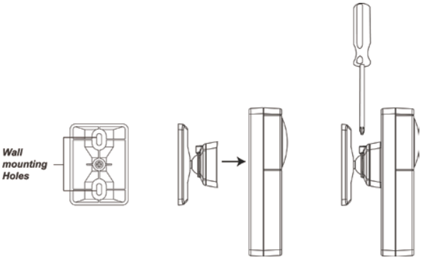

# VESTA-044

* UPIC-5ZW Infrared Universal Remote Control
* **Introduction**

UPIC5-ZW is a Z-Wave Infrared Remote Control. It is designed to operate your home appliances by transmitting IR signal. The IR Remote Control is capable of learning IR signal transmitted from the appliance’s remote control. After learning the signal, you can remotely control the IR Remote Control via Z-Wave network to send signal to appliance without using the remote control manually.

The UPIC-5ZW is a Z-Wave enabled device and is fully compatible with any Z-Wave enabled network.

Z-Wave is a wireless communication protocol that uses a low-power RF radio. By taking advantage of the Z-Wave mesh network, commands can be routed to their destination via intermediary “listening” Z-Wave products.

The UPIC5 Z-Wave Infrared Remote Control series includes the following models:

**UPIC5-ZW** Infrared Remote Control

**UPIC5-ZW-OTA** Infrared Remote Control with Over-the-Air Firmware Upgrade feature

## **Parts Identification**

**1. IR Eye**

.jpeg>)

Transmits IR signal to appliances.

**2. Function/IR Button**

Press the button 3 times within 1.5 seconds to send a learn code.

Press and hold the button for 10 seconds to factory reset.

Press and hold the button for 3 seconds to enter IR Learn Mode.

Press the button once to transmit signal/exit IR Learn Mode.

**3. Z-WaveLED**

Flashes once –IR Remote Control is transmitting a signal

**4. IR Indicator LED**

Slow Flash –IR Remote Control under IR learning mode.

Quick Flash–IR Remote Control receives IR signal under learning mode or is transmitting IR signal

Flash every half second – IR data cleared

Off – IR Remote Control is storing received IR signal under learning mode.

– IR Remote Control is in idle mode.

**5. IR Signal Receiver**

**6. Low IR Transmission Power Jumper (JP1)**

**Jumper Off**

if the jumper link is removed or “**parked**” on one pin.

**Jumper On**

The jumper link is inserted connecting the two pins

.png>).png>)

Jumper ON –IR Transmission power set to Low. **(Factory Default)**

Jumper OFF – Deselected.

**7. High IR Transmission Power Jumper (JP2)**

**Jumper Off**

if the jumper link is removed or “**parked**” on one pin.

**Jumper On**

The jumper link is inserted connecting the two pins

.png>).png>)

Jumper ON –IR Transmission power set to High.

Jumper OFF – Deselected.

**IMPORTANT NOTE: JP1 and JP2 jumper CANNOT be set to ON at the same time**

**8. Dip Switch Set 1**

For setting appliance type

**9. Dip Switch Set 2**

For learning and testing IR signal

**10. Battery Compartment**

**11. Wall Mounting Rotational Bracket (Optional)**

## _Battery and Low Battery Detection_

The IR Remote Control uses two 1.5V Lithium batteries as its power source. It features Low Battery Detection function. When low battery voltage is detected, the IR Remote Control will transmit Low Battery signal to the coordinator in Z-Wave network.

The IR Remote Control will report its battery percentage to the Control Panel respectively at 100%, 75%, 50%, 25%. The IR Remote Control can also detect low battery status. When low battery voltage is detected (25%), the low battery signal will be sent to the Control Panel along with regular signal transmission for the Control Panel to display the status accordingly.

## _Adding Device (Inclusion)_

This product can be included and operated in any Z-Wave network with other Z-Wave certified devices from other manufactures and/or other applications. All non-battery operated nodes within the network will act as repeaters regardless of vendor to increase reliability of the network.

* Insert batteries to power on the IR Remote Control.
* Put the Z-Wave gateway or control panel into **Inclusion** or **Learning** mode (please refer to the Z-Wave gateway or control panel manual).
* Within 1.5 seconds, press the Function/IR Button 3 times.
* Refer to the operation manual of the Z-Wave gateway or control panel to complete the learn-in process.
* If the sensor has already been **included** (learnt) into another Z-Wave Gateway/Control Panel, or if the sensor is unable to be learnt into the current Z-Wave Gateway/Control Panel, please exclude it first (see _**Exclusion**_) before attempting to **include** it into the current Z-Wave Gateway/Control Panel.

## _Removing Device (Exclusion)_

The IR Remote Control must be removed from existing Z-Wave network before being included into another. There are two methods available to exclude a device:

### **Exclusion Mode**

* Put the Z-Wave gateway or control panel into **Exclusion mode** (please refer to the Z-Wave gateway or control panel manual).
* Within 1.5 seconds, press the Function/IR Button 3 times and the IR Remote Control will be removed from the Z-Wave network.

### **Factory Reset**

_(Only use factory reset when network Control Panel/Gateway is missing or inoperable)._

* Press and hold the Function/IR Button of the IR Remote Control for 10 seconds to factory reset.

_**\<NOTE>**_

* Factory resetting the IR Remote Control will restore it to factory default settings (excluded from the Z-Wave network). The Z-Wave gateway or control panel will still keep its Z-Wave settings. Please refer to the gateway or control panel manual on how to remove the IR Remote Control’s Z-Wave settings.
* _Z-Wave Sleep Mode_
* The IR Remote Control will enter Z-Wave Sleep mode (to conserve power) after waking up for a short period of time (\~10 seconds). While in Z-Wave sleep mode, Z-Wave gateways or control panels are unable to send commands to the IR Remote Control.
* IR Signal Learning and Testing

In order to use the IR Remote Control to control your home appliance, the IR Remote Control must first learn in the IR signal sent from the appliance’s remote control. Follow instruction below to complete the learning process. **Please keep the IR Receiver away from direct lighting or sunlight during learning process to avoid interference.**

## _**Learning**_

### **Step 1. Enter IR Learn Mode**

1. Follow instruction in **Z-Wave Network Setup** section to join IR Remote Control into your Z-Wave network.
2. Make sure all switches on the DIP Switch Block are set to **OFF** position.
3. Press and hold the Function/IR button for 3 seconds and release when IR LED begins to flash.
4. The IR LED will begin flashing slowly to indicate the IR Remote Control is now entering IR Learn Mode.

ON

.jpeg>)

OFF

### **Step 2. Select Appliance Type**

The IR transmitter can learn up to 5 sets of IR signal for 5 different appliances.

Before starting learning, select the appliance number with Dip Switch Set 1 before proceed to learning the signals. The IR signal learnt in will be assigned to selected appliance number.

Select the appliance type according to following Dip Switch Set 1 table. For ease of recognition and operation from Climax Z-Wave Gateway/Control Panel, each device type has been given a display name on the Control Panel interface, we suggest you to learn in IR signals according to appliance types displayed.

| Switch 1 | Switch 2 | Switch 3 | Switch 4 | Switch 5 | Switch 6 | Appliance Type               |
| -------- | -------- | -------- | -------- | -------- | -------- | ---------------------------- |
| ON       | OFF      | OFF      | OFF      | OFF      | OFF      | **Type 1 (Air Conditioner)** |
| X        | ON       | OFF      | OFF      | OFF      | OFF      | **Type 2 (Television)**      |
| X        | X        | ON       | OFF      | OFF      | OFF      | **Type 3 (Home Audio)**      |
| X        | X        | X        | ON       | OFF      | OFF      | **Type 4 (Set Top Box)**     |
| X        | X        | X        | X        | ON       | OFF      | **Type 5 (Others)**          |

“X” means the location of this switch has no effect on appliance selection.

**Example:**

1. To select Air Conditioner, slide Switch 1 to ON, and Switch 2-6 to OFF.
2. To select Television, slide Switch 2 to ON, and Switch 3-6 to OFF, ignore Switch 1 position.

### **Step 3. Learn IR Data**

Each appliance type can learn up to 8 IR signals, selected with Dip Switch Set 2.

| Switch 1 | Switch 2 | Switch 3 | Switch 4 | Switch 5 | Switch 6 | Switch 7 | Switch 8 | IR Signal |
| -------- | -------- | -------- | -------- | -------- | -------- | -------- | -------- | --------- |
| ON       | OFF      | OFF      | OFF      | OFF      | OFF      | OFF      | OFF      | **1**     |
| X        | ON       | OFF      | OFF      | OFF      | OFF      | OFF      | OFF      | **2**     |
| X        | X        | ON       | OFF      | OFF      | OFF      | OFF      | OFF      | **3**     |
| X        | X        | X        | ON       | OFF      | OFF      | OFF      | OFF      | **4**     |
| X        | X        | X        | X        | ON       | OFF      | OFF      | OFF      | **5**     |
| X        | X        | X        | X        | X        | ON       | OFF      | OFF      | **6**     |
| X        | X        | X        | X        | X        | X        | ON       | OFF      | **7**     |
| X        | X        | X        | X        | X        | X        | X        | ON       | **8**     |

**Example:**

1. To select IR Signal 1, slide Switch 1 to ON, and Switch 2-8 to OFF.
2. To select IR Signal 2, slide Switch 2 to ON, and Switch 3-8 to OFF, ignore Switch 1 position.
3. Select the IR Signal desired by adjusting dip switch. We suggest to begin from IR Signal 1 by sliding Switch 1 to ON position to select IR Signal 1.
4. Point your appliance’s IR remote control at opposite direction of the IR receiver to prevent the IR Receiver from receiving unwanted IR signal.
5. Adjust the IR remote control to the setting you desired, then point the remote control at the IR Receiver, then press remote control button to transmit the IR Signal

**Example:**

For air conditioner remote control, if you set the remote control to “Cool Mode, 18°C, Fan Speed Auto” and turn off the remote control, then point the remote control at IR Receiver and press “ON.”

The IR Receiver will learn in “Cool Mode, 18°C, Fan Speed Auto” signal for the air conditioner

For television remote control, if you point the remote control at IR receiver and press ON/Off.

The IR Receiver will learn in ON/OFF signal for the television.

4. If the signal is received successfully, the IR LED will flash quickly, then turn off to indicating that IR Remote Control is storing IR Signal data, then flash slowly again. If you accidently sent the wrong IR signal, point the remote control away to adjust setting, the point it at the IR Receiver to retransmit signal again. The new IR signal will overwrite the old one.
5. After finish learning, change dip switch setting to learn another IR Signal, the repeat procedure from 2 to 4. We suggest to proceed from IR Signal 1 to 8 by sliding dip switch 1 to 8 to ON position one by one
6. Repeat the process to learn in maximum of 8 signals for each appliance type.
7. You can adjust your Dip Switch set 2 setting to select another appliance type.

### **Step 4. Exit IR Learn Mode**

1. After finish learning all IR signals, press Function/IR button once to exit learning mode, then slide all switches to OFF position.

## _**Testing**_

After complete learning the IR signals, follow instruction below to test transmitting IR signals.

1. Do not enter IR Learn mode, adjust the Dip Switch setting accordingly to select the Appliance type and IR signal number as previously learnt it.
2. Press the Function/IR button once, the IR LED will flash quickly to indicate it is transmitting signal. If no signal is learnt in, the IR Remote Control will not send any signal and IR LED will stay turned off.
3. Repeat procedure from 1 to 2 to test all learnt in IR signals.
4. After finish all settings, slide all switch to OFF position.

## _**Clearing IR Data**_

To remove all IR signal learnt in for an appliance type, follow instruction below:

1. Remote batteries to power down IR Remote Control.
2. Select the appliance type you want to remove using Dip Switch set 1 according to following table

| Switch 1 | Switch 2 | Switch 3 | Switch 4 | Switch 5 | Switch 6 | Appliance Selection          |
| -------- | -------- | -------- | -------- | -------- | -------- | ---------------------------- |
| ON       | OFF      | OFF      | OFF      | OFF      | OFF      | **Type 1 (Air Conditioner)** |
| OFF      | ON       | OFF      | OFF      | OFF      | OFF      | **Type 2 (Television)**      |
| OFF      | OFF      | ON       | OFF      | OFF      | OFF      | **Type 3 (Home Audio)**      |
| OFF      | OFF      | OFF      | ON       | OFF      | OFF      | **Type 4 (Set Top Box)**     |
| OFF      | OFF      | OFF      | OFF      | ON       | OFF      | **Type 5 (Others)**          |

Slide more than one switch to ON will select multiple appliance type,

**Example:**

1. Slide Switch 1, 2, 3, 4, 5 to ON will select all 5 appliance types.
2. Slide Switch 1 and 3 to ON to select Air Conditioner and Home Audio.
3. Press and hold Function/IR button and insert batteries to power up IR transmitter, do not release the button yet.
4. Keep holding both Function/IR button until IR LED turns on, then release the button
5. The IR transmitter will clear stored IR signal for selected appliance types, the IR LED will flash continuously.
6. Slide all switches to OFF position to return to normal operation. The IR LED will turn off.

## **Installation**

The IR Remote Control is designed to be mounted on wall. It can be mounted by either directly screwing the back cover onto the wall, or by installing the rotational bracket first, then install the main body on the bracket. Please refer to the **IR Signal Coverage & IR LED Selection** section below for information on IR signal transmission before selecting the IR Remote Control’s mounting location.

* _Mounting the IR Remote Control_

.jpeg>)

The IR Remote Control is designed to be mounted on wall. It can be mounted by either directly screwing the back cover onto the wall, or by installing the rotational bracket first, then install the main body on the bracket. The IR Eye should be pointed to the home appliance you want to control when the IR Remote Control is installed.

**NOTE: The Rotational Bracket is not included in standard shipping and is available upon request.**

* Direct Wall Mounting:

The back cover has 4 knockouts, where the plastic is thinner, for mounting purpose.

1. Open the cover and break through the 4 knockouts on the back cover.
2. Use the holes as template to drill holes in the wall, insert wall plugs if required.
3. Screw the back cover onto the wall.
4. Replace the front cover on the back cover.

* Rotational Bracket mounting.

The Rotational Bracket has an adjustable head which can be attached to the IR Remote Control. After installing the bracket on the wall, the user can adjust the angle of the head to change the direction IR Remote Control is facing.

1. The Rotational Bracket base has 2 mounting holes, Use the holes as template to drill holes in the wall, insert wall plugs if required.
2. Screw the bracket onto the wall.
3. Hook the IR Remote Control onto the brackets using the holes on the back.
4. After completing installation, you can use a Philip screw driver to loosen the screw on top of the bracket, then adjust the IR transmitter angle and tighten the screw to lock the bracket angle.

<figure><figcaption></figcaption></figure>

## **Operation**

### _**Control via Z-Wave Gateway/Control Panel**_

The IR Remote Control can be controlled via Climax Z-Wave Gateway/Control Panels remotely to transmit IR signal. Selecting the appliance type and IR signal number from the Control Panel will control the IR Remote Control to send IR signal accordingly.

**Example:**

1. Select “Air Conditioner Function 1” will control the IR Remote Control to send IR signal 1 learnt in Air Conditioner appliance type.

* _IR Signal Coverage & IR LED Selection_

.jpeg>)

The IR Eye of the IR Remote Control includes 6 LEDs which are used to transmit IR signals, with 1 central LED and 5 surrounding LEDs. The 5 surrounding LEDs are positioned at 45° angle to the PCB board. **LED Signal Coverage:**

Each LED transmits IR signal in cone coverage in front of the LED. The Central LED is always used each transmission. 1 of the 5 surrounding LEDs can also be selected to transmit signal for each appliance type by using Climax Z-Wave Gateway/Control Panel.

**Example:**

1. If you select LED 1 for Air Conditioner, the IR Remote Control will transmit signal with both Central LED and LED 1 when it transmits an Air Conditioner appliance type IR Signal.
2. If you select LED 3 for Home Audio, the IR Remote Control will transmit signal with both Central LED and LED 3 when it transmits a Home Audio appliance type IR Signal.

When installing the IR Remote Control, select the IR LED used via your Control Panel according to the IR Remote Control mounting location to allow IR transmitter to send signal to all appliance in your home. Please refer to your Climax Gateway/Control Panel manual for more information on IR Remote Control setting and control.

Please refer to diagram below for IR signal coverage:

<figure><figcaption></figcaption></figure>

## _**IR Transmission Power**_

Use the jumper switches (JP2 and JP3) to adjust the IR signal transmission power. Factory default is set to Low transmission power(JP1 ON). Setting the jumper to JP2 will increase the IR signal transmission range.

## _**Simple AV Control Set Command**_

The simple AV control set command is used to control an AV device through the Control Panel:

Command Class: COMMAND\_CLASS\_SIMPLE\_AV\_CONTROL\_V1

Command: SIMPLE\_AV\_CONTROL\_SET

Set the values:

Item ID MSB: for appliance type, 01\~05

Item ID LSB: for IR signal data, 01\~08

<figure><figcaption></figcaption></figure>

## **Z-Wave Information**

**Device Type:** Sub Energy Meter

**Role Type:** Reporting Sleeping Slave (RSS)

**Command Class Support/Control**

**Mandatory CC Support:**&#x20;

Association CC, v2

Association Group Information CC

Battery CC

Device Reset Locally CC

Manufacturer Specific CC, v2

Configuration CC,

Simple AV Control CC,

Version CC, v2

Z-Wave Plus Info CC, v2

Power Level CC

Firmware Update CC, v2

### _**Z-Wave’s Groups (Association Command Class Version 2)**_

Group 1 for “LifeLine”:

Battery CC (COMMAND\_CLASS\_BASIC)

Device Reset Locally CC
