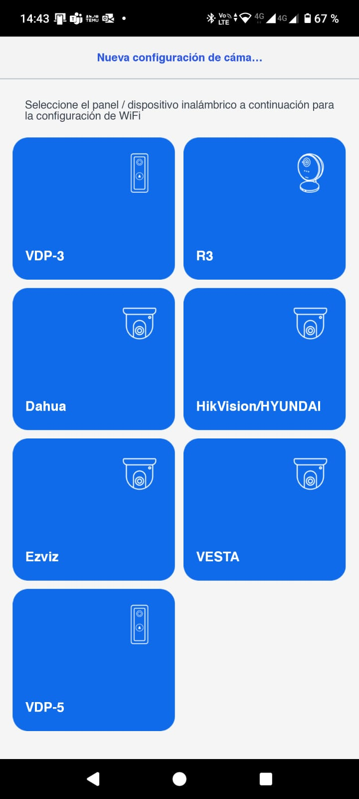
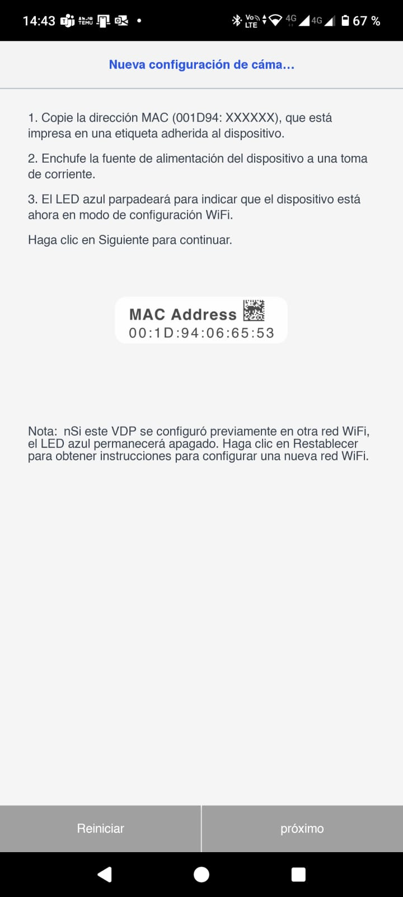
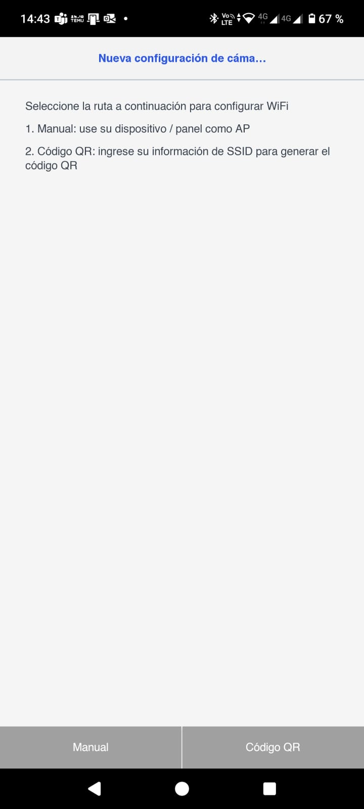
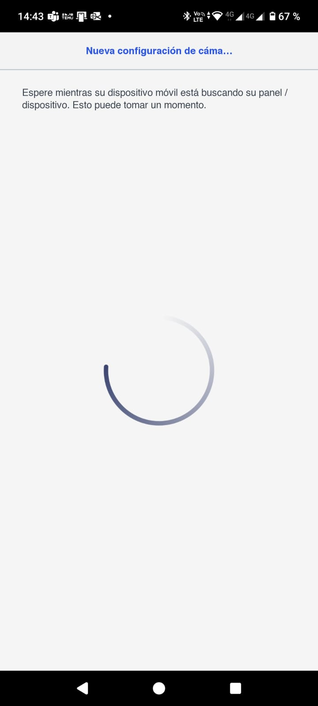
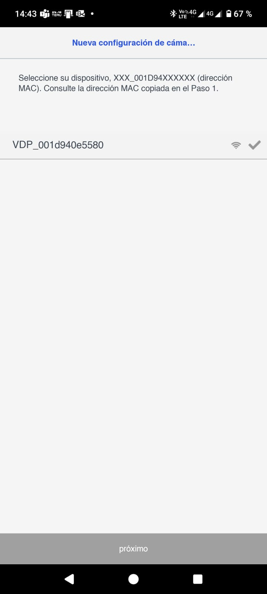
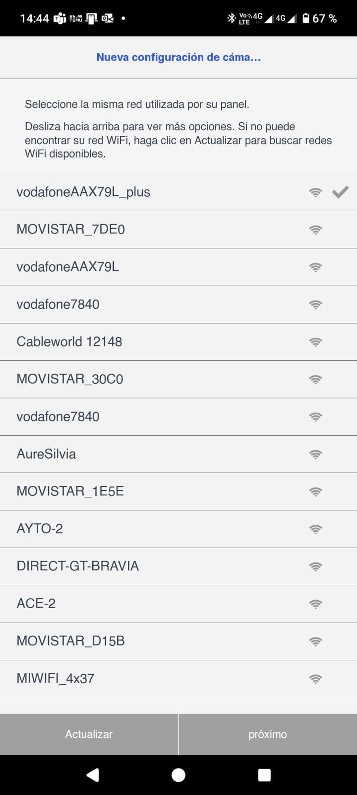
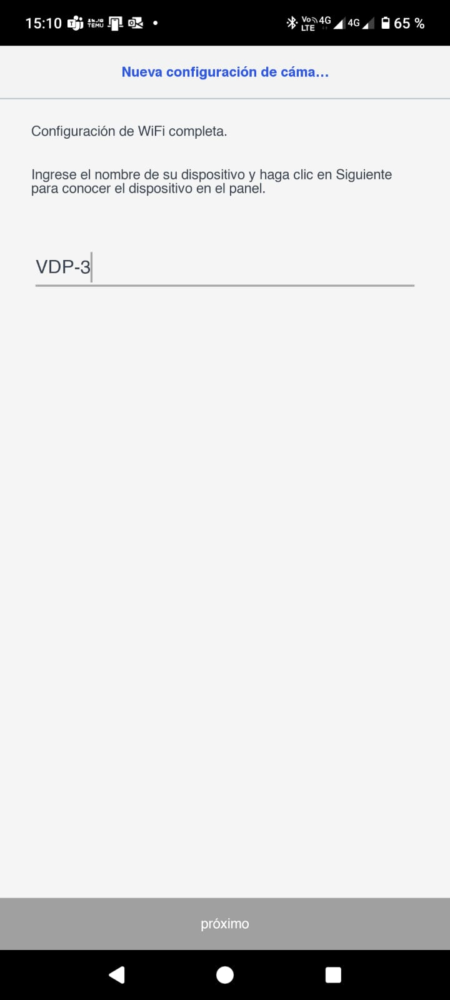
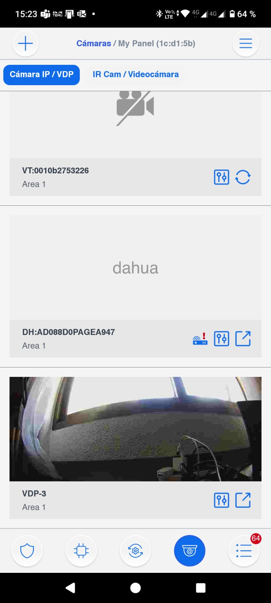

# VESTA-109

<figure><figcaption>
<a href="https://bydemes.com/es/productos/intrusion/alarma-vesta/teclados-y-mandos/VESTA-109">VESTA-109</a>
</figcaption></figure>

### Introduction 

VDP-3 Video Door Phone is designed to replace conventional doorbell by providing remote video streaming access, two-way communication via Wi-Fi network. The Video Door Phone functions as a part of VESTA alarm system by connecting to a VESTA security system Control Panel. Setup and remote access of Video Door Phone is performed via smartphone application developed by Climax Technology.

## Parts Identification 

&#x20;                    **From View                                      Front View (Cover removed)                  Back View**

<figure><figcaption></figcaption></figure>

1. **Protective Cover**
2. **Camera Lens**
3. **Function Button / LED Indicator (Blue / Amber)**
4. **IR Lens**
5. **Cover Fixing Screw**
6. **Mounting Hole**
7. **12\~24V DC or 16\~24V AC Power Input**

Please note the torque on the screw should be less than 24.5 Nm (2.5 kg-m).

8. **12\~24V DC or 16\~24V AC Power Input**

Please note the torque on the screw should be less than 24.5 Nm (2.5 kg-m).

9. **Reserved**
10. **Reserved**

## The Power Supply 

The VDP uses 12\~24V DC or 16\~24V AC power as its power source. Turn off mains power first. Loosen the two screws of the 12\~24V DC or 16\~24V AC Power Input, and save the screws for later use. Connect wires to the inputs on the rear side of the back cove&#x72;**\***; install the VDP to power on the device.

**\*Note:** It is recommended to use wire with a diameter less than 15mm to connect to the power input. The torque on the screw should be less than 24.5 nm (2.5 kg-m).

## LED Indicator 

The Video Door Phone has built-in Blue and Red LEDs to indicate device status.

<table data-header-hidden><thead><tr><th width="126"></th><th width="257"></th><th></th></tr></thead><tbody><tr><td>LED Color </td><td>Behavior </td><td>Indication</td></tr><tr><td>Blue</td><td>Flash every 3 seconds </td><td>VDP under Wi-Fi setup mode (AP mode)</td></tr><tr><td>Blue</td><td>Spinning </td><td>VDP button pressed, waiting for answer</td></tr><tr><td>Blue</td><td>ON </td><td>VDP under video streaming and two-way communication</td></tr><tr><td>Amber</td><td>ON for 3 seconds </td><td>VDP finish warm up upon power on, entering normal operation</td></tr><tr><td>Amber</td><td>Flash every 3 seconds </td><td>Wi-Fi connectivity problem*</td></tr><tr><td>Amber</td><td>Flash every second </td><td>VDP unable to connect to server</td></tr><tr><td>Amber</td><td>3 Flash then ON for 6 seconds</td><td>VDP reset to factory default</td></tr></tbody></table>

**\*Note:** It takes about 1 minute for VDP to connect to Wi-Fi after power on. Before the Wi-Fi connection is established, the Red LED may flash momentarily.

## To restore factory settings:

1. Unplug the VDP's power supply.
2. Press and hold the function button, then plug in the VDP’s power supply until the amber LED light blinks 3 times and remains steadily on.
3. Release the function button.
4. The VDP will restart automatically.
5. Once restarted, the blue LED will begin blinking to indicate that the device is now in Configuration mode.

<figure><figcaption></figcaption></figure>

## Equipment required 

The following equipment is required to use VDP:

* A router supporting 2.4 GHz Wi-Fi network. The VDP should be connected to this router with access to internet and Home Portal Server.
* An iPhone or Android smartphone

Android version requirement: Android **5.1** or above.

iPhone version requirement: iOS **9** or above.

* To use the VDP, a Climax IP based security system alarm panel is required – The panel must be registered in Climax Home Portal Server with a valid user account. Refer to panel and Home Portal Server user guide to complete panel setup and registration process.

## Hardware Installation 

**Step 1.** Before you start, find the circuit breaker or fuse box.

**Step 2.** Once you have found it, open the door and turn off the main power switch.

**Step 3.** Take out the VDP from the package. Remove the protective cover and put it

aside for later use.

**Step 4.** Flip the VDP up-side-down and locate the 4 screws near the bottom of the VDP.

**Step 5.** Loosen the 2 screws of the 12\~24V DC or 16\~24V AC Power Input, and save the screws

for later use.

**Step 6.** Connect wires to the inputs on the rear side of the back cover, as shown in

Figure 1. It is recommended to use wire with a diameter less than 15mm to

connect to the power input. Please note the torque on the screw should be less

than 24.5 nm (2.5 kg-m)

**Step 7.** Locate the 2 mounting holes on the VDP, as shown in Figure 2, and screw the

VDP into the wall.

&#x20;                                                                 Figure 1                       Figure 2

<figure><figcaption></figcaption></figure>

**Step 8.** Replace the protective cover on top of the VDP and tighten the cover fixing screw.

**Step 9.** Switch on the circuit breaker to provide power to the VDP.

## Setup 

The Video Door Phone can be incorporated into existing VESTA panel security system as an accessory device. To use the VDP, a VESTA IP based security system alarm panel is required.


It is necessary to enable all permissions and be connected to the same Wi-Fi network from the smartphone as the one the panel is connected to.


1. Open **Smart Home Sec** app and enter your existing user account & password of the Control Panel you wish to use for further setup.
2. Tap the Camera icon in the navigation bar and the + icon on top left corner to add the VDP into your existing system. Select the VDP icon and tap “Next”.

<figure><figcaption>
2. Navigation bar and the + icon on top left corner.
</figcaption></figure> <figure><figcaption>
Select VDP-3
</figcaption></figure>

3. Power up the Video Doorbell by applying AC power. The device will first warm up for about **30 seconds**, and its Blue LED will begin to flash.


Flashing LED indicates the Video Doorbell does not have a working Wi-Fi setting yet. It will enter Wi-Fi setup mode (AP mode) automatically upon power-up.


4. Select the route to set up your Wi-Fi network and follow on-screen instructions. Please note if the VDP has already been set up to another Wi-Fi network, be sure to reset the device first before adding it into your existing alarm system.

4.1. Manual: Use your VDP as an AP. Connect to your Wi-Fi. Make sure your smartphone’s Wi-Fi is enabled. Follow on-screen instructions and wait for your VDP to connect to your Wi-Fi network. After successfully joining to your Wi-Fi network, the app proceeds to learn the VDP into the Control Panel. When learning is completed, re-login to the app and start using your VDP.

<figure><figcaption></figcaption></figure> <figure><figcaption></figcaption></figure> <figure><figcaption></figcaption></figure>

<figure><figcaption></figcaption></figure> <figure><figcaption></figcaption></figure> <figure><figcaption></figcaption></figure>

4.2. QR Code: Enter your SSID information to generate QR Code for VDP to scan. The QR Code includes information about the Wi-Fi network and the Control Panel. Follow on-screen instructions. Tap “QR Code” for your smartphone to display it. VDP will emit a short beep to indicate the scanning is successful. When the LED stops flashing, tap “Done” to complete the setup. After VDP successfully joins to your Wi-Fi network, the app will proceed to learn the VDP into the Control Panel. When learning is completed, the VDP is able to be viewed on the app.

## Operation 

The Video Door Phone can be accessed by smartphone application SMART HOME SEC  and [VESTA-025](https://bydemes.com/es/productos/intrusion/alarma-vesta/teclados-y-mandos/VESTA-025) and [VESTA-354](https://bydemes.com/es/productos/intrusion/alarma-vesta/dispositivos-v-max-bus-para-hibrida/VESTA-354) Two-way voice communication function is available.

### Smartphone Access 

Use **SMART HOME SEC** to log into Home Portal Account registered by Control Panel. Select Cam page to display VDP streaming thumbnail. Press the thumbnail image to enlarge to full screen.

When the Video Doorbell button is pressed, all associated accounts with incoming call function enabled will be able to see incoming call popup and answer the call.

<figure><figcaption></figcaption></figure>

To access camera function setup, tap the .png>) icon and follow below instructions.

* **Device Name**

**This is for you to name or rename your IP Camera for easy identification. Enter a desired name and tap Save.**

* **Video Adjustment**

This is for you to adjust IP Camera video settings, such as brightness, saturation, and contrast. Video Adjustment now allows for top/bottom flip video option, thus enabling users to flip video without needing to physically move the Security Camera itself.

* **Timestamp Location**

The timestamp appears at the top-left corner of the device screen, within the status bar. It displays the current time when the screen is active or a screenshot is taken. This can be useful for logging, troubleshooting, or verifying the time of configuration steps.

* **Speaker Volume**

This is for you to adjust speaker volume. Tap the slider to adjust the volume to a desired level.

* **Door Lock Binding**

This is for you to select the door lock you wish to bind with the system. Please note: available door lock will be displayed after it is learned into the Control Panel. Tap Submit to complete. Ensure to log out and log in again for the changes to be effective.

* **WiFi Setup**


To configure the VDP on a different Wi-Fi network, a factory reset will be required.


## **Adding VDP-3 to the Control Panel**

To add the **VDP-3** device to the panel, follow the standard procedure for registering a new device. Access the system using the **installer account**, initiate a **device search**, and the unit will appear automatically. Once detected, proceed to add it to the system.

Below are the technical details and available configuration options for the device:

* **Device Name:** VDP-3
* **IP Address:** 192.168.0.106
* **Firmware Version:** VDP 0.00.3.09 demes
* **MAC Address:** 00:1d:94:0e:55:80

**Available Configuration Options:**

* **Settings**
* **Recorded Videos**&#x20;
* **Video Configuration**&#x20;
* **Wireless Network**
* **Doorbell Sound Adjustment**&#x20;

These options can be accessed through the device’s web interface or dedicated configuration app, once the VDP is connected to the network.

